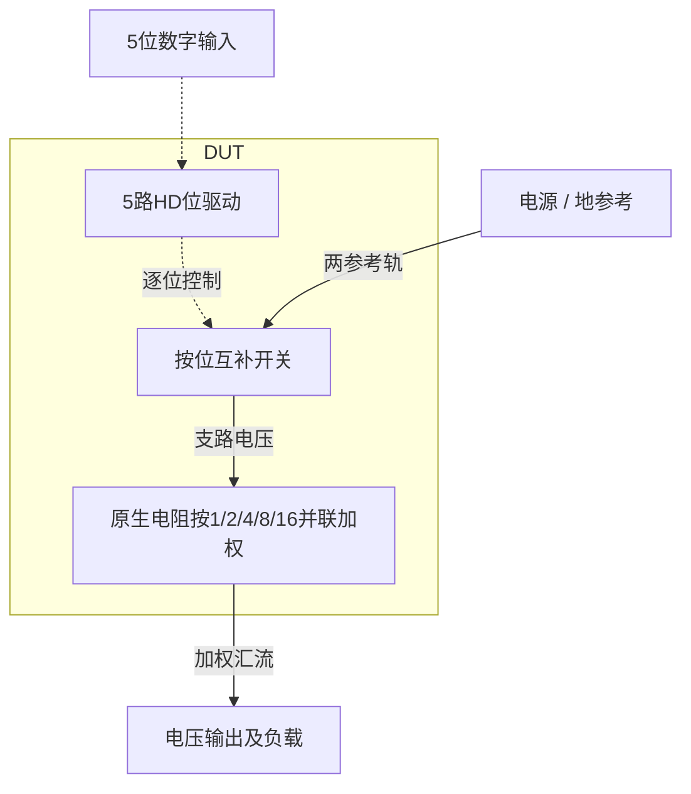
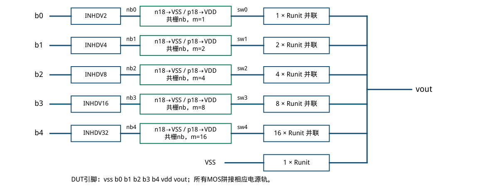
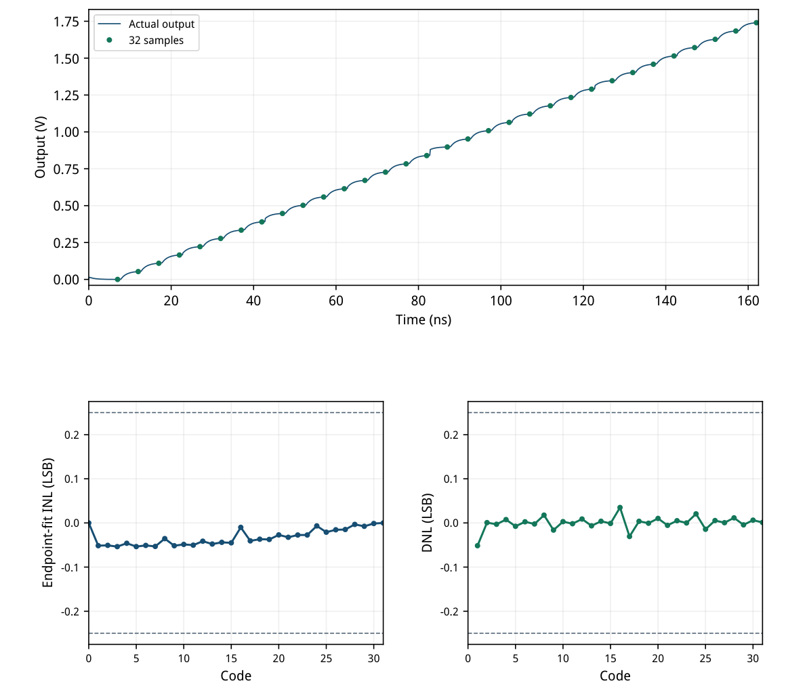
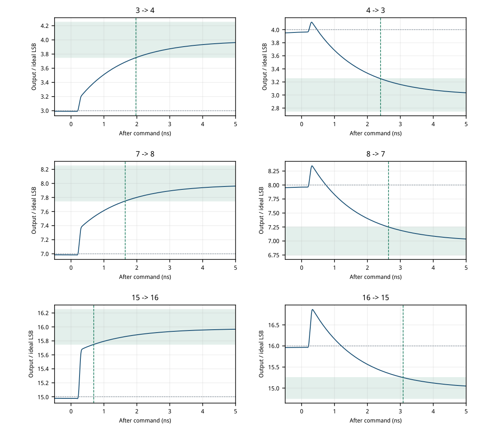
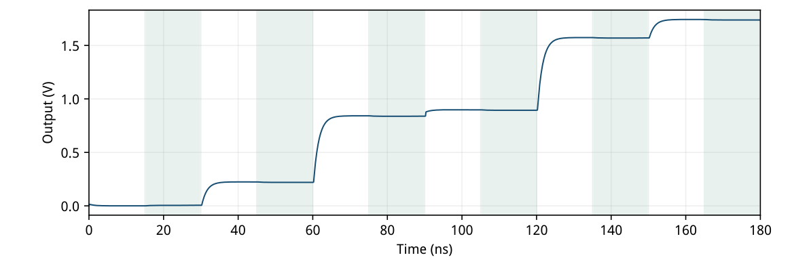
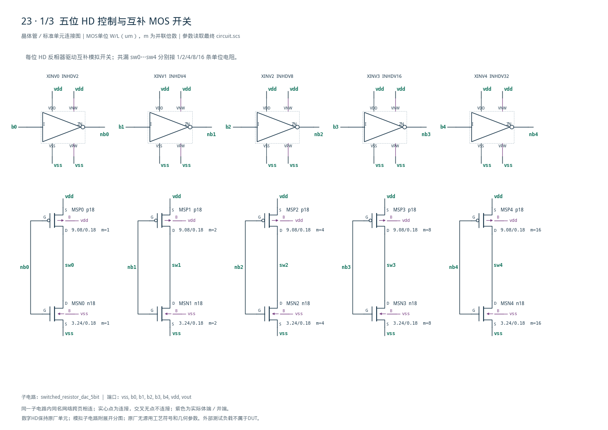
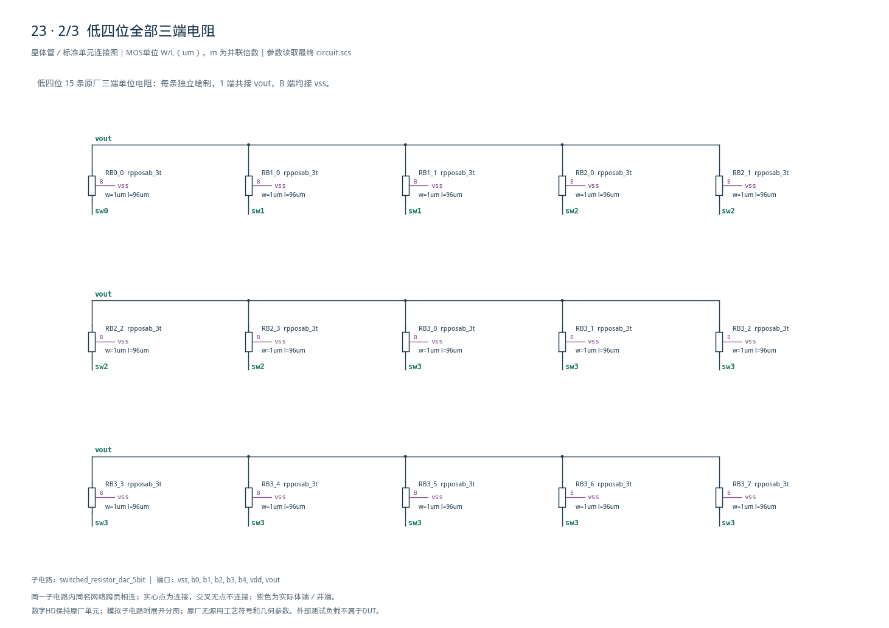
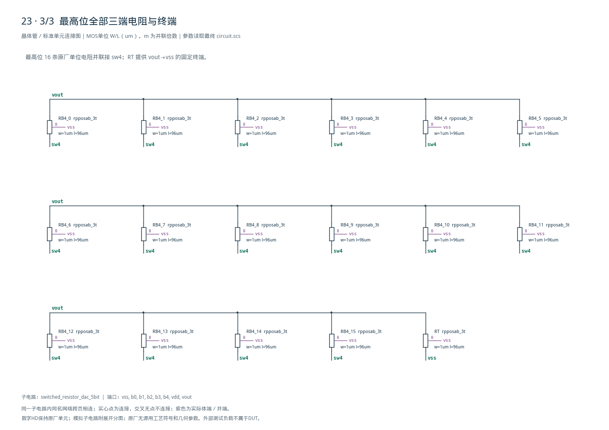

# 23 · 五位开关电阻 DAC 审查

[审查 PDF](review.pdf) · [实测结果](latest_results.json) · [验收合同](contract.json) · [最终网表](circuit.scs)

## 验收结果

本模块将5位数字码转换为模拟电压，用CMOS开关选择电阻网络的连接状态。电阻式DAC的优势是传输关系直观，便于实现静态单调性；相对电流舵结构，其输出阻抗和开关导通电阻更直接影响驱动与建立速度。芯片中常用于偏置调节、门限设定和低分辨率校准，实际精度还取决于电阻匹配及负载。

结论：完整确定性nominal检查达到原门槛，无需10%或15%放宽。

条件：SMIC18MMRF tt + res\_tt，1.8 V、27°C；输出负载1 pF，200 MS/s。五路数字输入均经原厂HD两级有限强度缓冲，50 ps命令边沿与原代码/时间窗一致。

| 指标 | 实测 | 原门槛 | 10%边界 | 15%边界 | 单位 |
| --- | --- | --- | --- | --- | --- |
| 最大端点拟合INL | 0.05360 | ≤0.25 | ≤0.275 | ≤0.2875 | LSB |
| 最大绝对DNL | 0.05148 | ≤0.25 | ≤0.275 | ≤0.2875 | LSB |
| 码0绝对误差 | 0.11659 | ≤2 | ≤2.2 | ≤2.3 | mV |
| 码31绝对误差 | 3.29870 | ≤5 | ≤5.5 | ≤5.75 | mV |
| DUT平均功耗 | 645.25353 | ≤1000 | ≤1100 | ≤1150 | uW |
| 最坏大进位建立 | 3.08389 | ≤5 | ≤5.5 | ≤5.75 | ns |
| 最坏窗口末误差 | 0.04890 | ≤0.25 | ≤0.275 | ≤0.2875 | LSB |
| 最坏越界峰值 | 0.86573 | ≤1 | ≤1.1 | ≤1.15 | LSB |
| 六码最大输出电阻 | 0.99387 | ≤2 | ≤2.2 | ≤2.3 | kOhm |

| 功能维度 | 实际覆盖 | 不放宽的功能检查 |
| --- | --- | --- |
| 200 MS/s爬码 | 全部32码 / 31步 | 全部正步长；160个输入位采样正确 |
| 双向大进位 | 3↔4、7↔8、15↔16 | 6条有限最后入带时刻 / 末端误差 |
| 输出电阻 | 0、4、15、16、28、31 | 6点均为正；向电源范围内施加5 uA |

最小步长53.250 mV，严格单调。功耗积分2.5–162.5 ns，只计DUT VDD，沿用原验证器；外部输入缓冲另耗约172.007 uW，两者总和约817.261 uW。

本次为确定性nominal迁移，不包含其余10个PVT点、8个固定种子局部失配回归、Monte Carlo良率和版图寄生。10%/15%只列数值边界；未延长5 ns代码或观察窗口。

<!-- SYSTEM-BLOCK-DIAGRAM -->
## 系统框图

这是二进制加权电阻支路，非电阻串抽头译码结构。

实线表示信号或能量通路，虚线表示时钟、控制或偏置。DUT框外为外部端口或测试夹具；精确端子连接见后附基本电路图。



[独立Mermaid源文件](system_block_diagram.mmd) · [框图SVG](markdown_assets/system-block.svg)
<!-- END-SYSTEM-BLOCK-DIAGRAM -->

## 电路连接、权重与 LUT 尺寸

32个同尺寸工艺电阻：五组二进制权重支路，加一个恒接地的LSB终端。

| 模拟开关单位 | W/L (um) | gm/ID | ID/W (uA/um) | VGS表点/V | fT表点/GHz |
| --- | --- | --- | --- | --- | --- |
| n18 | 3.24 / 0.18 | 6 | 61.699 | 0.7255 | 32.22 |
| p18 | 9.08 / 0.18 | 6 | 22.023 | 0.7624 | 12.00 |

LUT：27°C、VDS=0.9 V、参考W=10 um。选gm/ID=6、参考ID=200 uA，得到单位Wn=3.24 um、Wp=9.08 um。每位m=1/2/4/8/16；最大有效Wp=145.28 um由合法单位并联实现。

饱和LUT仅用于初始几何，200 uA不是电路偏置。实际开关由0/1.8 V驱动，导通时处于线性区；32码实测最坏开关轨压降约14.20 mV。单位开关尺寸与电阻电导同权重缩放。

每个Runit采用rpposab\_3t，W=1 um、L=96 um，第三端接VSS。32个相同单位保留蚀刻、电压/温度系数与基底电容。Runit手算约31.611 kΩ，Rout≈Runit/32≈987.84 Ω；实测范围986.74–993.87 Ω。

理想关系：Vout=(Σ 2^i·bi)/32·VDD。终端的一份电导保证分母32。全码平均静态功耗手算约546 uW，实测含内部数字翻转约645 uW。DUT无理想R/C、行为源或理想开关。



[查看矢量图](markdown_assets/figure-02-01.svg)

## 完整 32 码：动态爬码与线性度

每码5 ns，在7+5k ns采样；端点拟合与绝对端点误差同时检查。

LSBfit=(V31−V0)/31=56.13983 mV；INL[k]=(V[k]−V[0])/LSBfit−k；DNL[k]=(V[k]−V[k−1])/LSBfit−1。理想LSB仍为56.25 mV，绝对码0/31目标保持0 V与1.74375 V。

动态码31误差3.299 mV，包含有限建立时间；独立长驻留输出电阻测试中，未加载码31约1.743296 V，距理想1.743750 V约0.454 mV。二者测量时间不同，不能混用静态端点替代200 MS/s验收。

命令边沿50 ps，保持原PULSE/PWL。输入驱动采用原厂INHDV3→INHDV32两级缓冲，保留单独VDRV供电；DUT内数字反相同样采用HD。



[查看矢量图](markdown_assets/figure-03-01.svg)

## 六种大进位：建立与峰值越界

以命令时刻为零；理想目标码与±0.25 LSB带均不随端点拟合移动。

最坏16→15：3.0839 ns、峰值0.86573 LSB；六条波形均仅一次入带交叉。上行15→16不能替代下行验收。

| 跃迁 | 最后入带 / ns | 4.99 ns误差 / LSB | 指令两电平外峰值 / LSB |
| --- | --- | --- | --- |
| 3→4 | 1.9735 | 0.03762 | 0.00843 |
| 4→3 | 2.3975 | 0.03401 | 0.11492 |
| 7→8 | 1.6465 | 0.03782 | 0.01711 |
| 8→7 | 2.6395 | 0.03579 | 0.34316 |
| 15→16 | 0.6918 | 0.03292 | 0.02677 |
| 16→15 | 3.0839 | 0.04890 | 0.86573 |



[查看矢量图](markdown_assets/figure-04-01.svg)

## 负载扰动、数值对照与复现

输出电阻保留原六个代表代码及向电源范围内的5 uA扰动方向。

| 代码 | 5 uA方向 | 未加载/V | 加载/V | Rout/Ω |
| --- | --- | --- | --- | --- |
| 0 | 注入 | 0.0000008 | 0.0049645 | 992.7335 |
| 4 | 吸收 | 0.2244748 | 0.2195215 | 990.6485 |
| 15 | 吸收 | 0.8424906 | 0.8375569 | 986.7366 |
| 16 | 吸收 | 0.8987619 | 0.8937925 | 993.8724 |
| 28 | 吸收 | 1.5742075 | 1.5692727 | 986.9523 |
| 31 | 吸收 | 1.7432962 | 1.7383302 | 993.1932 |

每个代码驻留30 ns：前15 ns无负载，后15 ns施加5 uA；采样于本窗口14 ns和29 ns。码0取(Vloaded−Vunloaded)/5 uA，其余取相反电压差。保留整个扰动波形，非用1/gds替代外部测试。

数值对照：三类bench步长均缩小5倍（最终2/1/5 ps），reltol由2e−5收紧到2e−6。全部指标最大相对变化0.01049%。ramp/Rout仍有SPECTRE-16780局部LTE提示；没有模型尺寸越界，结论稳定。

复现：在smic18\_benchmark\_repro目录执行 /home/IC/CodeX/virtuoso-bridge-lite/.venv/bin/python scripts/case23\_dac.py --refined PDF：同一Python执行 scripts/review\_pdf.py 23

源任务与冻结instruction/verifier/bench：cases/23-resistor-dac/source/。失配统计与其他PVT点未执行；本次测得的单调性不能代表布局后匹配或良率。



[查看矢量图](markdown_assets/figure-05-01.svg)

## 完整 DUT 网表与证据路径

所有D/G/S/B、数字单元端口、并联数、电阻单位与基底连接均可逐行核对。

HD单元保持原厂内部W/L和模型，定义见hd\_cells.scs及manifest。所有include位于bench层；冻结inputs中的电路+HD文件构成实际运行闭包。LUT与模型完整SHA256见sizing.json、各run.json。

最终实测运行（每目录均有inputs、run.json、output/bench.raw和测量JSON）：runs/23/20260922T085255104320Z\_code\_ramp\_refined runs/23/20260922T085306554939Z\_major\_carry\_refined runs/23/20260922T085318058247Z\_output\_resistance\_refined

电路SHA256：e8388c72d139da2b34832dc179379e63bfa19e1f59e8c9e2cd45f85e566f75af

## 完整网表与电路图

[Spectre 网表](circuit.scs) · [全部分图 PDF](schematic/sheets.pdf) · [电路总图](schematic/full.svg) · [端子连接](schematic/connectivity.json)

<details>
<summary>展开完整 Spectre 网表</summary>

```spectre
// 5-bit binary-weighted PDK resistor DAC; b0 is LSB.
// HD logic definition must be included at the bench level.
simulator lang=spectre
subckt switched_resistor_dac_5bit (vss b0 b1 b2 b3 b4 vdd vout)
XINV0 (b0 nb0 vdd vss vdd vss) INHDV2
MSN0 (sw0 nb0 vss vss) n18 w=3.24u l=.18u m=1
MSP0 (sw0 nb0 vdd vdd) p18 w=9.08u l=.18u m=1
RB0_0 (vout sw0 vss) rpposab_3t w=1u l=96u
XINV1 (b1 nb1 vdd vss vdd vss) INHDV4
MSN1 (sw1 nb1 vss vss) n18 w=3.24u l=.18u m=2
MSP1 (sw1 nb1 vdd vdd) p18 w=9.08u l=.18u m=2
RB1_0 (vout sw1 vss) rpposab_3t w=1u l=96u
RB1_1 (vout sw1 vss) rpposab_3t w=1u l=96u
XINV2 (b2 nb2 vdd vss vdd vss) INHDV8
MSN2 (sw2 nb2 vss vss) n18 w=3.24u l=.18u m=4
MSP2 (sw2 nb2 vdd vdd) p18 w=9.08u l=.18u m=4
RB2_0 (vout sw2 vss) rpposab_3t w=1u l=96u
RB2_1 (vout sw2 vss) rpposab_3t w=1u l=96u
RB2_2 (vout sw2 vss) rpposab_3t w=1u l=96u
RB2_3 (vout sw2 vss) rpposab_3t w=1u l=96u
XINV3 (b3 nb3 vdd vss vdd vss) INHDV16
MSN3 (sw3 nb3 vss vss) n18 w=3.24u l=.18u m=8
MSP3 (sw3 nb3 vdd vdd) p18 w=9.08u l=.18u m=8
RB3_0 (vout sw3 vss) rpposab_3t w=1u l=96u
RB3_1 (vout sw3 vss) rpposab_3t w=1u l=96u
RB3_2 (vout sw3 vss) rpposab_3t w=1u l=96u
RB3_3 (vout sw3 vss) rpposab_3t w=1u l=96u
RB3_4 (vout sw3 vss) rpposab_3t w=1u l=96u
RB3_5 (vout sw3 vss) rpposab_3t w=1u l=96u
RB3_6 (vout sw3 vss) rpposab_3t w=1u l=96u
RB3_7 (vout sw3 vss) rpposab_3t w=1u l=96u
XINV4 (b4 nb4 vdd vss vdd vss) INHDV32
MSN4 (sw4 nb4 vss vss) n18 w=3.24u l=.18u m=16
MSP4 (sw4 nb4 vdd vdd) p18 w=9.08u l=.18u m=16
RB4_0 (vout sw4 vss) rpposab_3t w=1u l=96u
RB4_1 (vout sw4 vss) rpposab_3t w=1u l=96u
RB4_2 (vout sw4 vss) rpposab_3t w=1u l=96u
RB4_3 (vout sw4 vss) rpposab_3t w=1u l=96u
RB4_4 (vout sw4 vss) rpposab_3t w=1u l=96u
RB4_5 (vout sw4 vss) rpposab_3t w=1u l=96u
RB4_6 (vout sw4 vss) rpposab_3t w=1u l=96u
RB4_7 (vout sw4 vss) rpposab_3t w=1u l=96u
RB4_8 (vout sw4 vss) rpposab_3t w=1u l=96u
RB4_9 (vout sw4 vss) rpposab_3t w=1u l=96u
RB4_10 (vout sw4 vss) rpposab_3t w=1u l=96u
RB4_11 (vout sw4 vss) rpposab_3t w=1u l=96u
RB4_12 (vout sw4 vss) rpposab_3t w=1u l=96u
RB4_13 (vout sw4 vss) rpposab_3t w=1u l=96u
RB4_14 (vout sw4 vss) rpposab_3t w=1u l=96u
RB4_15 (vout sw4 vss) rpposab_3t w=1u l=96u
RT (vout vss vss) rpposab_3t w=1u l=96u
ends switched_resistor_dac_5bit
```

</details>







## 报告来源

正文与表格整理自已交付的矢量 PDF，图表单独提取；本文件是后续整理的 Markdown，不是原 PDF 的编译输入。原 PDF、网表及测量数据保持原值。
