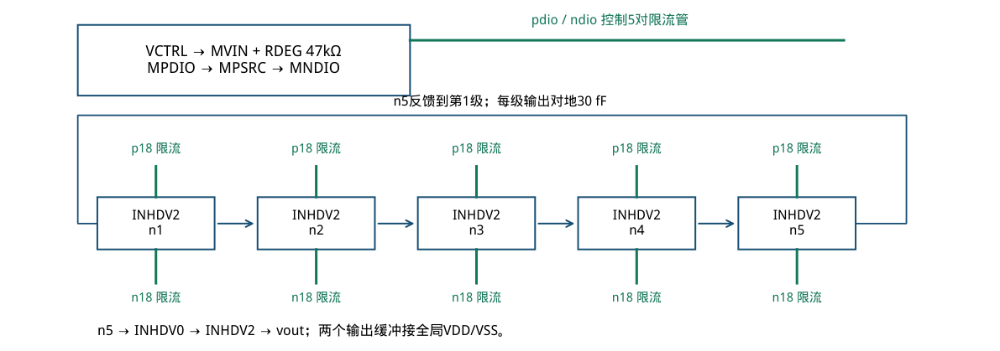
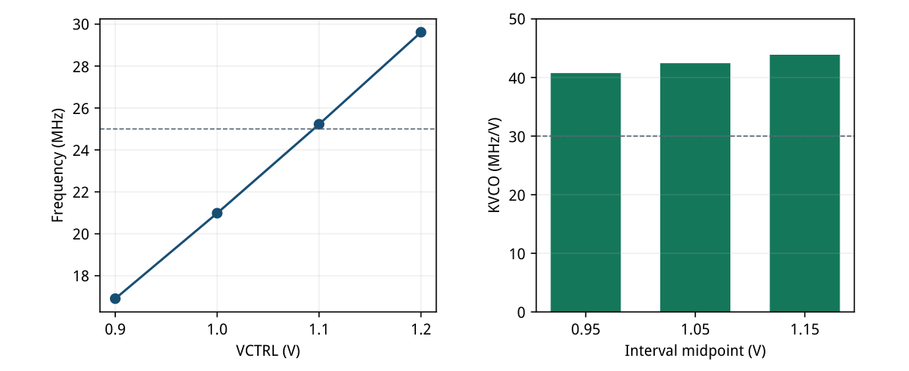
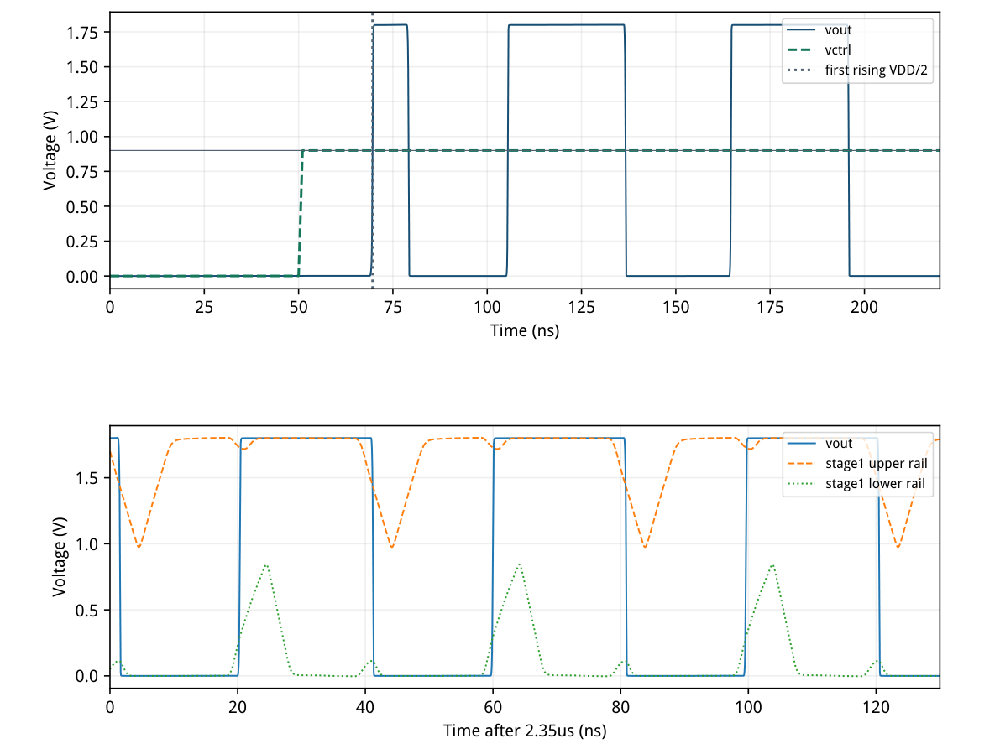
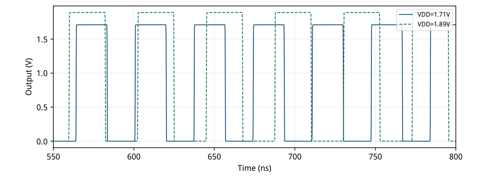
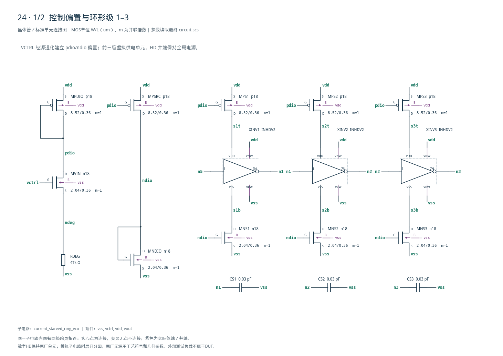
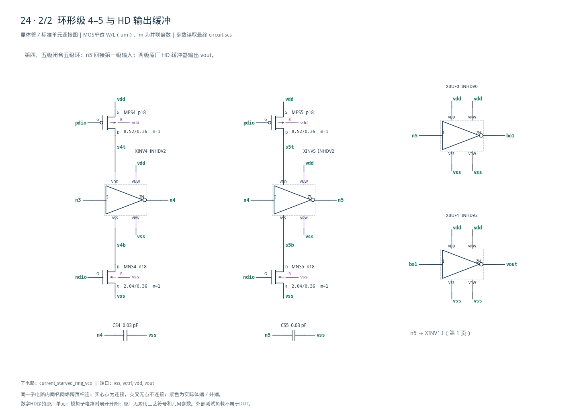

# 24 · 电流饥饿环形 VCO 审查

[审查 PDF](review.pdf) · [实测结果](latest_results.json) · [验收合同](contract.json) · [最终网表](circuit.scs)

## 验收结果

本模块把控制电压转换成连续振荡频率，通过限制环形延迟单元的充放电电流来调节周期。相比固定驱动的反相器环，电流饥饿结构提供可控的调频范围，但增益、摆幅和启动能力会随偏置变化。芯片中可用于PLL、时钟发生器和低面积时序调节，噪声与抖动还需单独评估。

结论：四平台调谐、启动、波形、功耗及成对推频全部达到原nominal门槛。

条件：SMIC18MMRF tt、27°C，调谐供电1.8 V，外载20 fF。控制电压0.9/1.0/1.1/1.2 V，各稳定平台1 us。推频保留TT/27°C、VCTRL=1.1 V、VDD=1.71/1.89 V。

| 指标 | 实测 | 原门槛 | 10%边界 | 15%边界 | 单位 |
| --- | --- | --- | --- | --- | --- |
| f(0.9 V)下界 | 16.908 | ≥10 | ≥9 | ≥8.5 | MHz |
| f(0.9 V)上界 | 16.908 | ≤25 | ≤27.5 | ≤28.75 | MHz |
| f(1.2 V) | 29.6148 | ≥25 | ≥22.5 | ≥21.25 | MHz |
| 高/低调谐比 | 1.75153 | ≥1.5 | ≥1.35 | ≥1.275 | 比值 |
| 最小KVCO | 40.752 | ≥30 | ≥27 | ≥25.5 | MHz/V |
| KVCO最大/最小 | 1.07673 | ≤1.5 | ≤1.65 | ≤1.725 | 比值 |
| 最大频率漂移 | 4.81265e-05 | ≤0.1 | ≤0.11 | ≤0.115 | % |
| 占空偏离50% | 2.68998 | ≤5 | ≤5.5 | ≤5.75 | 百分点 |
| 首次上升过半轨 | 18.6088 | ≤100 | ≤110 | ≤115 | ns |
| 四平台最坏低值 | -0.0480561 | ≤10 | ≤11 | ≤11.5 | %VDD |
| 四平台最坏高值 | 100.132 | ≥90 | ≥81 | ≥76.5 | %VDD |
| 1.2 V控制平均功耗 | 84.6706 | ≤200 | ≤220 | ≤230 | uW |
| 供电推频绝对值 | 83.5229 | ≤100 | ≤110 | ≤115 | %/V |

实际高电平占空52.690%，满足45–55%；原verifier对高/低相位取较短者，报告47.310%。放宽只扩大50%中心两侧允许误差，不移动中心。

四平台频率严格递增；4组五周期测量、4组晚期两周期测量都在各自平台结束前完成。两路推频各有完整五周期。窗口完整性、起振有效性和有限数据不放宽。

未执行其余26个调谐PVT点、SS/FF推频、失配、相噪/抖动和PEX。近零确定性频率漂移只说明两个时间窗周期一致，不能解释为真实振荡器无抖动。

## HD 延迟单元与模拟限流偏置

环内数字反相器保持原厂内部MOS，仅在供电端外接gm/ID定尺寸限流管。

| 模拟单位 | W/L (um) | gm/ID | ID/W(uA/um) | VGS表点/V | gm·ro |
| --- | --- | --- | --- | --- | --- |
| n18 | 2.04/0.36 | 15 | 4.8868 | 0.5296 | 89.50 |
| p18 | 8.52/0.36 | 15 | 1.1741 | 0.5431 | 139.51 |

LUT点：27°C、|VDS|=0.45 V、VBS=0、参考W=10 um、ID=10 uA。n18单位2.04/0.36 um，用于MVIN/MNDIO/五个下限流；p18单位8.52/0.36 um，用于二极管、转接镜及五个上限流。

| VCTRL/V | MVIN均值/uA | 实际gm/ID | 最小饱和余量/V |
| --- | --- | --- | --- |
| 0.9 | 6.7161 | 16.927 | 0.8689 |
| 1.0 | 8.2120 | 16.010 | 0.7789 |
| 1.1 | 9.7389 | 15.190 | 0.6890 |
| 1.2 | 11.2907 | 14.448 | 0.5993 |

表中实际值取稳定平台时间加权平均；余量为采样到的最小|VDS|−|VDSAT|。MVIN源极升高产生体效应，所以实际VGS不能直接等同零体偏LUT；本次实际gm/ID约14.45–16.93。

INHDV2原厂Wn/Wp=1.17/1.76 um，INHDV0=0.60/0.90 um，L均0.18 um。核心VDD/VSS接虚拟轨sXt/sXb；VNW/VPW始终接全局VDD/VSS，内部MOS尺寸和模型未改。



[查看矢量图](markdown_assets/figure-02-01.svg)

## 调谐、线性度与固定测量窗口

所有四个控制平台均测五个完整周期；最低频率不能借用下一个控制平台的边沿。

| 控制/V | 频率/MHz | 早晚漂移/% | 五周期终点/us | 晚2周期终点/us | 平台终点/us |
| --- | --- | --- | --- | --- | --- |
| 0.9 | 16.907988 | 1.631278e-07 | 0.696888 | 0.874319 | 1.051 |
| 1.0 | 20.983186 | 3.353673e-11 | 1.624019 | 1.862305 | 2.052 |
| 1.1 | 25.226914 | 4.812646e-05 | 2.568520 | 2.846002 | 3.053 |
| 1.2 | 29.614814 | 0 | 3.552372 | 3.822507 | 4.054 |

频率=5/(第6上升沿−第1上升沿)，选沿起点是平台开始后300 ns。漂移比较早期与晚期各两周期：|fearly−flate|/mean；晚期选沿起点是平台结束前300 ns。平台分别开始于51、1052、2053、3054 ns。

最小KVCO=40.752 MHz/V，最大/最小=1.07673；3个斜率都为正。1.1 V控制频率25.227 MHz，0.9→1.2 V调谐比1.75153。测得的是四点局部区间斜率，不声称更宽控制范围内线性。

交叉核验：把各稳定窗内全部10/13/17/19个完整周期求平均，与合同五周期结果最大相对差1.478329e-05%。本次无求解警告；确定性模型不包含相噪、热噪声或失配抖动。



[查看矢量图](markdown_assets/figure-03-01.svg)

## 真实起振、占空比与虚拟电源

普通DC初始化；控制由0 V在50–51 ns升至0.9 V，没有额外kick或强制初值。

起振首次上升过半电源于69.60884 ns，相对51 ns平台开始为18.60884 ns。四平台输出最小值约−0.865/−1.061/−1.251/−1.434 mV，最大值约1.8024–1.8036 V，均跨越10%与90%阈值。

1.1 V真实高电平占空52.690%；原verifier报告较短相位47.310%，两者不是两次测量冲突。HD输出缓冲承担20 fF，环内虚拟电源随周期移动，不能把sXt/sXb误连成HD阱电位。

稳定段第1级虚拟轨约−3.83 mV至1.80406 V；毫伏级越轨来自瞬态寄生耦合。限流管在充放电过程中并非全程饱和，靠近轨端退出饱和属于工作机制；静态偏置三管保持正饱和余量。



[查看矢量图](markdown_assets/figure-04-01.svg)

## 供电推频与完整 VDD 功耗

推频是本题nominal敏感度维度，保留1.71 V和1.89 V两路实际瞬态。

| VDD/V | 五周期频率/MHz | 起始沿/ns | 结束沿/ns |
| --- | --- | --- | --- |
| 1.71 | 27.272269 | 564.170728 | 747.507141 |
| 1.89 | 23.458786 | 559.822592 | 772.962351 |

推频=|fhigh−flow|/mean(fhigh,flow)/0.18×100=83.5229 %/V。VDD升高反而降低频率：电流限制下每次充放电需要更大的电压摆幅，偏置/体效应/寄生也参与；验收使用绝对灵敏度。

| VCTRL/V | V→I支路平均/uA | 全VDD稳定窗平均/uA |
| --- | --- | --- |
| 0.9 | 6.7161 | 29.9216 |
| 1.0 | 8.2120 | 35.5446 |
| 1.1 | 9.7389 | 41.2424 |
| 1.2 | 11.2907 | 46.8665 |

功耗门槛使用原3.754–4.054 us窗口：−1.8×mean(I(VDD))=84.6706 uW。包含V→I、镜像支路、五级环和两级输出缓冲；上表全稳定窗均值与此300 ns门槛窗口略有差别。

理想RDEG和五个30 fF电容为原任务明确允许项，本次未替代成实际工艺无源件。结果不含其片阻/容值PVT、匹配和布局面积保证。



[查看矢量图](markdown_assets/figure-05-01.svg)

## 完整网表、复现与证据范围

保留全部设计尺寸、HD接口与两类bench的输入快照和真实PSF。

DUT：14只模拟MOS + 7个原厂HD反相器 + 47 kΩ源极电阻 + 五个30 fF节点电容。所有HD定义include都在bench层；snapshot闭包和模型哈希见各run.json。

运行：/home/IC/CodeX/virtuoso-bridge-lite/.venv/bin/python  scripts/case24\_ring\_vco.py PDF：同一Python执行 scripts/review\_pdf.py 24

真实输出目录：runs/24/20260922T090830797411Z\_tune runs/24/20260922T090846079959Z\_push每目录包含inputs、run.json、output/bench.raw和measurements.json。

原instruction、正式verifier、bench与reference冻结于cases/24-ring-vco/source/。首次LUT候选即通过；未用原Sky130成绩替代测量。除本轮nominal外，PVT、失配、相噪/抖动及PEX均未验证。

电路SHA256：fc15de4598b7f285d780f50fc2a85f864935cf0bfa81dfb4d21208dfdfef662c

## 完整网表与电路图

[Spectre 网表](circuit.scs) · [全部分图 PDF](schematic/sheets.pdf) · [电路总图](schematic/full.svg) · [端子连接](schematic/connectivity.json)

<details>
<summary>展开完整 Spectre 网表</summary>

```spectre
// Five-stage current-starved VCO; original HD cells on virtual rails.
simulator lang=spectre
subckt current_starved_ring_vco (vss vctrl vdd vout)
RDEG (ndeg vss) resistor r=47000
MVIN (pdio vctrl ndeg vss) n18 w=2.04u l=0.36u
MPDIO (pdio pdio vdd vdd) p18 w=8.52u l=0.36u
MPSRC (ndio pdio vdd vdd) p18 w=8.52u l=0.36u
MNDIO (ndio ndio vss vss) n18 w=2.04u l=0.36u
MPS1 (s1t pdio vdd vdd) p18 w=8.52u l=0.36u
XINV1 (n5 n1 s1t s1b vdd vss) INHDV2
MNS1 (s1b ndio vss vss) n18 w=2.04u l=0.36u
CS1 (n1 vss) capacitor c=30f
MPS2 (s2t pdio vdd vdd) p18 w=8.52u l=0.36u
XINV2 (n1 n2 s2t s2b vdd vss) INHDV2
MNS2 (s2b ndio vss vss) n18 w=2.04u l=0.36u
CS2 (n2 vss) capacitor c=30f
MPS3 (s3t pdio vdd vdd) p18 w=8.52u l=0.36u
XINV3 (n2 n3 s3t s3b vdd vss) INHDV2
MNS3 (s3b ndio vss vss) n18 w=2.04u l=0.36u
CS3 (n3 vss) capacitor c=30f
MPS4 (s4t pdio vdd vdd) p18 w=8.52u l=0.36u
XINV4 (n3 n4 s4t s4b vdd vss) INHDV2
MNS4 (s4b ndio vss vss) n18 w=2.04u l=0.36u
CS4 (n4 vss) capacitor c=30f
MPS5 (s5t pdio vdd vdd) p18 w=8.52u l=0.36u
XINV5 (n4 n5 s5t s5b vdd vss) INHDV2
MNS5 (s5b ndio vss vss) n18 w=2.04u l=0.36u
CS5 (n5 vss) capacitor c=30f
XBUF0 (n5 bo1 vdd vss vdd vss) INHDV0
XBUF1 (bo1 vout vdd vss vdd vss) INHDV2
ends current_starved_ring_vco
```

</details>





## 报告来源

正文与表格整理自已交付的矢量 PDF，图表单独提取；本文件是后续整理的 Markdown，不是原 PDF 的编译输入。原 PDF、网表及测量数据保持原值。
