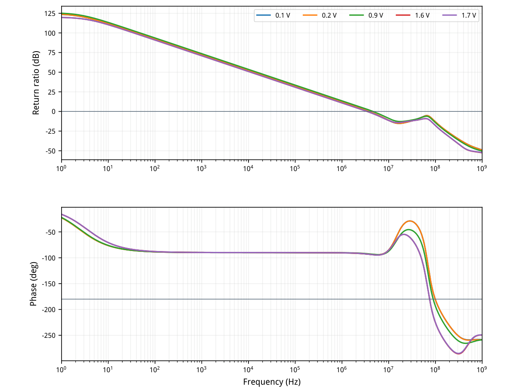
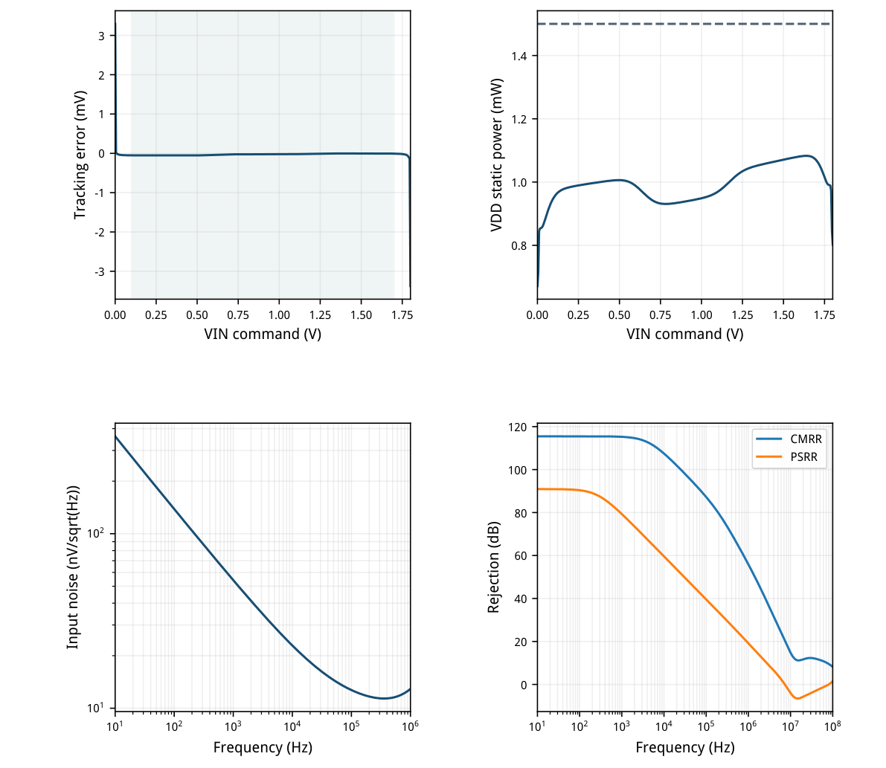
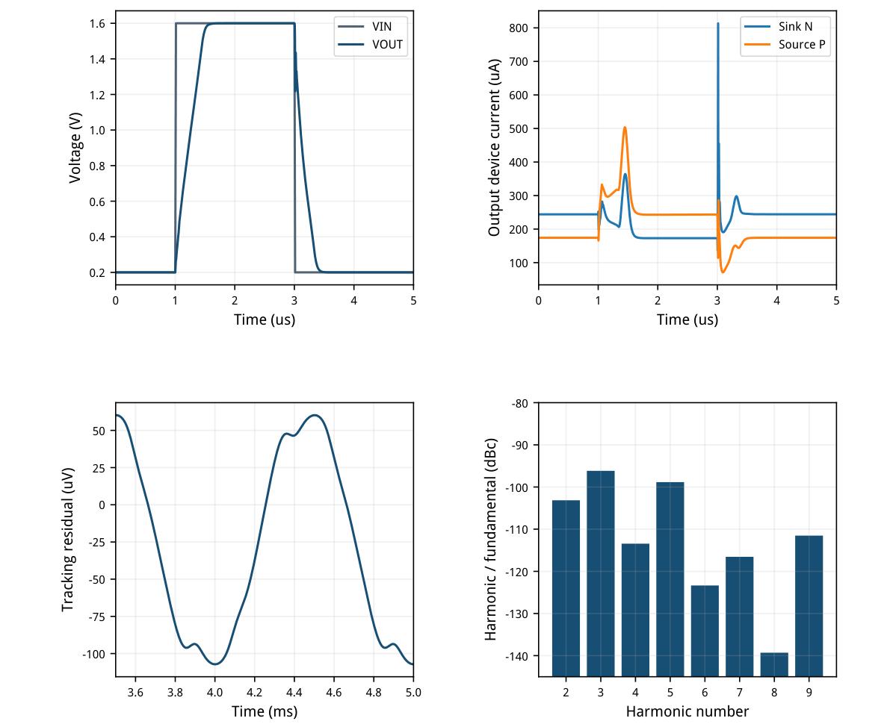
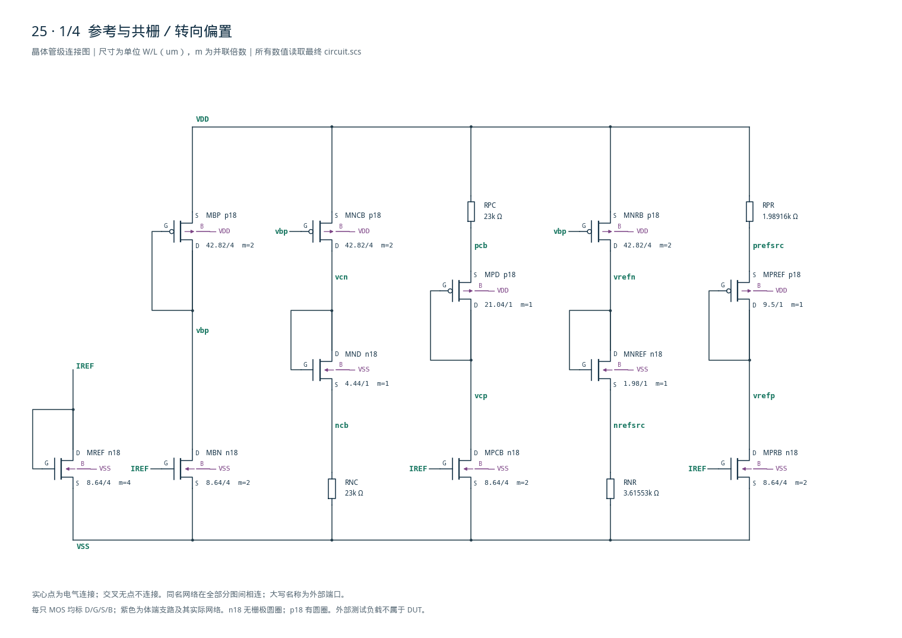
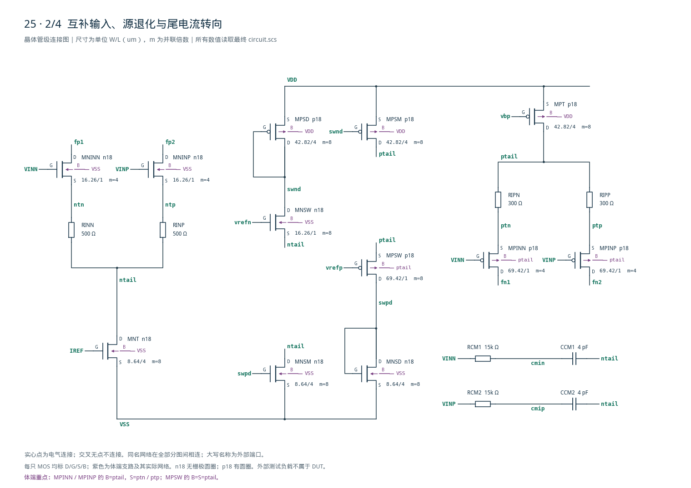
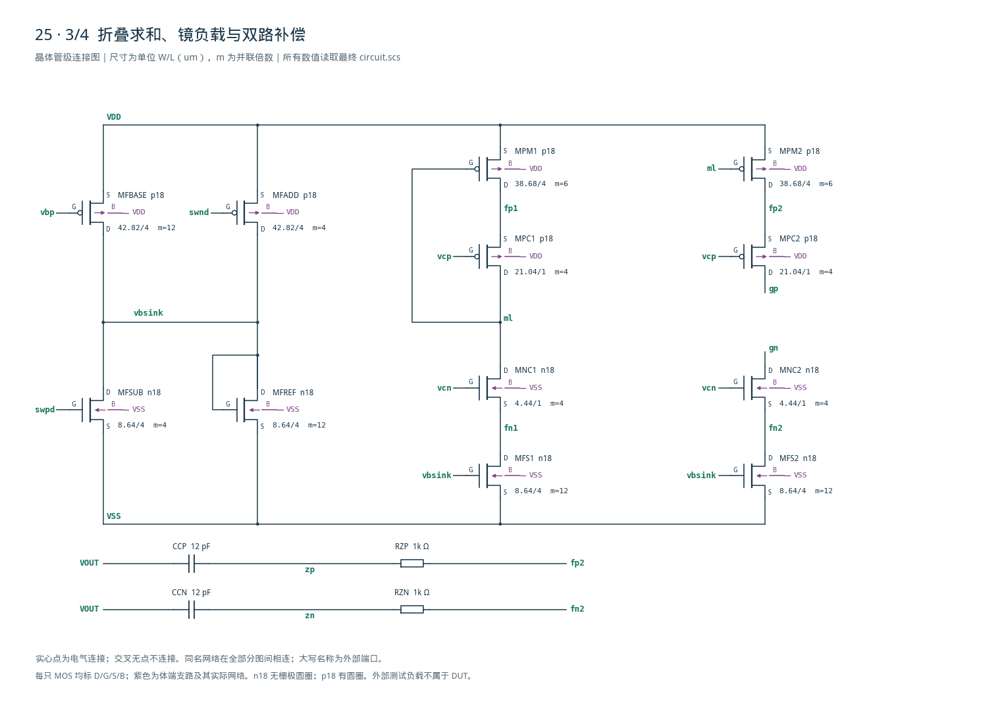
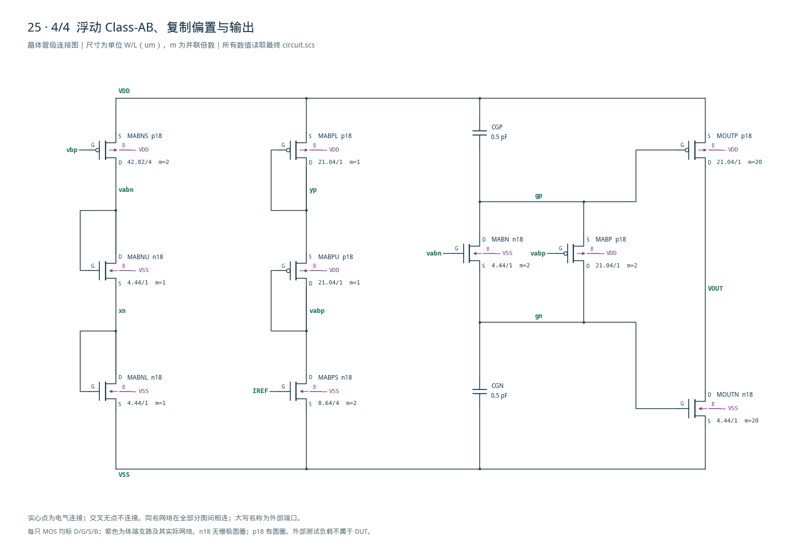

# 25 · 互补轨到轨 Class-AB 运放

[审查 PDF](review.pdf) · [实测结果](latest_results.json) · [验收合同](contract.json) · [最终网表](circuit.scs)

## 验收结果

本模块对接近两条电源轨的输入信号进行高精度电压放大，并以Class-AB输出级双向驱动负载。相比单极性输入对和固定电流的Class-A输出，互补输入及尾电流转向可扩展共模范围，浮动偏置让输出管在较低静态电流下提供更大的瞬态电流；代价是交接区、体效应复制和多节点补偿更复杂。芯片中常用于传感器信号调理、宽摆幅缓冲、ADC接口和低压模拟反馈环路。

结论：全部适用 nominal 原门槛通过；未使用10%或15%放宽。

SMIC18MMRF / TT / 1.8 V / 27°C；唯一20 uA参考，4 pF负载。跟踪、阶跃、噪声和失真另有10 kΩ接0.9 V。45 MOS、12 R、6 C，全部模拟器件有目标工艺gm/ID依据。

| 指标 | 实测 | 原门槛 | 10%边界 | 15%边界 | 单位 |
| --- | --- | --- | --- | --- | --- |
| 核心范围最小增益 | 110.42 | ≥90 | ≥89.085 | ≥88.588 | dB |
| 近轨最小增益 | 110.44 | ≥80 | ≥79.085 | ≥78.588 | dB |
| 最小UGB | 3.4852 | ≥1 | ≥0.9 | ≥0.85 | MHz |
| 核心范围最小PM | 86.715 | ≥60 | ≥54 | ≥51 | ° |
| 近轨最小PM | 86.816 | ≥55 | ≥49.5 | ≥46.75 | ° |
| 五共模UGB最大/最小 | 1.3296 | ≤2 | ≤2.2 | ≤2.3 |  |
| 核心最大跟踪误差 | 0.053093 | ≤5 | ≤5.5 | ≤5.75 | mV |
| 宽范围最大跟踪误差 | 0.053093 | ≤20 | ≤22 | ≤23 | mV |
| 合格输入共模跨度 | 1.795 | ≥1.5 | ≥1.35 | ≥1.275 | V |
| 最坏高轨余量 | 0.005 | ≤0.1 | ≤0.11 | ≤0.115 | V |
| 全扫最大VDD功耗 | 1.083 | ≤1.5 | ≤1.65 | ≤1.725 | mW |
| 10Hz–1MHz输入噪声 | 12.894 | ≤70 | ≤77 | ≤80.5 | uVrms |
| 最小双向压摆率 | 2.6271 | ≥2 | ≥1.8 | ≥1.7 | V/us |
| 最后100ns最大误差 | 0.052236 | ≤5 | ≤5.5 | ≤5.75 | mV |
| CMRR @1MHz | 55.906 | ≥55 | ≥54.085 | ≥53.588 | dB |
| PSRR @1MHz | 19.165 | ≥10 | ≥9.0849 | ≥8.5884 | dB |
| 1kHz Fourier THD | 0.0020861 | ≤0.01 | ≤0.011 | ≤0.0115 | % |
| 最大残差/0.4V | 0.026799 | ≤0.5 | ≤0.55 | ≤0.575 | % |

五个输入共模：0.1、0.2、0.9、1.6、1.7 V；AC输出均由DC伺服维持0.9 V。独立闭环STB最小PM86.569°，五条1 Hz–1 GHz环路均只有一次下降交越且无回穿。

输入扫0–1.8 V共361点；固定20 mV资格窗得到0–1.795 V跨度。末点上限依原提取定义，不外推。最低轨余量0 V也达原要求；1 kHz CMRR115.268 dB、10 Hz PSRR90.945 dB。

范围：原25点PVT约化为nominal；未执行其余24点、两组非nominal拒斥/失真点、3个失配种子或PEX。附图S1–S4完整绘制全部63个器件；另提供整张矢量总图。

## 架构选择与gm/ID定尺寸

互补输入、尾电流转向、折叠电流汇合、浮动AB控制和两路串联RC补偿均为真实器件。

输入：NMOS和PMOS差分对各40 uA基础尾电流，源退化分别500/300 Ω。转向镜为1:1，低共模由PMOS对承接、高共模由NMOS对承接；中间两对重叠工作。折叠支路目标40 uA，输出静态目标约200 uA。

| 角色 | 模型 | 单位W/L um | gm/ID | 单位Id/uA | LUT \|VGS\| |
| --- | --- | --- | --- | --- | --- |
| N偏置/尾源/转向镜 | n18 | 8.64/4 | 14 | 5 | 0.5020 |
| P偏置/尾源/转向镜 | p18 | 42.82/4 | 14 | 5 | 0.5156 |
| N输入与同尺寸N转向 | n18 | 16.26/1 | 22 | 5 | 0.4056 |
| P输入与同尺寸P转向 | p18 | 69.42/1 | 22 | 5 | 0.4286 |
| N共栅及复制二极管 | n18 | 4.44/1 | 14 | 10 | 0.5157 |
| P共栅及复制二极管 | p18 | 21.04/1 | 14 | 10 | 0.5331 |
| P长沟道求和镜 | p18 | 38.68/4 | 10 | 10 | 0.5826 |
| N浮动管/偏置上管 | n18 | 4.44/1 | 14 | 10 | 0.5157 |
| P浮动管/偏置上管 | p18 | 21.04/1 | 14 | 10 | 0.5331 |
| N输出/偏置下管 | n18 | 4.44/1 | 14 | 10 | 0.5157 |
| P输出/偏置下管 | p18 | 21.04/1 | 14 | 10 | 0.5331 |
| N转向门限二极管 | n18 | 1.98/1 | 10 | 10 | 0.5838 |
| P转向门限二极管 | p18 | 9.50/1 | 10 | 10 | 0.6001 |

所有查询使用既有TT/27°C、Wref10 um、VBS=0表：L1的|VDS|=0.45 V，L4为0.9 V。W由Id/(Id/W)得到并量化20 nm，宽单元用m并联。最大单位W69.42 um；未超出100 um模型上限。本模块无需新扫LUT。

输入每管m4；主P镜m6；N/P浮动管m2与偏置上管m1维持相同单位电流密度；输出m20与下管m1复制目标偏置。器件实际gm/ID随体偏、漏压及共模变化，不能把LUT目标当成全范围实测常数。

补偿最终为每路12 pF串1 kΩ，分别返回fp2、fn2；两输出栅各0.5 pF。两输入经15 kΩ/4 pF耦合至ntail以改善高频共模跟随。全部R/C允许使用理想器件；无源面积、容差与寄生未签核。

## 尾电流交接与浮动Class-AB偏置

电流预算和体效应复制决定可用工作点；浮动N/P管共同从gp向gn传导。

令SN、SP为两只转向管电流，基础尾电流T=40 uA。理想镜比下：IN=T+SP−SN，IP=T+SN−SP，因此IN+IP=80 uA；折叠底部电流设为60 uA+0.5SN−0.5SP，得到K=Isink−IP/2=40 uA。真实镜管漏压不同，以下保留实测偏差。

| VCM/V | N输入/支uA | P输入/支uA | SN/uA | SP/uA | K/uA | 输出Iq/uA |
| --- | --- | --- | --- | --- | --- | --- |
| 0.1 | 0.000 | 40.339 | 39.023 | 0.000 | 40.081 | 208.398 |
| 0.2 | 0.000 | 40.288 | 39.022 | 0.000 | 40.131 | 208.191 |
| 0.9 | 19.907 | 20.423 | 0.039 | 0.032 | 40.687 | 205.922 |
| 1.6 | 40.627 | 0.000 | 0.000 | 40.309 | 41.323 | 203.371 |
| 1.7 | 40.718 | 0.000 | 0.000 | 40.309 | 41.323 | 203.371 |

中点输入gm/ID为N22.29/P22.00，近轨单边活动对约19.6–20.1；活动输入总gm变化不大。两条尾支路不会在交接时同时消失。截止的互补输入或转向管是预期状态，不对这些管强求饱和导通。

N偏置：上管(MABNU)与浮动管(MABN)同L、同单位电流密度，体均接VSS；下管(MABNL)复制输出N管VGS。于是gn≈xn。P偏置同理：上管MABPU与MABP的体均接VDD，源分别yp、gp；保留相同体偏使gp≈yp，不能只把上管体接本地源。

| 中心工作点 | 实测 |
| --- | --- |
| xn | 0.517595 V |
| gn | 0.516621 V |
| yp | 1.266860 V |
| gp | 1.265934 V |
| vabn | 1.169819 V |
| vabp | 0.581512 V |
| fn2 | 0.235728 V |
| fp2 | 1.567989 V |

中心输出静态电流205.922 uA；完整阶跃期间源出峰值503.770 uA、灌入峰值813.736 uA，超过静态电流，体现AB驱动。全输入扫的VDD最大1.083 mW已经包含20 uA参考支路。

体效应复制关系为 GN ≈ XN、GP ≈ YP，IABN + IABP = K。MOUTN/P 的并联倍数 m=20，MABNL/PL 为 m=1。

## 五共模稳定性与补偿修正

原AC返回比T=−VOUT/VINN；另外以原负载下的真实闭环STB交叉检查。

| VCM/V | 10Hz增益/dB | UGB/MHz | 原AC PM/° | 真实STB PM/° |
| --- | --- | --- | --- | --- |
| 0.1 | 111.637 | 3.7886 | 86.816 | 86.640 |
| 0.2 | 111.644 | 3.7890 | 86.886 | 86.710 |
| 0.9 | 113.346 | 4.6339 | 86.715 | 86.569 |
| 1.6 | 110.422 | 3.4852 | 87.064 | 86.937 |
| 1.7 | 110.441 | 3.4942 | 87.051 | 86.922 |

初版6 pF/5 kΩ：中点UGB54.321 MHz、PM19.684°，共模UGB比4.739，失败；近轨PM虽大也不能代表中点。改为12 pF/1 kΩ后五点均通过，最小双向压摆率仍2.627 V/us。

gm平坦不能单独证明UGB平坦。两路补偿零极点及内部加载共同决定返回比。本次仅修正一次后满足原指标；五个原AC及STB响应在1Hz–1GHz均无0dB回穿。



[查看矢量图](markdown_assets/figure-04-01.svg)

## 轨到轨跟踪、功耗、噪声与拒斥

保留原负载、频段和固定0.9V拒斥共模；不由匹配模型推断失配性能。

| 指标 | 实测/dB | 原下限/dB |
| --- | --- | --- |
| CMRR @1kHz | 115.267702 | 70 |
| CMRR @1MHz | 55.906430 | 55 |
| PSRR @10Hz | 90.945183 | 45 |
| PSRR @1MHz | 19.165075 | 10 |

原噪声bench在DC闭环，但AC由大电容把负输入接地；本次如实测其输入折算谱，固定10Hz–1MHz积分12.894430 uVrms。此数不是独立实测的闭环输出总噪声。

0.2–1.6V与0.1–1.7V误差均≤53.093uV；5mV/20mV误差窗保持。0.9V确定性偏差−23.487uV；3个随机失配种子未执行，不能视为失调良率。



[查看矢量图](markdown_assets/figure-05-01.svg)

## 大信号双向驱动与低失真

阶跃0.2↔1.6V，4pF并10kΩ；THD为0.9V中心、0.4V峰值、1kHz。

| 正式指标 | 实测 | 原门槛 |
| --- | --- | --- |
| 上升20%→80% SR | 2.627118 V/us | ≥2 |
| 下降80%→20% SR | 3.180105 V/us | ≥2 |
| 两个末100ns窗误差 | 52.236 uV | ≤5000 uV |
| Fourier h2..h9 THD | 0.002086105 % | ≤0.01 % |
| 3.5–5ms最大残差/幅度 | 0.026799 % | ≤0.5 % |

阶跃观察5us；边沿1–1.01us/3–3.01us，SR用0.48/1.32V交越；末窗2.9–3us和4.9–5us。最大步0.5ns，1ns保存；没有缩短观察窗或按实测终值重定义误差。

THD仿真5ms、最大步50ns、250ns保存；取最后1ms相干周期，DC+1..9谐波拟合。原默认200点和4000点交叉一致。失真不包含随机瞬态噪声。



[查看矢量图](markdown_assets/figure-06-01.svg)

## 测量合同、复现路径与证据边界

六组正式nominal运行，加一组包含五共模分析的真实闭环STB；本轮只设计第25项。

| 运行 | 保持的原测试定义 | 验收覆盖 |
| --- | --- | --- |
| AC | 五共模；1Hz–1GHz；输出DC0.9V；4pF+1TΩ | 五点gain/UGB/PM/power和比值 |
| 跟踪 | 0–1.8V，5mV步进；4pF+10kΩ | 361点、固定误差窗、全扫功耗 |
| 噪声 | 10Hz–1MHz，负输入AC接地 | 原输入折算谱；501点积分 |
| CMRR/PSRR | 固定0.9V，差分基准实例 | 4pF与100MΩ；指定频点 |
| 阶跃 | 完整5us，两方向和两个末100ns窗 | 首个20/80%交越与最大误差 |
| 失真 | 5ms正弦；最后1ms Fourier | 1..9次谐波、1.5ms残差窗 |
| STB诊断 | 真实闭合反馈、五个共模点 | 原AC负载；每条单次交越 |

所有最终运行模型尺寸合法，六组正式运行使用同一电路SHA；全部LUT及源合同已冻结。AC与STB各有两条SPECTRE-294提示：保存1480条信号可能减慢初始化；数据完整，未发生模型尺寸越界或仿真失败。其他最终运行无警告。

独立复核：原默认200点Fourier与4000点THD一致；噪声输出谱/传递增益逐点等于输入谱，PSD梯形与幂律积分约差0.0004%。这些是现有PSF后处理核对，没有重跑电气或改变合同。

复现命令（在工程根目录，用既有Bridge Python）： python scripts/case25\_complementary\_ab.py --full python scripts/case25\_complementary\_ab.py --stb python scripts/case25\_complementary\_ab.py --extract python scripts/schematic25.py python scripts/review\_pdf.py 25

最终运行路径：runs/25/20260923T041729784311Z\_ac runs/25/20260923T041737996305Z\_track runs/25/20260923T041738178168Z\_noise runs/25/20260923T041738398537Z\_reject runs/25/20260923T041738565376Z\_step runs/25/20260923T041823802535Z\_thd runs/25/20260923T041937248892Z\_stb

原题其余PVT、代表非nominal点、3次固定失配回归、真实参考噪声、无源容差和版图寄生均未完成。大增益与低确定性误差不能作为这些范围的通过证据。

## 精确晶体管网表与图纸对应

D G S B端序；每个器件均在附图S1–S4中出现，体端与跨页同名网络明确标识。

图纸：cases/25-complementary-ab/schematic/full.svg与full.pdf提供整张总图；sheets.pdf为后附分图。connectivity.json和schematic\_audit.json检查每个实例与引脚。网表为唯一电气真源，图纸数值从该文件自动提取。

电路SHA-256：96b5209db247cee7e96e92e1189b494a6d08dca1efd22237326692957ccbff80

## 完整网表与电路图

[Spectre 网表](circuit.scs) · [全部分图 PDF](schematic/sheets.pdf) · [电路总图](schematic/full.svg) · [端子连接](schematic/connectivity.json)

<details>
<summary>展开完整 Spectre 网表</summary>

```spectre
// SMIC18 TT: complementary input, constant-sum tail steering, folded summing, floating Class-AB.
simulator lang=spectre
subckt complementary_folded_cascode_ab_opamp (vss iref vdd vinn vinp vout)
MREF (iref iref vss vss) n18 w=8.64u l=4u m=4
MBN (vbp iref vss vss) n18 w=8.64u l=4u m=2
MBP (vbp vbp vdd vdd) p18 w=42.82u l=4u m=2
MNCB (vcn vbp vdd vdd) p18 w=42.82u l=4u m=2
MND (vcn vcn ncb vss) n18 w=4.44u l=1u m=1
RNC (ncb vss) resistor r=23000
MPCB (vcp iref vss vss) n18 w=8.64u l=4u m=2
MPD (vcp vcp pcb vdd) p18 w=21.04u l=1u m=1
RPC (vdd pcb) resistor r=23000
MNRB (vrefn vbp vdd vdd) p18 w=42.82u l=4u m=2
MNREF (vrefn vrefn nrefsrc vss) n18 w=1.98u l=1u m=1
RNR (nrefsrc vss) resistor r=3615.53
MPRB (vrefp iref vss vss) n18 w=8.64u l=4u m=2
MPREF (vrefp vrefp prefsrc vdd) p18 w=9.5u l=1u m=1
RPR (vdd prefsrc) resistor r=1989.16
MNT (ntail iref vss vss) n18 w=8.64u l=4u m=8
MPT (ptail vbp vdd vdd) p18 w=42.82u l=4u m=8
MNINN (fp1 vinn ntn vss) n18 w=16.26u l=1u m=4
MNINP (fp2 vinp ntp vss) n18 w=16.26u l=1u m=4
RINN (ntn ntail) resistor r=500
RINP (ntp ntail) resistor r=500
MPINN (fn1 vinn ptn ptail) p18 w=69.42u l=1u m=4
MPINP (fn2 vinp ptp ptail) p18 w=69.42u l=1u m=4
RIPN (ptail ptn) resistor r=300
RIPP (ptail ptp) resistor r=300
MNSW (swnd vrefn ntail vss) n18 w=16.26u l=1u m=8
MPSD (swnd swnd vdd vdd) p18 w=42.82u l=4u m=8
MPSM (ptail swnd vdd vdd) p18 w=42.82u l=4u m=8
MPSW (swpd vrefp ptail ptail) p18 w=69.42u l=1u m=8
MNSD (swpd swpd vss vss) n18 w=8.64u l=4u m=8
MNSM (ntail swpd vss vss) n18 w=8.64u l=4u m=8
MFBASE (vbsink vbp vdd vdd) p18 w=42.82u l=4u m=12
MFADD (vbsink swnd vdd vdd) p18 w=42.82u l=4u m=4
MFSUB (vbsink swpd vss vss) n18 w=8.64u l=4u m=4
MFREF (vbsink vbsink vss vss) n18 w=8.64u l=4u m=12
MFS1 (fn1 vbsink vss vss) n18 w=8.64u l=4u m=12
MFS2 (fn2 vbsink vss vss) n18 w=8.64u l=4u m=12
MNC1 (ml vcn fn1 vss) n18 w=4.44u l=1u m=4
MNC2 (gn vcn fn2 vss) n18 w=4.44u l=1u m=4
MPM1 (fp1 ml vdd vdd) p18 w=38.68u l=4u m=6
MPM2 (fp2 ml vdd vdd) p18 w=38.68u l=4u m=6
MPC1 (ml vcp fp1 vdd) p18 w=21.04u l=1u m=4
MPC2 (gp vcp fp2 vdd) p18 w=21.04u l=1u m=4
MABN (gp vabn gn vss) n18 w=4.44u l=1u m=2
MABP (gn vabp gp vdd) p18 w=21.04u l=1u m=2
MABNS (vabn vbp vdd vdd) p18 w=42.82u l=4u m=2
MABNU (vabn vabn xn vss) n18 w=4.44u l=1u m=1
MABNL (xn xn vss vss) n18 w=4.44u l=1u m=1
MABPS (vabp iref vss vss) n18 w=8.64u l=4u m=2
MABPU (vabp vabp yp vdd) p18 w=21.04u l=1u m=1
MABPL (yp yp vdd vdd) p18 w=21.04u l=1u m=1
MOUTN (vout gn vss vss) n18 w=4.44u l=1u m=20
MOUTP (vout gp vdd vdd) p18 w=21.04u l=1u m=20
CGN (gn vss) capacitor c=0.5p
CGP (gp vdd) capacitor c=0.5p
RCM1 (vinn cmin) resistor r=15000
RCM2 (vinp cmip) resistor r=15000
CCM1 (cmin ntail) capacitor c=4p
CCM2 (cmip ntail) capacitor c=4p
CCP (vout zp) capacitor c=12p
RZP (zp fp2) resistor r=1000
CCN (vout zn) capacitor c=12p
RZN (zn fn2) resistor r=1000
ends complementary_folded_cascode_ab_opamp
```

</details>









## 报告来源

正文与表格整理自已交付的矢量 PDF，图表单独提取；本文件是后续整理的 Markdown，不是原 PDF 的编译输入。原 PDF、网表及测量数据保持原值。
