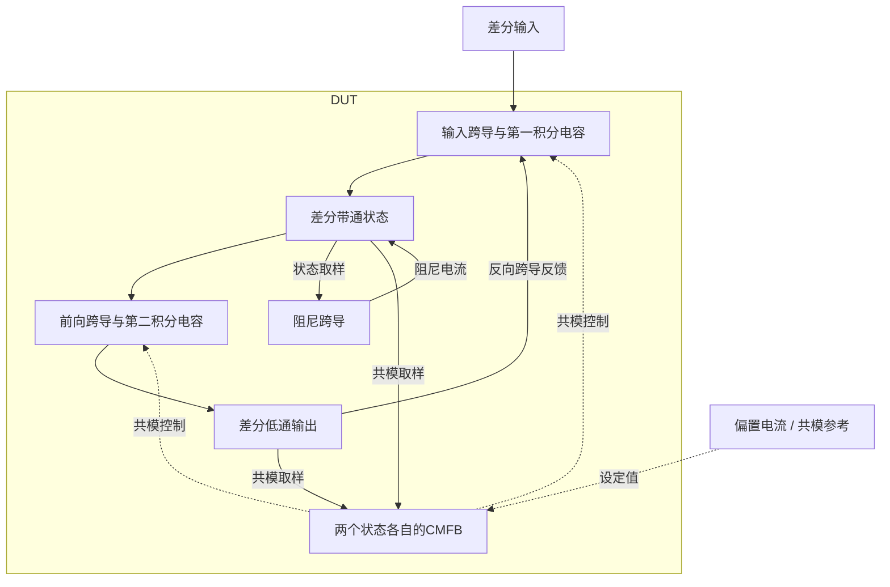
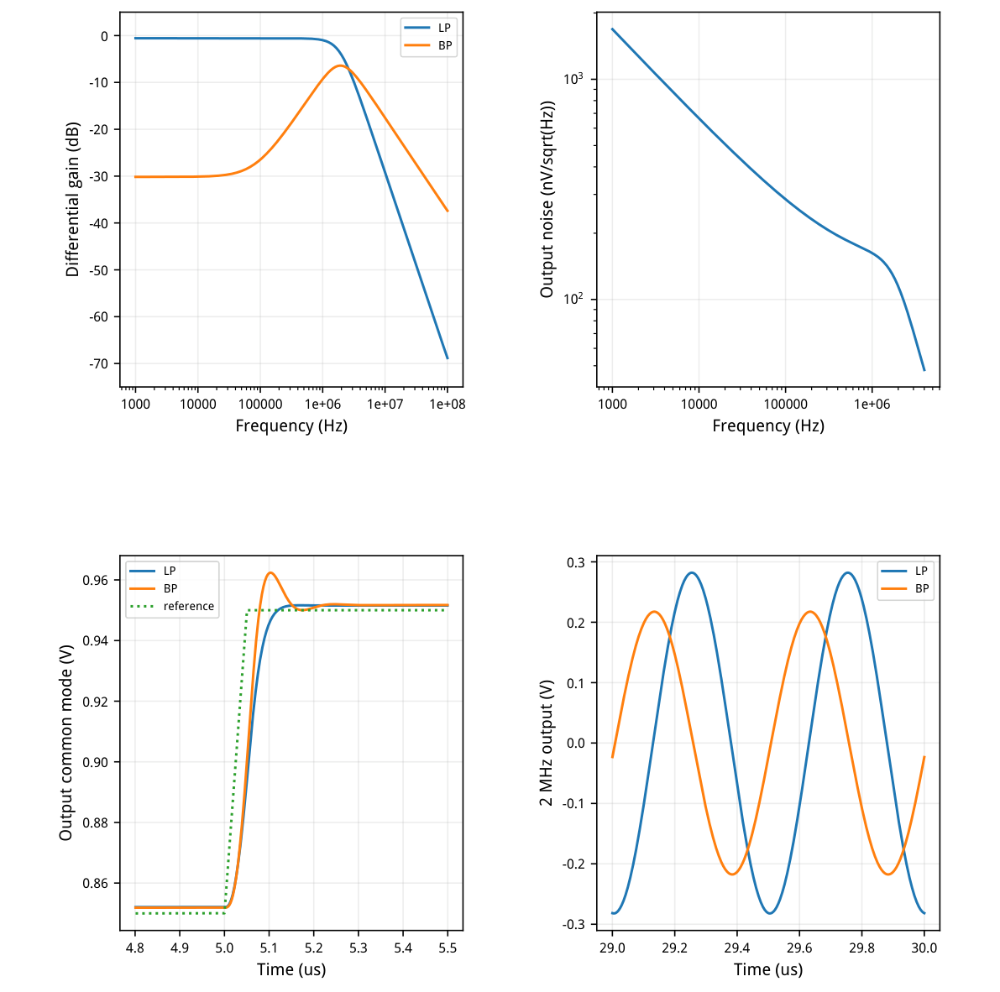
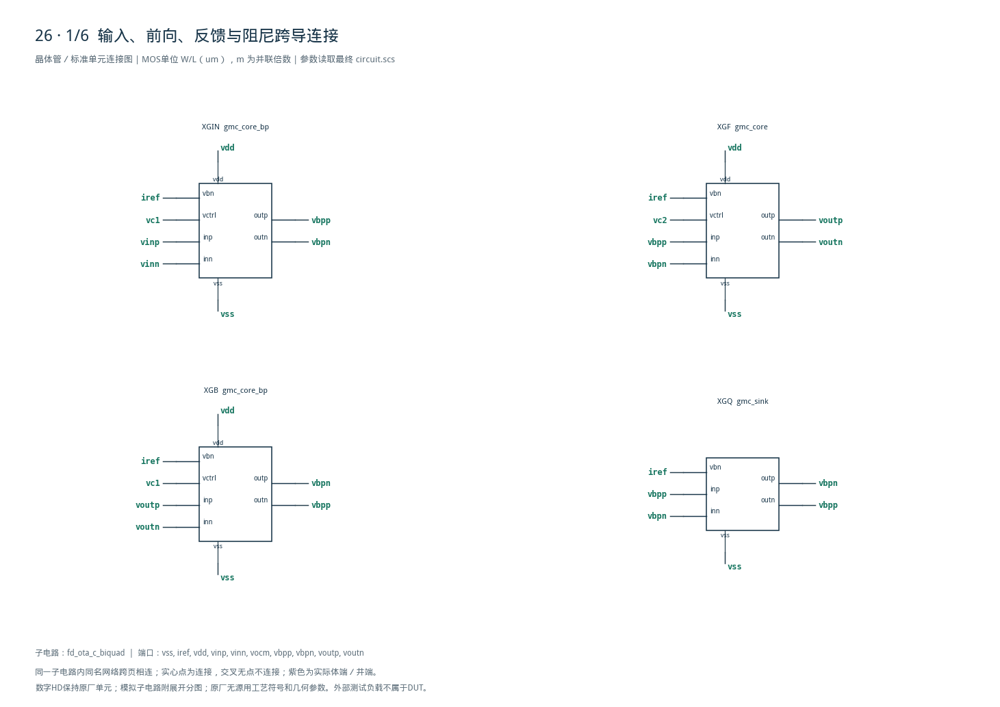
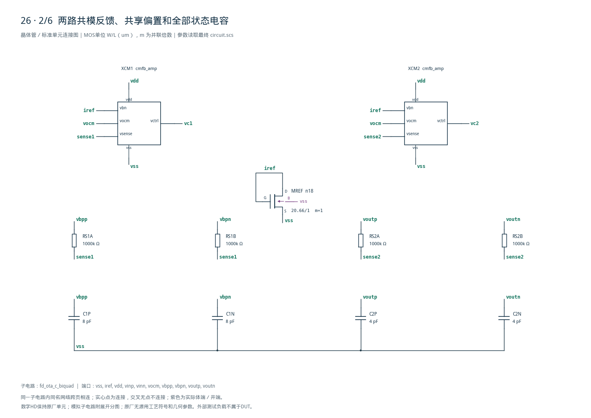
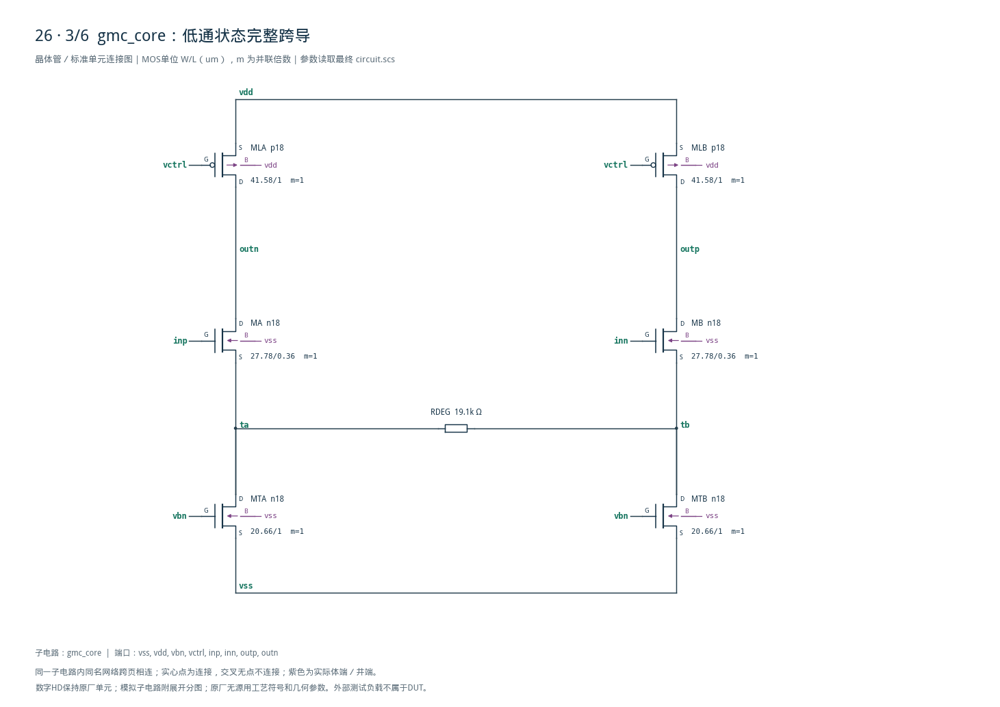
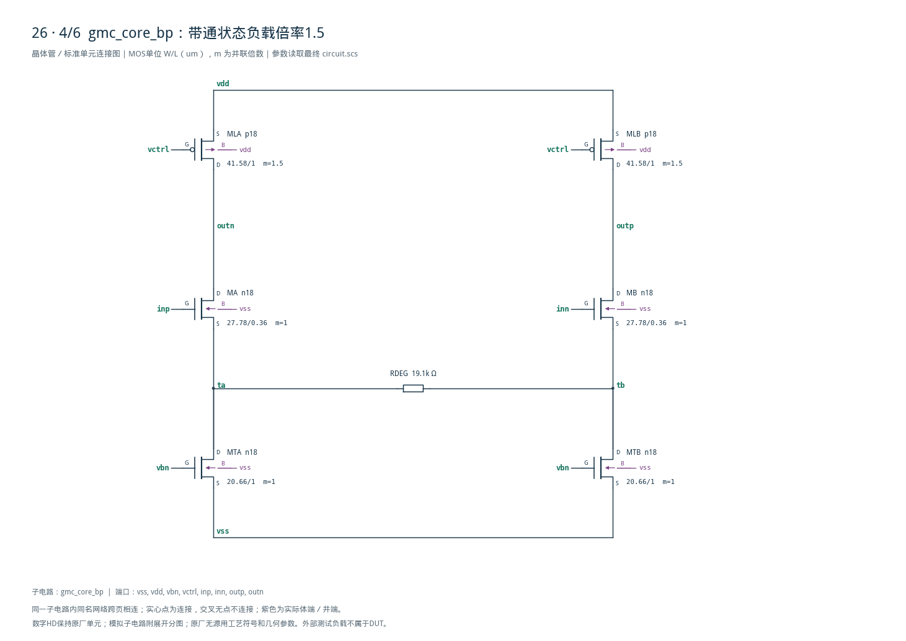
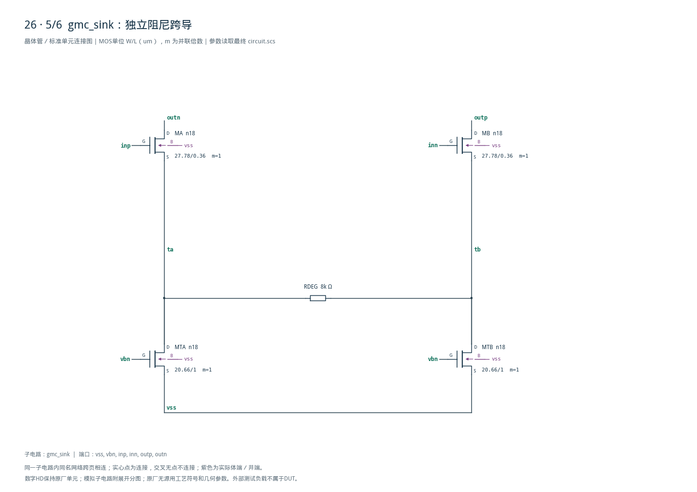
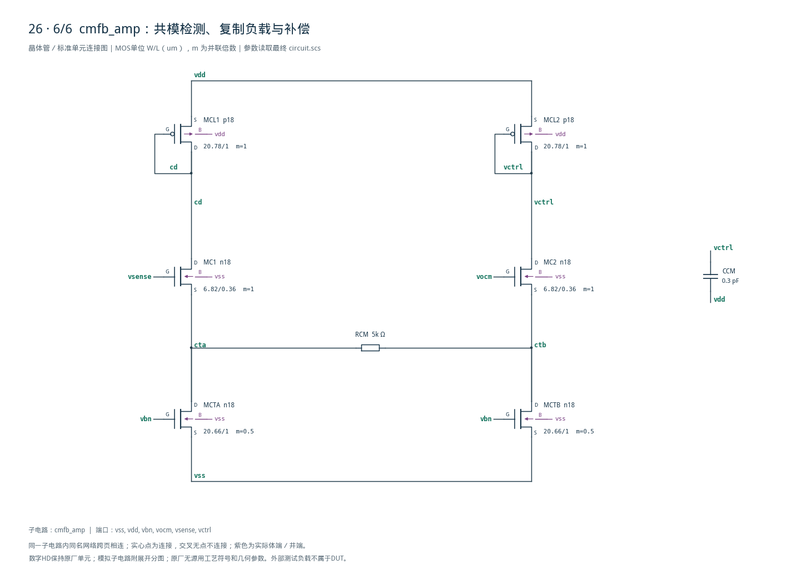

# 26 · 全差分OTA-C双二阶审查

[审查 PDF](review.pdf) · [实测结果](latest_results.json) · [验收合同](contract.json) · [最终网表](circuit.scs)

## 验收结果

本模块用跨导单元和电容实现二阶低通与带通滤波，差分状态节点由独立共模反馈保持偏置。相比电阻有源滤波器，极点由跨导与电容共同决定，可通过偏置调节，但跨导非线性、噪声和共模稳定性需要一起控制。芯片中可用于接收机基带、抗混叠滤波和模拟信号调理。

结论：TT/1.8V/27°C全部26项标量及原16组检查通过。

四个跨导支路构成双积分反馈，提供低通和带通输出。相对RC无源滤波可通过偏置调谐并缓冲负载，但消耗静态电流，线性度和共模稳定性依赖有源电路；适合接收机基带滤波。

| 指标 | 实测 | 原 | 10% | 15% |
| --- | --- | --- | --- | --- |
| 中心频率偏差/kHz | 75.282 | ≤200 | ≤220 | ≤230 |
| Q相对0.7偏差 | 0.00967912 | ≤0.05 | ≤0.055 | ≤0.0575 |
| 通带增益下限/dB | -0.561336 | ≥-1 | ≥-1.9151 | ≥-2.4116 |
| 通带增益上限/dB | -0.561336 | ≤1 | ≤1.8279 | ≤2.214 |
| 拟合RMS/dB | 0.00178734 | ≤0.5 | ≤0.55 | ≤0.575 |
| 20MHz衰减/dB | 40.6172 | ≥35 | ≥34.085 | ≥33.588 |
| BP峰频偏差/kHz | 72.4751 | ≤300 | ≤330 | ≤345 |
| BP峰增益下限/dB | -6.40561 | ≥-8 | ≥-8.9151 | ≥-9.4116 |
| BP峰增益上限/dB | -6.40561 | ≤-5 | ≤-4.1721 | ≤-3.786 |
| BP拒斥1kHz/dB | 23.7526 | ≥18 | ≥17.085 | ≥16.588 |
| BP拒斥200kHz/dB | 15.7415 | ≥15 | ≥14.085 | ≥13.588 |
| BP拒斥20MHz/dB | 17.108 | ≥15 | ≥14.085 | ≥13.588 |
| 共模DC误差/mV | 1.82506 | ≤10 | ≤11 | ≤11.5 |
| 总供电功耗/uW | 393.44 | ≤500 | ≤550 | ≤575 |
| 输出噪声/uVrms | 295.662 | ≤500 | ≤550 | ≤575 |

f0=1.924718015MHz，Q=0.690320881；BP峰1.927524913MHz。频率门槛以目标2MHz的误差带表示。仅完整TT六类功能试验，未扩称62运行PVT签核。

<!-- SYSTEM-BLOCK-DIAGRAM -->
## 系统框图

差模二阶环路和两路共模反馈分别标明；不是简单串联两个独立低通。

实线表示信号或能量通路，虚线表示时钟、控制或偏置。DUT框外为外部端口或测试夹具；精确端子连接见后附基本电路图。



[独立Mermaid源文件](system_block_diagram.mmd) · [框图SVG](markdown_assets/system-block.svg)
<!-- END-SYSTEM-BLOCK-DIAGRAM -->

## 失真、增益与共模恢复验收

固定输入幅度、2周期取样、2–5次谐波；同时约束基本增益。

| 指标 | 实测 | 原 | 10% | 15% |
| --- | --- | --- | --- | --- |
| 200k/0.6Vpp THD/dB | -54.5022 | ≤-45 | ≤-44.172 | ≤-43.786 |
| 200k/0.6Vpp增益 | 0.934349 | ≥0.85 | ≥0.765 | ≥0.7225 |
| 200k/0.9Vpp THD/dB | -44.4451 | ≤-30 | ≤-29.172 | ≤-28.786 |
| 200k/0.9Vpp增益 | 0.929247 | ≥0.8 | ≥0.72 | ≥0.68 |
| 2M/0.9Vpp LP THD/dB | -59.8962 | ≤-45 | ≤-44.172 | ≤-43.786 |
| 2M/0.9Vpp LP增益 | 0.626376 | ≥0.5 | ≥0.45 | ≥0.425 |
| 2M/0.9Vpp BP THD/dB | -52.7833 | ≤-45 | ≤-44.172 | ≤-43.786 |
| 2M/0.9Vpp BP增益 | 0.483615 | ≥0.3 | ≥0.27 | ≥0.255 |
| 共模初始误差/mV | 2.07288 | ≤10 | ≤10 | ≤10 |
| 共模建立/ns | 68.1026 | ≤1000 | ≤1100 | ≤1150 |
| 共模晚期偏差/mV | 1.72943 | ≤10 | ≤10 | ≤10 |

每次THD仿真30us，取最后2周期，均匀插值256点；仅2–5次谐波合成THD。输出幅度除以输入差分峰值为增益。dB放宽在幅度比上实施，未直接把负dB乘1.1。

共模参考0.85→0.95V，5–5.05us线性变化。建立时间从5.05us计至最后一次超出固定±10mV带；初始取4.85us，晚期取12us以后。低通和带通两路同时检查。

## 跨导结构、gm/ID与实际工作点

常规n18/p18实现原LVT结构功能；无模型别名或行为源替代。

| 角色 | 单位W/L um | 初算gm/ID | 初算I/uA |
| --- | --- | --- | --- |
| bias | 20.66/1 | 18 | 20 |
| input | 27.78/0.36 | 22 | 20 |
| load | 41.58/1 | 14 | 20 |
| cm_input | 6.82/0.36 | 20 | 10 |
| cm_load | 20.78/1 | 14 | 10 |

信号跨导每侧20uA，源间退化19.1kΩ；阻尼跨导无PMOS负载、源间8kΩ。带通节点接三组NMOS电流，两个PMOS负载各m1.5供30uA。C1两只各8pF，C2两只各4pF，四节点均外接250fF。

| 实际OP | \|ID\|/uA | gm/ID | gmb/uS | VDS余量/V |
| --- | --- | --- | --- | --- |
| 尾电流 | 19.8645 | 18.0314 | 107.304 | 0.2861 |
| 输入对 | 19.8645 | 22.3164 | 106.229 | 0.4665 |
| BP负载 | 29.7993 | 14.0476 | 133.470 | 0.7746 |
| CM输入 | 10.0235 | 20.2026 | 48.781 | 0.8430 |
| CM负载 | 10.0235 | 13.9463 | 44.532 | 0.4093 |

两路独立共模反馈用1MΩ电阻平均输出，CM尾电流10uA/侧、源间5kΩ、0.3pF补偿。输入管体效应保留；gm/ID表仅用于初算，实际gm、gmb与VDS余量由DC结果确认。

## 频率响应、噪声与共模动态

AC 1k–100MHz；输出差分噪声积分1k–4MHz。

二阶拟合使用≤8MHz数据的逆功率多项式。20MHz与200kHz沿用原检查器最近频点语义，精算网格实际20MHz对应19.952623MHz。BP峰值由离散AC网格查找。



[查看矢量图](markdown_assets/figure-04-01.svg)

## 数值确认与独立测量

12个基线/精算运行均0错误、0警告；不额外放宽数值容差。

maxstep2→1ns，reltol1e-6→1e-7；AC每十倍频100→200点、噪声80→160点。28项事前固定容差均通过。最大THD差0.044244dB&lt;0.05dB；噪声差0.012286uV&lt;1uV。

拟合f0仅差约1.965Hz；BP离散峰频差22.064kHz，处于预设30kHz内，体现网格取峰分辨率。最大2MHz基波幅度差42.499uV&lt;100uV。报告保留全部差异，没有改动通过界限。

独立审计用原Gauss消元拟合、直接复数DFT和共模扫描重算；噪声独立逐频段PSD积分后适配原积分结果接口。28项与主测量一致；原16组检查函数在显式TT六记录投影下全部通过。

图纸覆盖5个子电路定义共42实例、160端子，包括4个跨导块、两路CMFB、所有退化电阻与状态电容。展开复用后是51个叶级实例；不把定义数与展开数混写。

模型、LUT、源任务与每次运行输入哈希核对通过。两路共模通过阶跃验证；未额外声称独立共模环路相位裕量或失配后稳定性。

## 最终完整网表 1/2

全部层级定义及顶层连接原样列出。

电路SHA-256：ca1d973f73e9bc1899742bfe7698bdb9dfd31c3b23f2dd842da9dc403d49a82d

## 最终完整网表 2/2

全部层级定义及顶层连接原样列出。

电路SHA-256：ca1d973f73e9bc1899742bfe7698bdb9dfd31c3b23f2dd842da9dc403d49a82d

## 复现入口与未覆盖项

附后6页完整电路图，原检查器及全部运行证据随附。

既有Bridge Python，工程根目录： python scripts/case26\_ota\_c.py python scripts/confirm26.py python scripts/schematic26.py python scripts/audit26.py python scripts/review26.py 报告生成后仍需实际逐页检查。

contract.json固定原频率、负载、输入幅度、THD窗口、共模窗口及门槛。source/保持原文件；independent\_measurement\_details保留原16组评分。numerical\_plan、baseline和confirmation可追溯两套运行。

当前为TT1.8V27°C六类功能试验。其余24个AC/噪声PVT点和2个动态压力点未执行；未做失配、调谐范围、版图、PEX。所有理想R/C为原题允许的DUT元件，不包含理想放大器或受控源。

PDK、原LUT、Spectre与Bridge保持原环境。完整图纸含体端、尺寸、复用子电路接口；知识库保留标称通过与未覆盖范围，不以局部结果代替完整上游签核。

## 完整网表与电路图

[Spectre 网表](circuit.scs) · [全部分图 PDF](schematic/sheets.pdf) · [电路总图](schematic/full.svg) · [端子连接](schematic/connectivity.json)

<details>
<summary>展开完整 Spectre 网表</summary>

```spectre
simulator lang=spectre
subckt gmc_core (vss vdd vbn vctrl inp inn outp outn)
MTA (ta vbn vss vss) n18 w=20.66u l=1u m=1
MTB (tb vbn vss vss) n18 w=20.66u l=1u m=1
RDEG (ta tb) resistor r=19100
MA (outn inp ta vss) n18 w=27.78u l=.36u
MB (outp inn tb vss) n18 w=27.78u l=.36u
MLA (outn vctrl vdd vdd) p18 w=41.58u l=1u m=1
MLB (outp vctrl vdd vdd) p18 w=41.58u l=1u m=1
ends gmc_core
subckt gmc_core_bp (vss vdd vbn vctrl inp inn outp outn)
MTA (ta vbn vss vss) n18 w=20.66u l=1u m=1
MTB (tb vbn vss vss) n18 w=20.66u l=1u m=1
RDEG (ta tb) resistor r=19100
MA (outn inp ta vss) n18 w=27.78u l=.36u
MB (outp inn tb vss) n18 w=27.78u l=.36u
MLA (outn vctrl vdd vdd) p18 w=41.58u l=1u m=1.5
MLB (outp vctrl vdd vdd) p18 w=41.58u l=1u m=1.5
ends gmc_core_bp
subckt gmc_sink (vss vbn inp inn outp outn)
MTA (ta vbn vss vss) n18 w=20.66u l=1u m=1
MTB (tb vbn vss vss) n18 w=20.66u l=1u m=1
RDEG (ta tb) resistor r=8000
MA (outn inp ta vss) n18 w=27.78u l=.36u
MB (outp inn tb vss) n18 w=27.78u l=.36u
ends gmc_sink
subckt cmfb_amp (vss vdd vbn vocm vsense vctrl)
MCTA (cta vbn vss vss) n18 w=20.66u l=1u m=0.5
MCTB (ctb vbn vss vss) n18 w=20.66u l=1u m=0.5
RCM (cta ctb) resistor r=5k
MC1 (cd vsense cta vss) n18 w=6.82u l=.36u
MC2 (vctrl vocm ctb vss) n18 w=6.82u l=.36u
MCL1 (cd cd vdd vdd) p18 w=20.78u l=1u
MCL2 (vctrl vctrl vdd vdd) p18 w=20.78u l=1u
CCM (vctrl vdd) capacitor c=.3p
ends cmfb_amp
subckt fd_ota_c_biquad (vss iref vdd vinp vinn vocm vbpp vbpn voutp voutn)
MREF (iref iref vss vss) n18 w=20.66u l=1u
XGIN (vss vdd iref vc1 vinp vinn vbpp vbpn) gmc_core_bp
XGF (vss vdd iref vc2 vbpp vbpn voutp voutn) gmc_core
XGB (vss vdd iref vc1 voutp voutn vbpn vbpp) gmc_core_bp
XGQ (vss iref vbpp vbpn vbpn vbpp) gmc_sink
RS1A (vbpp sense1) resistor r=1Meg
RS1B (vbpn sense1) resistor r=1Meg
XCM1 (vss vdd iref vocm sense1 vc1) cmfb_amp
RS2A (voutp sense2) resistor r=1Meg
RS2B (voutn sense2) resistor r=1Meg
XCM2 (vss vdd iref vocm sense2 vc2) cmfb_amp
C1P (vbpp vss) capacitor c=8p
C1N (vbpn vss) capacitor c=8p
C2P (voutp vss) capacitor c=4p
C2N (voutn vss) capacitor c=4p
ends fd_ota_c_biquad
```

</details>













## 报告来源

正文与表格整理自已交付的矢量 PDF，图表单独提取；本文件是后续整理的 Markdown，不是原 PDF 的编译输入。原 PDF、网表及测量数据保持原值。
