# 28-fct-amplifier 审查报告

PDF由Python/Matplotlib排版生成。此Markdown从同一报告文本、表格和网表保存，便于编辑；它不是PDF编译输入。完整生成脚本随implementation目录保存。

<!-- SYSTEM-BLOCK-DIAGRAM -->
## 系统框图

FCT仅为余量放大子模块；外部飞跨/保持网络按原测试保留，不代表已完成整条流水线ADC。

实线表示信号或能量通路，虚线表示时钟、控制或偏置。DUT框外为外部端口或测试夹具；精确端子连接见后附基本电路图。

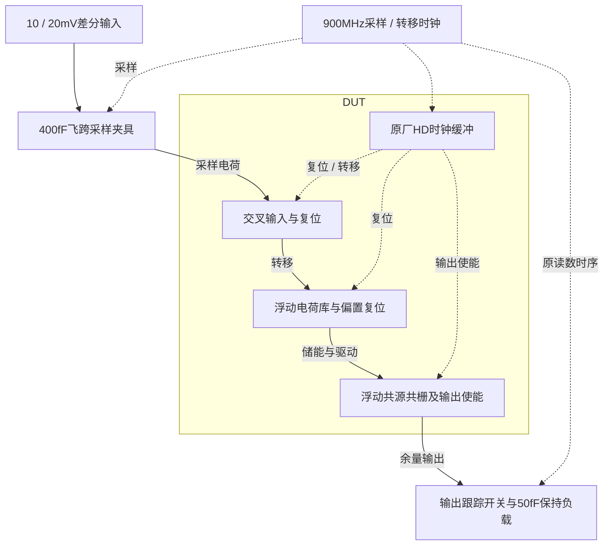
```mermaid
flowchart TB
    subgraph DUT["DUT"]
        direction TB
        IN["交叉输入与复位"]
        RES["浮动电荷库与偏置复位"]
        AMP["浮动共源共栅及输出使能"]
        CLKD["原厂HD时钟缓冲"]
    end
    VIN["10 / 20mV差分输入"]
    SC["400fF飞跨采样夹具"]
    CLK["900MHz采样 / 转移时钟"]
    HOLD["输出跟踪开关与50fF保持负载"]
    VIN --> SC
    SC -->|"采样电荷"| IN
    IN -->|"转移"| RES
    RES -->|"储能与驱动"| AMP
    AMP -->|"余量输出"| HOLD
    CLK -.-> CLKD
    CLKD -.->|"复位 / 转移"| IN
    CLKD -.->|"复位"| RES
    CLKD -.->|"输出使能"| AMP
    CLK -.->|"采样"| SC
    CLK -.->|"原读数时序"| HOLD
```

[独立Mermaid源文件](system_block_diagram.mmd) · [框图SVG](markdown_assets/system-block.svg)
<!-- END-SYSTEM-BLOCK-DIAGRAM -->

## 28 | 900MS/s FCT余量放大器

本模块在两相时钟下利用浮动电荷库和交叉输入支路放大采样余量，再由外部保持电容锁存输出。电荷转移结构避免连续时间高增益运放的静态功耗，但增益、共模、储能电容和保持时刻的建立误差需要共同权衡。芯片中可用于高速流水线ADC余量放大，本次验证900MS/s下两种固定输入幅度的标称行为。

结论：TT / 1.8V / 27°C，达到预定15%档；原指标和10%档未通过。

固定400fF飞跨电容和50fF保持负载，分别完成10mV/bin5、20mV/bin3的32点相干采样。
两组增益均未达到10%档下限；保持误差超过原1.5%，满足10%/15%档。

| 指标 | 10mV | 20mV | 原指标 | 10% | 15% |
| --- | --- | --- | --- | --- | --- |
| 增益 V/V | 4.796738 | 4.812311 | 5.5–6.5 | 4.95–7.15 | 4.675–7.475 |
| SFDR dB | 87.87971 | 84.99662 | ≥60 | ≥59.0849 | ≥58.5884 |
| 输出共模 V | 1.178956 | 1.178707 | 0.3–1.2 | 0.27–1.32 | 0.255–1.38 |
| 保持变化 % | 1.631272 | 1.623466 | ≤1.5 | ≤1.65 | ≤1.725 |
| 总功耗 mW | 4.748166 | 4.748208 | ≤5 | ≤5.5 | ≤5.75 |

保持输出范围：10mV组1.153762–1.203226V；20mV组1.129012–1.226778V。两组均满足原0.2–1.6V范围。

验收档位仅按既定指标界限换算；输入、时钟、负载、预热周期、读数时刻和功耗窗口均保留。未执行其他工艺角、噪声、失配或PEX。

## gm/ID初算与浮动电荷库

原模拟拓扑保留；数字时钟单元采用未改尺寸的原厂HD。

| 角色 | 模型 | 单位W/L um | gm/ID | 初算Id/uA |
| --- | --- | --- | --- | --- |
| nbias | n18 | 6.98/0.18 | 16.0 | 50 |
| pbias | p18 | 9.22/0.18 | 12.0 | 50 |
| ninput | n18 | 3.02/0.18 | 12.0 | 50 |
| pinput | p18 | 9.22/0.18 | 12.0 | 50 |
| nswitch | n18 | 5.42/0.18 | 8.0 | 200 |
| pswitch | p18 | 6.02/0.18 | 8.0 | 75 |

主输入支路保留原并联比例后乘0.3，二极管偏置支路不随之缩放；输出下拉/上拉尺寸分别乘2.3/1.23，串联输出使能开关乘0.6。完整实例映射保留在sizing.json。

两只主储能电容各4pF，其余电容保持原连接和值。12个DUT时钟缓冲/反相器采用BUFHDV12及INHDV12。器件宽度超过单指范围时只增加并联数；PDK模型未修改。

gm/ID确定原生器件初始电流密度，开关与浮动电荷转移过程不具有恒定gm/ID。尺寸和储能电容的取舍同时影响增益、共模、功耗及保持前建立误差。

## 最终保持样本与双频谱

离散谱线从-100dBc基线向上画；未删谐波或非基波点。

两种输入幅度的保持/提前100ps样本与单边DFT频谱；低于-100dBc只作显示截底，评分使用原始数据。

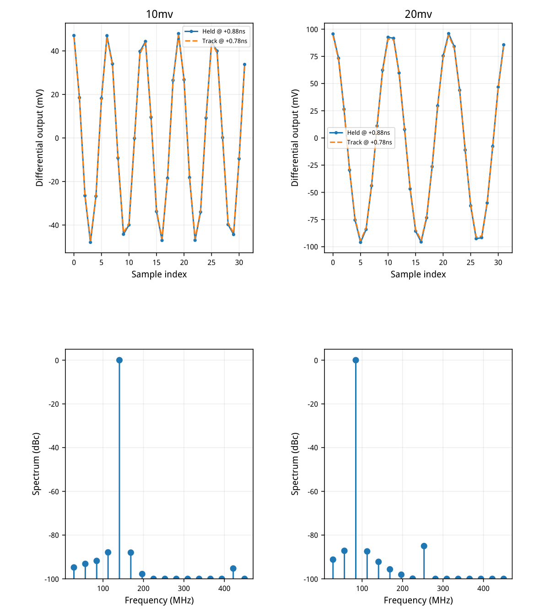

[查看矢量图](markdown_assets/figure-03-01.svg)

## 刺激、夹具与功耗边界

900MHz原始时序，64周期预热后取32个样本。

输入共模1V，差分峰值10/20mV，分别为32点DFT的第5/3频点；两侧正弦相位±90°。采样相延迟T−0.1ns、宽T−0.8ns；转移相延迟T−0.8ns、宽0.5ns；两者边沿10ps。

输出跟踪开关延迟T−1.03ns、宽0.72ns、边沿20ps。在第64至95周期的+0.88ns取保持值，+0.78ns取提前值。保持变化=RMS(提前差分−保持差分)/RMS(保持差分)，不是仅观察保持平台是否平坦。

原夹具飞跨电容400fF、输出保持50fF、输出预充0.9V、输入偏置50uA。
夹具理想开关Ron=0.1Ω并串1Ω、Roff=1e12Ω、阈值0.9V、迟滞0.5mV。
Spectre继电器采用1uV转移正则化，两端各100aF；启动预充仅第1ns启用。

原夹具双反相时钟缓冲固定映射BUFHDV16，在DUT调参前冻结。它保留逻辑极性和刺激，未声称与Sky130延迟完全相同。DUT五端口VDD、VCM、SAM、TRANSFER与IBIAS净供能在64T–96T积分；夹具电源单独记账，按原题排除。

SFDR以去DC的直接DFT计算，所有非基波点（含Nyquist）参与最大杂散搜索。没有拟合后删点、换窗或改变取样时刻。

## 数值确认与独立核验

保留完整原始source、Spectre运行快照、报告Markdown与生成脚本。

maxstep1.25→0.625ps，全局reltol1e-08→1e-09（conservative实际再除10）；vabstol1e-08→1e-08V。14项差异确认通过，包括SFDR差≤0.5dB；两次均为15%档。

| 指标 | 最大基线/精算差 | 预声明上限 |
| --- | --- | --- |
| gain_vv | 1.882943e-05 | 0.01 |
| sfdr_db | 0.3200636 | 0.5 |
| hold_movement_ratio | 9.264217e-07 | 0.0002 |
| power_w | 2.893129e-08 | 5e-06 |

独立逐点插值和五端口能量积分后，调用未改动的原analyze()与直接DFT；14项交叉核对通过。原题每幅度6项检查共12项中8项通过，增益和保持误差的原指标失败如实保留；预定15%档全部通过。

早期SFDR差异检查失败，严格容差又触发理想开关处的默认恢复次数上限；最终两项恢复次数上限为10000，绝对容差保持10nV，减半步长并收紧相对容差；1nV试跑在读数窗口前因代价过高停止。原读数时刻强制输出、全部点保留，未改夹具或界限；失败与告警留档。

完整图纸13页，94个定义实例、372个端子。入口：case28_fct_amplifier.py → confirm28.py → schematic28.py → audit28.py → review28.py。PDF及同文MD均保留。

电路SHA-256：efce96d95dcf0ca96cfdd534ea6f4dbd8a564de41e7c74c7f7d0d093a5a24988

## 完整网表与电路图

[Spectre 网表](circuit.scs) · [全部分图 PDF](schematic/sheets.pdf) · [电路总图](schematic/full.svg) · [端子连接](schematic/connectivity.json)

<details>
<summary>展开完整 Spectre 网表</summary>

```spectre
simulator lang=spectre
subckt test_fct (cinn cinp coutn coutp ib sam transfer vcm vddana vdddig vssana vssdig)
MP_OUTPUT_01 (coutn output_en_b outn_pullup_node reservoir_hi_n) p18 w=2.1672u l=.18u m=1
MP_INPUT_01 (bias_input_reset reset_b_main input_ctrl_p_a vdddig) p18 w=6.02u l=.18u m=1
MP_INPUT_02 (bias_input_reset reset_b_main input_ctrl_p_b vdddig) p18 w=6.02u l=.18u m=1
MP_INPUT_03 (vcm reset_b_main cinn vdddig) p18 w=12.04u l=.18u m=1
MP_RESERVOIR_01 (bias_n_cascode reset_b_bias reservoir_gate_lo_n vddana) p18 w=2.408u l=.18u m=1
MP_INPUT_04 (vcm reset_b_main cinp vdddig) p18 w=12.04u l=.18u m=1
MP_INPUT_05 (bias_reservoir_reset reset_b_main input_ctrl_n_a vdddig) p18 w=6.02u l=.18u m=1
MP_RESERVOIR_02 (bias_n_cascode reset_b_bias reservoir_gate_lo_p vddana) p18 w=2.408u l=.18u m=1
MP_RESERVOIR_03 (bias_p_cascode reset_b_bias reservoir_gate_hi_p vddana) p18 w=2.408u l=.18u m=1
MP_RESERVOIR_04 (bias_p_cascode reset_b_bias reservoir_gate_hi_n vddana) p18 w=2.408u l=.18u m=1
MP_INPUT_06 (bias_reservoir_reset reset_b_main input_ctrl_n_b vdddig) p18 w=6.02u l=.18u m=1
MP_INPUT_07 (input_branch_p input_ctrl_n_a cinp cinp) p18 w=27.66u l=.18u m=1
MP_INPUT_08 (input_branch_n input_ctrl_n_b cinn cinn) p18 w=27.66u l=.18u m=1
MP_OUTPUT_02 (outp_pullup_node reservoir_gate_hi_n reservoir_hi_p reservoir_hi_p) p18 w=34.0218u l=.18u m=1
MP_OUTPUT_03 (outn_pullup_node reservoir_gate_hi_p reservoir_hi_n reservoir_hi_n) p18 w=34.0218u l=.18u m=1
MP_RESERVOIR_05 (reservoir_hi_p reset_b_res_p vddana vdddig) p18 w=36.12u l=.18u m=1
MP_RESERVOIR_06 (reservoir_hi_n reset_b_res_n vddana vdddig) p18 w=36.12u l=.18u m=1
MP_RESERVOIR_07 (transfer_branch_p transfer_en_b reservoir_hi_p reservoir_hi_p) p18 w=11.03666667u l=.18u m=1
MP_RESERVOIR_08 (transfer_branch_n transfer_en_b reservoir_hi_n reservoir_hi_n) p18 w=11.03666667u l=.18u m=1
MP_INPUT_09 (bias_input_reset bias_p_gate vddana vddana) p18 w=9.22u l=.18u m=1
MP_INPUT_10 (bias_n_diode bias_n_diode vcm vcm) p18 w=9.22u l=.18u m=1
MP_BIAS_01 (bias_p_branch_1 bias_p_gate vddana vddana) p18 w=9.22u l=.18u m=1
MP_BIAS_02 (bias_p_branch_2 bias_p_gate vddana vddana) p18 w=9.22u l=.18u m=1
MP_BIAS_03 (bias_p_branch_3 bias_p_gate vddana vddana) p18 w=9.22u l=.18u m=1
MP_BIAS_04 (bias_p_branch_4 bias_p_gate vddana vddana) p18 w=9.22u l=.18u m=1
MP_BIAS_05 (bias_p_branch_4 bias_p_gate vddana vddana) p18 w=9.22u l=.18u m=1
MP_BIAS_06 (bias_mid_n bias_mid_p bias_p_branch_3 vddana) p18 w=9.22u l=.18u m=1
MP_BIAS_07 (bias_n_cascode bias_mid_p bias_p_branch_1 vddana) p18 w=9.22u l=.18u m=1
MP_BIAS_08 (bias_p_gate bias_mid_p bias_p_branch_2 vddana) p18 w=9.22u l=.18u m=1
MP_BIAS_09 (bias_mid_p bias_mid_p bias_p_branch_4 vddana) p18 w=9.22u l=.18u m=1
MP_INPUT_11 (bias_reservoir_reset bias_reservoir_reset vcm vcm) p18 w=9.22u l=.18u m=1
MP_OUTPUT_04 (coutp output_en_b outp_pullup_node reservoir_hi_p) p18 w=2.1672u l=.18u m=1
MP_BIAS_10 (bias_p_cascode bias_p_cascode vddana vddana) p18 w=9.22u l=.18u m=1
C_INPUT_01 (cinp input_ctrl_p_a) capacitor c=1p
C_BIAS_01 (vddana bias_p_cascode) capacitor c=457.241f
C_RESERVOIR_01 (reservoir_hi_p reservoir_lo_p) capacitor c=4p
C_RESERVOIR_02 (reservoir_gate_lo_p reservoir_lo_n) capacitor c=365.955f
C_BIAS_02 (vssana bias_n_cascode) capacitor c=457.241f
C_INPUT_02 (cinn input_ctrl_n_a) capacitor c=1p
C_INPUT_03 (cinn input_ctrl_p_b) capacitor c=1p
C_RESERVOIR_03 (reservoir_hi_n reservoir_lo_n) capacitor c=4p
C_RESERVOIR_04 (reservoir_gate_hi_n reservoir_hi_n) capacitor c=365.955f
C_RESERVOIR_05 (reservoir_gate_hi_p reservoir_hi_p) capacitor c=365.955f
C_RESERVOIR_06 (reservoir_gate_lo_n reservoir_lo_p) capacitor c=365.955f
C_INPUT_04 (cinp input_ctrl_n_b) capacitor c=1p
C_INPUT_05 (vcm bias_reservoir_reset) capacitor c=431.276f
C_INPUT_06 (vcm bias_input_reset) capacitor c=431.276f
X_CLOCK_01 (sam reset_n_res_n vdddig vssdig vdddig vssdig) BUFHDV12
X_CLOCK_02 (transfer output_en_n vdddig vssdig vdddig vssdig) BUFHDV12
X_CLOCK_03 (sam reset_n_bias vdddig vssdig vdddig vssdig) BUFHDV12
X_CLOCK_04 (sam reset_n_res_p vdddig vssdig vdddig vssdig) BUFHDV12
X_CLOCK_05 (transfer transfer_en_n vdddig vssdig vdddig vssdig) BUFHDV12
X_CLOCK_06 (sam reset_n_main vdddig vssdig vdddig vssdig) BUFHDV12
MN_OUTPUT_01 (coutn output_en_n outn_pulldown_node reservoir_lo_n) n18 w=0.68292u l=.18u m=1
MN_RESERVOIR_01 (reservoir_gate_lo_p reset_n_bias bias_n_cascode vssana) n18 w=2.168u l=.18u m=1
MN_RESERVOIR_02 (reservoir_gate_hi_p reset_n_bias bias_p_cascode vssana) n18 w=2.168u l=.18u m=1
MN_INPUT_01 (input_ctrl_n_b reset_n_main bias_reservoir_reset vssana) n18 w=5.42u l=.18u m=1
MN_OUTPUT_02 (coutp output_en_n outp_pulldown_node reservoir_lo_p) n18 w=0.68292u l=.18u m=1
MN_INPUT_02 (input_ctrl_p_b reset_n_main bias_input_reset vssana) n18 w=5.42u l=.18u m=1
MN_INPUT_03 (cinn reset_n_main vcm vssana) n18 w=10.84u l=.18u m=1
MN_RESERVOIR_03 (reservoir_gate_lo_n reset_n_bias bias_n_cascode vssana) n18 w=2.168u l=.18u m=1
MN_INPUT_04 (input_ctrl_n_a reset_n_main bias_reservoir_reset vssana) n18 w=5.42u l=.18u m=1
MN_INPUT_05 (cinp reset_n_main vcm vssana) n18 w=10.84u l=.18u m=1
MN_INPUT_06 (bias_p_branch_4 bias_p_branch_4 vcm vcm) n18 w=3.02u l=.18u m=1
MN_BIAS_01 (ib bias_mid_n bias_n_branch_4 vssana) n18 w=6.98u l=.18u m=1
MN_INPUT_07 (transfer_branch_n input_ctrl_p_b cinp cinp) n18 w=9.06u l=.18u m=1
MN_INPUT_08 (transfer_branch_p input_ctrl_p_a cinn cinn) n18 w=9.06u l=.18u m=1
MN_OUTPUT_03 (outp_pulldown_node reservoir_gate_lo_p reservoir_lo_p reservoir_lo_p) n18 w=14.04725u l=.18u m=1
MN_OUTPUT_04 (outn_pulldown_node reservoir_gate_lo_n reservoir_lo_n reservoir_lo_n) n18 w=14.04725u l=.18u m=1
MN_RESERVOIR_04 (reservoir_lo_p reset_n_res_p vssana vssdig) n18 w=32.52u l=.18u m=1
MN_RESERVOIR_05 (reservoir_lo_n reset_n_res_n vssana vssdig) n18 w=32.52u l=.18u m=1
MN_INPUT_09 (input_branch_n transfer_en_n reservoir_lo_p vssana) n18 w=9.936666667u l=.18u m=1
MN_INPUT_10 (input_branch_p transfer_en_n reservoir_lo_n vssana) n18 w=9.936666667u l=.18u m=1
MN_INPUT_11 (input_ctrl_p_a reset_n_main bias_input_reset vssana) n18 w=5.42u l=.18u m=1
MN_INPUT_12 (bias_input_reset bias_input_reset vcm vcm) n18 w=3.02u l=.18u m=1
MN_BIAS_02 (bias_n_branch_1 ib vssana vssana) n18 w=6.98u l=.18u m=1
MN_BIAS_03 (bias_p_gate bias_mid_n bias_n_branch_1 vssana) n18 w=6.98u l=.18u m=1
MN_BIAS_04 (bias_p_cascode bias_mid_n bias_n_branch_2 vssana) n18 w=6.98u l=.18u m=1
MN_BIAS_05 (bias_n_diode ib vssana vssana) n18 w=6.98u l=.18u m=1
MN_BIAS_06 (bias_mid_n bias_mid_n bias_n_diode vssana) n18 w=6.98u l=.18u m=1
MN_BIAS_07 (bias_n_branch_4 ib vssana vssana) n18 w=6.98u l=.18u m=1
MN_BIAS_08 (bias_mid_p bias_mid_n bias_n_branch_3 vssana) n18 w=6.98u l=.18u m=1
MN_BIAS_09 (bias_n_branch_3 ib vssana vssana) n18 w=6.98u l=.18u m=1
MN_BIAS_10 (bias_n_diode ib vssana vssana) n18 w=6.98u l=.18u m=1
MN_BIAS_11 (bias_n_branch_2 ib vssana vssana) n18 w=6.98u l=.18u m=1
MN_BIAS_12 (bias_n_cascode bias_n_cascode vssana vssana) n18 w=6.98u l=.18u m=1
MN_RESERVOIR_06 (bias_reservoir_reset ib vssana vssana) n18 w=4.3625u l=.18u m=1
MN_RESERVOIR_07 (reservoir_gate_hi_n reset_n_bias bias_p_cascode vssana) n18 w=2.168u l=.18u m=1
X_CLOCK_07 (sam reset_b_res_n vdddig vssdig vdddig vssdig) INHDV12
X_CLOCK_08 (transfer output_en_b vdddig vssdig vdddig vssdig) INHDV12
X_CLOCK_09 (sam reset_b_bias vdddig vssdig vdddig vssdig) INHDV12
X_CLOCK_10 (transfer transfer_en_b vdddig vssdig vdddig vssdig) INHDV12
X_CLOCK_11 (sam reset_b_res_p vdddig vssdig vdddig vssdig) INHDV12
X_CLOCK_12 (sam reset_b_main vdddig vssdig vdddig vssdig) INHDV12
ends test_fct
```

</details>

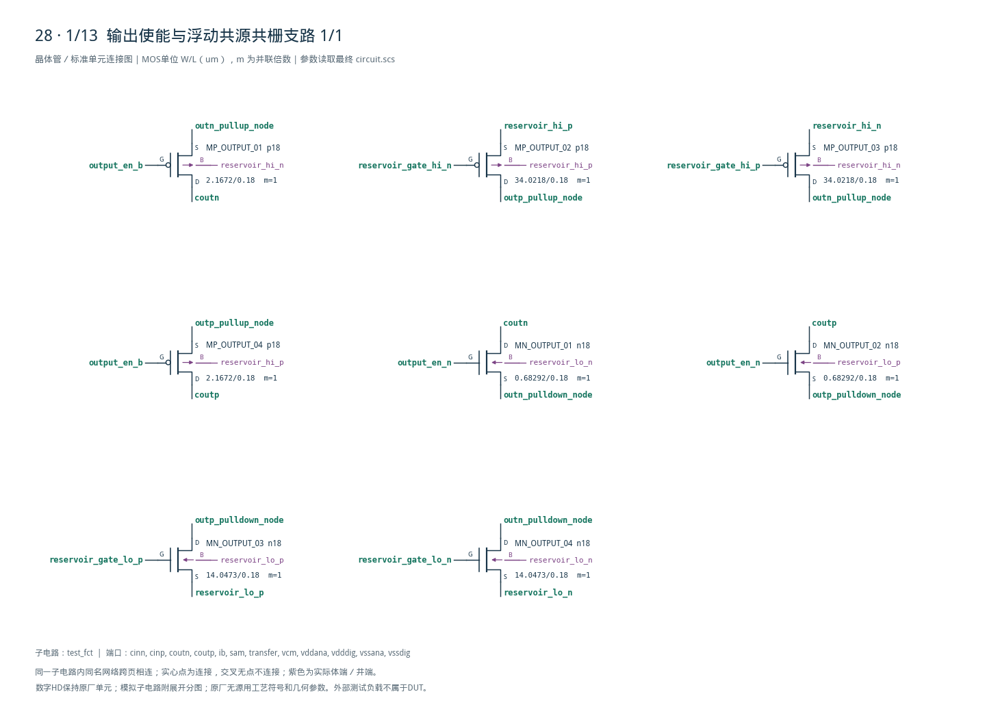

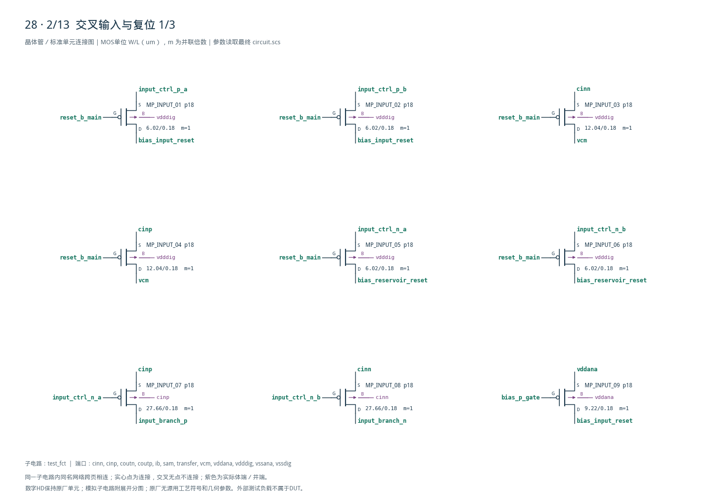

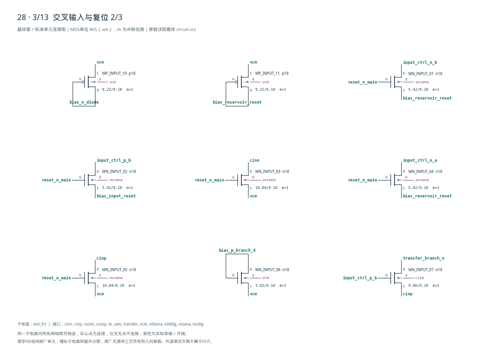

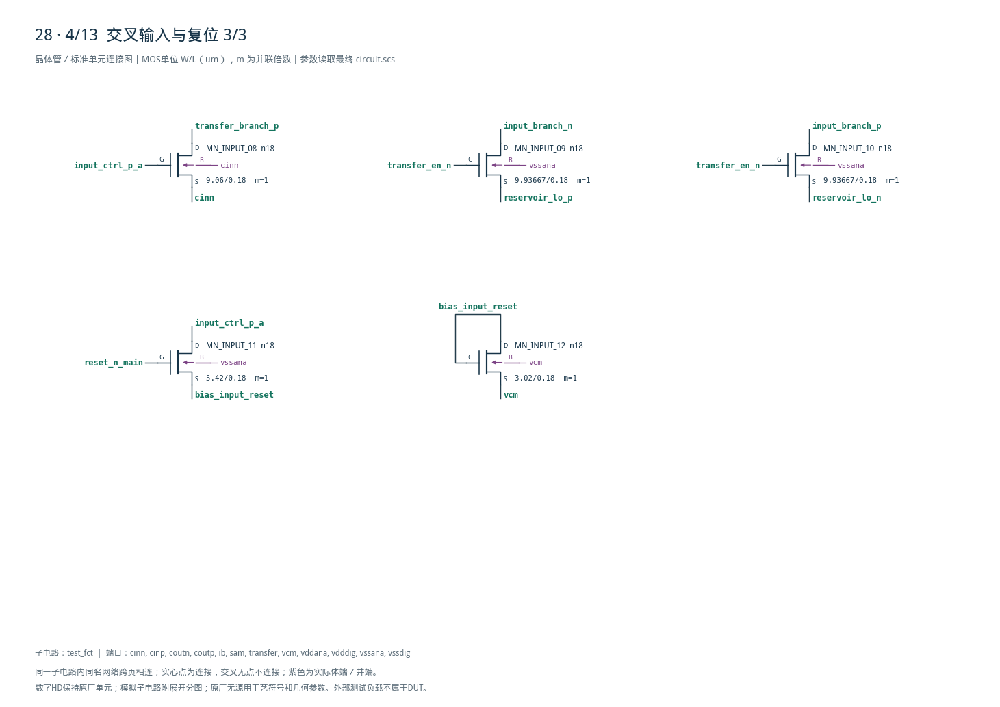

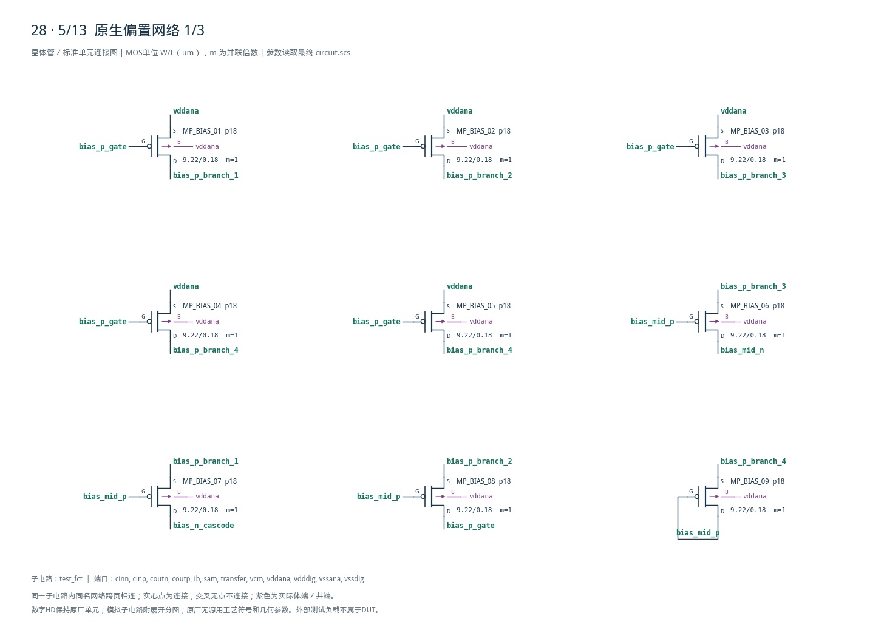

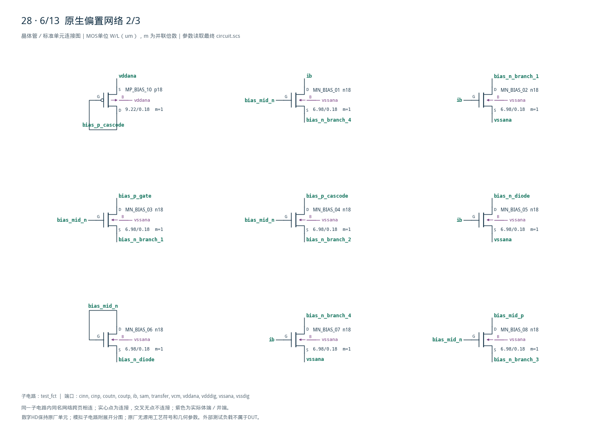

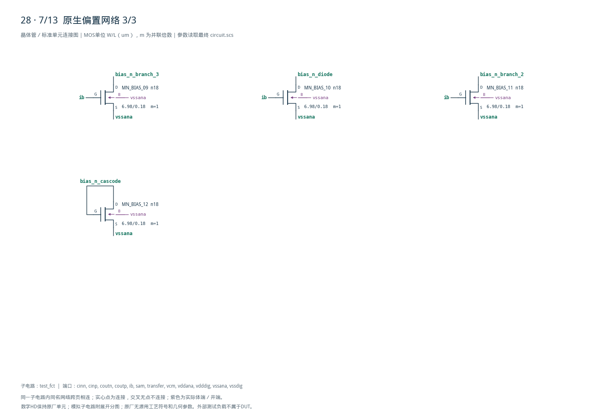

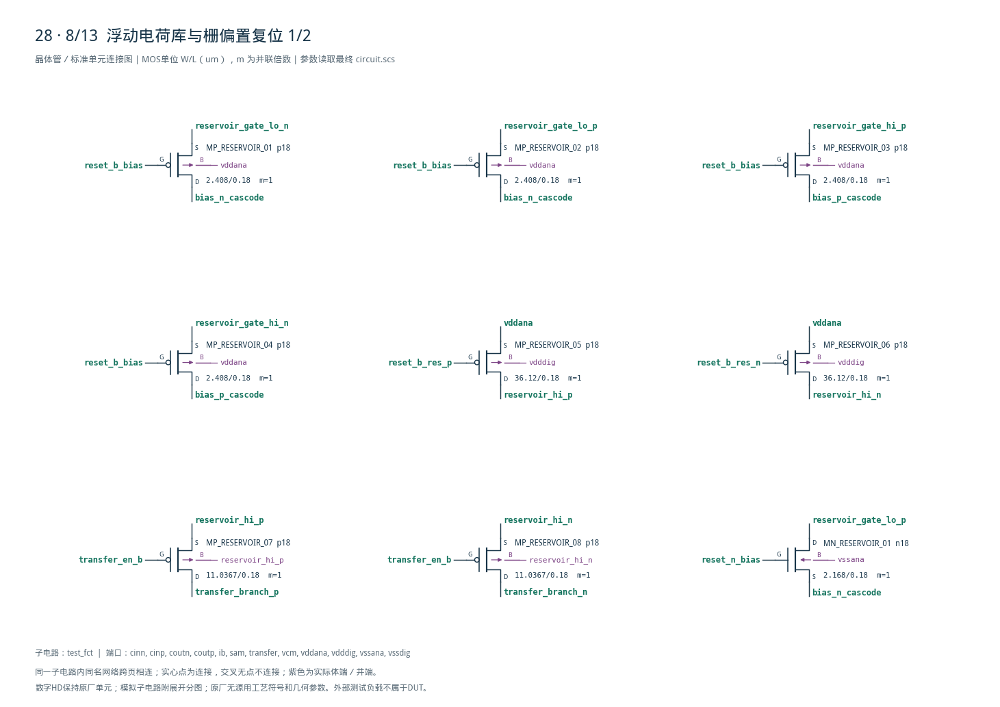

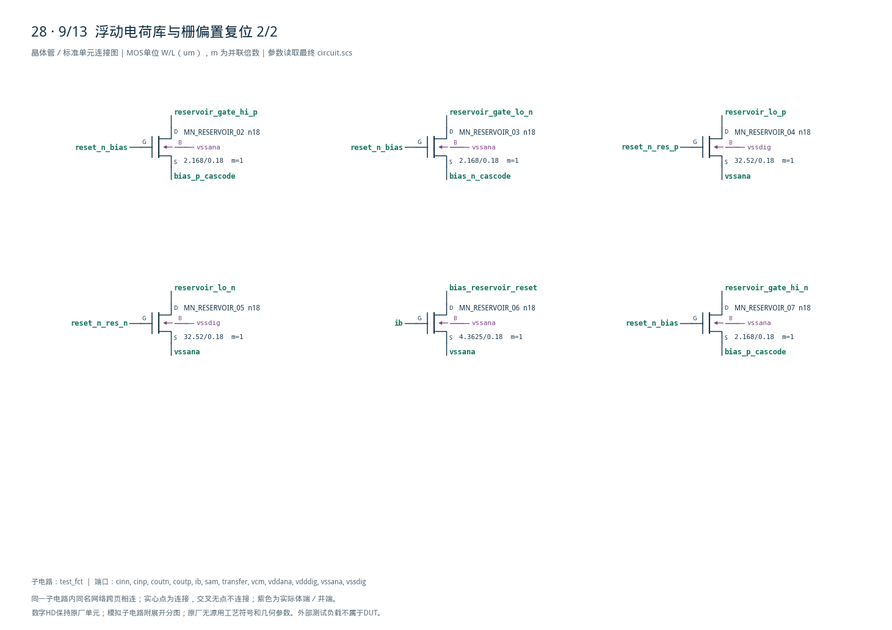

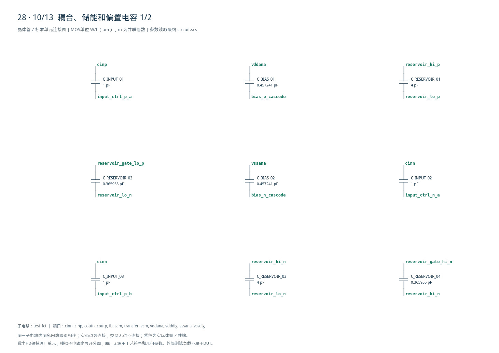

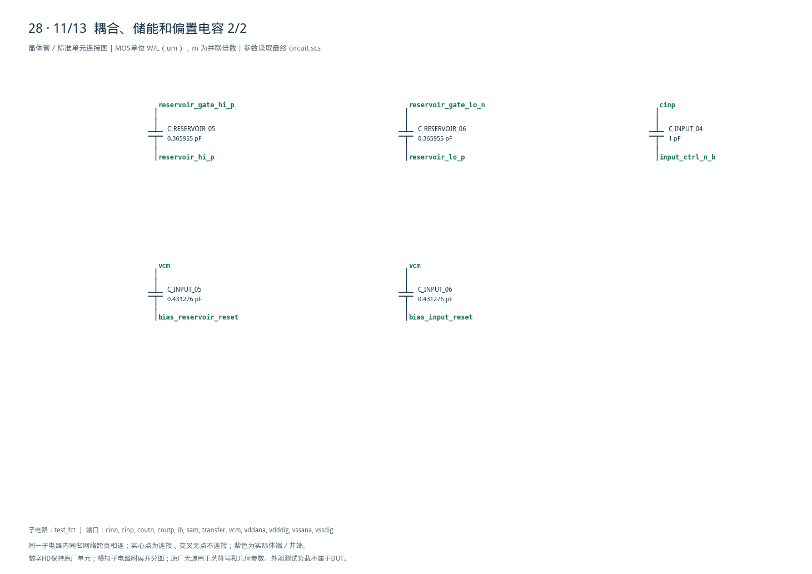

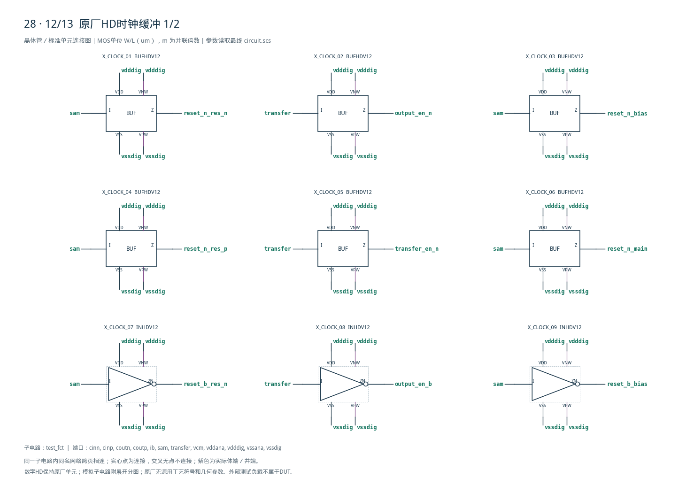

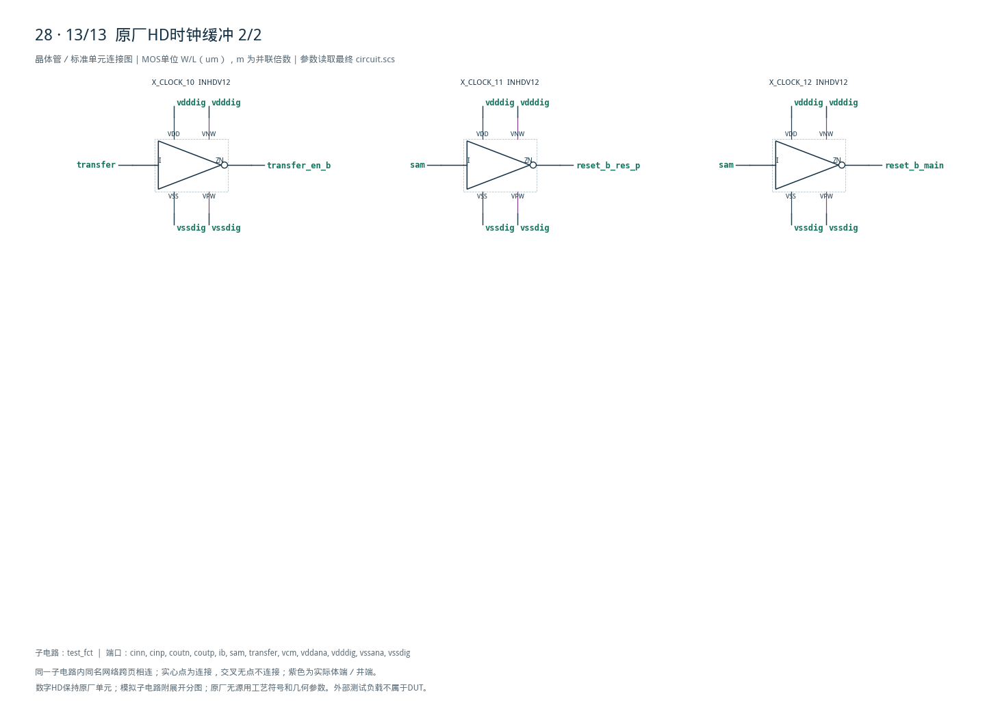
