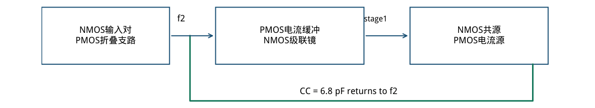
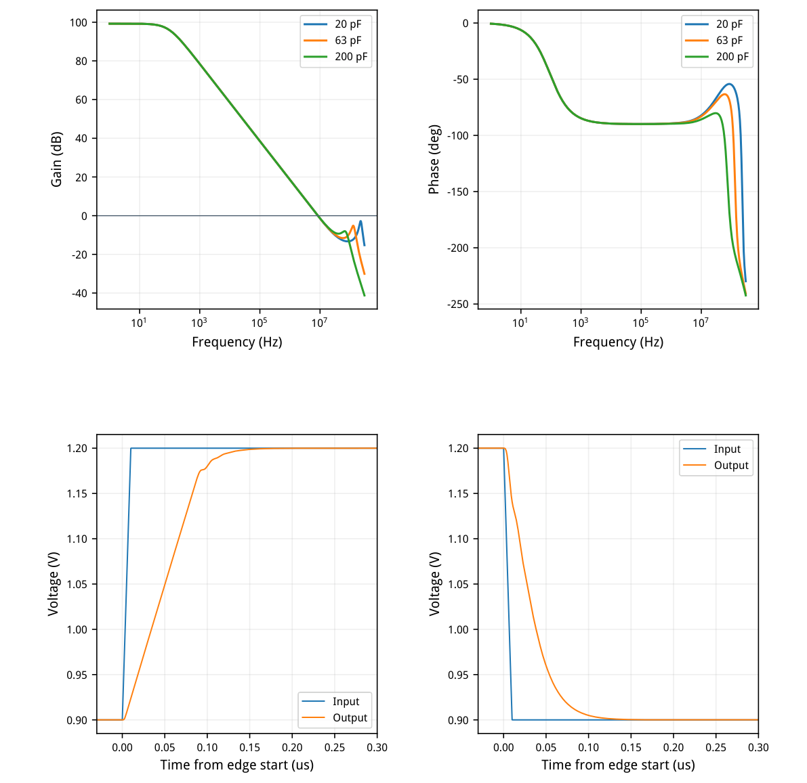
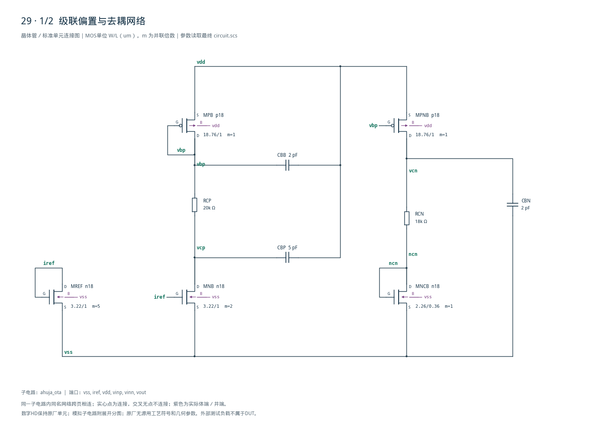
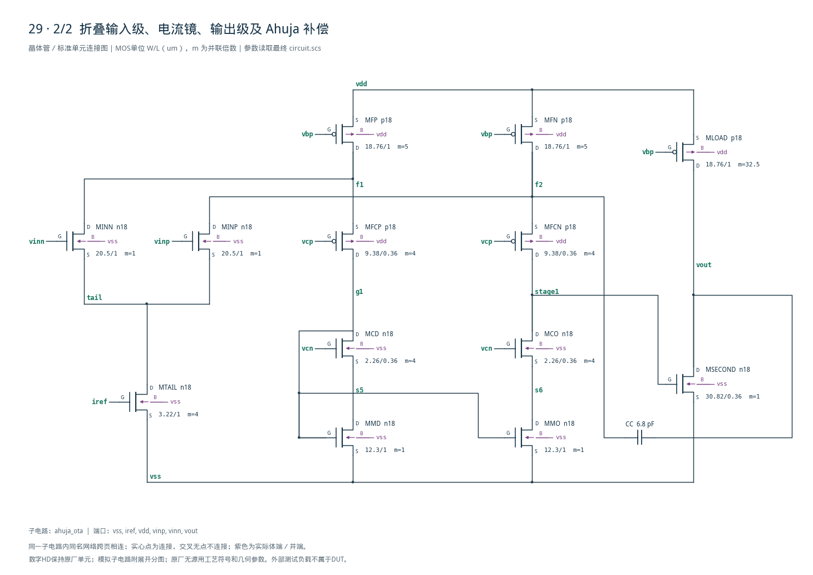

# 29 · Ahuja 宽负载运放审查

[审查 PDF](review.pdf) · [实测结果](latest_results.json) · [验收合同](contract.json) · [最终网表](circuit.scs)

## 验收结果

本模块在电容负载变化较大时提供高增益、稳定的闭环放大。相比直接Miller补偿，Ahuja补偿把电容返回到电流缓冲管的低阻节点，可减弱直接前馈通路带来的右半平面零点问题，改善稳定性与负载范围的取舍。芯片中常用于电容负载缓冲、数据转换器接口和驱动级；优势仍取决于偏置与补偿设计。

结论：20 / 63 / 200 pF三种负载及双向大信号，均通过原nominal指标。条件：SMIC18MMRF / tt / 1.8 V / 27°C，50 uA参考，输入共模0.9 V。折叠共源共栅第一级、NMOS共源第二级；6.8 pF补偿返回PMOS电流缓冲管的源端f2。

| 指标 | 实测 | 原门槛 | 10%边界 | 15%边界 | 单位 |
| --- | --- | --- | --- | --- | --- |
| 20pF增益@10Hz | 99.1806 | ≥58.000 | ≥57.085 | ≥56.588 | dB |
| 20pF UGB | 8.3748 | ≥6.500 | ≥5.850 | ≥5.525 | MHz |
| 20pF相位裕量 | 96.4675 | ≥60.000 | ≥54.000 | ≥51.000 | deg |
| 63pF相位裕量 | 95.7663 | ≥60.000 | ≥54.000 | ≥51.000 | deg |
| 200pF相位裕量 | 93.4842 | ≥60.000 | ≥54.000 | ≥51.000 | deg |
| 单位反馈输出误差 | 0.0417 | ≤6.000 | ≤6.600 | ≤6.900 | mV |
| 总功耗（含参考） | 1.7199 | ≤2.000 | ≤2.200 | ≤2.300 | mW |
| 最坏建立时间 | 0.1213 | ≤2.000 | ≤2.200 | ≤2.300 | us |
| 最坏终值误差 | 0.0416 | ≤6.000 | ≤6.600 | ≤6.900 | mV |

| 负载/pF | 10Hz增益/dB | UGB/MHz | PM/deg | 0dB交越 |
| --- | --- | --- | --- | --- |
| 20 | 99.181 | 8.3748 | 96.468 | 1 / 无回穿 |
| 63 | 99.181 | 8.3948 | 95.766 | 1 / 无回穿 |
| 200 | 99.180 | 8.4511 | 93.484 | 1 / 无回穿 |

200 pF上/下阶跃建立121.264/96.327 ns；终值误差38.01/41.62 uV。测量从输入1%命令交越开始，目标固定为1.2/0.9 V，误差窗口6 mV，不以实际终值重定中心。

仅原理图nominal：未运行其余PVT、无源变化、失配、噪声或版图。模型尺寸均有效，相关信号路径器件最终工作于饱和区。

## 拓扑、gm/ID与偏置修正

电流缓冲补偿与直接Miller补偿的连接点不同。

| 器件角色 | 模型 | 单位W/L (um) | m | 目标gm/ID |
| --- | --- | --- | --- | --- |
| MINP/MINN | n18 | 20.50/1 | 1 | 18 |
| REF / TAIL / NB | n18 | 3.22/1 | 5 / 4 / 2 | 12 |
| 偏置 / 折叠 / 输出 | p18 | 18.76/1 | 1 / 5 / 32.5 | 10 |
| MFCP/MFCN | p18 | 9.38/0.36 | 4 | 12 |
| MNCB / MCD/MCO | n18 | 2.26/0.36 | 1 / 4 | 12 |
| MMD/MMO | n18 | 12.30/1 | 1 | 8 |
| MSECOND | n18 | 30.82/0.36 | 1 | 8 |

| 实际工作点 | \|I\| / uA | gm/ID | gm/gds | 余量 / mV |
| --- | --- | --- | --- | --- |
| MINP | 19.71 | 18.24 | 341.2 | 1038.4 |
| MFN | 99.96 | 9.89 | 125.1 | 150.8 |
| MFCN | 80.24 | 11.97 | 154.1 | 660.3 |
| MMO | 80.24 | 8.66 | 40.5 | 96.4 |
| MCO | 80.24 | 11.83 | 54.6 | 232.9 |
| MSECOND | 664.88 | 7.92 | 106.5 | 709.6 |

初版RCN=11 kΩ时镜管VDS≈177 mV，小于VDSAT≈199 mV。提高RCN到18 kΩ后VDS≈289 mV、余量96 mV；增益86.17→99.18 dB，输出误差147→41.7 uV，速度几乎不变。



[查看矢量图](markdown_assets/figure-02-01.svg)

## 三负载环路与双向动态

全部曲线来自最终同一电路；三个AC条件各有完整1 Hz–300 MHz扫描。

AC外部500 MΩ/50 mF伺服只在DC闭合，频带内近似开环；这与第16/41项的串联注入方法不同。200 pF瞬态则直接单位反馈，模拟到20 us，最终1 ns输出采样，最大内部步长0.5 ns。

三负载均只有一次下降交越，之后直到300 MHz都低于0 dB。首次跌破−6 dB后仍有高频峰值，最坏-2.75 dB；因此PM大并不代表不存在高频再抬升，回穿守卫必须保留。



[查看矢量图](markdown_assets/figure-03-01.svg)

## 精确电路与可复用认识

RCP、RCN决定共栅余量；补偿电容返回位置决定电流反馈路径。

设计认识：低阻f2节点由PMOS共栅管传递补偿电流，避免把CC直接接到高阻stage1形成相同的前馈路径。输入gm约0.359 mS、CC6.8 pF，gm/(2πCC)≈8.41 MHz，与20 pF实测8.375 MHz一致；这是近似选值依据，三负载相位仍来自仿真。

初版外部指标虽已通过，底部镜管却进入线性区，削弱级联镜增益；保留失败工作点与最终修正，有助于区分“测量恰好通过”和“偏置符合设计意图”。PVT未验证，不把96 mV余量称为全角落保证。

复现：/home/IC/CodeX/virtuoso-bridge-lite/.venv/bin/python  scripts/case29\_ahuja.py PDF：同一Python运行 scripts/review\_pdf.py 29

AC/DC：runs/29/20260922T071014367013Z\_static动态：runs/29/20260922T071014526093Z\_dynamic

原任务：sky130-ahuja-compensated-two-stage-load-range-pvt。 合同、LUT哈希和原始PSF见模块与runs目录。

## 完整网表与电路图

[Spectre 网表](circuit.scs) · [全部分图 PDF](schematic/sheets.pdf) · [电路总图](schematic/full.svg) · [端子连接](schematic/connectivity.json)

<details>
<summary>展开完整 Spectre 网表</summary>

```spectre
// Indirect compensation returns to the PMOS current-buffer source.
simulator lang=spectre
subckt ahuja_ota (vss iref vdd vinp vinn vout)
MREF (iref iref vss vss) n18 w=3.22u l=1u m=5
MTAIL (tail iref vss vss) n18 w=3.22u l=1u m=4
MNB (vcp iref vss vss) n18 w=3.22u l=1u m=2
MPB (vbp vbp vdd vdd) p18 w=18.76u l=1u
RCP (vbp vcp) resistor r=20000
CBP (vcp vdd) capacitor c=5p
CBB (vbp vdd) capacitor c=2p
MPNB (vcn vbp vdd vdd) p18 w=18.76u l=1u
RCN (vcn ncn) resistor r=18000
MNCB (ncn ncn vss vss) n18 w=2.26u l=.36u
CBN (vcn vss) capacitor c=2p
MINN (f1 vinn tail vss) n18 w=20.5u l=1u
MINP (f2 vinp tail vss) n18 w=20.5u l=1u
MFP (f1 vbp vdd vdd) p18 w=18.76u l=1u m=5
MFN (f2 vbp vdd vdd) p18 w=18.76u l=1u m=5
MFCP (g1 vcp f1 vdd) p18 w=9.38u l=.36u m=4
MFCN (stage1 vcp f2 vdd) p18 w=9.38u l=.36u m=4
MMD (s5 g1 vss vss) n18 w=12.3u l=1u
MMO (s6 g1 vss vss) n18 w=12.3u l=1u
MCD (g1 vcn s5 vss) n18 w=2.26u l=.36u m=4
MCO (stage1 vcn s6 vss) n18 w=2.26u l=.36u m=4
MSECOND (vout stage1 vss vss) n18 w=30.82u l=.36u m=1
MLOAD (vout vbp vdd vdd) p18 w=18.76u l=1u m=32.5
CC (vout f2) capacitor c=6.8p
ends ahuja_ota
```

</details>





## 报告来源

正文与表格整理自已交付的矢量 PDF，图表单独提取；本文件是后续整理的 Markdown，不是原 PDF 的编译输入。原 PDF、网表及测量数据保持原值。
