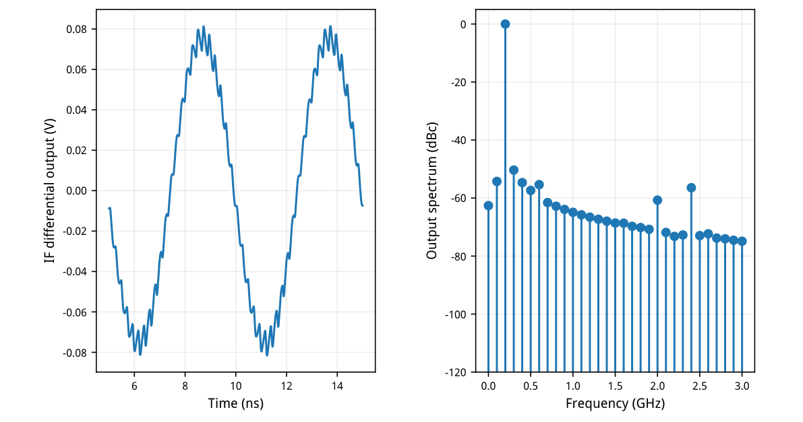
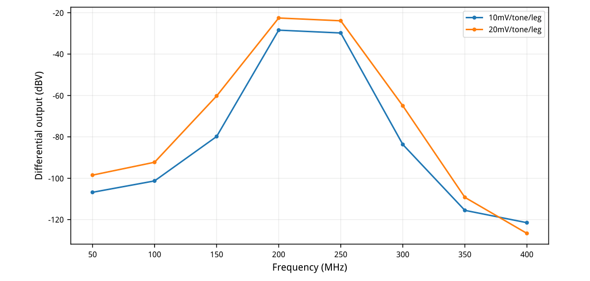
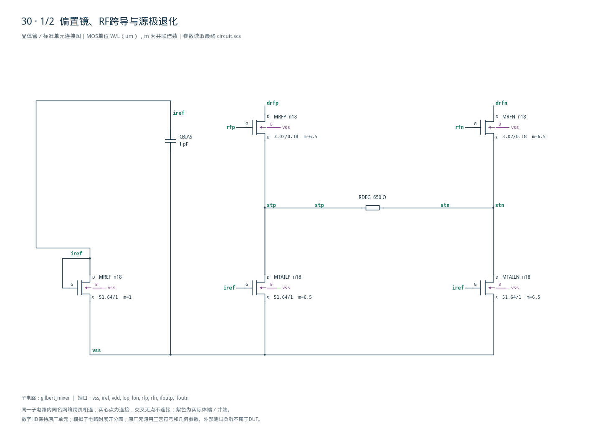
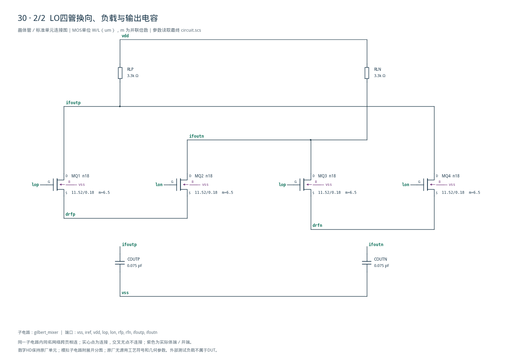

# 30 · 2.4GHz Gilbert混频器审查

[审查 PDF](review.pdf) · [实测结果](latest_results.json) · [验收合同](contract.json) · [最终网表](circuit.scs)

## 验收结果

本模块用差分跨导级将射频电压变为电流，再由本振驱动的Gilbert开关四管换向，得到差频中频信号。双平衡结构有助于抑制本振和射频直通，源极退化改善线性度；代价是持续偏置功耗、转换增益和堆叠电压余量的权衡。芯片中可用于无线接收机下变频前端。

结论：六组RF及四组线性度TT运行全部原门槛通过。

双平衡跨导与LO换向四管将RF降至200MHz中频。相对单平衡结构可抑制LO/RF直通，并提供转换增益；代价是多层堆叠余量、偏置功耗及双音失真。适合低中频接收链。

| 指标最差值 | 实测 | 原 | 10% | 15% |
| --- | --- | --- | --- | --- |
| 转换增益/dB | 5.42562 | ≥3 | ≥2.0849 | ≥1.5884 |
| LO→IF/dB | -90.2079 | ≤-45 | ≤-44.172 | ≤-43.786 |
| RF→IF/dB | -50.9311 | ≤-45 | ≤-44.172 | ≤-43.786 |
| LO→RF/dB | -129.235 | ≤-45 | ≤-44.172 | ≤-43.786 |
| 输出失衡/uV | 30.2198 | ≤30000 | ≤33000 | ≤34500 |
| 输出共模/V | 0.744375 | ≥0.45 | ≥0.405 | ≥0.3825 |
| 到VDD余量/V | 1.05532 | ≥0.2 | ≥0.18 | ≥0.17 |
| 总供电/mW | 1.24159 | ≤2 | ≤2.2 | ≤2.3 |
| 带外杂散/dBc | -49.4282 | ≤-30 | ≤-29.172 | ≤-28.786 |
| IIP3/dBm | -2.4356 | ≥-4 | ≥-4.4576 | ≥-4.7058 |
| 双音增益差/dB | 1.35951 | ≤1.5 | ≤1.65 | ≤1.725 |
| 压缩/dB | 1.01911 | ≤2 | ≤2.2 | ≤2.3 |

固定斜率约束：基波0.8–1.2，实测0.976558；IM3为1.8–4，实测3.254322。隔离只在三组2%幅度、2°相位不平衡点评分。极深相消值为仿真结果，数值可置信范围见文末完整网表。

TT/1.8V/27°C，RF=2.3/2.4/2.5GHz，LO=RF-0.2GHz。50Ω/腿源阻抗、200fF/腿外部负载；未执行其他PVT及原10个失配种子。

## 堆叠、gm/ID尺寸与实际余量

9个常规n18、3个理想电阻、3个理想电容；15实例48端子。

| 角色 | 单位W/L um | gm/ID初算 | 单位I/uA |
| --- | --- | --- | --- |
| bias | 51.64/1 | 18 | 50 |
| rf | 3.02/0.18 | 12 | 50 |
| lo | 11.52/0.18 | 18 | 50 |

两尾电流镜m6.5，各目标325uA；RF输入m6.5，总宽19.63um/只，源间650Ω退化。LO四管各m6.5，总宽74.88um/只；3.3kΩ负载，DUT输出75fF/腿，偏置去耦1pF。外部50uA参考从VDD取得，已包含供电功耗。

| DC工作点 | ID/uA | 实际gm/ID | VDS/V | VDSAT/V |
| --- | --- | --- | --- | --- |
| MREF | 50.0000 | 18.0323 | 0.462174 | 0.088646 |
| MTAILP | 317.9596 | 18.0267 | 0.234976 | 0.088646 |
| MRFP | 317.9596 | 9.9791 | 0.123543 | 0.128448 |
| MQ1 | 158.9798 | 20.4112 | 0.392215 | 0.062699 |

DC时RF管VDS=0.123543V，略低于VDSAT=0.128448V，实际gm/ID约9.98。不能宣称所有管子处于深饱和。这里列出LO静止时DC诊断；转换和线性度验收来自实际大信号LO瞬态。

使用真实常规n18，不把原LVT模型简单改名。初算用较强反型RF管换取余量，LO以较高gm/ID和较大尺寸换取换向能力；体效应、有限输出电阻及源负载效应由工艺模型保留。

## RF扫频、不平衡与实际输出

全部六点保留原功能激励；没有只挑最好频率。

| RF/GHz | 条件 | 转换增益/dB | RF→IF/dB | 杂散/dBc |
| --- | --- | --- | --- | --- |
| 2.3 | 平衡 | 5.426746 | -66.874571 | -50.118849 |
| 2.3 | 2%/2° | 5.425622 | -53.282982 | -50.725400 |
| 2.4 | 平衡 | 5.493623 | -66.717537 | -49.741538 |
| 2.4 | 2%/2° | 5.492599 | -50.931063 | -50.337589 |
| 2.5 | 平衡 | 5.554042 | -66.633374 | -49.428152 |
| 2.5 | 2%/2° | 5.553117 | -54.239580 | -50.012184 |

RF窗口5–15ns，2048点矩形相干DFT，无补零；100MHz整数谱线。输入RF每腿20mV峰值、LO每腿350mV峰值；增益和隔离分母使用DUT端真实差分幅度。



[查看矢量图](markdown_assets/figure-03-01.svg)

## 双音外推与大信号压缩

双音2.4/2.45GHz，LO2.2GHz；窗口10–30ns，频谱间距50MHz。

| 输入条件 | 200M/mV | 250M/mV | 150M/uV | 300M/uV |
| --- | --- | --- | --- | --- |
| 每腿每音10mV | 37.914871 | 32.421566 | 102.167030 | 65.598958 |
| 每腿每音20mV | 74.545145 | 63.854871 | 974.767773 | 562.911668 |

IIP3按两音基波平均、较大IM3和DUT端输入平均幅度计算，低/高两次估计取最小，再按100Ω差分端口换算d Bm。结果-2.435600dBm≥-4dBm，双音增益差1.359512dB≤1.5dB。

单音每腿20→80mV：转换增益5.506084→4.486977dB，压缩1.019106dB≤2dB。IIP3为这两个有限输入幅度的外推，不是无限小信号导数；斜率与两音差同时检查，避免偶然谱线抵消。



[查看矢量图](markdown_assets/figure-04-01.svg)

## 最终完整晶体管网表

理想R/C为原题允许元件；DUT内部无受控源或行为放大器。

电路SHA-256：e405fd9038a74aff43c984389a5b0cdfbc7eb96bc6f992c541b4bea568d89879

供电功耗包含50uA参考及混频核心；测试台RF、LO理想驱动电源功耗未计入原供电指标。DUT输出电容75fF另叠加外部200fF，未包含布局或封装寄生。

## 精度边界、独立审计与复现

20次基线/精算运行0错误、0警告；105项数值与独立测量通过。

maxstep3→1.5ps、reltol1e-6→1e-7，所有10运行复算。预设转换增益差0.02dB、杂散0.15dB、IIP3差0.05dBm、斜率0.01、输入/输出幅度10uV；最大原始幅度差4.612082uV，全部通过。

极深隔离用线性比值差≤2e-5确认，不能把-129dB相消数字当作真实芯片隔离精度。即使把每个仿真泄漏比加2e-5，仍满足原-45dB门槛；版图失配和寄生未覆盖。

独立使用直接复数DFT而非FFT、逐区间功率积分，复核105标量并调用原7组函数。原ngspice线性化被显式2048点相干重采样替代，保持原时间窗口、频点与幅度比定义；source文件和原门槛未改。

工程根目录，既有Bridge Python：case30\_gilbert.py → confirm30.py → schematic30.py → audit30.py → review30.py（均位于scripts/）。附后2页完整图纸；报告生成后须实际查看。

contract、数值计划、基线/精算、独立明细、spectral\_records及运行输入和日志完整保留。仅TT1.8V27°C，未做其他PVT、10个随机失配种子、噪声、版图和PEX；原PDK、Bridge、Spectre、LUT未修改。

## 完整网表与电路图

[Spectre 网表](circuit.scs) · [全部分图 PDF](schematic/sheets.pdf) · [电路总图](schematic/full.svg) · [端子连接](schematic/connectivity.json)

<details>
<summary>展开完整 Spectre 网表</summary>

```spectre
simulator lang=spectre
subckt gilbert_mixer (vss iref vdd lop lon rfp rfn ifoutp ifoutn)
MREF (iref iref vss vss) n18 w=51.64u l=1u
MTAILP (stp iref vss vss) n18 w=51.64u l=1u m=6.5
MTAILN (stn iref vss vss) n18 w=51.64u l=1u m=6.5
CBIAS (iref vss) capacitor c=1p
MRFP (drfp rfp stp vss) n18 w=3.02u l=.18u m=6.5
MRFN (drfn rfn stn vss) n18 w=3.02u l=.18u m=6.5
RDEG (stp stn) resistor r=650
MQ1 (ifoutp lop drfp vss) n18 w=11.52u l=.18u m=6.5
MQ2 (ifoutn lon drfp vss) n18 w=11.52u l=.18u m=6.5
MQ3 (ifoutn lop drfn vss) n18 w=11.52u l=.18u m=6.5
MQ4 (ifoutp lon drfn vss) n18 w=11.52u l=.18u m=6.5
RLP (vdd ifoutp) resistor r=3300
RLN (vdd ifoutn) resistor r=3300
COUTP (ifoutp vss) capacitor c=75f
COUTN (ifoutn vss) capacitor c=75f
ends gilbert_mixer
```

</details>





## 报告来源

正文与表格整理自已交付的矢量 PDF，图表单独提取；本文件是后续整理的 Markdown，不是原 PDF 的编译输入。原 PDF、网表及测量数据保持原值。
