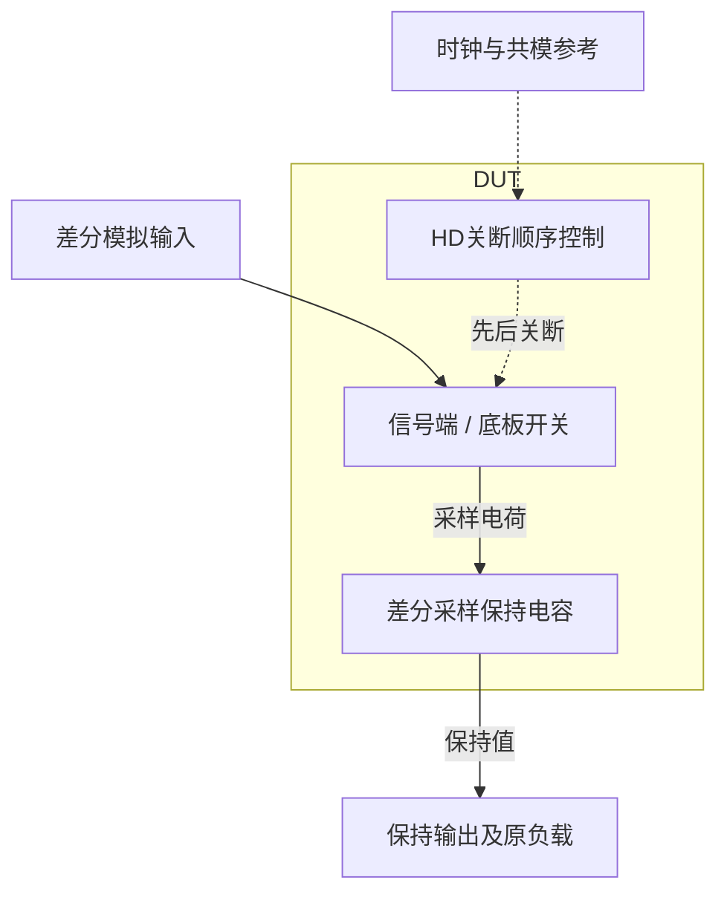
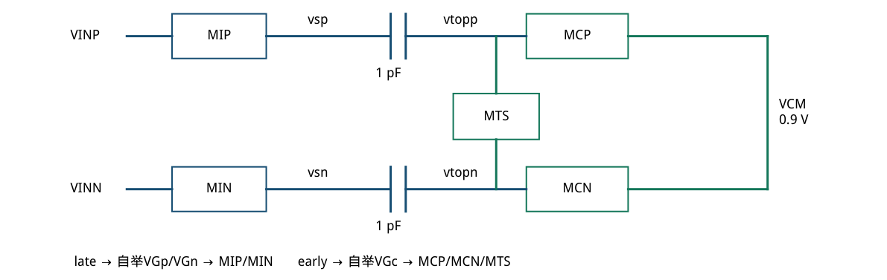
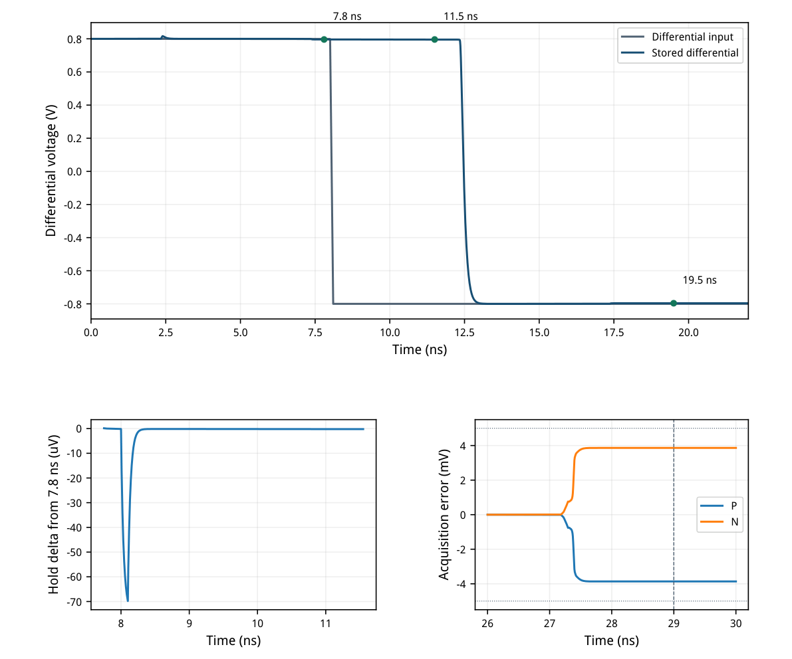
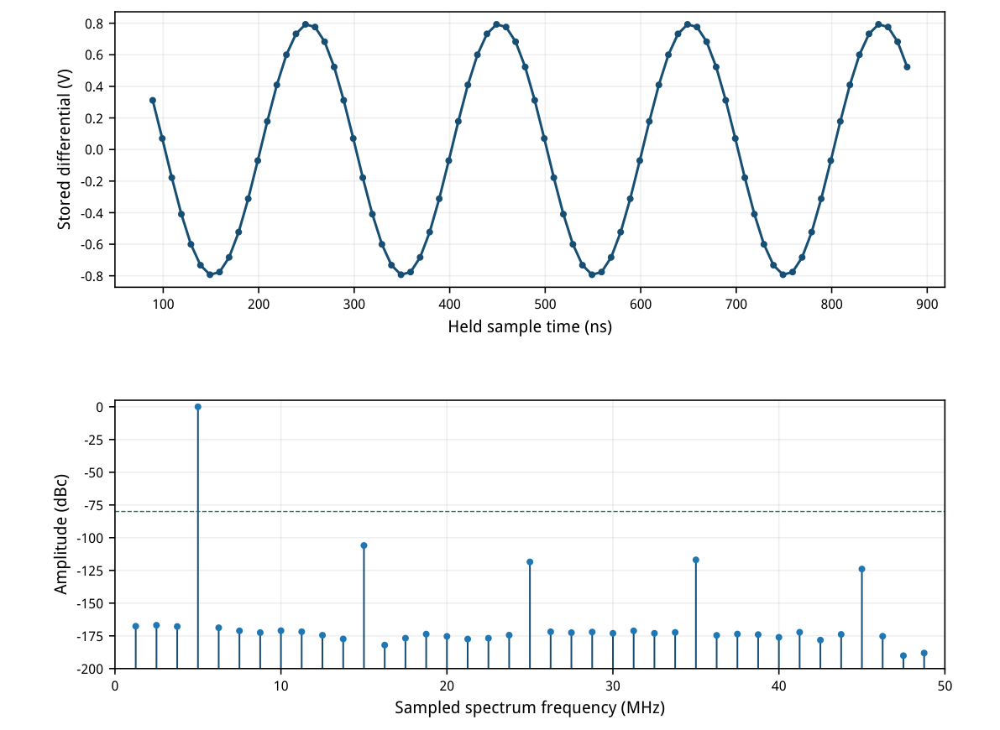
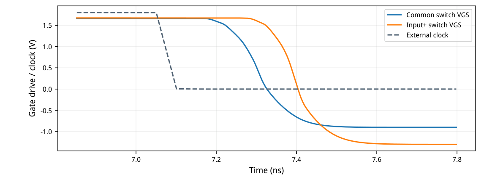
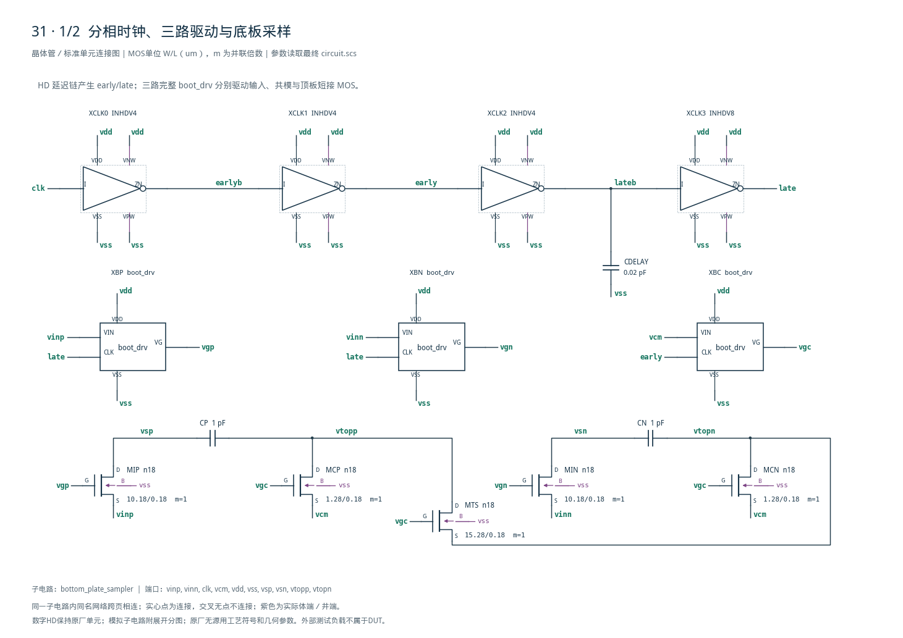
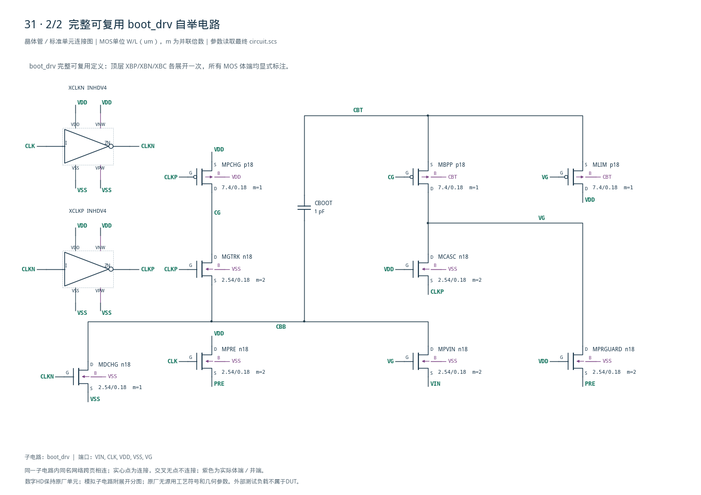

# 31 · 差分底板采样器审查报告

[审查 PDF](review.pdf) · [实测结果](latest_results.json) · [验收合同](contract.json) · [最终网表](circuit.scs)

## 验收结果

本模块在时钟控制下采集并保持差分模拟电压，将连续时间输入转换为离散样本。底板采样通过安排电容两端开关的关断顺序，降低信号相关电荷注入对采样值的影响；相比简单单开关采样，它需要更细致的时序控制。芯片中常作为ADC前端、开关电容滤波器和余量放大级的采样网络。

结论：双极性采样、保持隔离、相干频谱和全部外部源功耗均通过原nominal门槛。条件：SMIC18MMRF / tt / 1.8 V / 27°C；100 MHz时钟、50 ps源边沿、50 Ω时钟驱动；输入共模0.9 V。两只1 pF采样电容，三个1 pF自举电容；仅原厂HD逻辑、PDK MOS和正值电容。

| 指标 | 实测 | 原门槛 | 10%边界 | 15%边界 | 单位 |
| --- | --- | --- | --- | --- | --- |
| 正输入采集误差 | 3.8634 | ≤5 | ≤5.5 | ≤5.75 | mV |
| 负输入采集误差 | 3.8634 | ≤5 | ≤5.5 | ≤5.75 | mV |
| 保持前正样本误差 | 3.85716 | ≤5 | ≤5.5 | ≤5.75 | mV |
| 保持期间反向输入扰动 | 0.221541 | ≤5000 | ≤5500 | ≤5750 | uV |
| 下一次负样本误差 | 3.83728 | ≤5 | ≤5.5 | ≤5.75 | mV |
| 80点采样SFDR | 105.934 | ≥80 | ≥79.085 | ≥78.588 | dB |
| 差分基波增益误差 | 0.482814 | ≤0.5 | ≤0.55 | ≤0.575 | % |
| 存储电荷共模偏移 | 18.4026 | ≤25 | ≤27.5 | ≤28.75 | mV |
| 五个外部源总功耗 | 303.454 | ≤600 | ≤660 | ≤690 | uW |

差分存储量严格按(vsp−vtopp)−(vsn−vtopn)计算，共模为两项之和的一半。不能以vsp−vsn替代，也不能把浮置电容端点对地电压当作共模误差。

额外检查四个测试副本中所有模拟管与HD MOS的端电压：最大|VGS|或|VGD|为1.941092 V，最大|VDS|为1.942443 V，均低于不放宽的1.98 V工程筛查线。该线不是PDK寿命或氧化层额定值声明。

此报告覆盖原题全部nominal功能维度；其余八组FFT PVT、ss/ff保持测试、失配与PEX未执行。确定性SFDR没有包含热噪声，不能据此声称13位ENOB或SNDR。

<!-- SYSTEM-BLOCK-DIAGRAM -->
## 系统框图

图表示采样和底板关断时序，后级量化器不在本例范围。

实线表示信号或能量通路，虚线表示时钟、控制或偏置。DUT框外为外部端口或测试夹具；精确端子连接见后附基本电路图。



[独立Mermaid源文件](system_block_diagram.mmd) · [框图SVG](markdown_assets/system-block.svg)
<!-- END-SYSTEM-BLOCK-DIAGRAM -->

## 采样拓扑、关断顺序与LUT尺寸

先断开共模板，再断开信号输入；自举使信号开关的栅极跟随输入。

| 器件角色 | 单位W/L (um) | 初算gm/ID | LUT参考电流/uA |
| --- | --- | --- | --- |
| MIP / MIN | 10.18 / 0.18 | 8 | 400 |
| MCP / MCN | 1.28 / 0.18 | 8 | 50 |
| 自举NMOS单位 | 2.54 / 0.18 | 8 | 100 |
| 自举PMOS单位 | 7.4 / 0.18 | 8 | 100 |
| 共模板连接MTS | 15.28 / 0.18 | 8 | 600 |

LUT选点均为VDS=0.9 V、VSB=0；查询只提供初始尺寸，实际开关在时变线性区和关断状态之间转换，表中电流不是电路中的固定偏置。自举NMOS中MPRE/MGTRK/MPVIN/MCASC/MPRGUARD为单位m=2，其余m=1。

时钟链：INHDV4→INHDV4产生early；再经INHDV4→INHDV8产生late，lateb对地20 fF。每个自举驱动内再用两只INHDV4；共10个原厂HD反相器，全部尺寸和井连接保留。

共模侧先关断，把主要关断误差置于固定共模电位；随后关闭信号侧。自举提高输入跟踪线性度，不能取消电荷注入、寄生电容和有限建立时间。第五页给出有效栅源波形。



[查看矢量图](markdown_assets/figure-02-01.svg)

## 双极性采集与真实保持隔离

输入在8.0–8.1 ns从+0.8 V翻转至−0.8 V；仍须保存上一样本，下一拍才采负值。

| 时刻/ns | 存储差分/V | 测量意义 |
| --- | --- | --- |
| 7.8 | 0.796142842 | 首次正样本 |
| 11.5 | 0.796142621 | 输入已反转但仍保持 |
| 19.5 | -0.796162722 | 下一拍负样本 |

7.8与11.5 ns之间的判定量为两次端点差：0.22154 uV。图中瞬时电容馈通完整保留；原合同没有把保持窗内峰值改成新的硬门槛。两路固定正/负输入在独立副本29 ns取样。



[查看矢量图](markdown_assets/figure-03-01.svg)

## 相干频谱、增益与完整端口功耗

直接调用冻结的上游stored/analyze\_fft函数处理Spectre向量，保持80点、bin4和功耗定义。

| 外部源 | 非负平均功率/uW |
| --- | --- |
| VDD | 243.185470 |
| VCM | 21.305285 |
| VINP | 19.073975 |
| VINN | 19.073974 |
| 时钟源（50 Ω之前） | 0.815501 |
| 合计 | 303.454205 |

采样时刻89–879 ns，5 MHz输入每边0.4 V峰值，bin4；SFDR=105.9336 dB，基波幅度0.796137491 V。功率窗80–880 ns，对每个源分别积分−V×I后取非负，再求和；时钟串联电阻消耗包含在源功率中。无窗函数，不计DC与Nyquist，非SNDR。



[查看矢量图](markdown_assets/figure-04-01.svg)

## 自举保护、关断时序与数值复核

频谱达标之外检查器件端差；绝对栅压高于VDD本身不足以判定保护是否有效。

| 方案 | SFDR/dB | 增益误差/% | 判定 |
| --- | --- | --- | --- |
| 传输门基线 | 56.7456 | 0.563185 | 频谱失败 |
| 未保护自举 | 97.0926 | 0.471965 | MPRE \|VGS\|=2.893 V，撤回 |
| 保护自举/5 ps | 105.93421 | 0.482814 | 通过，作为精度对照 |
| 保护自举/2.5 ps | 105.93358 | 0.482814 | 最终结果 |

初始自举在CLK下降而VG仍被抬高时，把接在CLK与VG之间的预充管暴露于2.893 V端差。最终把MPRE源端改接PRE，增加栅接VDD的串联保护管MPRGUARD；保留旧运行，不能把旧频谱pass继续当作可交付实现。

最终四个测试副本共208条MOS检查记录，最大栅至通道端差1.941092 V，漏源差1.942443 V。1.98 V是不放宽的工程检查界限，既未证明长期可靠性，也没有执行其他PVT。

相同电路缩步5→2.5 ps，reltol=2e−6、iabstol=1e−12、vabstol=1e−9不变；SFDR变化0.000629132 dB，增益误差变化2.33093e-08个百分点。两次均通过原门槛，最终使用细步长数据。

Spectre在部分HD/自举管内部源节点报告SPECTRE-16780局部LTE放宽，日志完整保留；上述同电路精度对照用于检验关键结果稳定性。没有把警告删去或称作无警告运行。



[查看矢量图](markdown_assets/figure-05-01.svg)

## 精确网表、复现与证据

电路、原始合同、LUT、HD来源、测试台和最终波形在项目目录保留哈希快照。

bootstrap中的MPRE由VDD经PRE预充，新增MPRGUARD的栅接VDD、两通道端连接VG和PRE。MLIM/MBPP的PMOS体接CBT，要求独立井；HD单元的VNW/VPW始终接VDD/VSS。

复现：/home/IC/CodeX/virtuoso-bridge-lite/.venv/bin/python scripts/case31\_bottom\_plate.py --ma xstep-ps 2.5 PDF：同一Python运行 scripts/review\_pdf.py 31最终运行：runs/31/20260922T093029941807Z\_acquisition\_hold runs/31/20260922T093040811547Z\_fft

原任务sky130-bottom-plate-sampler-pvt的instruction、reference和verifier已冻结。数值对照见numerical\_confirmation.json；撤回的未保护自举版本和失败收敛日志保留为工程教训。没有改动PDK、HD原库或既有验证环境。

## 完整网表与电路图

[Spectre 网表](circuit.scs) · [全部分图 PDF](schematic/sheets.pdf) · [电路总图](schematic/full.svg) · [端子连接](schematic/connectivity.json)

<details>
<summary>展开完整 Spectre 网表</summary>

```spectre
// Sample capacitor bottom plates disconnect before signal-input switches.
simulator lang=spectre
subckt boot_drv (VIN CLK VDD VSS VG)
XCLKN (CLK CLKN VDD VSS VDD VSS) INHDV4
XCLKP (CLKN CLKP VDD VSS VDD VSS) INHDV4
CBOOT (CBT CBB) capacitor c=1p
MDCHG (CBB CLKN VSS VSS) n18 w=2.54u l=.18u
MPCHG (CG CLKP VDD VDD) p18 w=7.4u l=.18u
MLIM (VDD VG CBT CBT) p18 w=7.4u l=.18u
MPRE (VDD CLK PRE VSS) n18 w=2.54u l=.18u m=2
MGTRK (CG CLKP CBB VSS) n18 w=2.54u l=.18u m=2
MBPP (VG CG CBT CBT) p18 w=7.4u l=.18u
MPVIN (CBB VG VIN VSS) n18 w=2.54u l=.18u m=2
MCASC (VG VDD CLKP VSS) n18 w=2.54u l=.18u m=2
MPRGUARD (VG VDD PRE VSS) n18 w=2.54u l=.18u m=2
ends boot_drv

subckt bottom_plate_sampler (vinp vinn clk vcm vdd vss vsp vsn vtopp vtopn)
XCLK0 (clk earlyb vdd vss vdd vss) INHDV4
XCLK1 (earlyb early vdd vss vdd vss) INHDV4
XCLK2 (early lateb vdd vss vdd vss) INHDV4
XCLK3 (lateb late vdd vss vdd vss) INHDV8
CDELAY (lateb vss) capacitor c=20f
XBP (vinp late vdd vss vgp) boot_drv
XBN (vinn late vdd vss vgn) boot_drv
XBC (vcm early vdd vss vgc) boot_drv
MIP (vsp vgp vinp vss) n18 w=10.18u l=.18u
MCP (vtopp vgc vcm vss) n18 w=1.28u l=.18u
CP (vsp vtopp) capacitor c=1p
MIN (vsn vgn vinn vss) n18 w=10.18u l=.18u
MCN (vtopn vgc vcm vss) n18 w=1.28u l=.18u
CN (vsn vtopn) capacitor c=1p
MTS (vtopp vgc vtopn vss) n18 w=15.28u l=.18u
ends bottom_plate_sampler
```

</details>





## 报告来源

正文与表格整理自已交付的矢量 PDF，图表单独提取；本文件是后续整理的 Markdown，不是原 PDF 的编译输入。原 PDF、网表及测量数据保持原值。
