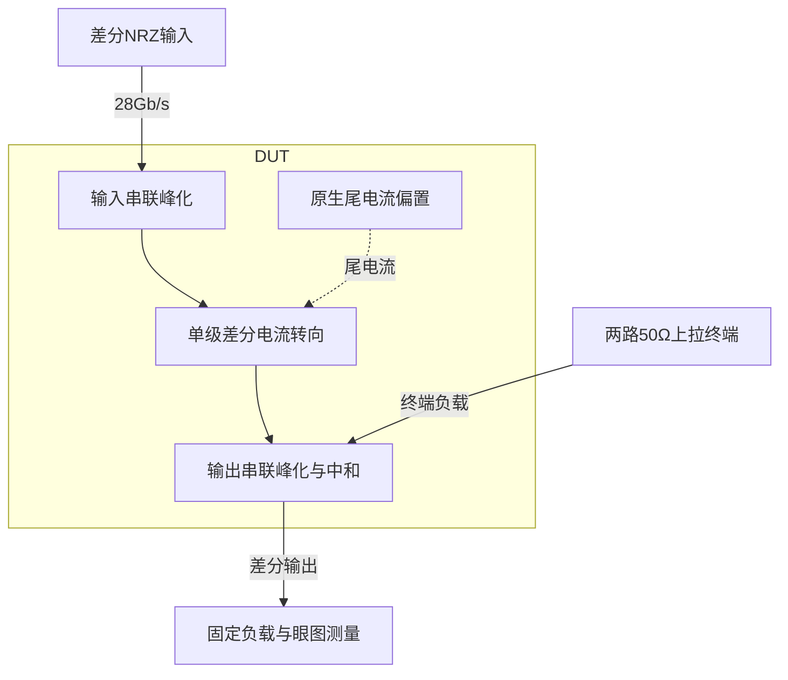
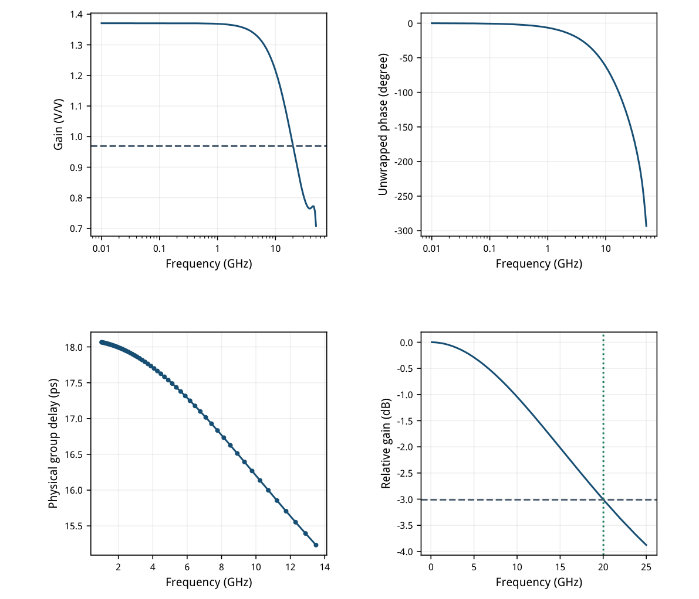
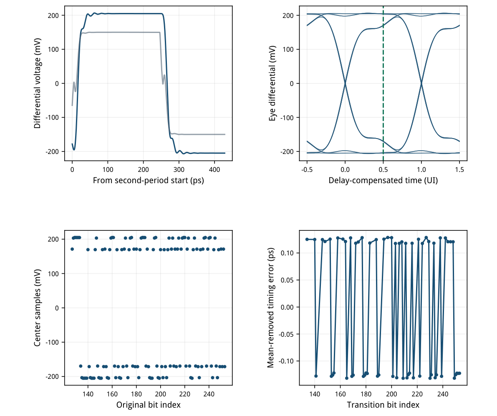
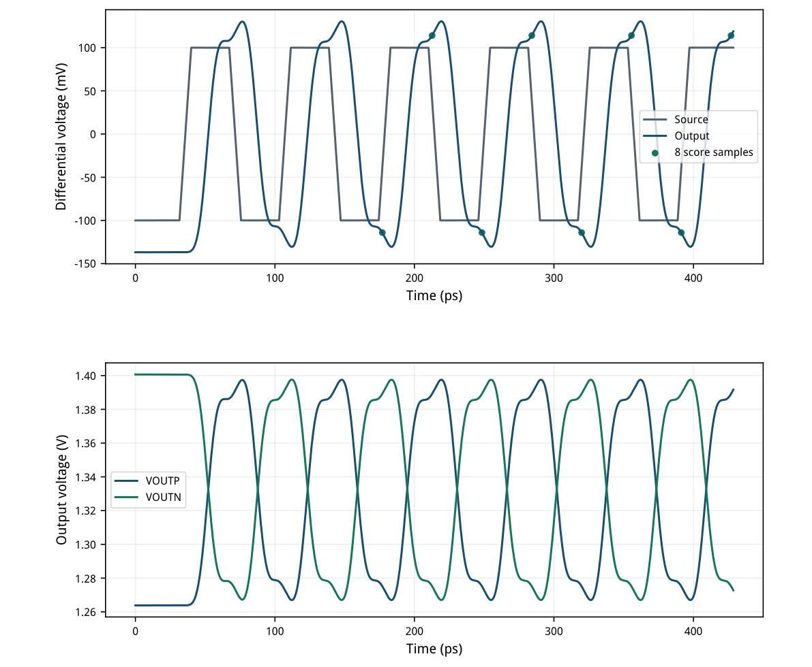
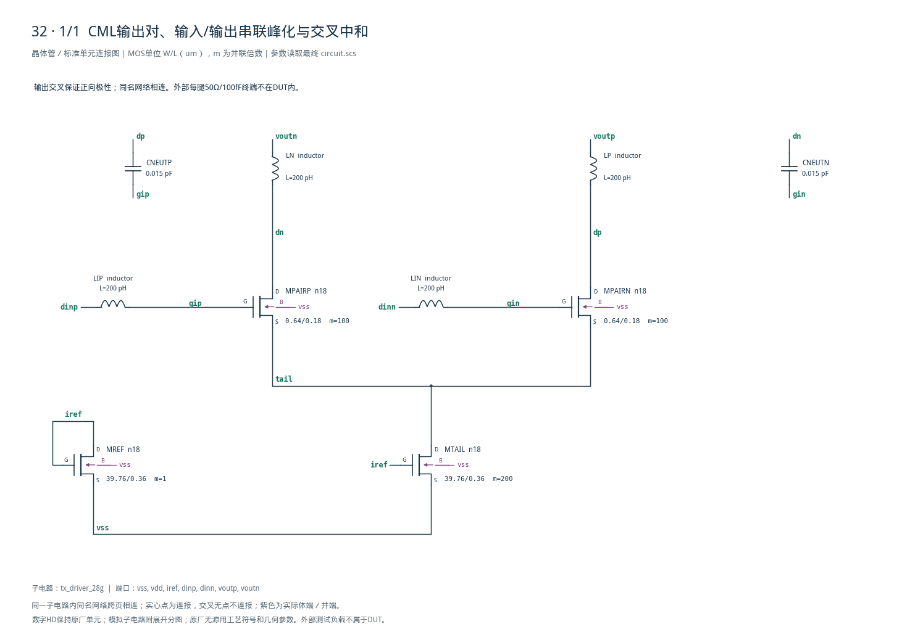

# 32 · 28Gb/s CML发送器审查

[审查 PDF](review.pdf) · [实测结果](latest_results.json) · [验收合同](contract.json) · [最终网表](circuit.scs)

## 验收结果

本模块把差分NRZ输入转换为高速电流转向输出，驱动两路接至电源的50Ω终端。单级CML差分对减少级联传播延迟，输入和输出串联电感补偿电容负载，交叉电容减轻栅漏反馈；代价是持续偏置功耗、较大的电流镜及电感面积和损耗。芯片中可用于高速串行发送器的末级驱动，本次验证28Gb/s固定负载下的标称眼图与抖动，不包含信道均衡或物理互连。

结论：10%范围内完成；带宽与低摆幅输出需放宽，其余原门槛通过。

SMIC18MMRF TT / 1.8V / 27°C，外部100uA参考；输入共模1.17V。每腿输入50Ω源阻抗、30fF焊盘，输出50Ω到VDD及100fF到地。原PRBS7和低摆幅PWL激励全文保留。

| 验收量 | 实测 | 原门槛 | 10%边界 | 15%边界 | 单位 |
| --- | --- | --- | --- | --- | --- |
| 差分摆幅下限 | 409.7 | ≥400 | ≥360 | ≥340 | mV |
| -3dB带宽 | 20.0267 | ≥22 | ≥19.8 | ≥18.7 | GHz |
| 1–14GHz群延迟变化 | 2.83271 | ≤8 | ≤8.8 | ≤9.2 | ps |
| PRBS眼高 | 338.949 | ≥320 | ≥288 | ≥272 | mV |
| 确定性抖动峰峰值 | 0.260573 | ≤5 | ≤5.5 | ≤5.75 | ps |
| 时间加权平均功耗 | 33.8593 | ≤45 | ≤49.5 | ≤51.75 | mW |
| 低摆幅输出 | 228.107 | ≥250 | ≥225 | ≥212.5 | mV |

PRBS第二周期127个采样、63个跳变（31升/32降）及低摆幅8个采样、4升/4降全部满足；符号错误均为0。功能、测量完整性、有限值和输出轨范围保持原要求。

只运行TT标称；原题另外两个配对点ss/1.62V/-40°C与ff/1.98V/125°C未执行。无随机噪声或失配仿真，不能把这里的确定性抖动当作总抖动或误码率。

四只原生n18、两只15fF电容及四只200pH理想电感；正值理想R/C/L为原题明确允许。电感损耗、面积、耦合与PEX尚未验证。

<!-- SYSTEM-BLOCK-DIAGRAM -->
## 系统框图

只覆盖发送末级与原固定负载；没有SERDES协议逻辑、均衡器或物理信道模型。

实线表示信号或能量通路，虚线表示时钟、控制或偏置。DUT框外为外部端口或测试夹具；精确端子连接见后附基本电路图。



[独立Mermaid源文件](system_block_diagram.mmd) · [框图SVG](markdown_assets/system-block.svg)
<!-- END-SYSTEM-BLOCK-DIAGRAM -->

## 结构、gm/ID尺寸与实际偏置

跨接漏端使正差分输入对应正差分输出；无内部重复终端或理想偏置源。

MREF与MTAIL由外部100uA参考形成1:200电流镜；差分对目标每支10mA。较低输入gm/ID用更高电流换取较小栅电容和较短延迟；尾源gm/ID=18降低所需余量。串联电感补偿输入、输出电容，交叉电容用于中和反馈。

| 角色 | W/L um | m | 目标gm/ID | 初算电流 |
| --- | --- | --- | --- | --- |
| MREF | 39.76/0.36 | 1 | 18 | 100uA |
| MTAIL | 39.76/0.36 | 200 | 18 | 20mA |
| MPAIRP/N | 0.64/0.18 | 各100 | 3 | 各10mA |

| 输入/器件 | ID/mA | gm/ID | VGS/V | VDS/V | VDS-VDSAT/V |
| --- | --- | --- | --- | --- | --- |
| off/MREF | 0.100000 | 18.0426 | 0.48855 | 0.48855 | 0.40458 |
| off/MTAIL | 18.707372 | 18.0443 | 0.48855 | 0.20638 | 0.12271 |
| off/MPAIRP | 9.353682 | 3.0971 | 0.96362 | 1.12593 | 0.84291 |
| off/MPAIRN | 9.353682 | 3.0971 | 0.96362 | 1.12593 | 0.84291 |
| one/MREF | 0.100000 | 18.0426 | 0.48855 | 0.48855 | 0.40458 |
| one/MTAIL | 18.713310 | 18.0450 | 0.48855 | 0.20718 | 0.12351 |
| one/MPAIRP | 11.405165 | 2.6192 | 1.03782 | 1.02256 | 0.71260 |
| one/MPAIRN | 7.308138 | 3.7739 | 0.88782 | 1.22741 | 0.97377 |

off为零差分，one为+150mV差分。实际尾电流18.707–18.713mA，低于20mA初值；零输入每支9.35368mA、gm/ID=3.097。输入管体接vss，实际尾节点约0.207V，体效应与电流镜VDS差异由OP确认。

使用既有TT LUT：输入L0.18um/VDS0.9V、参考L0.36um/VDS0.45V，按单位100uA查询并保留路径/哈希。四只MOS均有正VDS余量；对称结果不代表失配下零失调。

## 完整静态及AC验收门槛

14个标量边界；\*为不放宽的输出轨检查，数值均来自最终电路。

| 测量 | 实测 | 原门槛 | 10% | 15% | 单位 |
| --- | --- | --- | --- | --- | --- |
| 差分摆幅下限 | 409.7 | ≥400 | ≥360 | ≥340 | mV |
| 差分摆幅上限 | 409.7 | ≤900 | ≤990 | ≤1035 | mV |
| 共模距VDD下限 | 467.833 | ≥100 | ≥90 | ≥85 | mV |
| 共模距VDD上限 | 467.833 | ≤550 | ≤605 | ≤632.5 | mV |
| 两符号共模差 | 0 | ≤30 | ≤33 | ≤34.5 | mV |
| 零输入失调 | 0 | ≤20 | ≤22 | ≤23 | mV |
| 两符号IDD差比 | 0 | ≤10 | ≤11 | ≤11.5 | % |
| 静态轨下限* | 1.22974 | ≥0.2 | ≥0.2 | ≥0.2 | V |
| 静态轨上限* | 1.43459 | ≤1.82 | ≤1.82 | ≤1.82 | V |
| 100MHz增益下限 | 1.37059 | ≥1.3 | ≥1.17 | ≥1.105 | V/V |
| 100MHz增益上限 | 1.37059 | ≤4 | ≤4.4 | ≤4.6 | V/V |
| -3dB带宽 | 20.0267 | ≥22 | ≥19.8 | ≥18.7 | GHz |
| 100MHz–22GHz峰化 | 0 | ≤1.5 | ≤2.3279 | ≤2.714 | dB |
| 1–14GHz群延迟变化 | 2.83271 | ≤8 | ≤8.8 | ≤9.2 | ps |

静态输入分别为±150mV、0差分，共模1.17V。输出两个符号为±204.850mV差分；输出共模1.33216677V。共模差、零输入失调与IDD不平衡在匹配模型中为0。

AC用两路幅度0.5V、相差180°的源构成1V差分激励；源端定义增益，50Ω/30fF输入网络计入传递函数。带宽按原算法在幅度轴与频率轴线性插值首个-3dB交越。

## 幅频、相位与群延迟

10MHz–50GHz，每十倍频50点；群延迟变化仅在1–14GHz统计。

群延迟=-dφ/dω，其中φ以弧度计算。原ac\_analysis.py把输入相位视为度，原SPICE台则输出ph()；迁移明确导出DEGREES接口后调用未改动分析器，并与弧度导数独立核对。

真实群延迟变化2.832706ps；误将弧度当度会得到0.049440ps，该错误单位诊断不参与评分。通带峰化0dB也不表示绝对传播延迟为零。



[查看矢量图](markdown_assets/figure-04-01.svg)

## 原PRBS7眼图与确定性抖动

28Gb/s，UI=35.7142857ps；运行两个127位周期，只验收第二周期。

平均传播偏移16.371671ps，采样时刻为(n+0.5)UI+该偏移；127个样点无符号错，眼高338.949473mV。63个过零交越逐一匹配且不重复使用。

峰峰值/RMS抖动取过零误差减均值后统计；DCD为上、下沿平均偏移之差。眼图仅用于可视化；评分使用原始自适应轨迹和原检查器，不从画图重采样结果计算。



[查看矢量图](markdown_assets/figure-05-01.svg)

## 完整瞬态验收门槛

15个标量边界，加功能计数与零符号错误；所有原始门槛及两档边界均列出。

| 测量 | 实测 | 原门槛 | 10% | 15% | 单位 |
| --- | --- | --- | --- | --- | --- |
| PRBS眼高 | 338.949 | ≥320 | ≥288 | ≥272 | mV |
| PRBS最坏上升 | 9.79285 | ≤15 | ≤16.5 | ≤17.25 | ps |
| PRBS最坏下降 | 9.7932 | ≤15 | ≤16.5 | ≤17.25 | ps |
| 过冲/欠冲占静态摆幅 | 0.467663 | ≤12 | ≤13.2 | ≤13.8 | % |
| 动态共模最大偏离 | 0.841884 | ≤50 | ≤55 | ≤57.5 | mV |
| 动态轨下限* | 1.2287 | ≥0.2 | ≥0.2 | ≥0.2 | V |
| 动态轨上限* | 1.43549 | ≤1.82 | ≤1.82 | ≤1.82 | V |
| 确定性抖动峰峰值 | 0.260573 | ≤5 | ≤5.5 | ≤5.75 | ps |
| 确定性抖动RMS | 0.125149 | ≤1.5 | ≤1.65 | ≤1.725 | ps |
| DCD | 0.00385652 | ≤2 | ≤2.2 | ≤2.3 | ps |
| 原样点平均功耗 | 33.8564 | ≤45 | ≤49.5 | ≤51.75 | mW |
| 时间加权平均功耗 | 33.8593 | ≤45 | ≤49.5 | ≤51.75 | mW |
| 低摆幅输出 | 228.107 | ≥250 | ≥225 | ≥212.5 | mV |
| 低摆幅最坏上升 | 7.74205 | ≤17 | ≤18.7 | ≤19.55 | ps |
| 低摆幅最坏下降 | 7.7427 | ≤17 | ≤18.7 | ≤19.55 | ps |

PRBS 20–80%边沿阈值来自独立静态两电平，不按动态峰值重新缩放。过冲和欠冲分别为1.916018/1.915712mV，按静态409.700132mV摆幅归一化；动态共模偏移以静态共模为基准。

原验收功耗为自适应原样点IDD算术均值×1.8V；另按第二周期真实时间加权积分，同样检查45mW上限。两者含参考电流和输出终端的VDD功耗，按原合同不计输入信号源。

## 200mVpp差分输入敏感性

12UI交替码，前4UI预热；后8个延迟补偿中心样点验收，原PWL未改。

低摆幅平均传播偏移16.271085ps。输出取min(ones)-max(zeros)=228.107321mV，低于原250mV、达到10%边界225mV；8个符号均正确，4升/4降均完整测得。

低摆幅边沿阈值按该测试中心样点的高/低平均电平定义，保留原分析器规则；最坏上/下沿7.742050/7.742701ps。没有增加输入振幅、移除50Ω/30fF或放宽功能计数。



[查看矢量图](markdown_assets/figure-07-01.svg)

## 固定界限的数值精度对照

两个瞬态从0.2ps/1e-6收紧至0.1ps/1e-7，gear2only；最终使用细步长轨迹。

| 复核量 | 0.2ps / 1e-6 | 0.1ps / 1e-7 | 绝对差 | 预设上限 |
| --- | --- | --- | --- | --- |
| eye_height_v | 338.9012 | 338.9495 | 0.048269 | 0.5 mV |
| SENS_swing_v | 228.0772 | 228.1073 | 0.030078 | 0.5 mV |
| jitter_pp_s | 0.2607642 | 0.2605733 | 0.00019093 | 0.05 ps |
| jitter_rms_s | 0.1253054 | 0.1251494 | 0.00015601 | 0.05 ps |
| dcd_s | 0.003863386 | 0.003856518 | 6.8675e-06 | 0.05 ps |
| rise_time_s | 9.7913 | 9.792846 | 0.0015461 | 0.05 ps |
| fall_time_s | 9.791663 | 9.7932 | 0.0015378 | 0.05 ps |
| SENS_rise_time_s | 7.740269 | 7.74205 | 0.001781 | 0.05 ps |
| SENS_fall_time_s | 7.740921 | 7.742701 | 0.0017807 | 0.05 ps |
| time_weighted_power_w | 33.85934 | 33.85934 | 5.2538e-06 | 0.05 mW |

预设：眼高/低摆幅差≤0.5mV；抖动、DCD与四种最坏边沿时间差≤0.05ps；时间加权功耗差≤0.05mW；等级、功能检查保持。全部通过，最大眼高差48.269uV、低摆幅差30.078uV。

37个独立标量从原PSF重算，与报告值一致。独立交越向量检查唯一匹配、样点范围与计数；原23组检查以仅TT输入调用，其中带宽与低摆幅输出为原门槛失败，明确保留。

最终四组及两个瞬态基线均0错误/0警告；检查实际Spectre完成日志、输入快照及模型/LUT哈希。10实例28端子另用独立解析器核对，全部体端明确。

## 失败迭代与最终精确网表

保留AC成功但功能失败的候选；没有改变原采样算法来制造通过。

| 阶段 | 参数变化 | 结果/取舍 |
| --- | --- | --- |
| 初版 | 8mA / gmID8 / C15fF | BW8.654GHz，群延迟变化11.91ps |
| 提速 | 16mA / gmID4 / C30fF | 无L时10.726GHz，输出L240pH后12.879GHz |
| 双端峰化 | 输入L300pH / 输出L240pH | BW23.593GHz；原PRBS/敏感性功能失败 |
| 加大中和 | C100fF，其他保持 | BW23.471GHz；PRBS32错、敏感性8错 |
| 最终 | 20mA / gmID3 / C15fF / 两端L200pH | 延迟降至半UI内，全部功能通过；两项10% |

早期绝对传播偏移约19ps，超过半UI；原分析器按最近过零搜索，在交替码下可能选到相邻边沿，造成眼中心错误。群延迟变化小和AC带宽通过都不能替代原瞬态功能检查。

所有电感为200pH、所有中和电容为15fF，均为正值理想无源；无行为源、开关或传递函数。每腿外部50Ω终端/100fF负载仅在测试台，DUT中不重复。

## 复现入口、证据与适用边界

图纸、PDF、源快照、数值对照与知识笔记绑定同一最终电路。

复现（工程根目录，既有Bridge Python）： python scripts/case32\_tx.py python scripts/confirm32.py python scripts/schematic32.py python scripts/audit32.py python scripts/review32.py 重新生成报告后须重新逐页查看及核对完整总图。

latest\_results.json：29个边界、原/放宽结果及三种静态输入OP。 verification\_audit.json：37个独立标量与23组原检查。 numerical\_confirmation.json：两种瞬态的细步长对照。 source/：原instruction、solution、benches和分析器冻结副本。 iteration\_history.json：未采用候选、功能失败与原运行路径。 schematic/：完整晶体管图、参数及端子连接映射。 implementation/：生成、审计和报告脚本快照。

本次是给定负载下的28Gb/s单级CML标称验证；其余ss/ff配对点、失配、噪声、通道/封装、驱动静电防护、电感有限Q、版图面积及PEX未执行。理想电感获得的提速不能直接换算为实芯片性能。

输入输出终端、共模、PWL边沿、PRBS7序列和验收窗口均未改变。严格计数防止缺失边沿冒充通过，时间加权功耗检查防止自适应采样偏差掩盖功耗。

DUT SHA-256：4a3d75102319b904cbe4a9aabfdb373e34eb42a70c57c37fb97fb94aa7c29b91

## 完整网表与电路图

[Spectre 网表](circuit.scs) · [全部分图 PDF](schematic/sheets.pdf) · [电路总图](schematic/full.svg) · [端子连接](schematic/connectivity.json)

<details>
<summary>展开完整 Spectre 网表</summary>

```spectre
simulator lang=spectre
subckt tx_driver_28g (vss vdd iref dinp dinn voutp voutn)
MREF (iref iref vss vss) n18 w=39.76u l=.36u m=1
MTAIL (tail iref vss vss) n18 w=39.76u l=.36u m=200
MPAIRP (dn gip tail vss) n18 w=0.64u l=.18u m=100
MPAIRN (dp gin tail vss) n18 w=0.64u l=.18u m=100
CNEUTP (dp gip) capacitor c=15f
CNEUTN (dn gin) capacitor c=15f
LP (dp voutp) inductor l=200p
LN (dn voutn) inductor l=200p
LIP (dinp gip) inductor l=200p
LIN (dinn gin) inductor l=200p
ends tx_driver_28g
```

</details>



## 报告来源

正文与表格整理自已交付的矢量 PDF，图表单独提取；本文件是后续整理的 Markdown，不是原 PDF 的编译输入。原 PDF、网表及测量数据保持原值。
