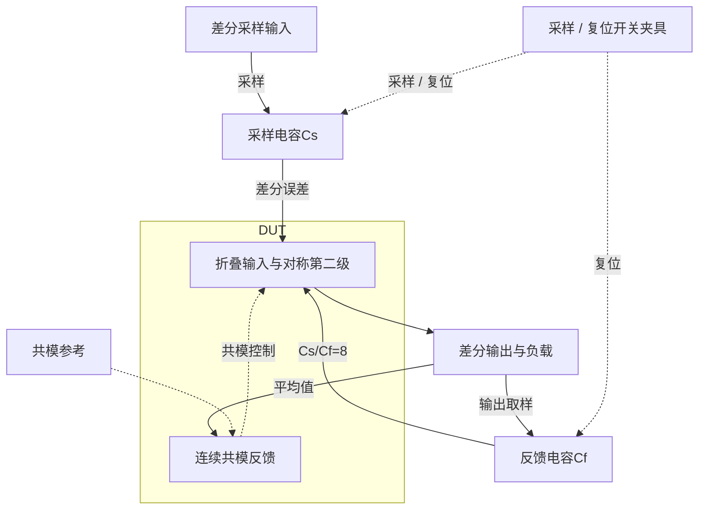
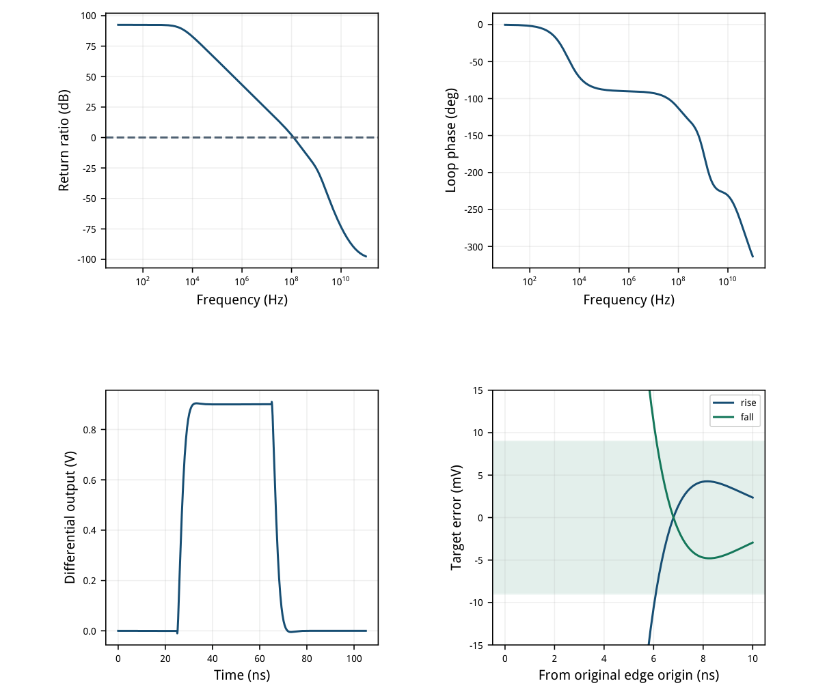
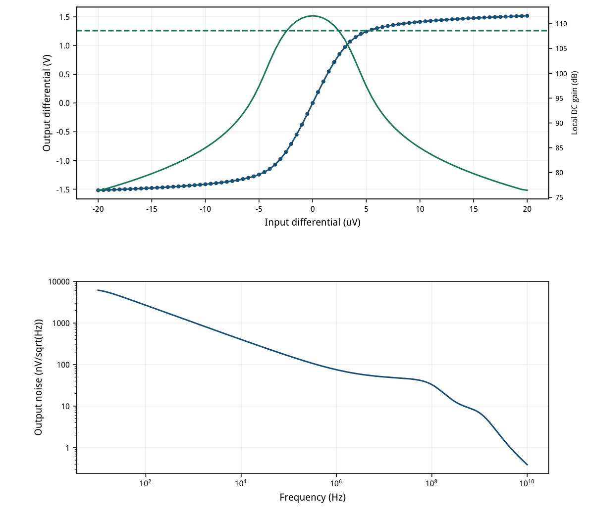
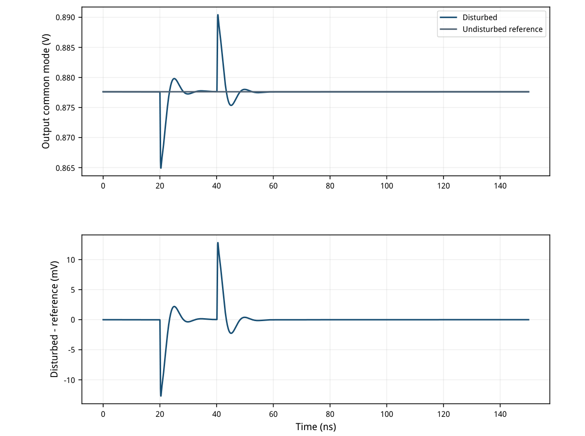
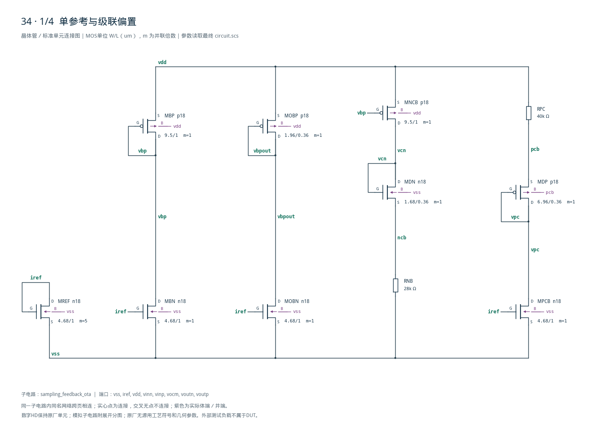
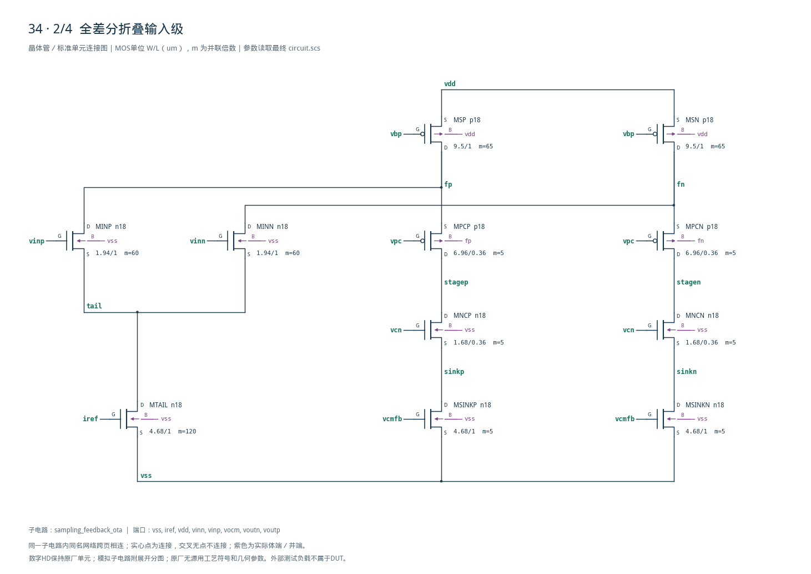
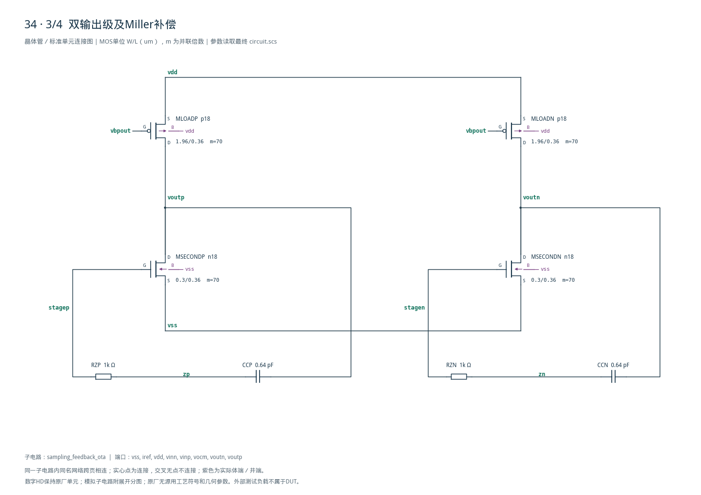
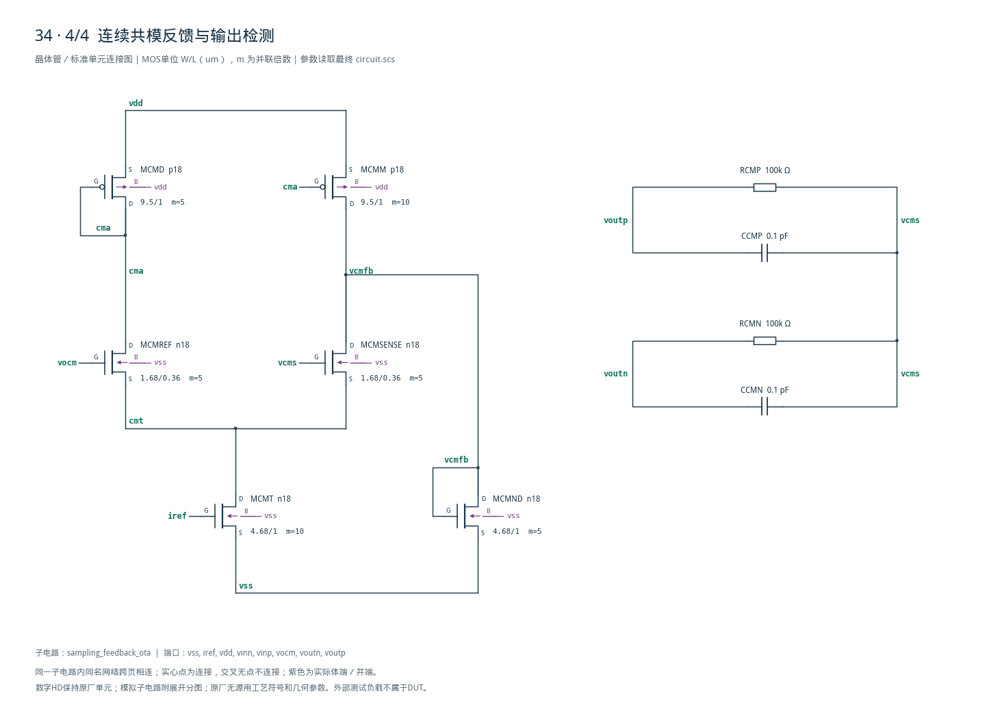

# 34 · 采样反馈OTA：增益8

[审查 PDF](review.pdf) · [实测结果](latest_results.json) · [验收合同](contract.json) · [最终网表](circuit.scs)

## 验收结果

本模块在采样电容与反馈电容比为8的闭环中建立差分输出，用于快速电压放大。折叠输入级提供增益和输入跨导，对称第二级驱动负载，Miller补偿与连续共模反馈分别控制差模稳定性和输出平均电压。增益8使反馈系数降至1/9，需要更大的跨导来维持建立速度，代价是电流、噪声与补偿设计更受约束。芯片中可用于流水线ADC余量放大、开关电容增益级和高速采样信号通路。

结论：TT标称14项检查在10%放宽内通过，仅3dB输出摆幅未达原门槛。

TT / 1.8V / 27°C；IREF=50uA，VOCM=0.9V。保留Cs=1pF、Cf=125fF、每端CL=250fF，差分目标阶跃0.9V，双向建立与原10Hz–10GHz输出噪声积分。

| 指标 | 实测 | 原门槛 | 10%边界 | 15%边界 | 单位 |
| --- | --- | --- | --- | --- | --- |
| 相位裕量 | 63.643 | ≥60 | ≥54 | ≥51 | ° |
| 零差分共模误差 | 22.384 | ≤25 | ≤27.5 | ≤28.75 | mV |
| 总DC功耗 | 5.5222 | ≤10 | ≤11 | ≤11.5 | mW |
| 原rise建立时间 | 6.0843 | ≤10 | ≤11 | ≤11.5 | ns |
| 原fall建立时间 | 6.1135 | ≤10 | ≤11 | ≤11.5 | ns |
| 原rise动态误差 | 0.26255 | ≤1 | ≤1.1 | ≤1.15 | % |
| 原fall动态误差 | 0.32639 | ≤1 | ≤1.1 | ≤1.15 | % |
| 高台静态误差 | 0.011479 | ≤1 | ≤1.1 | ≤1.15 | % |
| 低台静态误差 | 3.5855e-09 | ≤1 | ≤1.1 | ≤1.15 | % |
| 开环3dB输出摆幅 | 1.6571 | ≥1.8 | ≥1.62 | ≥1.53 | V |
| 差分输出噪声 | 619.36 | ≤1000 | ≤1100 | ≤1150 | uVrms |
| CMFB峰值偏移 | 12.822 | ≤100 | ≤110 | ≤115 | mV |
| CMFB释放20ns残差 | 0.013437 | ≤5 | ≤5.5 | ≤5.75 | mV |
| CMFB释放100ns残差 | 0.0012292 | ≤1 | ≤1.1 | ≤1.15 | mV |

原开环3dB压缩摆幅要求≥1.8V，实测1.657101V，差7.94%；10%边界1.62V。双向动态误差、静态误差和所有其余适用nominal指标达到原值。

只完成确定性的匹配nominal。原30点PVT的其余29点、另外两点共模扰动和20次局部失配未执行；不能把下文匹配抑制表征当作失配通过。

<!-- SYSTEM-BLOCK-DIAGRAM -->
## 系统框图

电容网络与时序是外部闭环夹具，核心DUT为全差分OTA；还保留原报告中的其他独立测量维度。

实线表示信号或能量通路，虚线表示时钟、控制或偏置。DUT框外为外部端口或测试夹具；精确端子连接见后附基本电路图。



[独立Mermaid源文件](system_block_diagram.mmd) · [框图SVG](markdown_assets/system-block.svg)
<!-- END-SYSTEM-BLOCK-DIAGRAM -->

## 结构、gm/ID与偏置选择

折叠输入、对称共源输出、Miller补偿与连续共模反馈。

| 角色 | 模型 | 单位W/L um | gm/ID | 初算/uA | VDS/V |
| --- | --- | --- | --- | --- | --- |
| input | n18 | 1.94/1 | 10 | 10 | 0.9 |
| n_bias | n18 | 4.68/1 | 14 | 10 | 0.2 |
| p_bias | p18 | 9.5/1 | 10 | 10 | 0.45 |
| n_cascode | n18 | 1.68/0.36 | 14 | 10 | 0.45 |
| p_cascode | p18 | 6.96/0.36 | 14 | 10 | 0.45 |
| second | n18 | 0.3/0.36 | 6 | 10 | 0.9 |
| output_load | p18 | 1.96/0.36 | 8 | 10 | 0.9 |
| cm_input | n18 | 1.68/0.36 | 14 | 10 | 0.45 |

所有模拟角色重新查询既有SMIC18表，单位电流10uA；初算目标为输入支路600uA、PMOS折叠源650uA、差额支路50uA、输出支路700uA和共模输入支路50uA。实际OP不等于目标值。IREF端50uA由VDD供给，包含在功耗中。

以工程第35项结构为初值，输入gm/ID由18改为10，目标电流由100增至600uA，折叠源目标650uA。同为600uA目标时，较低gm/ID减少所需宽度；这不代表总宽度小于第35项。全部性能用第34项原电容网络重新仿真。

| 网络 | 最终值 | 作用 |
| --- | --- | --- |
| 每侧Miller串联RC | 1kΩ / 0.64pF | 主极点与零点控制 |
| 每侧共模取样RC | 100kΩ // 100fF | 输出平均值检测 |
| 级联偏置电阻 | 28kΩ / 40kΩ | 低余量NMOS/PMOS偏置 |

本题原器件规则允许理想R/C；DUT无独立源、受控源或行为器件。全电路为模拟，无HD数字单元。

## 实际OP、体端与余量

30只MOS的工作点逐个保存；代表性支路列在下表。

| 器件 | \|ID\|/uA | gm/ID | VGS/V | VDS/V | \|VDS\|-\|VDSAT\| |
| --- | --- | --- | --- | --- | --- |
| MREF | 50.00000 | 14.2406 | 0.5122 | 0.5122 | 0.3924 |
| MINP | 585.80036 | 10.0139 | 0.6503 | 1.1771 | 1.0041 |
| MSP | 665.29102 | 9.8596 | -0.6029 | -0.3732 | 0.1968 |
| MPCP | 79.48887 | 11.7435 | -0.5913 | -0.7330 | 0.5813 |
| MNCP | 79.48887 | 11.5153 | 0.6508 | 0.4302 | 0.2883 |
| MSINKP | 79.48887 | 11.7413 | 0.5497 | 0.2636 | 0.1175 |
| MSECONDP | 733.25983 | 5.8946 | 0.6938 | 0.8776 | 0.6363 |
| MLOADP | 733.25983 | 7.7487 | -0.6803 | -0.9224 | 0.7022 |
| MCMT | 98.00614 | 14.2219 | 0.5122 | 0.2753 | 0.1556 |
| MCMREF | 59.05622 | 13.2235 | 0.6247 | 0.9079 | 0.7841 |
| MCMSENSE | 38.94992 | 14.9506 | 0.6023 | 0.2744 | 0.1657 |
| MCMD | 59.05622 | 9.2479 | -0.6168 | -0.6168 | 0.4295 |
| MCMM | 120.49679 | 9.2199 | -0.6168 | -1.2503 | 1.0630 |
| MCMND | 81.54687 | 11.8010 | 0.5497 | 0.5497 | 0.4036 |

输入管体端接vss，真实尾节点电压带来体效应，因此OP的gm/ID不会机械等于零体偏置LUT目标。PMOS信号级联管体端分别接fp/fn；其复制偏置管体端接pcb，完整体端连接在图纸中明确绘出。

所有30只MOS在标称静态点的|VDS|-|VDSAT|均为正；这不代表大信号全过程都保持饱和。对称第二级、较低共模输出阻抗和补偿共同决定建立与共模恢复，静态余量不能替代瞬态验证。

实际输入585.800uA、折叠源665.291uA，差额79.491uA。有限增益CMFB的零差分共模偏差22.384mV，偏差和额外电流均保留。

## 差模环路与真实电容反馈建立

原rise对应输出向+0.9V，原fall对应返回0V；名称沿用原验收器。

返回比T=A/9，环路UGB=121.770212MHz，PM=63.643323°；只有一次下降零dB交越，之后未回穿。环路等效每端负载0.361111pF，实际建立台使用完整Cs/Cf/CL与1GH直流偏置电感。

0.9V目标和9mV误差带保持不变；取各原时间窗的最后容差交越，且末端必须留在带内。输入边沿通过反馈电容产生瞬时反向馈通；源文件的导数峰值不应解释为纯放大器固有压摆率。



[查看矢量图](markdown_assets/figure-04-01.svg)

## 开环压缩摆幅与全带输出噪声

摆幅按开环DC局部增益下降3dB定义；噪声积分上限固定10GHz。

原81点：输入-20至20uV、步长0.5uV。两压缩交点输出-0.828551/0.828551V，跨度1.657101V。0.25uV的161点诊断为1.660197V，相差3.096mV；原81点继续作为验收值。

差分输出噪声619.355963uVrms；对输出谱幅度平方做线性频率梯形积分。另用区间幂律PSD积分交叉核对，相对差0.00860%。未以较低输入折算噪声或有限信号带宽替代。



[查看矢量图](markdown_assets/figure-05-01.svg)

## 共模扰动、参考轨迹与恢复

每个输出同时吸收50uA，20ns平台、100ps边沿；与未扰动相同实例比较。

| 测量量 | 实测/mV |
| --- | --- |
| cmfb_static_error_v | 22.383824082 |
| cmfb_max_deviation_v | 12.821988304 |
| cmfb_residual_20ns_v | 0.013437335 |
| cmfb_residual_100ns_v | 0.001229222 |

峰值窗口20–45ns，残差时刻60.2/140.2ns。扰动结束于40.2ns；没有按20ns理想方波错误提前释放时刻。两只零伏源仅测量外部扰动电流，不改变源电流和DUT。

OP的25mV共模要求针对零差分输入；差分阶跃中最大共模误差56.240mV另作表征，并未满足25mV。



[查看矢量图](markdown_assets/figure-06-01.svg)

## 功耗、匹配抑制表征与验收边界

完整保留原失配要求的分母与激励语义，但本次不执行失配矩阵。

总DC功耗5.522228512mW，由环路台唯一VDD供电源计算；包含外部50uA参考、内部偏置、输入/输出级和连续CMFB。CMFB扰动台含两个DUT，仅用于差分参考恢复测试，其总电流没有拿来代替单DUT功耗。

| 10Hz激励 | 到差分输出的幅度/V/V | 解释 |
| --- | --- | --- |
| CMRR | 1.249e-16 | 对称抵消，非失配结论 |
| PSRR_plus | 6.74578e-13 | 对称抵消，非失配结论 |
| PSRR_minus | 1.39888e-14 | 对称抵消，非失配结论 |

抑制比分子按原题使用标称闭环A/(1+A/9)，约19.08465dB，不误用开环增益。匹配台用±1/18输出反馈到两输入保持DC闭环；共模输入、正电源和负电源三种外部激励分别运行。

负电源激励中VSS对绝对地AC=+1，VDD相对VSS的AC=-1，因此绝对VDD保持不动。对称模型的差分泄漏受浮点抵消限制；即使换算出极大的dB，也不能据此宣称20个失配样本的50/60dB要求通过。

原验收器nominal\_functional通过，独立limit\_check使用明确expected=1检查当前nominal的功率、噪声和共模恢复。原30点/20样本集合没有伪造；原3dB摆幅判据保留失败，而10%迁移判据通过。

不包含另外29个PVT点、两种非nominal共模扰动、20次局部失配、版图、寄生、电容失配或连续时间反馈网络之外的开关非理想。

## 独立复核、图纸与可重复证据

40个器件实例、140个端子，全部模拟器件、无源值和体端可追溯。

25个独立测量核对涵盖环路交越、功耗、共模、双向静动态误差、最后容差交越、3dB压缩摆幅、10GHz噪声积分和共模恢复。原始波形、模型、LUT、DUT及每组输入快照分别保存哈希。

首版RZ=400Ω时PM49.551°，低于15%边界51°，尽管双向建立已小于10ns，仍未通过。保持电流和0.64pF补偿，只把RZ改为1kΩ，PM提高至63.643°，双向建立缩短至约6.1ns；代价是输出噪声由592.888升至619.356uVrms。最终六组及加密扫点均0错误、0警告。

复现（工程根目录，既有Bridge Python）： python scripts/case34\_sampling.py python scripts/confirm34.py python scripts/schematic34.py python scripts/audit34.py python scripts/review34.py 更新PDF后，必须重新逐页目检与核对完整总图。

证据：latest\_results.json / numerical\_confirmation.json / verification\_audit.json 精确网表：circuit.scs；所有30只MOS实际OP在结果中。 完整四页晶体管图及层次端子表：schematic/ 运行、模型及输入快照：各runs/34目录；生成脚本快照：implementation/

最终电路SHA-256：ad543b3c4d9ab88b0e6f9638569f8b72543f020f027c340503828215b0110a42

原资料、PDK和既有Bridge/Spectre环境保持原样；只在本次授权的SMIC18复现分区更新知识库。

## 完整网表与电路图

[Spectre 网表](circuit.scs) · [全部分图 PDF](schematic/sheets.pdf) · [电路总图](schematic/full.svg) · [端子连接](schematic/connectivity.json)

<details>
<summary>展开完整 Spectre 网表</summary>

```spectre
// Fully differential folded-cascode first stage and symmetric second stage.
// D G S B. Legal unit widths use m replication; no internal sources.
simulator lang=spectre
subckt sampling_feedback_ota (vss iref vdd vinn vinp vocm voutn voutp)
MREF (iref iref vss vss) n18 w=4.68u l=1u m=5
MBN (vbp iref vss vss) n18 w=4.68u l=1u
MBP (vbp vbp vdd vdd) p18 w=9.5u l=1u
MOBN (vbpout iref vss vss) n18 w=4.68u l=1u
MOBP (vbpout vbpout vdd vdd) p18 w=1.96u l=.36u
MNCB (vcn vbp vdd vdd) p18 w=9.5u l=1u
MDN (vcn vcn ncb vss) n18 w=1.68u l=.36u
RNB (ncb vss) resistor r=28000
RPC (vdd pcb) resistor r=40000
MDP (vpc vpc pcb pcb) p18 w=6.96u l=.36u
MPCB (vpc iref vss vss) n18 w=4.68u l=1u
MTAIL (tail iref vss vss) n18 w=4.68u l=1u m=120
MINP (fp vinp tail vss) n18 w=1.94u l=1u m=60
MINN (fn vinn tail vss) n18 w=1.94u l=1u m=60
MSP (fp vbp vdd vdd) p18 w=9.5u l=1u m=65
MSN (fn vbp vdd vdd) p18 w=9.5u l=1u m=65
MPCP (stagep vpc fp fp) p18 w=6.96u l=.36u m=5
MPCN (stagen vpc fn fn) p18 w=6.96u l=.36u m=5
MNCP (stagep vcn sinkp vss) n18 w=1.68u l=.36u m=5
MNCN (stagen vcn sinkn vss) n18 w=1.68u l=.36u m=5
MSINKP (sinkp vcmfb vss vss) n18 w=4.68u l=1u m=5
MSINKN (sinkn vcmfb vss vss) n18 w=4.68u l=1u m=5
MSECONDP (voutp stagep vss vss) n18 w=0.3u l=.36u m=70
MSECONDN (voutn stagen vss vss) n18 w=0.3u l=.36u m=70
MLOADP (voutp vbpout vdd vdd) p18 w=1.96u l=.36u m=70
MLOADN (voutn vbpout vdd vdd) p18 w=1.96u l=.36u m=70
RZP (stagep zp) resistor r=1000
CCP (zp voutp) capacitor c=0.64p
RZN (stagen zn) resistor r=1000
CCN (zn voutn) capacitor c=0.64p
RCMP (voutp vcms) resistor r=100k
RCMN (voutn vcms) resistor r=100k
CCMP (voutp vcms) capacitor c=100f
CCMN (voutn vcms) capacitor c=100f
MCMT (cmt iref vss vss) n18 w=4.68u l=1u m=10
MCMREF (cma vocm cmt vss) n18 w=1.68u l=.36u m=5
MCMSENSE (vcmfb vcms cmt vss) n18 w=1.68u l=.36u m=5
MCMD (cma cma vdd vdd) p18 w=9.5u l=1u m=5
MCMM (vcmfb cma vdd vdd) p18 w=9.5u l=1u m=10
MCMND (vcmfb vcmfb vss vss) n18 w=4.68u l=1u m=5
ends sampling_feedback_ota
```

</details>









## 报告来源

正文与表格整理自已交付的矢量 PDF，图表单独提取；本文件是后续整理的 Markdown，不是原 PDF 的编译输入。原 PDF、网表及测量数据保持原值。
