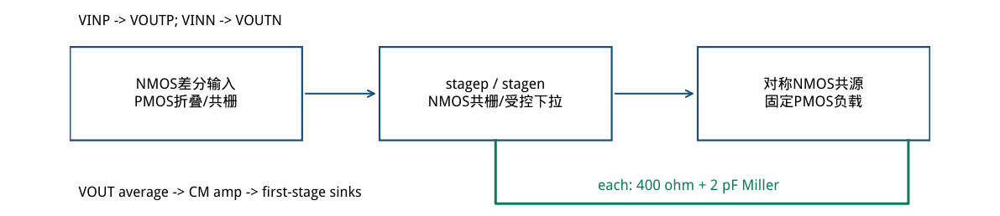
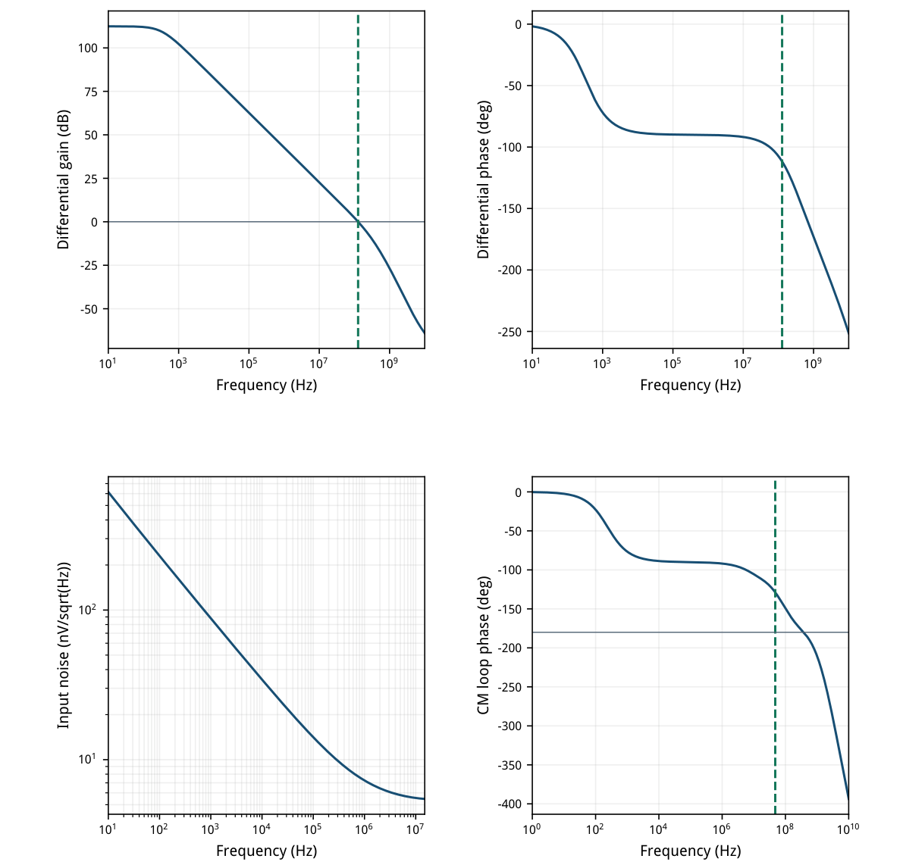
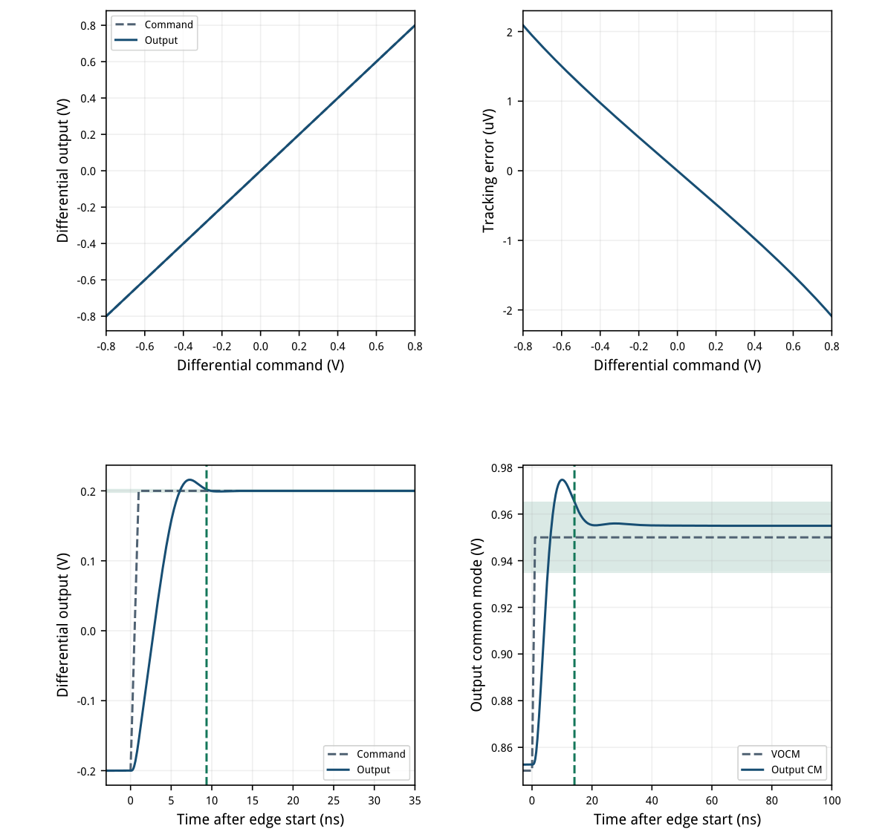
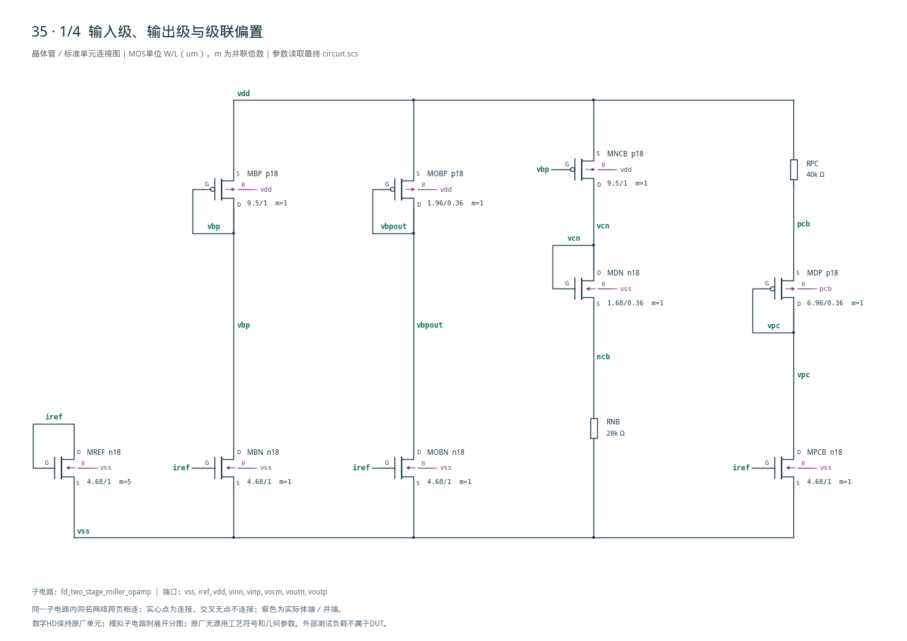
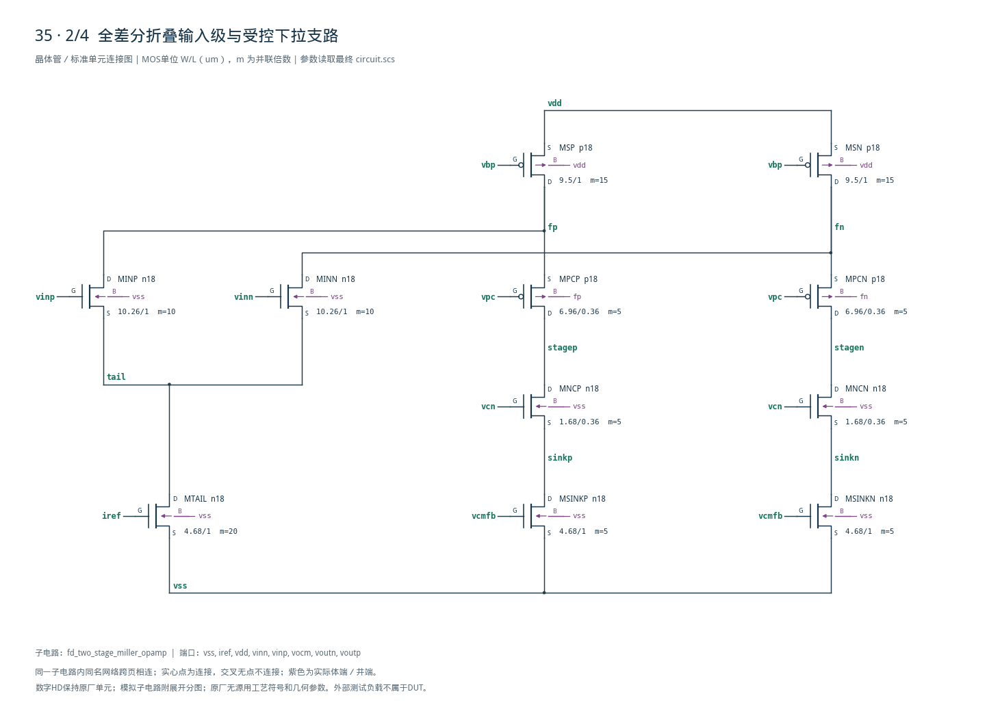
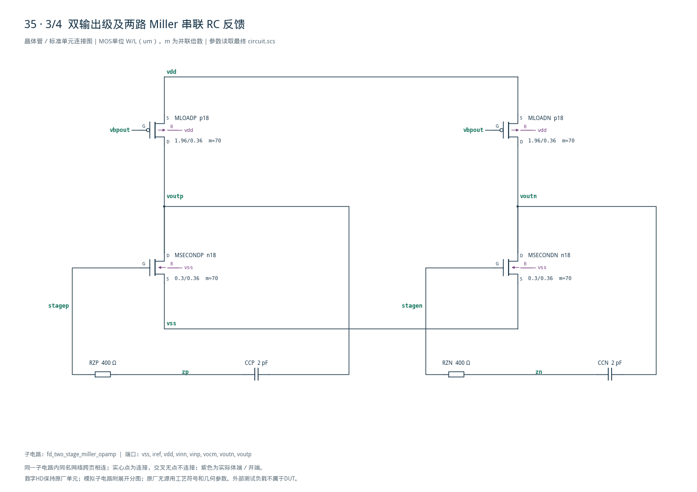
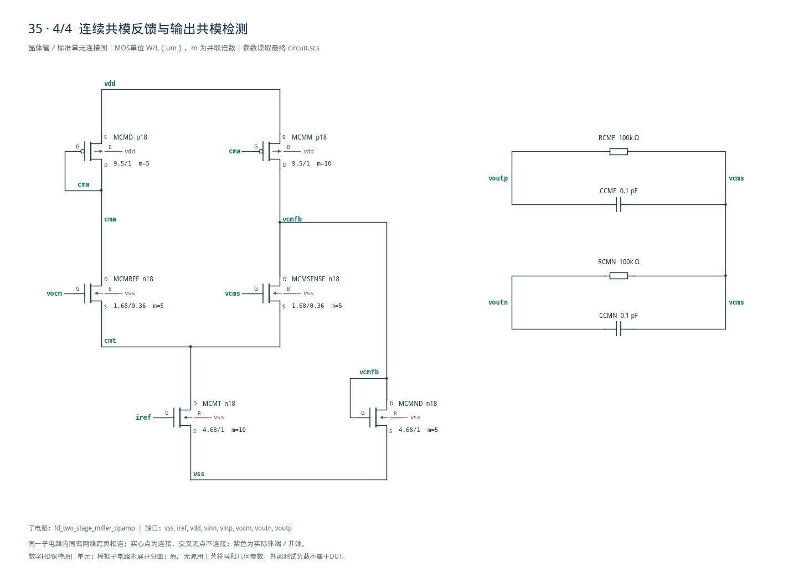

# 35 · 全差分两级 Miller 运放审查

[审查 PDF](review.pdf) · [实测结果](latest_results.json) · [验收合同](contract.json) · [最终网表](circuit.scs)

## 验收结果

本模块提供全差分闭环放大，并分别控制差分信号和输出共模。相比单级全差分OTA，第二级增加开环增益和驱动能力，Miller补偿用于维持差模环路稳定；同时需要设计共模反馈，避免共模动态成为瓶颈。芯片中常用于ADC驱动、开关电容放大器和差分模拟信号通路。

结论：确定性 nominal 原门槛全部通过；原20种子失配拒斥试验未执行。

条件：SMIC18MMRF / tt / 1.8 V / 27°C，50 uA参考，输入共模0.9 V，每侧1 pF。30只MOS；折叠共栅第一级、对称共源输出级、每侧2 pF/400 Ω Miller支路。

| 指标 | 实测 | 原门槛 | 10%边界 | 15%边界 | 单位 |
| --- | --- | --- | --- | --- | --- |
| 差模增益 @10Hz | 112.4192 | ≥60.000 | ≥59.085 | ≥58.588 | dB |
| 差模UGB | 127.5082 | ≥100.000 | ≥90.000 | ≥85.000 | MHz |
| 差模相位裕量 | 68.2512 | ≥60.000 | ≥54.000 | ≥51.000 | deg |
| 输出共模误差 | 3.6382 | ≤15.000 | ≤16.500 | ≤17.250 | mV |
| 输出差分不平衡 | 0.0055 | ≤100.000 | ≤110.000 | ≤115.000 | uV |
| VDD功耗，含参考 | 3.6308 | ≤5.000 | ≤5.500 | ≤5.750 | mW |
| 输入噪声 10Hz–15MHz | 24.9263 | ≤50.000 | ≤55.000 | ≤57.500 | uVrms |
| 连续有效差分范围 | 1.6000 | ≥0.800 | ≥0.720 | ≥0.680 | Vpp |
| 范围内最大跟踪误差 | 0.0021 | ≤5.000 | ≤5.500 | ≤5.750 | mV |
| 差模最后容差交越 | 9.3561 | ≤15.000 | ≤16.500 | ≤17.250 | ns |
| 320ns终值误差/目标 | 0.0002 | ≤1.000 | ≤1.100 | ≤1.150 | % |
| CM最后容差交越 | 14.1630 | ≤100.000 | ≤110.000 | ≤115.000 | ns |
| 1us共模终值误差 | 4.9711 | ≤10.000 | ≤11.000 | ≤11.500 | mV |

完整321点命令−0.8～+0.8 V、步长5 mV均通过5 mV跟踪窗，连续有效范围1.6 Vpp。差模AC额外检查只有一次下降0 dB交越、此后不回穿；功耗为正，数据完整且有限。

独立CM STB：UGB47.674 MHz、PM51.147°，满足45°诊断下限。主表的60°门槛对应差模PM。全部30只MOS在中心OP有正的饱和余量。

范围边界：其余PVT、20个固定种子local-mismatch、版图寄生与无源变化未执行。匹配CMRR/PSRR只作数值表征，不能替代原失配验收，也不能把nV级平衡推广到失配。

## 架构、尺寸与目标工艺LUT

所有偏置从iref生成；DUT中仅MOS及正值R/C，没有内部独立或受控源。

| 器件角色 | 模型 | 单位W/L um | m | gm/ID | LUT fT MHz |
| --- | --- | --- | --- | --- | --- |
| MINP/MINN | n18 | 10.26/1 | 10 | 18 | 471 |
| REF/TAIL/偏置/受控下拉 | n18 | 4.68/1 | 5/20/1/5 | 14 | 713 |
| 偏置/折叠源/CM镜 | p18 | 9.50/1 | 1/15/5,10 | 10 | 244 |
| MDN / MNCP,MNCN | n18 | 1.68/0.36 | 1 / 5 | 14 | 4702 |
| MDP / MPCP,MPCN | p18 | 6.96/0.36 | 1 / 5 | 14 | 1155 |
| MSECONDP/MSECONDN | n18 | 0.30/0.36 | 70 | 6 | 10846 |
| MOBP / MLOADP,MLOADN | p18 | 1.96/0.36 | 1 / 70 | 8 | 2175 |
| MCMREF/MCMSENSE | n18 | 1.68/0.36 | 5 | 14 | 4702 |

gm/ID初值：输入L=1 um、gm/ID=18、每侧100 uA，gm1≈1.8 mS；Cc=2 pF给出gm1/(2πCc)≈143 MHz。输出L=0.36 um、gm/ID=6、目标700 uA，gm2≈4.2 mS，400 Ω大于1/gm2，串联零点移到左半平面。

全部单位W≤10.26 um；总宽较大的输入/PMOS输出以m复制。NMOS输出单位W=0.30 um、m=70，仍在模型范围内；LUT Wref=10 um只作初值，实际OP已包含窄宽效应与体偏置。

LUT使用既有gmoverid\_smic18/lut/tt；每个查询的VDS、L、温度、体偏置、源路径与SHA-256保存在sizing.json。无需补扫，没有改动PDK、Bridge或原LUT。



[查看矢量图](markdown_assets/figure-02-01.svg)

## 实际工作点与CMFB修正

CMFB动作节点的阻抗和偏置平衡共同影响恢复；原动态门槛通过仍须检查环路。

| 器件 | \|Id\|/uA | gm/ID | gm/gds | \|VDS\|/V | 饱和余量/mV |
| --- | --- | --- | --- | --- | --- |
| MINP | 98.769 | 18.212 | 336.38 | 1.0525 | 963.09 |
| MTAIL | 197.537 | 14.242 | 152.54 | 0.3453 | 225.57 |
| MSP | 153.773 | 9.864 | 190.60 | 0.4022 | 225.73 |
| MPCP | 55.004 | 13.590 | 159.62 | 0.7046 | 574.55 |
| MNCP | 55.004 | 13.383 | 68.74 | 0.4061 | 283.23 |
| MSINKP | 55.004 | 13.651 | 106.51 | 0.2871 | 161.75 |
| MSECONDP | 732.059 | 5.906 | 76.81 | 0.9036 | 662.66 |
| MLOADP | 732.059 | 7.750 | 122.04 | 0.8964 | 676.17 |
| MCMSENSE | 47.473 | 13.846 | 35.35 | 0.2359 | 118.14 |
| MCMND | 56.073 | 13.670 | 224.99 | 0.5204 | 395.03 |

中心节点：tail=0.34531 V，fp/fn=1.39783 V，stagep/stagen=0.69318 V，sinkp/sinkn=0.28708 V；vcmfb=0.52037 V。输出每侧732.06 uA，主输入98.77 uA。余量=|VDS|−|VDSAT|；不是全PVT保证。

| 版本 | ND电流/uA | ND gm/mS | CM PM | CM误差/mV | 恢复/ns |
| --- | --- | --- | --- | --- | --- |
| CM镜比1.2，初版 | 11.215 | 0.1533 | 13.680° | 8.254 | 31.387 |
| CM镜比2.0，最终 | 56.073 | 0.7665 | 51.147° | 3.638 | 14.163 |

CM镜的额外上拉电流流过二极管NMOS MCMND，后者与一阶受控下拉近似匹配电流密度。镜比从1.2改为2.0，同时把ND的m从1增至5，使动作节点近似1/gm由6.52 kΩ降到1.30 kΩ；独立CM UGB从87.88降到47.67 MHz，PM从13.68°升到51.15°。

CM极性：输出平均值升高→MCMSENSE下拉增强、镜像上拉减小→vcmfb下降→第一阶段下拉减小→stagep/stagen上升→输出NMOS电流上升→输出均值下降。该修正保留晶体管级连续反馈。

## 频率、噪声与共模环路证据

差模增益/PM、闭环输入噪声和CM STB使用各自正确的连接与测量定义。

差模AC输入±0.5 V，H=Voutp−Voutn，10 Hz取增益；首次下降交越计算UGB/PM。噪声是单位差分闭环的输入等效谱，积分sqrt(∫en²df)，频带严格10 Hz–15 MHz；没有把UGB当成噪声积分上限。

噪声含619个频点；线性频率梯形积分与PSD幂律插值积分相差0.00095%。CM用感测节点到MCMSENSE栅的零压探针；图取−loopGain，51.1473°与Spectre原生51.1477°一致。



[查看矢量图](markdown_assets/figure-04-01.svg)

## 完整范围与动态目标

最后容差交越从20 ns边沿开始计；差模固定2 mV窗，共模固定15 mV窗。

差模−0.2→+0.2 V、20–21 ns线性边沿；误差窗为最终目标0.2 V的1%，即2 mV。全波形末次容差交越线性插值后减20 ns，得到9.356 ns。320 ns瞬时终值误差0.4807 uV，不以实际终值重新居中。

VOCM 0.85→0.95 V、同样1 ns边沿，零差分输入保持0.9 V。15 mV窗的末次交越减20 ns为14.163 ns；观察至1 us，终值误差4.971 mV≤10 mV。图仅放大边沿，提取扫描完整观察窗。



[查看矢量图](markdown_assets/figure-05-01.svg)

## 最终精确晶体管网表

D G S B端序；共栅PMOS体端各接源端，物理设计必须保留相应独立井。

第一阶段PMOS固定源与NMOS输入电流之差流入折叠支路；连续CMFB调节两个底部下拉。输出为两组NMOS共源与PMOS固定电流负载，Miller支路直接从各输出返回各自stage节点。

精确尺寸、m、总宽与端序另见geometry.json；最终circuit.scs SHA-256：6d9f5f72270985bfe6f78ef2b76d423773ed5271b7edac16c114f3c9b148289b

## 拒斥范围边界、提取与复现

原20种子随机失配要求未执行；下面保留匹配nominal激励的原始结果，不能作为实际拒斥承诺。

| 指标 | 10Hz扰动→差模 V/V | 形式计算dB | 原失配门槛 | 10%边界 | 15%边界 |
| --- | --- | --- | --- | --- | --- |
| CMRR | 4.898e-11 | 318.62 | ≥50 | ≥49.085 | ≥48.588 |
| PSRR+ | 1.301e-07 | 250.14 | ≥40 | ≥39.085 | ≥38.588 |
| PSRR− | 3.823e-09 | 280.77 | ≥40 | ≥39.085 | ≥38.588 |

三个超高dB数值来自理想匹配对称性与求解/输出精度残差。1 MHz时三种扰动的差分残差均为0，dB未定义；没有把零残差改成任意大“通过”数值。20个固定种子41000–41019均未运行，此项明确排除。

CMRR/PSRR定义为差模信号增益与相应扰动到差分输出增益之比。负电源测试令VSS AC=+1、VDD对VSS AC=−1，使绝对VDD不动；输入及VOCM相对VSS保持原bench连接。不是输出共模抑制比。

原instruction、参考电路、verify.py、utils.py和六套bench均已冻结。提取按bench的.meas定义适配PSF，并用原verifier的nominal\_functional/threshold函数核对标量门槛；不运行原PVT/MC调度。差模采样50 ps、CM采样100 ps，内部最大步长25/50 ps。

复现（工程根目录）： /home/IC/CodeX/virtuoso-bridge-lite/.venv/bin/python scripts/case35\_fd\_miller.py 同一Python运行 scripts/review\_pdf.py 35 生成PDF。 原任务：sky130-fd-two-stage-miller-opamp-gain60-pm60-noise50uv-pvt

最终运行（依次AC、noise、range、settling、CM、rejection、CM STB）：runs/35/20260922T091831965563Z\_ac runs/35/20260922T091832170295Z\_noise runs/35/20260922T091832394130Z\_range runs/35/20260922T091832565378Z\_settling runs/35/20260922T091833569988Z\_cm runs/35/20260922T091835170616Z\_rejection runs/35/20260922T091835756615Z\_cmstb

每个run.json保存模型与输入哈希；inputs/与原始PSF保留。仅nominal原理图，不含剩余PVT、失配、寄生与无源容差。

## 完整网表与电路图

[Spectre 网表](circuit.scs) · [全部分图 PDF](schematic/sheets.pdf) · [电路总图](schematic/full.svg) · [端子连接](schematic/connectivity.json)

<details>
<summary>展开完整 Spectre 网表</summary>

```spectre
// Fully differential folded-cascode first stage and symmetric second stage.
// D G S B. Legal unit widths use m replication; no internal sources.
simulator lang=spectre
subckt fd_two_stage_miller_opamp (vss iref vdd vinn vinp vocm voutn voutp)
MREF (iref iref vss vss) n18 w=4.68u l=1u m=5
MBN (vbp iref vss vss) n18 w=4.68u l=1u
MBP (vbp vbp vdd vdd) p18 w=9.5u l=1u
MOBN (vbpout iref vss vss) n18 w=4.68u l=1u
MOBP (vbpout vbpout vdd vdd) p18 w=1.96u l=.36u
MNCB (vcn vbp vdd vdd) p18 w=9.5u l=1u
MDN (vcn vcn ncb vss) n18 w=1.68u l=.36u
RNB (ncb vss) resistor r=28000
RPC (vdd pcb) resistor r=40000
MDP (vpc vpc pcb pcb) p18 w=6.96u l=.36u
MPCB (vpc iref vss vss) n18 w=4.68u l=1u
MTAIL (tail iref vss vss) n18 w=4.68u l=1u m=20
MINP (fp vinp tail vss) n18 w=10.26u l=1u m=10
MINN (fn vinn tail vss) n18 w=10.26u l=1u m=10
MSP (fp vbp vdd vdd) p18 w=9.5u l=1u m=15
MSN (fn vbp vdd vdd) p18 w=9.5u l=1u m=15
MPCP (stagep vpc fp fp) p18 w=6.96u l=.36u m=5
MPCN (stagen vpc fn fn) p18 w=6.96u l=.36u m=5
MNCP (stagep vcn sinkp vss) n18 w=1.68u l=.36u m=5
MNCN (stagen vcn sinkn vss) n18 w=1.68u l=.36u m=5
MSINKP (sinkp vcmfb vss vss) n18 w=4.68u l=1u m=5
MSINKN (sinkn vcmfb vss vss) n18 w=4.68u l=1u m=5
MSECONDP (voutp stagep vss vss) n18 w=0.3u l=.36u m=70
MSECONDN (voutn stagen vss vss) n18 w=0.3u l=.36u m=70
MLOADP (voutp vbpout vdd vdd) p18 w=1.96u l=.36u m=70
MLOADN (voutn vbpout vdd vdd) p18 w=1.96u l=.36u m=70
RZP (stagep zp) resistor r=400
CCP (zp voutp) capacitor c=2p
RZN (stagen zn) resistor r=400
CCN (zn voutn) capacitor c=2p
RCMP (voutp vcms) resistor r=100k
RCMN (voutn vcms) resistor r=100k
CCMP (voutp vcms) capacitor c=100f
CCMN (voutn vcms) capacitor c=100f
MCMT (cmt iref vss vss) n18 w=4.68u l=1u m=10
MCMREF (cma vocm cmt vss) n18 w=1.68u l=.36u m=5
MCMSENSE (vcmfb vcms cmt vss) n18 w=1.68u l=.36u m=5
MCMD (cma cma vdd vdd) p18 w=9.5u l=1u m=5
MCMM (vcmfb cma vdd vdd) p18 w=9.5u l=1u m=10
MCMND (vcmfb vcmfb vss vss) n18 w=4.68u l=1u m=5
ends fd_two_stage_miller_opamp
```

</details>









## 报告来源

正文与表格整理自已交付的矢量 PDF，图表单独提取；本文件是后续整理的 Markdown，不是原 PDF 的编译输入。原 PDF、网表及测量数据保持原值。
