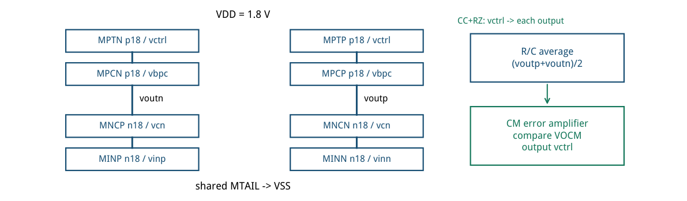
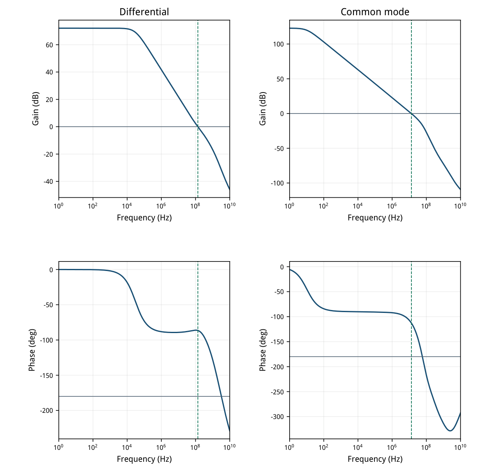
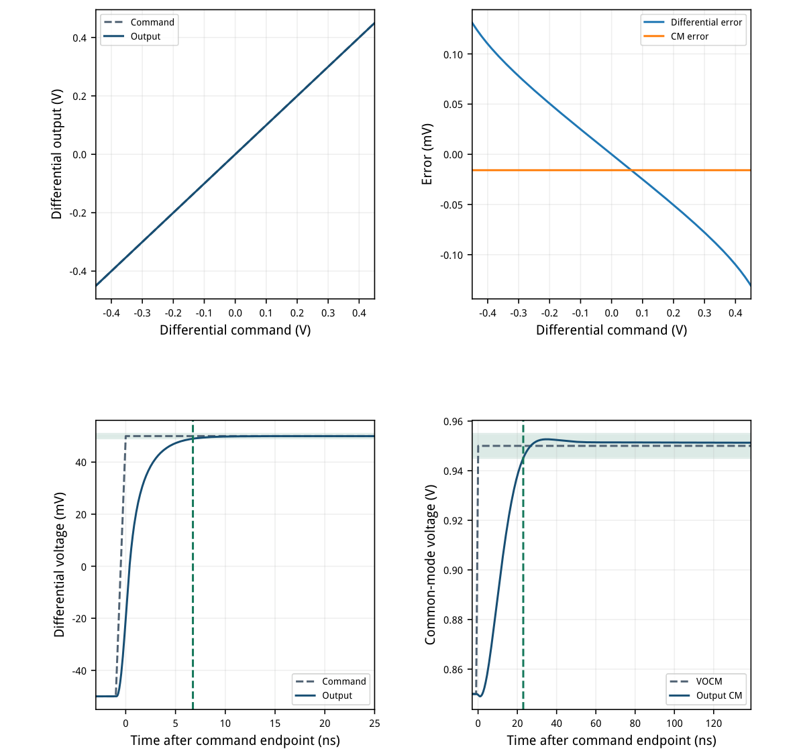
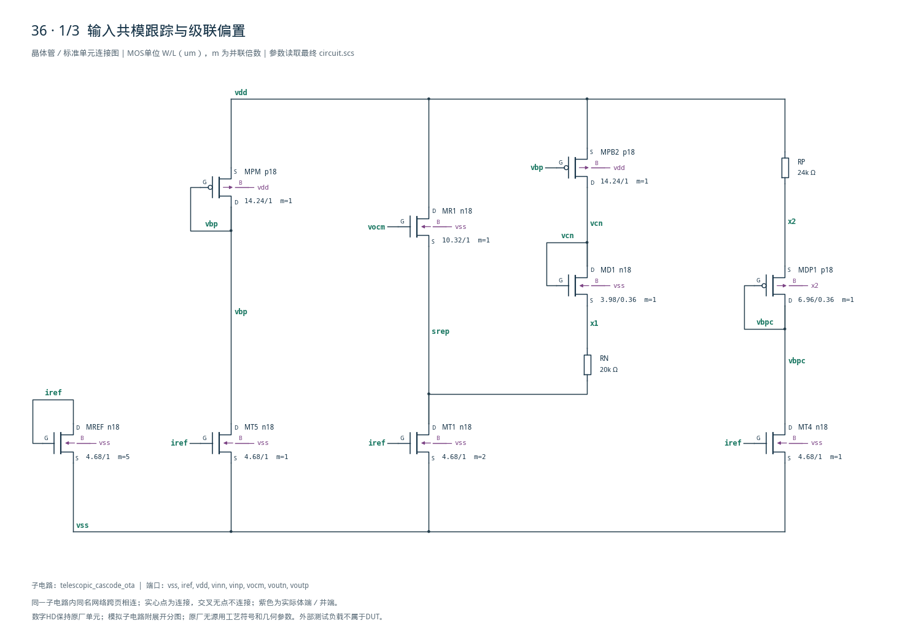
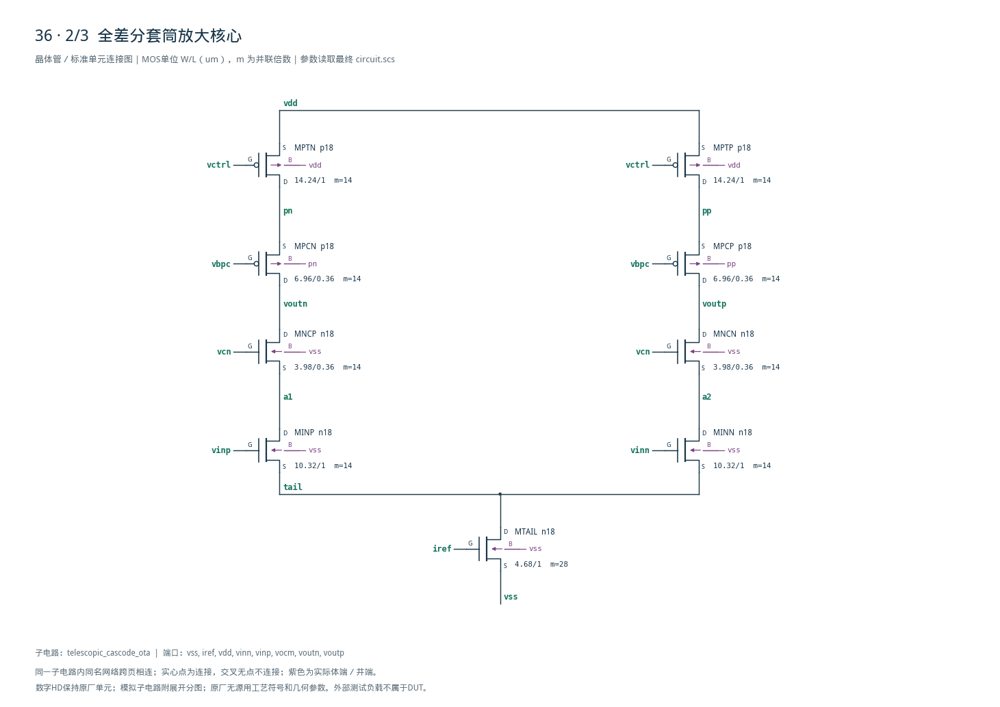
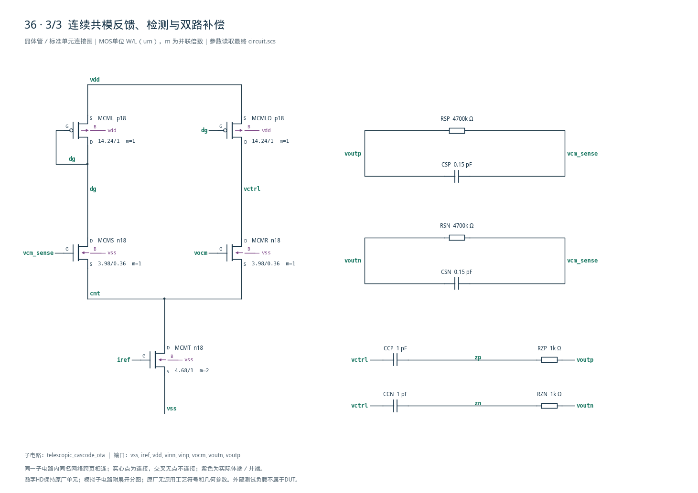

# 36 · 全差分 Telescopic OTA 审查

[审查 PDF](review.pdf) · [实测结果](latest_results.json) · [验收合同](contract.json) · [最终网表](circuit.scs)

## 验收结果

本模块把差分输入放大为全差分输出，并用共模反馈把两输出的平均电压保持在指定值。相比基础差分对，套筒式级联用叠接晶体管提高输出阻抗和增益，在单级结构中兼顾速度与电流效率，代价是输入输出电压余量较紧。芯片中常用于高速开关电容放大、ADC余量放大和连续时间滤波器。

结论：四组原始 nominal 电气验收全部通过，无需10%–15%放宽。

条件：SMIC18MMRF / tt / 1.8 V / 27°C；50 uA参考；输入共模0.9 V；每侧2 pF负载。23只MOS、连续时间CMFB与VOCM跟踪偏置；无数字逻辑。

| 指标 | 实测 | 原门槛 | 10%边界 | 15%边界 | 单位 |
| --- | --- | --- | --- | --- | --- |
| 差模增益 @1Hz | 72.1030 | &gt;60.000 | &gt;59.085 | &gt;58.588 | dB |
| 差模UGB | 136.6279 | &gt;50.000 | &gt;45.000 | &gt;42.500 | MHz |
| 差模相位裕量 | 93.4904 | &gt;60.000 | &gt;54.000 | &gt;51.000 | deg |
| 开环输出CM误差 | 0.0158 | &lt;5.000 | &lt;5.500 | &lt;5.750 | mV |
| VDD总功耗，含参考 | 0.6958 | &lt;1.000 | &lt;1.100 | &lt;1.150 | mW |
| 181点差模跟踪误差 | 0.1310 | ≤5.000 | ≤5.500 | ≤5.750 | mV |
| 181点最大CM误差 | 0.0158 | ≤5.000 | ≤5.500 | ≤5.750 | mV |
| 差模最后进入时间 | 6.7500 | &lt;10.000 | &lt;11.000 | &lt;11.500 | ns |
| 差模末10ns均值误差 | 0.0124 | ≤0.100 | ≤0.110 | ≤0.115 | mV |
| 差模终值误差/阶跃 | 0.0124 | ≤1.000 | ≤1.100 | ≤1.150 | % |
| CM最后进入时间 | 23.0000 | &lt;40.000 | &lt;44.000 | &lt;46.000 | ns |
| CM末20ns均值误差 | 1.3044 | ≤5.000 | ≤5.500 | ≤5.750 | mV |

不放宽检查：完整181点，−0.45～+0.45 V、步长5 mV；完整0.90 Vpp。1 Hz～10 GHz内恰好一次下降0 dB交越，此后均低于0 dB；功耗非负，全部数据有限。

独立CM环路：UGB=13.401 MHz，PM=67.077°，高于45°诊断下限。 与Spectre原生PM之差小于0.002°。

本次仅nominal原理图验证。未执行其余26个PVT点、Monte Carlo、噪声、抑制比或版图寄生；“原始通过”指原阈值在本次nominal条件下通过。

## 信号结构、gm/ID与工作点

NMOS输入与尾源、上下共栅级、PMOS顶电流源；CMFB独立调节两侧上拉。

| 器件角色 | 模型 | 单位W/L um | m | gm/ID | LUT fT MHz |
| --- | --- | --- | --- | --- | --- |
| MINP/MINN; MR1 | n18 | 10.32/1 | 14; 1 | 18 | 466 |
| REF/TAIL/T1/T4/T5/CMT | n18 | 4.68/1 | 5/28/2/1/1/2 | 14 | 713 |
| MNCP/MNCN; MD1 | n18 | 3.98/0.36 | 14; 1 | 18 | 2843 |
| MPCN/MPCP; MDP1 | p18 | 6.96/0.36 | 14; 1 | 14 | 1155 |
| PTN/PTP; PB2/PM/CML/CMLO | p18 | 14.24/1 | 14; 1 | 12 | 201 |
| MCMS/MCMR | n18 | 3.98/0.36 | 1 | 18 | 2843 |

| 实测工作点 | \|I\|/uA | gm/ID | gm/gds | \|VDS\|/V | 余量/mV |
| --- | --- | --- | --- | --- | --- |
| MINP | 138.245 | 18.067 | 96.52 | 0.2130 | 121.83 |
| MTAIL | 276.489 | 14.241 | 151.08 | 0.3429 | 223.14 |
| MNCP | 138.245 | 18.117 | 73.76 | 0.3441 | 256.90 |
| MPCN | 138.245 | 14.116 | 158.47 | 0.6508 | 526.10 |
| MPTN | 138.245 | 11.940 | 85.53 | 0.2492 | 102.97 |
| MCMS | 9.860 | 18.219 | 132.34 | 0.9106 | 826.20 |

余量=|VDS|−|VDSAT|；全部23只MOS在中心工作点均有正余量。信号支路138.245 uA。LUT零体偏置作初值，实际输入管有0.343 V体偏置；gm/ID=18.067确认实际跨导效率。

LUT：gmoverid\_smic18/lut/tt；原表与SHA-256保存在sizing.json。单位W最大14.24 um；超100 um总宽由m复制实现，模型没有尺寸越界警告。



[查看矢量图](markdown_assets/figure-02-01.svg)

## 差模与共模频率证据

两种环路分别提取。差模高相位裕量不能代替CMFB稳定性验证。

差模：VINP AC=+0.5 V、VINN AC=−0.5 V，H=Voutp−Voutn，单位差分输入。按原verifier在对数频率上插值首个下降0 dB交越；相位由复数响应展开。扫描每十倍频100点。

共模：在vcm\_sense与MCMS栅之间插入零压iprobe，记录Spectre STB。图取−loopGain以统一低频相位为0°；同一符号约定给出67.077° PM，与Spectre原生日志一致。插入探针前后输出OP差小于1 pV。



[查看矢量图](markdown_assets/figure-03-01.svg)

## 完整闭环范围与两类动态

每侧负载保持2 pF；所有曲线来自最终相同的电路快照。

差模阶跃−50→+50 mV，20–21 ns线性边沿；从21 ns起算，最后进入固定±1 mV窗为6.75 ns。 观察至140 ns，最后10 ns均值距理想+50 mV为12.42 uV。无重新居中。

VOCM阶跃0.85→0.95 V、同样1 ns边沿；零差分输入保持0.9 V。最后进入固定±5 mV窗为23.0 ns。 观察至160 ns，末20 ns均值误差1.304 mV。这是有限观察窗指标，不能当作无限时间DC失调。



[查看矢量图](markdown_assets/figure-04-01.svg)

## 最终精确晶体管网表

D G S B端序；MPCN/MPCP及其复制管的体端跟随源端；外部供电与激励均在bench中。

偏置节点（中心OP）：tail=0.34288 V，a1/a2=0.55585 V，pn/pp=1.55080 V； vcn=1.18629 V，vbpc=0.99592 V，vctrl=1.23665 V。RN复制输入源电位再抬高约0.20 V；RP设定PMOS顶管压降约0.24 V。

CMFB极性：输出均值上升→MCMS电流增加→PMOS镜提供更多vctrl上拉，同时MCMR下拉减小→vctrl上升→主PMOS电流减小→输出均值下降。CC/RZ同时影响CM补偿与差模负载。

精确尺寸和端序另见geometry.json；circuit.scs SHA-256：2d4a9e9504ac804dd6b55067d359dc4d79fabc31be9e32557493978f80d8af81

## 失败迭代、测量口径与复现

保留失败证据；没有把仅差模通过的初版记为完成。

| 版本 | 支路uA/CCpF/RZΩ/CM Lμm | DM ns | CM ns | 结果 |
| --- | --- | --- | --- | --- |
| 初版 | 100 / 0.39 / 3k / 1 | 7.00 | 未进入窗 | CM PM32.90°；尾窗6.731mV |
| 第二版 | 100 / 0.6 / 15k / .36 | 14.25 | 135.35 | 此RZ/CC组合失败；CM PM14.76° |
| 最终 | 140 / 1.0 / 1k / .36 | 6.75 | 23.00 | 全部原nominal通过；CM PM67.08° |

关键修正：CM感测输入管由L=1 um改为0.36 um，降低其门电容对RC平均节点的瞬态衰减；CC增至1 pF并将RZ取1 kΩ，稳定共模环路。支路电流从100增到140 uA，补回差模驱动能力。

181点DC保持外部理想反馈：err=command−(Voutp−Voutn)，vinp/vinn=VOCM±err/2。动态由原冻结verifier取“命令首次到终值后，之后全在窗内的首个输出样本”。最大内部步长25 ps，输出采样50 ps；均值按采样点算术平均。

提取直接复用source/tests/verify.py的AC、范围、建立、CM恢复函数，输入改为经过长度/有限值/顺序校验的Spectre PSF复数向量；保留严格&gt;/&lt;及≤边界。差模增益是幅度dB，放宽时加20log10(0.9/0.85)。

复现（工程根目录）： /home/IC/CodeX/virtuoso-bridge-lite/.venv/bin/python scripts/case36\_telescopic.py 同一Python运行 scripts/review\_pdf.py 36 生成本PDF。 原任务：sky130-telescopic-cascode-ota-pvt-fix

最终原始运行：runs/36/20260922T085345191248Z\_ac runs/36/20260922T085345388089Z\_range runs/36/20260922T085345536109Z\_settling runs/36/20260922T085346089578Z\_cm\_recovery runs/36/20260922T085423643569Z\_cmstb

每个run.json保留电路/bench/模型哈希和冻结输入；cases/36-telescopic/source保留源合同、正式verifier与bench。未运行PVT、失配、版图或无源工艺变化。

## 完整网表与电路图

[Spectre 网表](circuit.scs) · [全部分图 PDF](schematic/sheets.pdf) · [电路总图](schematic/full.svg) · [端子连接](schematic/connectivity.json)

<details>
<summary>展开完整 Spectre 网表</summary>

```spectre
// SMIC18 gm/ID migration of a fully differential telescopic OTA.
// D G S B; all individual W <= 100um, wide devices use m copies.
simulator lang=spectre
subckt telescopic_cascode_ota (vss iref vdd vinn vinp vocm voutn voutp)
MREF (iref iref vss vss) n18 w=4.68u l=1u m=5
MTAIL (tail iref vss vss) n18 w=4.68u l=1u m=28
MINP (a1 vinp tail vss) n18 w=10.32u l=1u m=14
MINN (a2 vinn tail vss) n18 w=10.32u l=1u m=14
MNCP (voutn vcn a1 vss) n18 w=3.98u l=.36u m=14
MNCN (voutp vcn a2 vss) n18 w=3.98u l=.36u m=14
MPCN (voutn vbpc pn pn) p18 w=6.96u l=.36u m=14
MPCP (voutp vbpc pp pp) p18 w=6.96u l=.36u m=14
MPTN (pn vctrl vdd vdd) p18 w=14.24u l=1u m=14
MPTP (pp vctrl vdd vdd) p18 w=14.24u l=1u m=14
MR1 (vdd vocm srep vss) n18 w=10.32u l=1u
MT1 (srep iref vss vss) n18 w=4.68u l=1u m=2
MPB2 (vcn vbp vdd vdd) p18 w=14.24u l=1u
MD1 (vcn vcn x1 vss) n18 w=3.98u l=.36u
RN (x1 srep) resistor r=20000
RP (vdd x2) resistor r=24000
MDP1 (vbpc vbpc x2 x2) p18 w=6.96u l=.36u
MT4 (vbpc iref vss vss) n18 w=4.68u l=1u
MPM (vbp vbp vdd vdd) p18 w=14.24u l=1u
MT5 (vbp iref vss vss) n18 w=4.68u l=1u
RSP (voutp vcm_sense) resistor r=4.7M
RSN (voutn vcm_sense) resistor r=4.7M
CSP (voutp vcm_sense) capacitor c=0.15p
CSN (voutn vcm_sense) capacitor c=0.15p
MCMS (dg vcm_sense cmt vss) n18 w=3.98u l=0.36u m=1
MCMR (vctrl vocm cmt vss) n18 w=3.98u l=0.36u m=1
MCMT (cmt iref vss vss) n18 w=4.68u l=1u m=2
MCML (dg dg vdd vdd) p18 w=14.24u l=1u m=1
MCMLO (vctrl dg vdd vdd) p18 w=14.24u l=1u m=1
CCP (vctrl zp) capacitor c=1p
RZP (zp voutp) resistor r=1000
CCN (vctrl zn) capacitor c=1p
RZN (zn voutn) resistor r=1000
ends telescopic_cascode_ota
```

</details>







## 报告来源

正文与表格整理自已交付的矢量 PDF，图表单独提取；本文件是后续整理的 Markdown，不是原 PDF 的编译输入。原 PDF、网表及测量数据保持原值。
