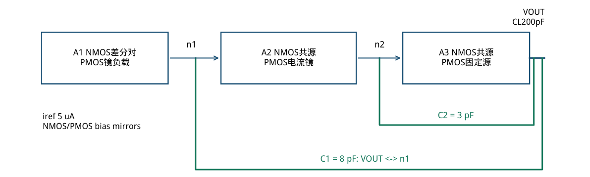
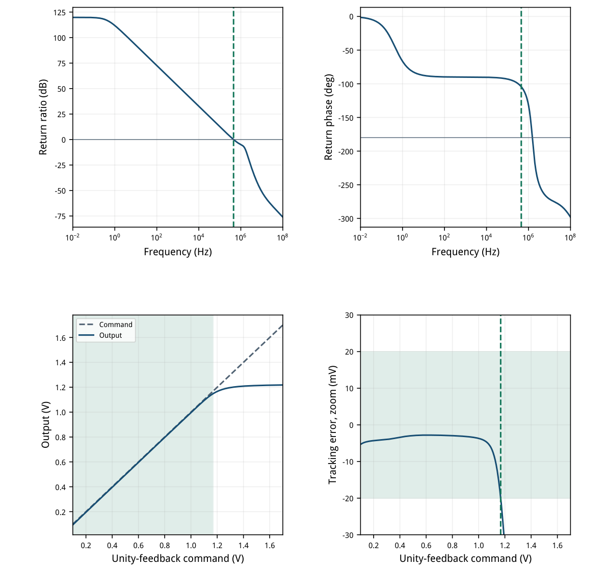
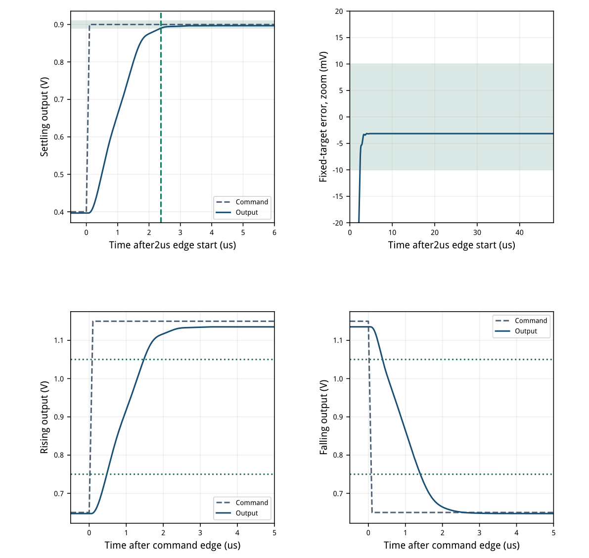
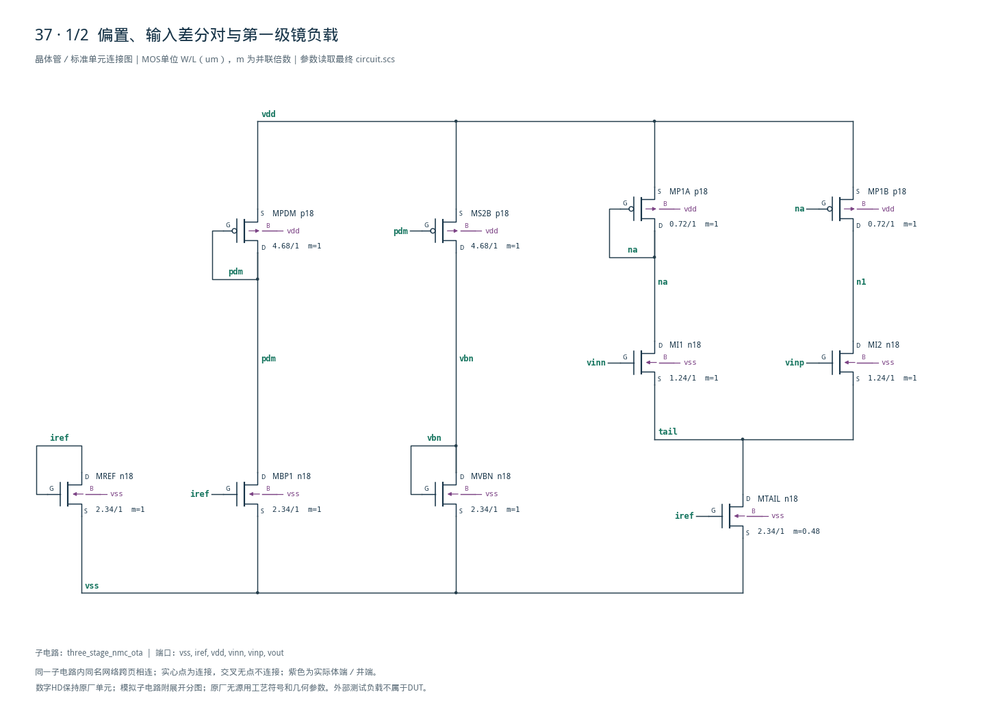
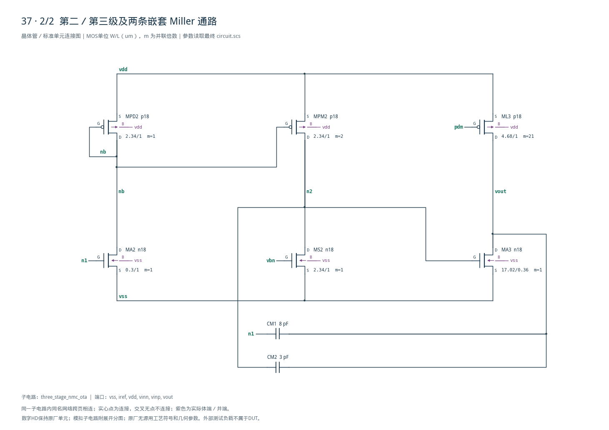

# 37 · 三级嵌套 Miller OTA 审查

[审查 PDF](review.pdf) · [实测结果](latest_results.json) · [验收合同](contract.json) · [最终网表](circuit.scs)

## 验收结果

本模块通过三级放大提供高开环增益和负载驱动能力，用嵌套Miller补偿协调多个高阻节点的极点。相比基础两级Miller结构，额外一级可提高增益并分配各级驱动任务，同时增加稳定性和建立时间设计的难度。芯片中可用作高精度信号调理、ADC驱动或其他闭环模拟系统的误差放大器。

结论：五组 nominal 检查全部达到原门槛，未用性能放宽；其余44个PVT点未执行。

条件：SMIC18MMRF / tt / 1.8 V / 27°C，5 uA参考，输入共模和输出目标0.9 V，理想负载200 pF。16只MOS与8 pF/3 pF嵌套电容，所有偏置从iref产生。

| 指标 | 实测 | 原门槛 | 10%边界 | 15%边界 | 单位 |
| --- | --- | --- | --- | --- | --- |
| 返回比增益 @0.1Hz | 119.5889 | ≥110.000 | ≥109.085 | ≥108.588 | dB |
| UGB | 451.6591 | ≥400.000 | ≥360.000 | ≥340.000 | kHz |
| 相位裕量 | 75.6215 | ≥70.000 | ≥63.000 | ≥59.500 | deg |
| 驱动效率 FOM | 370.7789 | ≥300.000 | ≥270.000 | ≥255.000 | 见下式 |
| 静态输出误差 | 3.1553 | ≤10.000 | ≤11.000 | ≤11.500 | mV |
| VDD总功耗，含参考 | 243.6272 | &lt;300.000 | &lt;330.000 | &lt;345.000 | uW |
| VINP DC电流绝对值 | 0.0000 | ≤100.000 | ≤110.000 | ≤115.000 | nA |
| VINN DC电流绝对值 | 0.0000 | ≤100.000 | ≤110.000 | ≤115.000 | nA |
| 连续合格命令区间 | 1.0680 | ≥0.800 | ≥0.720 | ≥0.680 | Vpp |
| 0.4→0.9V建立时间 | 2.3800 | &lt;3.000 | &lt;3.300 | &lt;3.450 | us |
| 终值误差/0.5V阶跃 | 0.6311 | ≤2.000 | ≤2.200 | ≤2.300 | % |
| 上升压摆率 | 0.3002 | ≥0.200 | ≥0.180 | ≥0.170 | V/us |
| 下降压摆率 | 0.2935 | ≥0.200 | ≥0.180 | ≥0.170 | V/us |

FOM = UGB(kHz) × 200 pF / 功耗(uW)；451.659 × 200 / 243.627 = 370.779 kHz·pF/uW。负载、输入幅度、观察窗、20 mV范围资格窗和10 mV建立窗均保持原定义。

AC从0.01 Hz至100 MHz只有一次下降0 dB交越，之后不回穿。中心OP全部16只MOS有正的饱和余量，五次正式运行无模型尺寸警告。输入电流0是本模型读数，不是实际器件零泄漏承诺。

范围边界：仅nominal原理图；其余PVT、局部失配、寄生、封装、老化和无源容差未运行。原任务也未要求局部失配；本报告不声称完成原45点PVT签核。

## 三级增益链、嵌套补偿与LUT

保留参考架构：A1反相、A2非反相、A3反相；从VINP到输出总极性为正。

| 角色 | 模型 | 单位W/L um | m | 目标gm/ID |
| --- | --- | --- | --- | --- |
| MI1 / MI2 | n18 | 1.24/1 | 1 | 18 |
| MP1A / MP1B | p18 | 0.72/1 | 1 | 8 |
| MA2 | n18 | 0.30/1 | 1 | 8 |
| MPD2 / MPM2 | p18 | 2.34/1 | 1 / 2 | 10 |
| REF / TAIL / BP1 / VBN / S2 | n18 | 2.34/1 | 1 / 0.48 / 1 / 1 / 1 | 14 |
| MPDM / MS2B / ML3 | p18 | 4.68/1 | 1 / 1 / 21 | 10 |
| MA3 | n18 | 17.02/0.36 | 1 | 14 |

输入L=1 um、每支目标1.2 uA、gm/ID=18，gm≈21.6 uS，初估gm/(2π·8pF)≈430 kHz。A2选gm/ID=8，让n1保留足够电位，使输入MI2的漏源压不被压低；输出L=0.36 um、目标105 uA、gm/ID=14。

全部单位W≤17.02 um；ML3以4.68 um、m=21得到98.28 um等效总宽。MTAIL的m=0.48是连续模型缩放；实版需转换为合规匹配几何并重新提取验证，不能直接将小数m视作完整布局。

LUT采用既有SMIC18 tt表，Wref=10 um、零体偏置；每项VDS、尺寸、源路径与SHA-256均在sizing.json。实际OP吸收体效应和窄宽偏差；未改PDK或原LUT，无需补扫。



[查看矢量图](markdown_assets/figure-02-01.svg)

## 中心工作点与手算闭合

余量定义为|VDS|−|VDSAT|；以下是0.9 V输入目标、单位反馈、200 pF负载的实际OP。

| MOS | \|Id\| uA | gm/ID | gm/gds | \|VDS\| V | 饱和余量mV |
| --- | --- | --- | --- | --- | --- |
| MREF | 5.000 | 14.156 | 227.35 | 0.5123 | 391.92 |
| MTAIL | 2.370 | 14.157 | 151.58 | 0.3454 | 225.04 |
| MBP1 | 5.169 | 14.059 | 330.34 | 1.1957 | 1075.28 |
| MPDM | 5.169 | 9.786 | 270.21 | 0.6043 | 426.82 |
| MS2B | 5.283 | 9.754 | 322.06 | 1.2838 | 1106.28 |
| MVBN | 5.283 | 13.882 | 225.38 | 0.5162 | 393.17 |
| MI1 | 1.175 | 18.042 | 310.33 | 0.8085 | 717.81 |
| MI2 | 1.195 | 17.858 | 141.41 | 0.2652 | 172.60 |
| MP1A | 1.175 | 8.024 | 232.68 | 0.6460 | 437.33 |
| MP1B | 1.195 | 8.004 | 278.90 | 1.1894 | 980.71 |
| MA2 | 2.591 | 7.323 | 235.98 | 1.1957 | 971.63 |
| MPD2 | 2.591 | 9.757 | 268.92 | 0.6043 | 426.93 |
| MPM2 | 5.292 | 9.726 | 319.84 | 1.2553 | 1077.89 |
| MS2 | 5.292 | 13.880 | 234.64 | 0.5447 | 421.66 |
| MA3 | 109.643 | 13.801 | 138.35 | 0.8968 | 780.57 |
| ML3 | 109.643 | 9.774 | 305.87 | 0.9032 | 725.68 |

节点：tail=0.34545 V，na=1.15400 V，n1=0.61062 V，nb=1.19570 V，n2=0.54474 V，vout=0.896845 V。MI2饱和余量最小，为172.60 mV；中心OP通过不等于全摆幅、全PVT均饱和。

按OP的gm和输出电导，A1≈41.23 dB，A2≈38.22 dB，A3≈40.41 dB；简单相加119.86 dB，与119.59 dB的返回比实测相近。A2估算包含PMOS镜的gm比；这些是低频近似，不能替代环路测量。

实际尾流2.3704 uA / C1 8 pF ≈0.2963 V/us，吻合双向0.3002/0.2935 V/us。输出上拉109.643 uA / CL 200 pF≈0.5482 V/us，说明本例主要由前级补偿电容充放电限制压摆。

119 dB增益来自三个有限增益级，8 pF/3 pF嵌套反馈安排极点。保持微功耗同时得到200 pF驱动，需要共同预算带宽、输出静态电流、补偿电容和压摆率。

## 返回比与完整直流扫描

返回比T=−V(vout)/V(vinn)，由输出与反相端之间的AC1串联电压源提取。

AC：100点/十倍频，增益取0.1 Hz，首个下降交越按对数频率插值求UGB/PM；0.01 Hz–100 MHz仅一次下降交越。完整801点DC：0.1→1.7 V、步长2 mV；535点构成0.100–1.168 V连续资格区间。

1.168 V命令误差19.9966 mV，下一点1.170 V误差20.7050 mV，不再合格。0.100 V是扫描下界，未声称物理极限；低输入电压时偏置可能很弱，静态跟踪区间不代表整个区间均具相同带宽或压摆能力。



[查看矢量图](markdown_assets/figure-04-01.svg)

## 固定建立窗口与双向压摆

时间从原刺激边沿开始计；建立容差中心固定0.9 V，不随实际终值0.896845 V平移。

建立：0.4→0.9 V，2.0–2.1 us线性边沿，观察到50 us。2%×0.5 V=10 mV窗，最后越界落在2.37–2.38 us之间；原算法取首个合格采样点2.38 us。末点误差3.1553 mV，即阶跃幅度的0.6311%。

压摆：0.65↔1.15 V，边沿100 ns，下降边沿开始42.1 us；原算法从42 us搜索。固定0.75/1.05 V输出交越线性插值得0.30025/0.29345 V/us。输出采样10 ns，内部最大步长5 ns；没有把采样精度当作连续时间精确值。



[查看矢量图](markdown_assets/figure-05-01.svg)

## 精确网表、测量来源与复现

DUT仅使用16个目标工艺MOS与两个正电容；独立刺激和理想200 pF负载均在bench中。

原instruction、参考solution、verify.py、utils.py和五套bench已冻结。将真实PSF向量适配为原Plot结构，直接调用extract\_metrics；原nominal\_functional也通过。未调用或伪造45点矩阵检查。

输入偏置另用两输入独立固定0.9 V、开环输出的原bench；两输入电流均读0 A。该bench输出约7.88 mV，不用于0.9 V静态输出门槛；后者在单位反馈AC/OP bench测量。0 A不能证明ESD、栅泄漏或封装漏电也为零。

复现（工程根目录）： /home/IC/CodeX/virtuoso-bridge-lite/.venv/bin/python scripts/case37\_nested\_miller.py 同一Python运行 scripts/review\_pdf.py 37 生成PDF。 源任务：sky130-three-stage-nested-miller-ota-pvt

正式运行（依次AC/OP、输入偏置、DC范围、建立、压摆）：runs/37/20260922T094634948149Z\_pvt runs/37/20260922T094635113442Z\_input\_bias runs/37/20260922T094635241732Z\_swing runs/37/20260922T094635425475Z\_settling runs/37/20260922T094635958990Z\_slew

各run保留inputs、原始PSF、模型与网表哈希。精确电路SHA-256：0014c2c3bce36d7ea1099c7c8c13df67508d37d3fff87a719166c916e21dcbbb

## 完整网表与电路图

[Spectre 网表](circuit.scs) · [全部分图 PDF](schematic/sheets.pdf) · [电路总图](schematic/full.svg) · [端子连接](schematic/connectivity.json)

<details>
<summary>展开完整 Spectre 网表</summary>

```spectre
// Three gain stages, outer and inner Miller paths; source topology retained.
// SMIC18 primitive D G S B; m scales identical parallel model units.
simulator lang=spectre
subckt three_stage_nmc_ota (vss iref vdd vinn vinp vout)
MREF (iref iref vss vss) n18 w=2.34u l=1u
MTAIL (tail iref vss vss) n18 w=2.34u l=1u m=0.48
MBP1 (pdm iref vss vss) n18 w=2.34u l=1u
MPDM (pdm pdm vdd vdd) p18 w=4.68u l=1u
MS2B (vbn pdm vdd vdd) p18 w=4.68u l=1u
MVBN (vbn vbn vss vss) n18 w=2.34u l=1u
MI1 (na vinn tail vss) n18 w=1.24u l=1u
MI2 (n1 vinp tail vss) n18 w=1.24u l=1u
MP1A (na na vdd vdd) p18 w=0.72u l=1u
MP1B (n1 na vdd vdd) p18 w=0.72u l=1u
MA2 (nb n1 vss vss) n18 w=0.3u l=1u
MPD2 (nb nb vdd vdd) p18 w=2.34u l=1u
MPM2 (n2 nb vdd vdd) p18 w=2.34u l=1u m=2
MS2 (n2 vbn vss vss) n18 w=2.34u l=1u m=1
MA3 (vout n2 vss vss) n18 w=17.02u l=.36u
ML3 (vout pdm vdd vdd) p18 w=4.68u l=1u m=21
CM1 (vout n1) capacitor c=8p
CM2 (vout n2) capacitor c=3p
ends three_stage_nmc_ota
```

</details>





## 报告来源

正文与表格整理自已交付的矢量 PDF，图表单独提取；本文件是后续整理的 Markdown，不是原 PDF 的编译输入。原 PDF、网表及测量数据保持原值。
