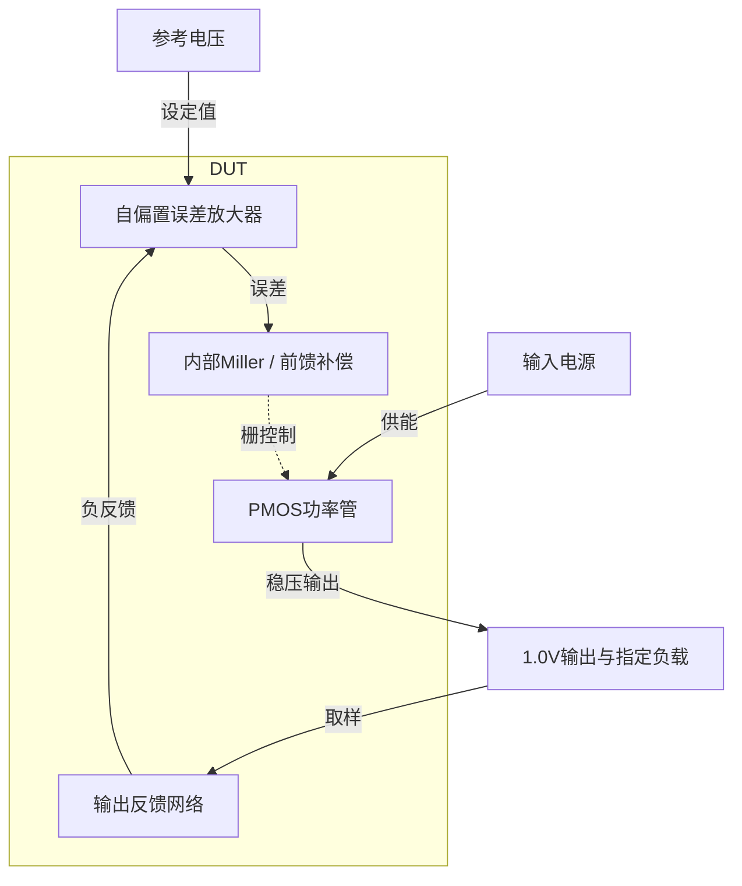
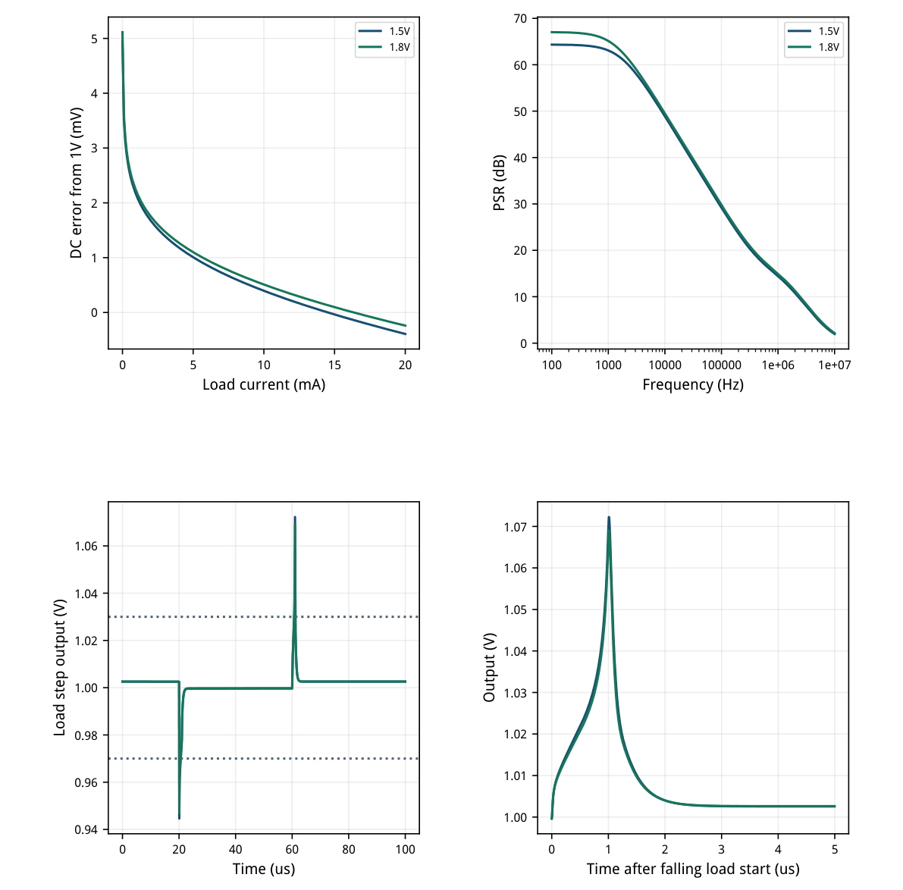
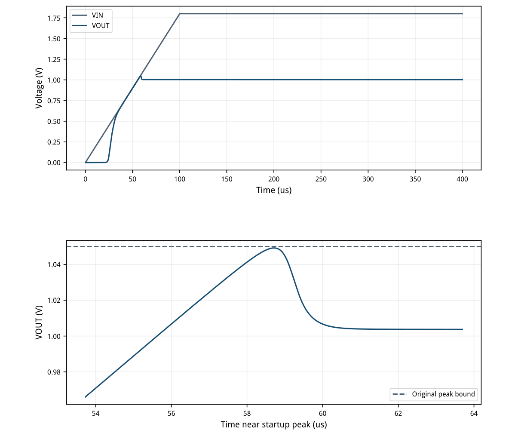
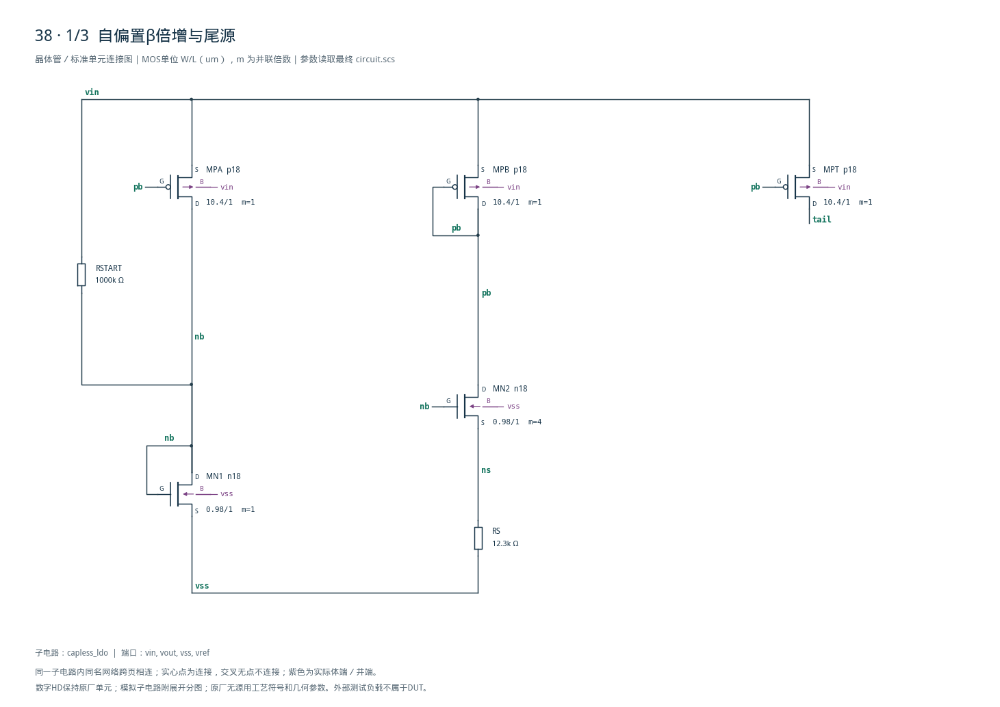
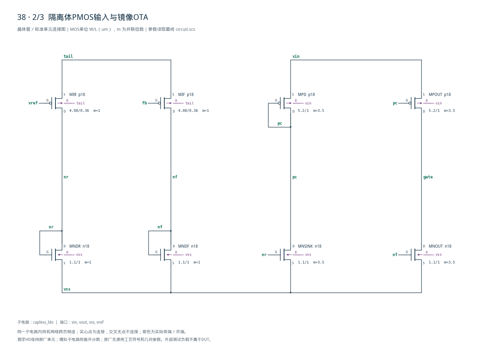
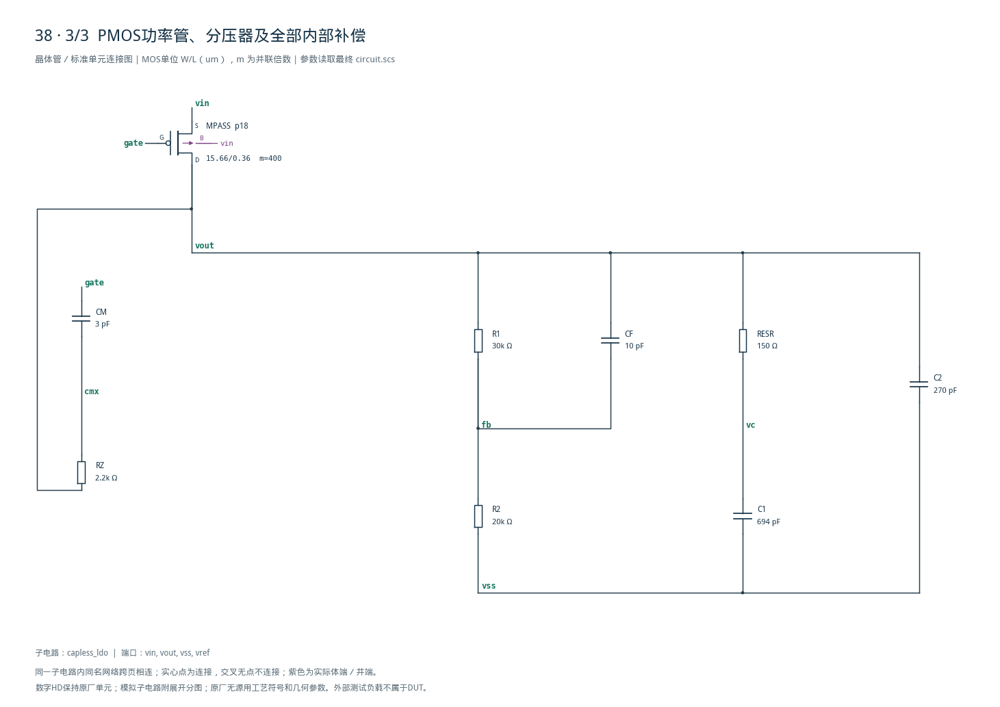

# 38 · 无外部电容LDO审查

[审查 PDF](review.pdf) · [实测结果](latest_results.json) · [验收合同](contract.json) · [最终网表](circuit.scs)

## 验收结果

本模块通过PMOS功率管将输入电源稳压至1.0V，反馈分压器把输出与0.4V参考比较。自偏置误差放大器和内部Miller、前馈及输出电容承担环路补偿，无需外部输出电容；代价是接近1nF的内部理想电容预算、静态电流与瞬态恢复需要共同权衡。芯片中可用作片上局部稳压电源，本次验证TT下两档供电的负载调节、供电抑制及动态响应。

结论：TT27°C两档供电的全部原指标通过，无需性能放宽。

1.5V与1.8V供电；完整0–20mA DC，20mA PSR，0.5→20→0.5mA双向动态。TT1.8V另做100us斜坡启动。所有输出电容在DUT内部，合计977pF，原1nF预算不放宽。

| 指标 | 1.5V | 1.8V | 原 | 10% | 15% | 单位 |
| --- | --- | --- | --- | --- | --- | --- |
| DC误差 | 4.9449 | 5.11485 | ≤30 | ≤33 | ≤34.5 | mV |
| 空载IQ | 88.2144 | 93.8682 | ≤100 | ≤110 | ≤115 | uA |
| PSR 1kHz | 63.0835 | 65.1294 | ≥30/35 | ≥29.08/34.08 | ≥28.59/33.59 | dB |
| PSR 100kHz | 29.1829 | 29.7473 | ≥20 | ≥19.08 | ≥18.59 | dB |
| PSR 1MHz | 14.4428 | 14.9545 | ≥10 | ≥9.085 | ≥8.588 | dB |
| 阶跃最坏偏差 | 72.3005 | 69.103 | ≤150 | ≤165 | ≤172.5 | mV |
| 阶跃尾窗偏差 | 2.55629 | 2.62677 | ≤30 | ≤33 | ≤34.5 | mV |

启动峰值1.049246774V：原上限1.05V；按相对1V的过冲量放宽时10%/15%上限为1.055/1.0575V。200–400us最坏误差2.625166mV，原20mV，放宽22/23mV。本版原值全部通过。

仅TT27°C，保留两档供电这一功能维度；另外28个DC/阶跃点、8个PSR点及3个启动角落未执行。原题的理想内部电容不含实际密度、容差、压变和寄生，不能据此宣称真实面积或版图性能。

<!-- SYSTEM-BLOCK-DIAGRAM -->
## 系统框图

反馈、补偿和功率管构成同一稳压环路；参考与负载按本题合同保留。

实线表示信号或能量通路，虚线表示时钟、控制或偏置。DUT框外为外部端口或测试夹具；精确端子连接见后附基本电路图。



[独立Mermaid源文件](system_block_diagram.mmd) · [框图SVG](markdown_assets/system-block.svg)
<!-- END-SYSTEM-BLOCK-DIAGRAM -->

## gm/ID初算与最终实测偏置

自偏置电阻调整后，实际电流密度与最初5uA查表点不同。

| 角色 | 单位W/L um | 初算gm/ID | 初算ID uA |
| --- | --- | --- | --- |
| nbias | 0.98/1 | 10 | 5 |
| pbias | 10.4/1 | 14 | 5 |
| input | 4.08/0.36 | 18 | 2.5 |
| nmirror | 1.1/1 | 14 | 2.5 |
| pmirror | 5.2/1 | 14 | 2.5 |
| pass_unit | 15.66/0.36 | 10 | 50 |

| 器件/1.8V20mA | ID/uA | 实际gm/ID | VGS/V | VDS/V | 电压余量/V |
| --- | --- | --- | --- | --- | --- |
| MPA | -11.0896 | 10.019 | -0.5992 | -1.1020 | 0.9284 |
| MPB | -10.9075 | 10.043 | -0.5992 | -0.5992 | 0.4256 |
| MN1 | 12.1916 | 6.1098 | 0.6980 | 0.6980 | 0.4374 |
| MN2 | 10.9074 | 12.743 | 0.5639 | 1.0666 | 0.9311 |
| MPT | -10.9999 | 10.033 | -0.5992 | -0.8465 | 0.6729 |
| MIR | -5.49627 | 14.233 | -0.5535 | -0.3721 | 0.2487 |
| MIF | -5.50367 | 14.227 | -0.5536 | -0.3720 | 0.2485 |
| MNDR | 5.49627 | 9.8312 | 0.5814 | 0.5814 | 0.4080 |
| MNDF | 5.50367 | 9.825 | 0.5815 | 0.5815 | 0.4081 |
| MNOUT | 19.7314 | 9.7822 | 0.5815 | 1.1786 | 1.0052 |
| MNSINK | 19.7178 | 9.7867 | 0.5814 | 1.1976 | 1.0243 |
| MPD | -19.7179 | 9.8792 | -0.6024 | -0.6024 | 0.4264 |
| MPOUT | -19.7314 | 9.8787 | -0.6024 | -0.6214 | 0.4454 |
| MPASS | -20020 | 10.127 | -0.6214 | -0.8002 | 0.6252 |

实际尾电流10.9999uA、镜输出约19.7uA，较初算5uA尾电流增大；输入gm/ID约14.23，未将初算18写成最终工作点。功率管15.66/0.36um×400，总宽6264um，实测gm/ID10.1267。

输入PMOS体端接tail，需要隔离井实现；其他PMOS体端接vin，NMOS接VSS。固定1.8V模型用于给定供电范围，本次未生成版图。

## 完整负载扫描、供电抑制与动态

无外部电容；所有动态窗口对固定1.0V目标评分。

0.5mA→20mA在20–21us完成，20mA→0.5mA在60–61us完成。暂态窗20–41us/60–81us允许±150mV；尾窗41–60us/81–100us要求±30mV。最坏暂态72.301mV、尾窗2.627mV。

最终DC每0.1mA一点共201点，包含原0.2mA网格；PSR100Hz–10MHz每十倍频160点，包含原20点/dec网格。



[查看矢量图](markdown_assets/figure-03-01.svg)

## 从零电源启动与有限过冲余量

供电100us斜坡，负载2kΩ，不用关断时仍吸电流的理想电流负载。

全0–400us最大VOUT=1.049246774V，距1.05V原门槛仅0.753226mV。200–400us范围1.002625166–1.002625166V；没有改用最终值作为1V误差中心。

startup原最大步长400ns；本次基线200ns，最终100ns且收紧reltol，峰值只变1.056uV。该余量仅对已验证TT条件成立，未宣称其他三个启动角落也通过。VREF按原台始终0.4V。



[查看矢量图](markdown_assets/figure-04-01.svg)

## 迭代与数值确认

保留失败候选；总电容始终在1nF预算内。

| 候选 | Rs/kΩ | Cf/C2/C1 pF | 1.5V PSR1M | 启动峰值/V | 等级 |
| --- | --- | --- | --- | --- | --- |
| 1 | 20 | 4/120/850 | 8.179 | 1.066897 | needs_iteration |
| 2 | 15 | 4/270/700 | 10.105 | 1.056419 | 15pct |
| 3 | 15 | 10/270/694 | 12.853 | 1.054625 | 10pct |
| 4 | 13 | 10/270/694 | 13.992 | 1.050607 | 10pct |
| 5 | 12.3 | 10/270/694 | 14.443 | 1.049246 | original |

提高直接输出电容占比并增加Cf前馈，改善高频PSR和负载扰动；Rs从20kΩ降至12.3kΩ，提高真实偏置与控制速度，降低启动过冲。代价是空载IQ从57.37uA升至93.87uA，原100uA余量约6.13uA。

| 比较（SI/dB） | 最大绝对差 | 预先上限 |
| --- | --- | --- |
| DC输出误差 | 0 | 0.0002 |
| 空载电流 | 0 | 1e-08 |
| PSR任一点 | 0.000491218 | 0.01 |
| 暂态各窗口电压 | 8.83307e-06 | 0.0002 |
| 启动峰值 | 1.05625e-06 | 0.0002 |

38项数值对照通过：步长20→10ns、启动200→100ns，reltol1e-6→1e-7；DC步进0.2→0.1mA，AC40→160点/dec。最大受检电压差8.834uV&lt;200uV；PSR差0.000492dB&lt;0.01dB。

40项独立测量核对与原8组检查函数通过，明确投影至TT27两供电及一启动。14个基线/最终运行0错误/0警告；静态预算独立累加4个电容得977pF。

## 最终精确电路

原生n18/p18与正值理想R/C；无内部源、模型、理想开关或外部CLOAD。

内部电容：Miller CM3pF、前馈CF10pF、阻尼支路C1=694pF/RESR150Ω、直接输出C2=270pF，总977pF。30k/20k分压比固定0.4，VREF仍是原0.4V，没有通过调整目标掩盖误差。

电路SHA-256：44f175530b8c48e901aa078ddc595bec1cefd3f2487f5ea63e9d71566ec7d2d5

## 测量语义、复现入口与未覆盖项

24实例76端子，附后三页展开全部电路；环境和原资料不修改。

IQ为无外部负载时|I(VIN)|，包括内部20uA左右的分压电流。原题明确不计理想VREF供电；本实现VREF只连接输入MOS栅极，DC测得0A。动态输出没有外部电容，补偿和输出储能均在内部预算内。

原任务以外部输出窗口评分，不给拓扑独立的环路断点，因此PM/UGB不是验收项。本次用完整双向负载阶跃与真实启动检验规定动态；没有给未测的内部环路裕量编造数值。理想R/C的容差、密度与版图耦合仍未模拟。

复现（工程根目录，既有Bridge Python）： python scripts/case38\_capless\_ldo.py python scripts/confirm38.py python scripts/schematic38.py python scripts/audit38.py python scripts/review38.py 重新生成报告和图纸后须再次实际逐页查看。

source/及source\_provenance.json冻结原合同、网表及检查器。iteration\_history.json保留五个候选；numerical\_plan/baseline/confirmation记录固定数值容限；verification\_audit.json和independent\_measurement\_details.json给出独立窗口、原函数与电容预算。

原30点DC/阶跃中其余28点、10点PSR中其余8点、4点启动中其余3点未执行。失配、噪声、版图、PEX与实际电容面积/工艺容差未验证。

## 完整网表与电路图

[Spectre 网表](circuit.scs) · [全部分图 PDF](schematic/sheets.pdf) · [电路总图](schematic/full.svg) · [端子连接](schematic/connectivity.json)

<details>
<summary>展开完整 Spectre 网表</summary>

```spectre
simulator lang=spectre
subckt capless_ldo (vin vout vss vref)
RSTART (vin nb) resistor r=1Meg
MPA (nb pb vin vin) p18 w=10.4u l=1u
MPB (pb pb vin vin) p18 w=10.4u l=1u
MN1 (nb nb vss vss) n18 w=0.98u l=1u
MN2 (pb nb ns vss) n18 w=0.98u l=1u m=4
RS (ns vss) resistor r=12300
MPT (tail pb vin vin) p18 w=10.4u l=1u
MIR (nr vref tail tail) p18 w=4.08u l=.36u
MIF (nf fb tail tail) p18 w=4.08u l=.36u
MNDR (nr nr vss vss) n18 w=1.1u l=1u
MNDF (nf nf vss vss) n18 w=1.1u l=1u
MNOUT (gate nf vss vss) n18 w=1.1u l=1u m=3.5
MNSINK (pc nr vss vss) n18 w=1.1u l=1u m=3.5
MPD (pc pc vin vin) p18 w=5.2u l=1u m=3.5
MPOUT (gate pc vin vin) p18 w=5.2u l=1u m=3.5
MPASS (vout gate vin vin) p18 w=15.66u l=.36u m=400
CM (gate cmx) capacitor c=3p
RZ (cmx vout) resistor r=2200
R1 (vout fb) resistor r=30k
CF (vout fb) capacitor c=10p
R2 (fb vss) resistor r=20k
RESR (vout vc) resistor r=150
C1 (vc vss) capacitor c=694p
C2 (vout vss) capacitor c=270p
ends capless_ldo
```

</details>







## 报告来源

正文与表格整理自已交付的矢量 PDF，图表单独提取；本文件是后续整理的 Markdown，不是原 PDF 的编译输入。原 PDF、网表及测量数据保持原值。
