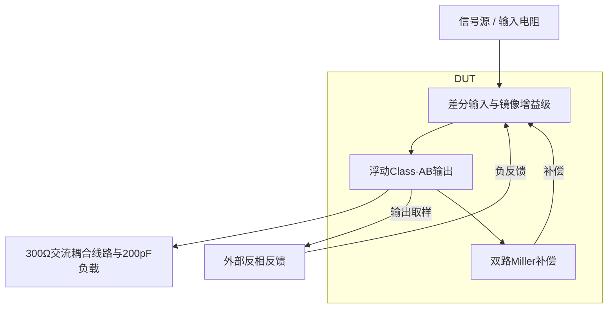
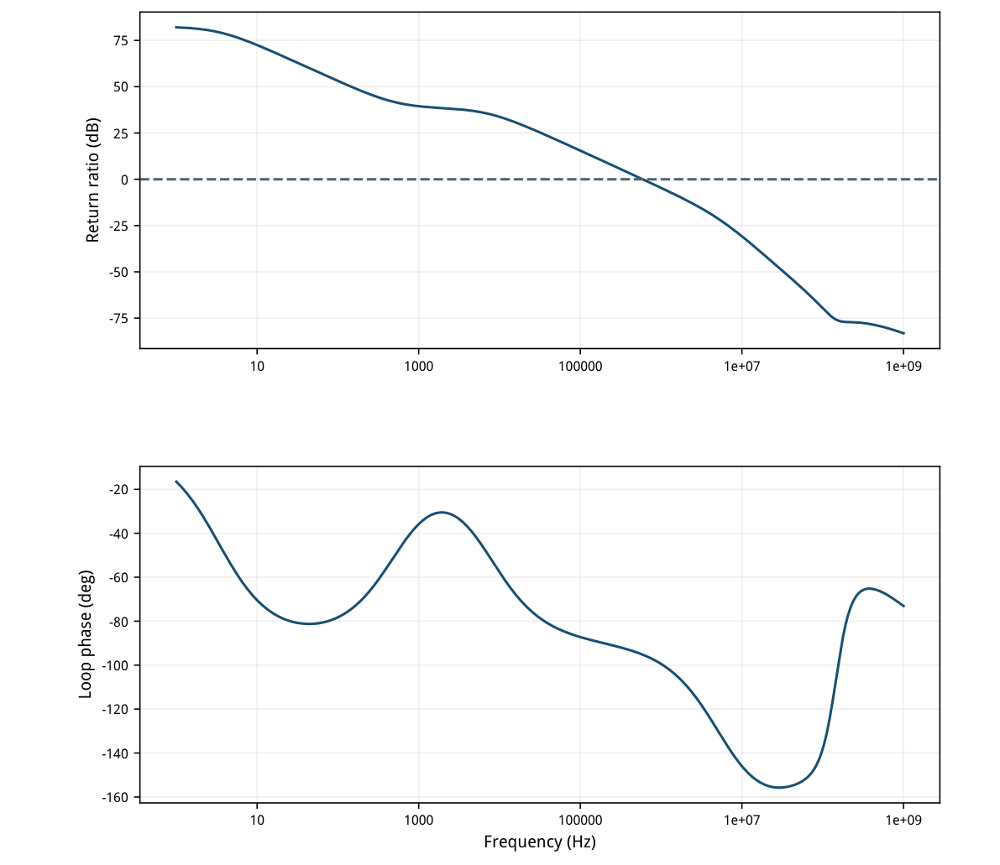
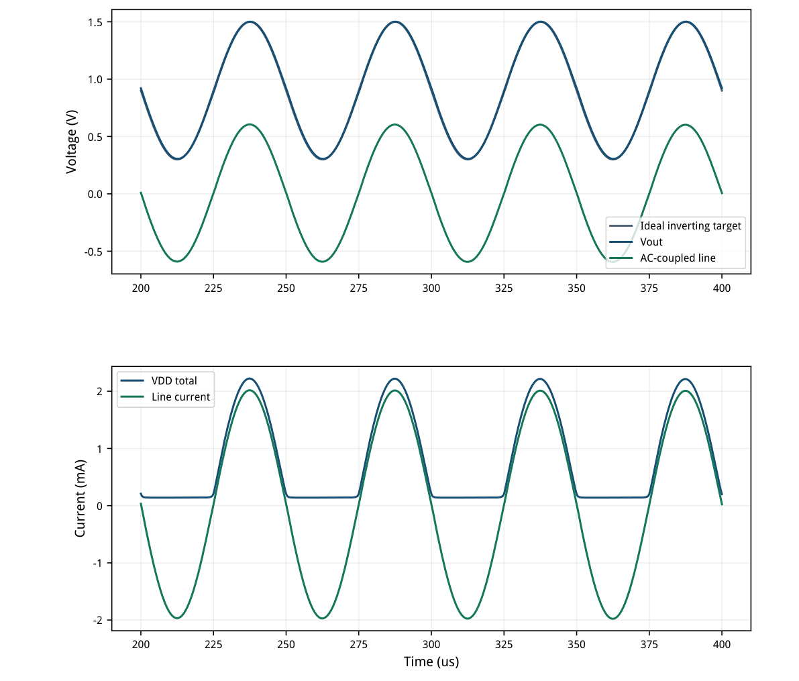
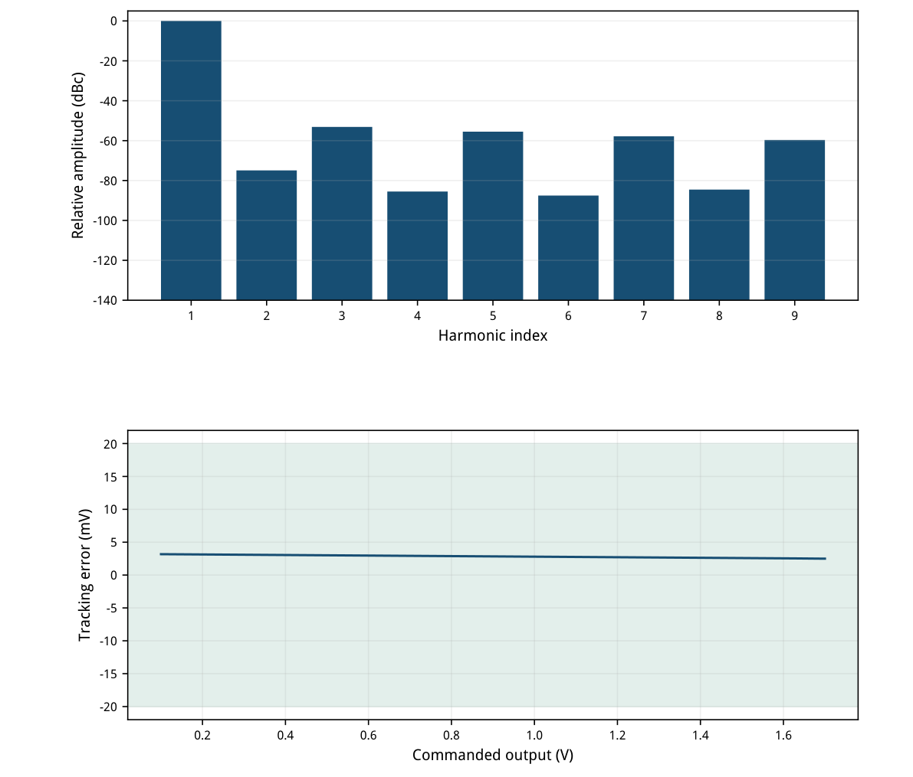
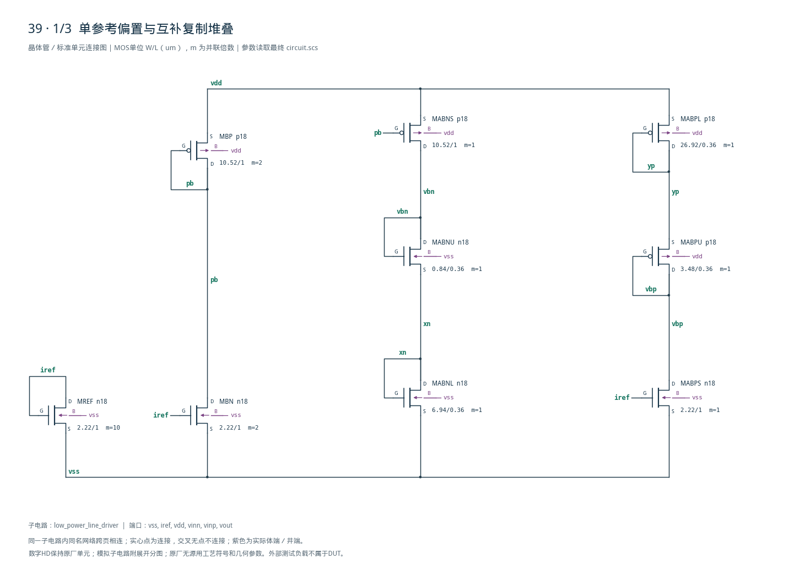
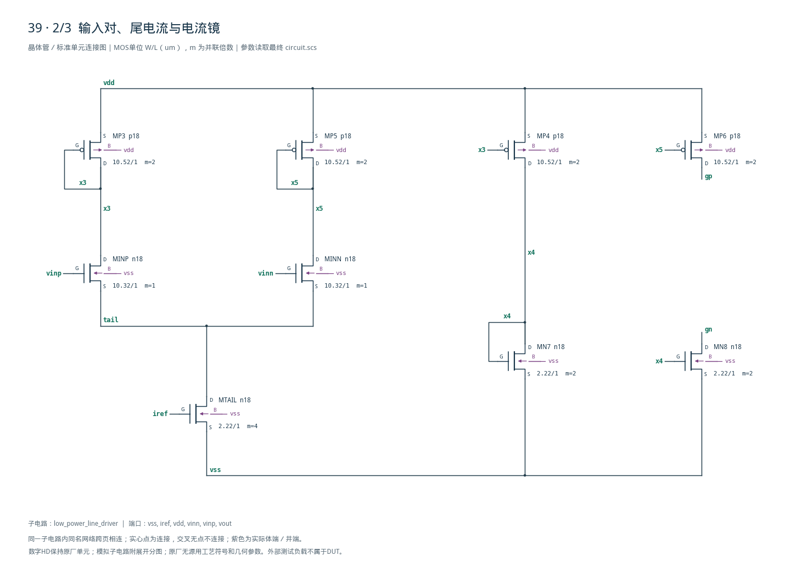
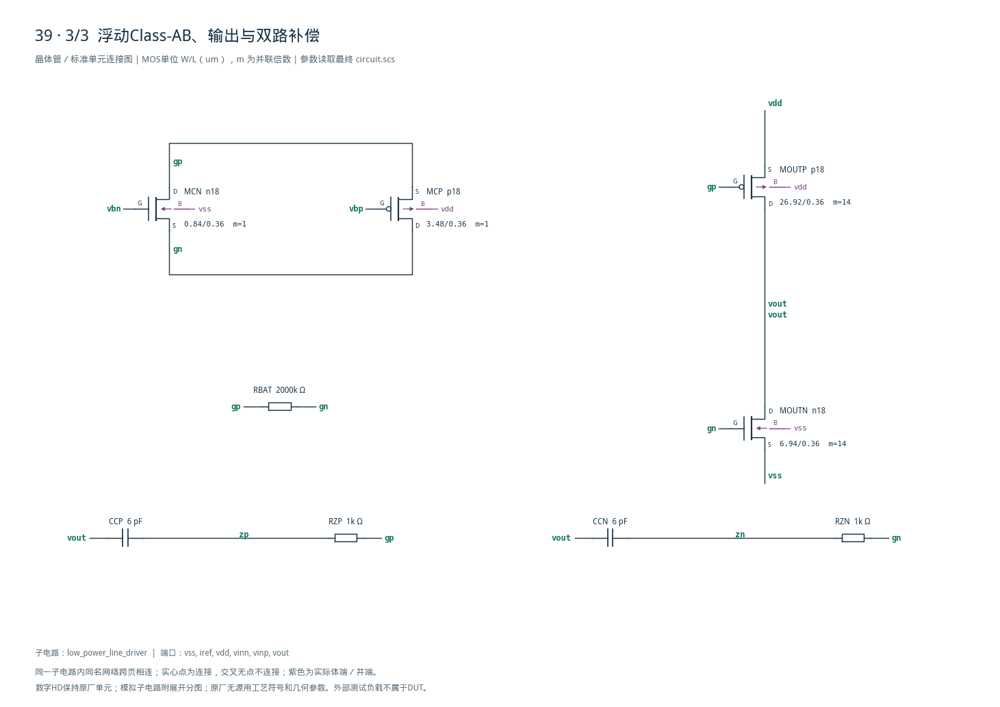

# 39 · 低功耗Class-AB线驱动

[审查 PDF](review.pdf) · [实测结果](latest_results.json) · [验收合同](contract.json) · [最终网表](circuit.scs)

## 验收结果

本模块用反相闭环把电压信号送到300Ω交流耦合线路，并驱动200pF输出电容。输入差分对和电流镜提供增益，浮动Class-AB偏置让互补输出管以较低静态电流提供毫安级动态电流；双路Miller补偿控制重负载下的稳定性。代价是复制偏置、输出级非线性及带宽需要共同权衡。芯片中可用于音频或低频通信线驱动，以及需要低待机功耗的模拟输出接口。

结论：TT标称10项原门槛全部通过，无需放宽。

TT / 1.8V / 27°C，IREF=50uA，反相闭环增益-1。两只10kΩ反馈电阻、0.9V参考、1uF耦合电容、300Ω线路和200pF输出电容全部保留。

| 指标 | 实测 | 原要求 | 单位 | 状态 |
| --- | --- | --- | --- | --- |
| 10Hz环路增益 | 72.5127 | ≥40 | dB | 通过 |
| 环路UGB | 0.592917 | ≥0.5 | MHz | 通过 |
| 相位裕量 | 84.77 | ≥60 | ° | 通过 |
| 静态输出偏差 | 2.82133 | ≤20 | mV | 通过 |
| 静态VDD功耗 | 355.814 | ≤400 | uW | 通过 |
| 20kHz输出基波 | 0.598105 | ≥0.55 | Vpk | 通过 |
| 2–9次谐波THD | 0.323123 | ≤3 | % | 通过 |
| 正弦峰值VDD电流 | 2.22355 | ≥2 | mA | 通过 |
| 峰值/静态电流 | 11.2485 | ≥10 | 倍 | 通过 |
| 连续跟踪命令范围 | 1.6 | ≥1.5 | Vpp | 通过 |

报告包含原负载下的环路、静态偏差、完整功耗、四周期谐波、峰值驱动与连续跟踪范围。静态功耗包含50uA参考和所有内部偏置，不只计算输出对管。

仅完成确定性匹配nominal。原45点PVT矩阵的另外44点、失配、版图、PEX和无源容差未执行；本结论不等同于原全矩阵签核。

<!-- SYSTEM-BLOCK-DIAGRAM -->
## 系统框图

框图显示反相闭环、功率输出和外部线路边界；不引入未实现的收发协议。

实线表示信号或能量通路，虚线表示时钟、控制或偏置。DUT框外为外部端口或测试夹具；精确端子连接见后附基本电路图。



[独立Mermaid源文件](system_block_diagram.mmd) · [框图SVG](markdown_assets/system-block.svg)
<!-- END-SYSTEM-BLOCK-DIAGRAM -->

## gm/ID尺寸与浮动偏置结构

22只MOS均由目标工艺LUT初算；理想正值R/C符合原题器件规则。

| 角色 | 模型 | 单位W/L um | gm/ID | 单位目标/uA |
| --- | --- | --- | --- | --- |
| nbias | n18 | 2.22/1 | 14 | 5 |
| pbias | p18 | 10.52/1 | 14 | 5 |
| input | n18 | 10.32/1 | 18 | 10 |
| nab | n18 | 0.84/0.36 | 14 | 5 |
| pab | p18 | 3.48/0.36 | 14 | 5 |
| nout | n18 | 6.94/0.36 | 22 | 5 |
| pout | p18 | 26.92/0.36 | 22 | 5 |

初算目标：输入尾电流20uA、每侧输入10uA；浮动NMOS/PMOS各约5uA，两个复制偏置堆叠各5uA；输出对管各70uA。输出单位6.94um/26.92um均并联14倍，总宽97.16um/376.88um，沟道长0.36um。

每个AB复制堆叠的上管与对应浮动控制管匹配电流密度，下管与输出管匹配几何及目标电流密度。全部NMOS体端接vss、PMOS体端接vdd，复制上管实际存在体效应；没有用零体偏置LUT代替实际OP。

输入NMOS对通过PMOS及NMOS电流镜驱动gp/gn，浮动互补控制让输出栅压随负载需求移动；正弦峰值电流远大于静态电流。DUT无独立源、受控源、行为器件或数字HD单元。

最终每路串联Miller补偿为6pF/1kΩ，gp与gn之间保留2MΩ电阻。全部27个实例见后三页图纸。

## 实际工作点与电流预算

实际输出静态电流约87uA，初始70uA目标不能直接当作测量。

| 器件 | \|ID\|/uA | gm/ID | VGS/V | VDS/V | 余量/V |
| --- | --- | --- | --- | --- | --- |
| MREF | 50.0000 | 13.8857 | 0.51603 | 0.51603 | 0.39300 |
| MTAIL | 19.7496 | 13.8855 | 0.51603 | 0.34583 | 0.22280 |
| MBN | 10.3616 | 13.7809 | 0.51603 | 1.26457 | 1.14153 |
| MABNS | 5.2185 | 13.8221 | -0.53543 | -0.72314 | 0.59735 |
| MABNU | 5.2185 | 13.6652 | 0.64748 | 0.64748 | 0.52640 |
| MABNL | 5.2185 | 21.8846 | 0.42938 | 0.42938 | 0.36941 |
| MABPS | 5.0441 | 13.8694 | 0.51603 | 0.67247 | 0.54943 |
| MABPU | 5.0441 | 13.8091 | -0.68285 | -0.68285 | 0.55094 |
| MABPL | 5.0441 | 21.9924 | -0.44469 | -0.44469 | 0.38085 |
| MINP | 9.7483 | 18.2925 | 0.55417 | 0.92309 | 0.83403 |
| MINN | 10.0013 | 18.1815 | 0.55558 | 0.92127 | 0.83142 |
| MCN | 5.0038 | 13.9425 | 0.64300 | 0.91402 | 0.79592 |
| MCP | 4.5065 | 14.4273 | -0.67542 | -0.91402 | 0.78869 |
| MOUTN | 87.1702 | 21.4471 | 0.43387 | 0.90282 | 0.84114 |
| MOUTP | 87.3113 | 21.4751 | -0.45211 | -0.89718 | 0.83048 |

总静态电流197.674216uA，功耗355.813589uW。静态输出0.902821331V，与0.9V相差2.821331mV；真实输出误差和镜电压差全部保留。

全部静态|VDS|-|VDSAT|为正。部分高gm/ID器件的模型region=3为弱反型区，不把该枚举当作截止或失效；报告同时给出实际电流和端压，动态切换仍由瞬态验证。

所有供电、参考和返回连接见测试台；没有从功耗中扣掉外部50uA参考。

## 原始断环方法与带宽调整

保留串联AC=1V测试源；T=-V(vout)/V(fbv)，不是简单开环增益。

10Hz环路增益72.512717dB，第一次下降交越0.592917MHz、PM=84.769971°；频扫1Hz–1GHz、每十倍频60点，之后没有回穿零dB。

初版每侧12pF补偿使UGB仅0.305379MHz，低于原0.5MHz及15%边界0.425MHz。减至6pF后达到0.592917MHz，PM从88.133°降为84.770°；电流和输出尺寸保持不变。



[查看矢量图](markdown_assets/figure-04-01.svg)

## 300Ω线路大信号与真实供电电流

20kHz、0.6V峰值输入，共8周期；舍前4周期，评分后4周期。

输出基波0.598105050Vpk，峰值VDD电流2.223546306mA，峰值/静态比11.248540。峰值取200–400us全部真实自适应样点，未用谐波均匀网格代替电流峰值。

1uF耦合电容使线路直流隔离；200pF仍直接接在放大器输出。线路初始偏置和充电过程不擅自去除，严格保留原200–400us窗口；本项峰值不是未计入偏置的输出支路峰值。



[查看矢量图](markdown_assets/figure-05-01.svg)

## 2–9次THD与连续跟踪范围

两个测试各保留原定义：正弦动态线性度与DC连续命令范围分别评分。

THD=0.323122988%，按原算法取后4周期2048个均匀点，末端不重复，用2–9次谐波平方和开根除以基波。独立调用原harmonic\_fit，并用DC+1–9次最小二乘交叉核对。

输入从0.1扫至1.7V、步长2mV，共801点；命令=1.8-输入。全部点在固定20mV误差内，连续命令跨度1.6V，最大误差3.182339mV。DC时耦合电容开路，此范围不冒充带300Ω直流负载的1.6Vpp。



[查看矢量图](markdown_assets/figure-06-01.svg)

## 收敛失败、等效接地与精度复核

实际SPECTRE-16927保留为失败；没有用Bridge的license分类掩盖错误。

初次50ns/1e-7复算在2.5609us因minstep非收敛中止，日志指出零伏VSS源电流解异常。将其两端同为零电位的节点直接合并到地，消除冗余支路未知量；DUT、所有激励、负载和积分窗口不变，三组台重新运行。

合并前后的基线基波仅差约2nV、THD差约0.0000038个百分点；此次修正保持电气等效，不以增加虚构电容、改变负载或放宽器件模型来换取收敛。失败日志和修正前基线分别归档。

| 复核量/SI | 100ns/1e-6 | 50ns/1e-7 | 绝对差 | 预设上限 |
| --- | --- | --- | --- | --- |
| thd_pct | 0.323079754 | 0.323122988 | 4.32339e-05 | 0.005 |
| fundamental_v | 0.598099206 | 0.59810505 | 5.84398e-06 | 0.0001 |
| peak_supply_current_a | 0.00222351997 | 0.00222354631 | 2.63401e-08 | 1e-06 |

数值界限保持不变：THD差≤0.005个百分点、基波差≤0.1mV、峰值电流差≤1uA，且验收等级不变；全部通过。最终瞬态采用50ns最大步长，gear2only，保留自适应数据。

最终三组与有效基线均正常完成，0错误、0警告；原模型/LUT哈希未变。14项独立测量核对及原8组检查以expected=1调用，不伪造45点PVT集合。

27个实例、98个端子逐一连接核对；完整晶体管图附后，体端和所有无源值均明确。

## 可重复证据与适用范围

完整报告、图纸、结果和源快照使用同一最终电路。

复现（工程根目录，既有Bridge Python）： python scripts/case39\_line\_driver.py python scripts/confirm39.py python scripts/schematic39.py python scripts/audit39.py python scripts/review39.py 每次重新生成PDF，都需重新查看全部页面和完整总图后再交付。

latest\_results.json：10项门槛、14个主测量量及全部22只MOS的OP。 numerical\_confirmation.json：原/收紧步长及固定精度比较。 verification\_audit.json：原验收器、独立算法、模型/输入/源文件哈希。 iteration\_history.json：12pF带宽失败与实际瞬态收敛失败。 schematic/：三页完整晶体管图、总图与连接映射。 implementation/：生成、测量与审计脚本快照。

本模块的Class-AB动态电流能力在20kHz、0.6Vpk、300Ω交流耦合线路和200pF负载下成立。不同线路阻抗、电容、频率、温度或供电需要重新验证；本题理想R/C的物理面积、容差和寄生没有建模。

未执行原45点矩阵中的另外44点、失配、布局、PEX、长期应力或完整输出短路保护验证。静态小误差及高相位裕量不能替代这些未执行项。

DUT SHA-256：45eb5290815c778d817a7b9e108994121159fdb0e952d17e8984bdd00b1af2af

原Sky130档案和既有PDK、Bridge、Spectre、LUT环境保持原样。

## 完整网表与电路图

[Spectre 网表](circuit.scs) · [全部分图 PDF](schematic/sheets.pdf) · [电路总图](schematic/full.svg) · [端子连接](schematic/connectivity.json)

<details>
<summary>展开完整 Spectre 网表</summary>

```spectre
simulator lang=spectre
subckt low_power_line_driver (vss iref vdd vinn vinp vout)
MREF (iref iref vss vss) n18 w=2.22u l=1u m=10
MTAIL (tail iref vss vss) n18 w=2.22u l=1u m=4
MBN (pb iref vss vss) n18 w=2.22u l=1u m=2
MBP (pb pb vdd vdd) p18 w=10.52u l=1u m=2
MABNS (vbn pb vdd vdd) p18 w=10.52u l=1u m=1
MABNU (vbn vbn xn vss) n18 w=0.84u l=0.36u m=1
MABNL (xn xn vss vss) n18 w=6.94u l=0.36u m=1
MABPS (vbp iref vss vss) n18 w=2.22u l=1u m=1
MABPU (vbp vbp yp vdd) p18 w=3.48u l=0.36u m=1
MABPL (yp yp vdd vdd) p18 w=26.92u l=0.36u m=1
MINP (x3 vinp tail vss) n18 w=10.32u l=1u m=1
MINN (x5 vinn tail vss) n18 w=10.32u l=1u m=1
MP3 (x3 x3 vdd vdd) p18 w=10.52u l=1u m=2
MP4 (x4 x3 vdd vdd) p18 w=10.52u l=1u m=2
MP5 (x5 x5 vdd vdd) p18 w=10.52u l=1u m=2
MP6 (gp x5 vdd vdd) p18 w=10.52u l=1u m=2
MN7 (x4 x4 vss vss) n18 w=2.22u l=1u m=2
MN8 (gn x4 vss vss) n18 w=2.22u l=1u m=2
MCN (gp vbn gn vss) n18 w=0.84u l=0.36u m=1
MCP (gn vbp gp vdd) p18 w=3.48u l=0.36u m=1
MOUTP (vout gp vdd vdd) p18 w=26.92u l=0.36u m=14
MOUTN (vout gn vss vss) n18 w=6.94u l=0.36u m=14
RBAT (gp gn) resistor r=2M
CCP (vout zp) capacitor c=6p
RZP (zp gp) resistor r=1000
CCN (vout zn) capacitor c=6p
RZN (zn gn) resistor r=1000
ends low_power_line_driver
```

</details>







## 报告来源

正文与表格整理自已交付的矢量 PDF，图表单独提取；本文件是后续整理的 Markdown，不是原 PDF 的编译输入。原 PDF、网表及测量数据保持原值。
