# 40-delta-sigma 审查报告

PDF由Python/Matplotlib排版生成。此Markdown从同一报告文本、表格和网表保存，便于编辑；它不是PDF编译输入。完整生成脚本随implementation目录保存。

<!-- SYSTEM-BLOCK-DIAGRAM -->
## 系统框图

OTA与比较器按原题归为明确迁移的外部晶体管夹具；本次只实现模拟调制器，没有数字抽取滤波器。

实线表示信号或能量通路，虚线表示时钟、控制或偏置。DUT框外为外部端口或测试夹具；精确端子连接见后附基本电路图。

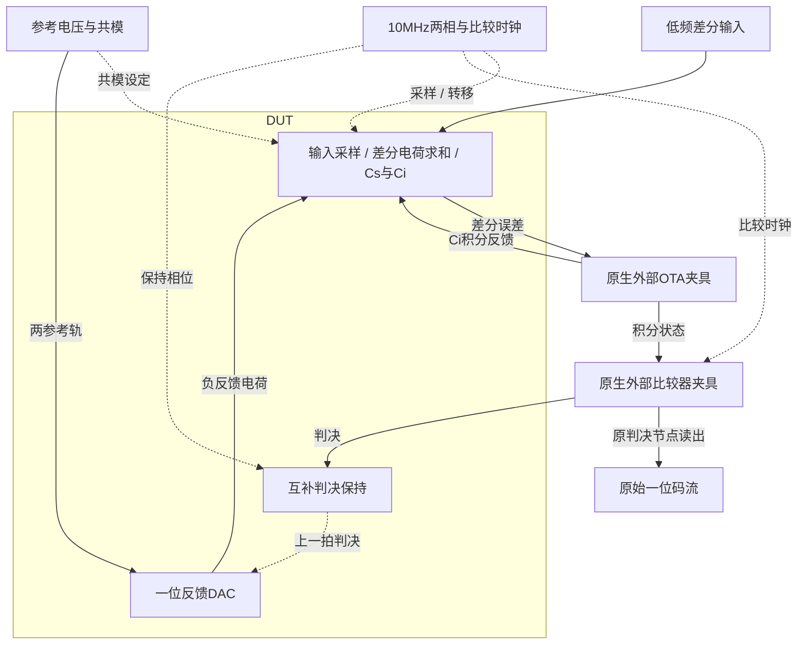

[独立Mermaid源文件](system_block_diagram.mmd) · [框图SVG](markdown_assets/system-block.svg)
<!-- END-SYSTEM-BLOCK-DIAGRAM -->

## 40 | 一阶开关电容ΔΣ调制器

本模块通过开关电容积分器与一位反馈DAC，把低频差分输入编码为高采样率的一位码流。闭环积分将量化误差向高频整形，配合过采样可改善带内信噪失真比；代价是带宽、时钟、积分器建立和后续数字滤波。芯片中可用于低带宽传感器与音频采集，本次验证模拟调制器而未实现数字抽取滤波器。

结论：TT / 1.8V / 27°C，三组原始标称电气指标通过。

采样10MHz，512点记录，OSR32带内带宽156.25kHz。原两档输入幅度、直流偏置和反极性刺激均保留，积分器和比较器以原生晶体管夹具实现。

| 记录 | SNDR32/dB | 原算术功耗/mW | 时间加权功耗/mW |
| --- | --- | --- | --- |
| 主记录 | 44.100513 | 1.758857 | 1.599324 |
| 较小幅度正极性 | 41.745869 | 1.759664 | 1.598005 |
| 较小幅度反极性 | 43.963071 | 1.759573 | 1.599190 |

三组SNDR均≥40dB，两种功耗口径均≤2mW。原功耗使用非均匀自适应点电流的算术均值，并非能量平均值；报告额外列出真正时间加权的VDD功耗，避免两者混用。

三组增益1.162507/1.162832/1.163014，DC跟踪误差均0.00859375；正反极性幅度比1.00015696，相位偏差0.00637591°。积分状态峰值0.523273V<2V。

本次为确定性原理图标称复现。未执行噪声、失配、PVT、PEX或数字抽取滤波器验证。

## gm/ID初算与夹具边界

DUT为sigma_adc；ds_ota和ds_comparator是明确分离的原生外部夹具。

| 角色 | 模型 | 初算总W/L um | gm/ID | 初算Id/uA |
| --- | --- | --- | --- | --- |
| switch | n18 | 9.02/0.18 | 14.0 | 100 |
| hold_n | n18 | 2.04/0.18 | 8.0 | 75 |
| hold_p | p18 | 6.02/0.18 | 8.0 | 75 |
| ota_ref | n18 | 9.88/1 | 10.0 | 50 |
| ota_input | n18 | 121.88/1 | 14.0 | 275 |
| ota_load | p18 | 261.42/1 | 10.0 | 275 |
| cm_input | n18 | 2.08/0.36 | 14.0 | 12.5 |
| cm_load | p18 | 11.88/1 | 10.0 | 12.5 |
| cmp_input | n18 | 9.02/0.18 | 14.0 | 100 |
| cmp_tail | n18 | 8.14/0.18 | 8.0 | 300 |
| cmp_p | p18 | 6.12/0.18 | 10.0 | 50 |
| switch_p | p18 | 4/0.18 | 8.0 | 50 |

Cs=200fF/侧，Ci=450fF/侧；两路比较判决先经互补保持门存入300fF，再控制一位DAC。DAC、输入采样和积分转移均使用原生互补开关，参考低轨0.5V、高轨1.3V。100GΩ泄放支路保留。

外部OTA和StrongARM的拓扑、50uA参考电流比例及负载保持，器件尺寸由目标工艺gm/ID明确迁移，随后在DUT调参中固定。原Sky130器件几何并未原样移植；此复现不声称两工艺夹具动态完全相同。

原生宽MOS分为相同并联指，图上标单位W/L及m；所有终端与井端从最终网表读取。

## 一位码流与带内外频谱

对数频率轴观察一阶噪声整形；20dB/dec虚线仅为斜率参照。

原始FFT各频点采用对数频率轴，谱线从-100dBc向上画；156.25kHz竖虚线标带宽。20dB/dec参照线使用任意竖直偏移，不是拟合结果；只作显示截底，评分未截断谱功率。

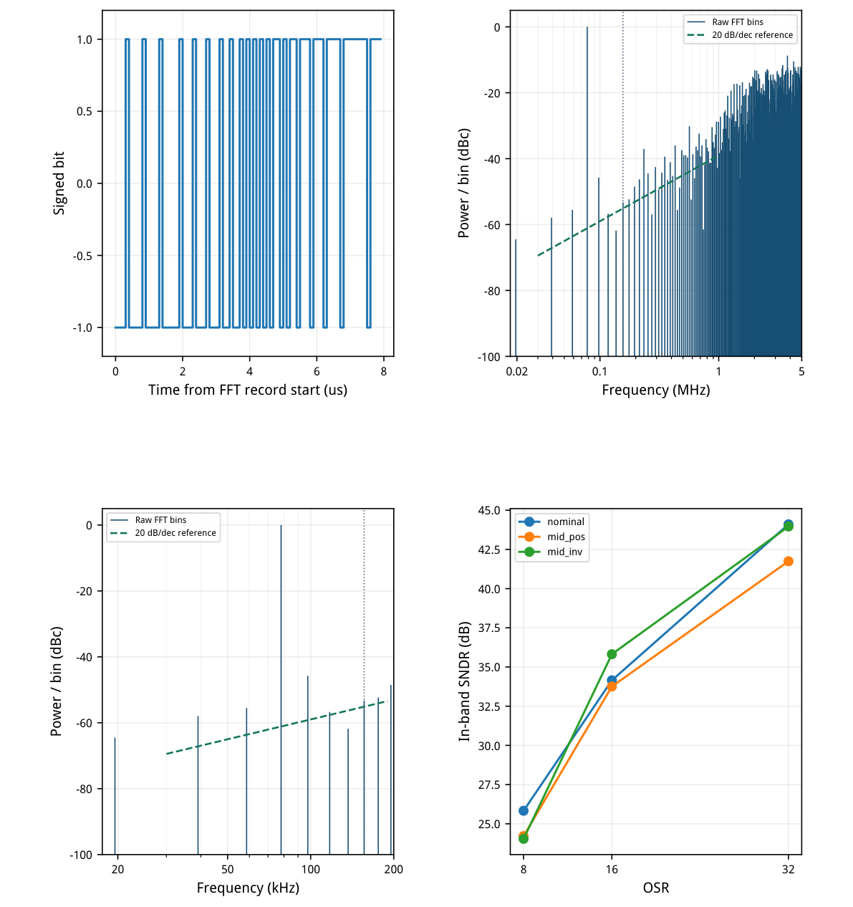

[查看矢量图](markdown_assets/figure-03-01.svg)

N=512，Δf=19.53125kHz。虚线为20dB/dec理论参照，未拟合实测斜率。
未作随机噪声仿真；SNDR32−SNDR16=9.9483dB≥6dB。

## 原刺激、采样边界与功率解释

保留三种功能维度；不把终止时间之后的外推点纳入FFT。

主记录每侧0.24V、bin4/45°、每侧DC±20mV；较小幅度0.22V、bin2/45°与225°，DC同步反号。共模0.9V，输出每侧1pF、输入偏置5MΩ；比较器固定±0.5mV差分偏置保留。

两相周期100ns、边沿5ns、脉宽34ns，第二相延后50ns；比较时钟首次延后100ns，各时钟均有50Ω源阻抗。全部58us从零状态skipdc启动，原数值cmin=1fF保留。

原提取器由首末导出时间生成采样点；Spectre恰好导出0和58us时，它可能额外生成58.02us并倒夹到终点。本次合同明确只取20ns至57.92us的580个实际记录内点，再取最后512点，即6.82–57.92us。这个边界修正已明示，不伪称原extract()逐行未改。

调用未修改的原analyze()，矩形窗去DC。OSR32取第1–8频点，去基波后全部剩余功率进分母；噪声整形比为第9–255点平均功率与带内非基波平均功率之比。未删除谐波或选取更有利的窗口。

VDD功耗包括OTA、比较器和从VDD取得的50uA参考，积分0–58us包含启动；理想外部时钟、输入和参考电压源能量不在原2mW上限内，因此不等于完整ADC系统功耗。

## 精度确认、独立审计与完整材料

预定误差界限、失败迭代及全部运行日志保留。

maxstep1→0.5ns，全局reltol1e-5→1e-6；conservative瞬态实际reltol1e-6→1e-7。48项差异检查全部通过，三组最终码流一致，SNDR完全不变。两种功耗差分别按预定75uW和10uW界限检查，未把自适应点算术均值当能量平均值。

独立复核重新提取实际时刻的互补判决，调用原analyze()并应用原main()中的9组不等式；42项交叉核对全部通过。基线和精算共6次Spectre实际0错误，模型、源文件、LUT与运行快照哈希一致。

保留的早期方案因DAC非线性或比较器复位耦合导致反极性SNDR不足。最终增加互补开关并把判决存储从50fF增至300fF；原刺激、积分时间、固定夹具与输出负载没有随结果调整。

完整图纸11页，69个定义实例、256个端子，包含所有外部原生模拟夹具。复现顺序：case40_delta_sigma.py → confirm40.py → schematic40.py → audit40.py → review40.py。PDF文本、表格和网表同时保留review_report.md，图纸附后。

电路SHA-256：
86767b3e18b29812fe33bfdfa9971c67dff4512ca22bafaa31356676d058bbf4

## 完整网表与电路图

[Spectre 网表](circuit.scs) · [全部分图 PDF](schematic/sheets.pdf) · [电路总图](schematic/full.svg) · [端子连接](schematic/connectivity.json)

<details>
<summary>展开完整 Spectre 网表</summary>

```spectre
simulator lang=spectre
subckt ds_ota (vss iref vdd vinn vinp vocm voutn voutp)
MREF (iref iref vss vss) n18 w=9.88u l=1u m=1
MTAIL (tail iref vss vss) n18 w=54.34u l=1u m=2
MINP (voutn vinp tail vss) n18 w=60.94u l=1u m=2
MINN (voutp vinn tail vss) n18 w=60.94u l=1u m=2
MLP (voutp vcmfb vdd vdd) p18 w=87.14u l=1u m=3
MLN (voutn vcmfb vdd vdd) p18 w=87.14u l=1u m=3
RAVP (voutp sense) resistor r=1Meg
RAVN (voutn sense) resistor r=1Meg
CAVP (voutp sense) capacitor c=400f
CAVN (voutn sense) capacitor c=400f
MCTAIL (ctail iref vss vss) n18 w=4.94u l=1u m=1
MCSENSE (cmirror sense ctail vss) n18 w=2.08u l=0.36u m=1
MCREF (vcmfb vocm ctail vss) n18 w=2.08u l=0.36u m=1
MCLE (cmirror cmirror vdd vdd) p18 w=11.88u l=1u m=1
MCLR (vcmfb vcmfb vdd vdd) p18 w=11.88u l=1u m=1
ends ds_ota
subckt ds_comparator (voutp voutn vinp vinn clk vdd vss)
MRSTP (voutp clk vdd vdd) p18 w=6.12u l=0.18u m=1
MRSTN (voutn clk vdd vdd) p18 w=6.12u l=0.18u m=1
MTAIL (tail clk vss vss) n18 w=8.14u l=0.18u m=1
MINP (voutp vinp tail vss) n18 w=9.02u l=0.18u m=1
MINN (voutn vinn tail vss) n18 w=9.02u l=0.18u m=1
MLP (voutp voutn vdd vdd) p18 w=6.12u l=0.18u m=1
MLN (voutn voutp vdd vdd) p18 w=6.12u l=0.18u m=1
CLP (voutp vss) capacitor c=200f
CLN (voutn vss) capacitor c=200f
ends ds_comparator
subckt sigma_adc (vss vdd vip vin vp vn vcm ctrl_a ctrl_b c1a c1b c2a c2b intp intn inp inn)
CSP (cspt cspb) capacitor c=200f
CSN (csnt csnb) capacitor c=200f
CIP (inp intp) capacitor c=450f
CIN (inn intn) capacitor c=450f
MHNa (hold_a c1a ctrl_a vss) n18 w=2.04u l=0.18u m=1
MHPa (hold_a c1b ctrl_a vdd) p18 w=6.02u l=0.18u m=1
CHa (hold_a vss) capacitor c=300f
RHa (hold_a vss) resistor r=100G
MHNb (hold_b c1a ctrl_b vss) n18 w=2.04u l=0.18u m=1
MHPb (hold_b c1b ctrl_b vdd) p18 w=6.02u l=0.18u m=1
CHb (hold_b vss) capacitor c=300f
RHb (hold_b vss) resistor r=100G
MDPH (dac_p hold_a vp vn) n18 w=9.02u l=0.18u m=1
MDPHP (dac_p hold_b vp vdd) p18 w=4u l=0.18u m=1
MDPL (dac_p hold_b vn vn) n18 w=9.02u l=0.18u m=1
MDPLP (dac_p hold_a vn vdd) p18 w=4u l=0.18u m=1
MDNH (dac_n hold_a vn vn) n18 w=9.02u l=0.18u m=1
MDNHP (dac_n hold_b vn vdd) p18 w=4u l=0.18u m=1
MDNL (dac_n hold_b vp vn) n18 w=9.02u l=0.18u m=1
MDNLP (dac_n hold_a vp vdd) p18 w=4u l=0.18u m=1
MS1 (cspt c1a vip vn) n18 w=9.02u l=0.18u m=1
MS1P (cspt c1b vip vdd) p18 w=4u l=0.18u m=1
MS2 (cspb c1a vcm vn) n18 w=9.02u l=0.18u m=1
MS2P (cspb c1b vcm vdd) p18 w=4u l=0.18u m=1
MS3 (csnt c1a vin vn) n18 w=9.02u l=0.18u m=1
MS3P (csnt c1b vin vdd) p18 w=4u l=0.18u m=1
MS4 (csnb c1a vcm vn) n18 w=9.02u l=0.18u m=1
MS4P (csnb c1b vcm vdd) p18 w=4u l=0.18u m=1
MI1 (cspt c2a inp vn) n18 w=9.02u l=0.18u m=1
MI1P (cspt c2b inp vdd) p18 w=4u l=0.18u m=1
MI2 (cspb c2a dac_p vn) n18 w=9.02u l=0.18u m=1
MI2P (cspb c2b dac_p vdd) p18 w=4u l=0.18u m=1
MI3 (csnt c2a inn vn) n18 w=9.02u l=0.18u m=1
MI3P (csnt c2b inn vdd) p18 w=4u l=0.18u m=1
MI4 (csnb c2a dac_n vn) n18 w=9.02u l=0.18u m=1
MI4P (csnb c2b dac_n vdd) p18 w=4u l=0.18u m=1
R_dac_p (dac_p vcm) resistor r=100G
R_dac_n (dac_n vcm) resistor r=100G
R_cspt (cspt vcm) resistor r=100G
R_cspb (cspb vcm) resistor r=100G
R_csnt (csnt vcm) resistor r=100G
R_csnb (csnb vcm) resistor r=100G
ends sigma_adc
subckt sigma_system (vss vdd vip vin vp vn vcm ctrl_a ctrl_b c1a c1b c2a c2b intp intn inp inn iref vocm sa_inp sa_inn cmpclk)
XADC (vss vdd vip vin vp vn vcm ctrl_a ctrl_b c1a c1b c2a c2b intp intn inp inn) sigma_adc
XOTA (vss iref vdd inn inp vocm intp intn) ds_ota
XSA (ctrl_b ctrl_a sa_inp sa_inn cmpclk vdd vss) ds_comparator
ends sigma_system
```

</details>

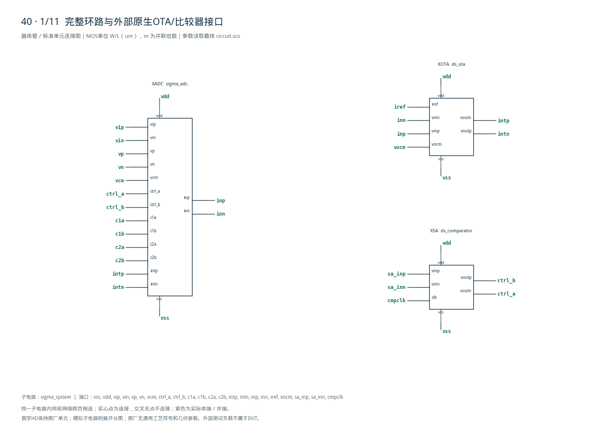

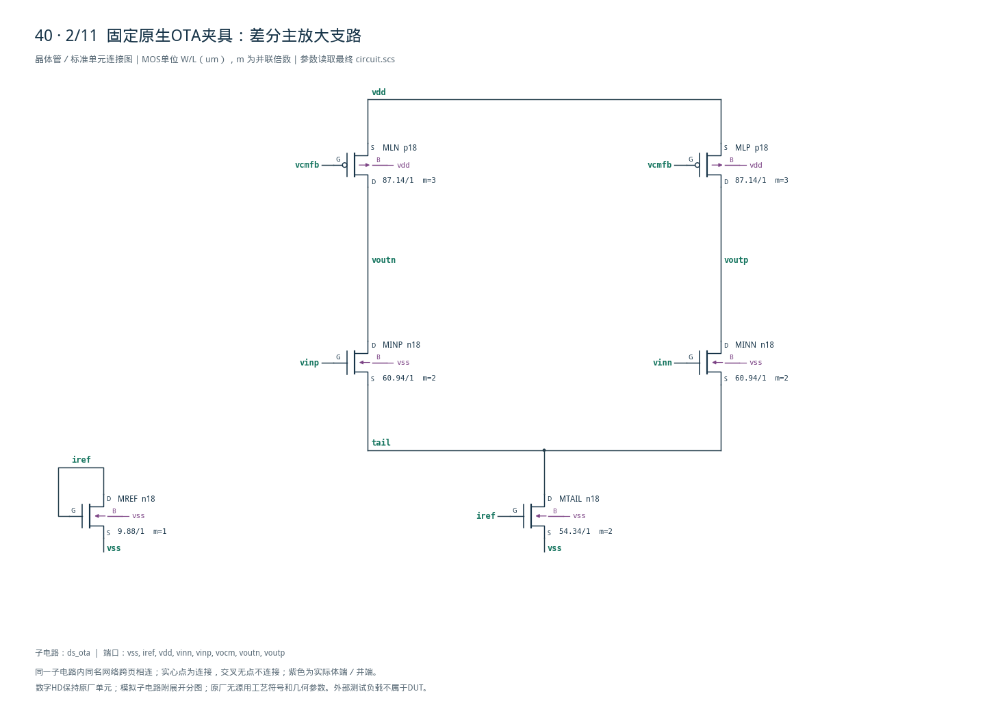

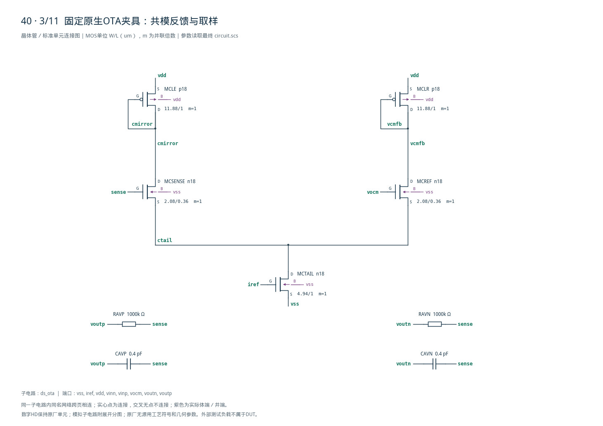

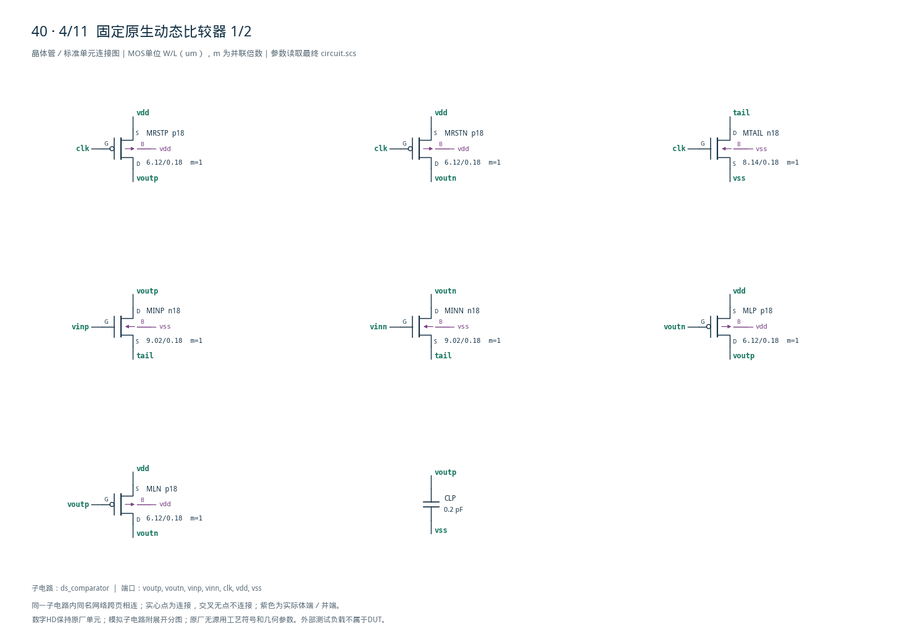

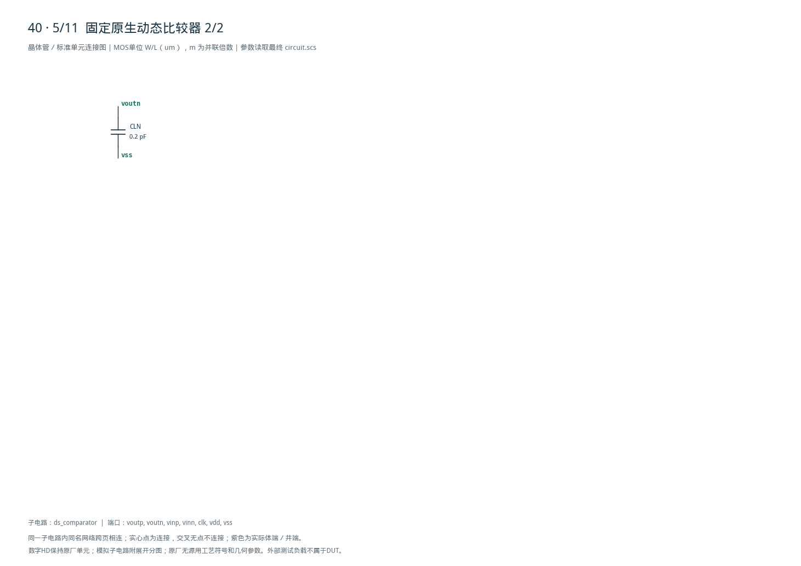

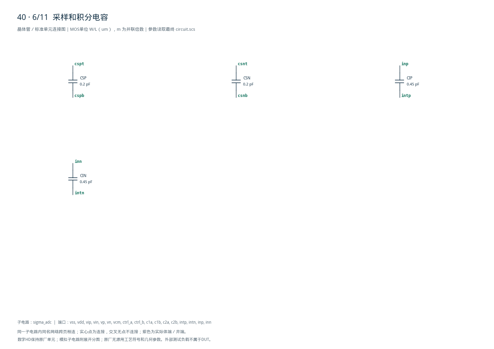

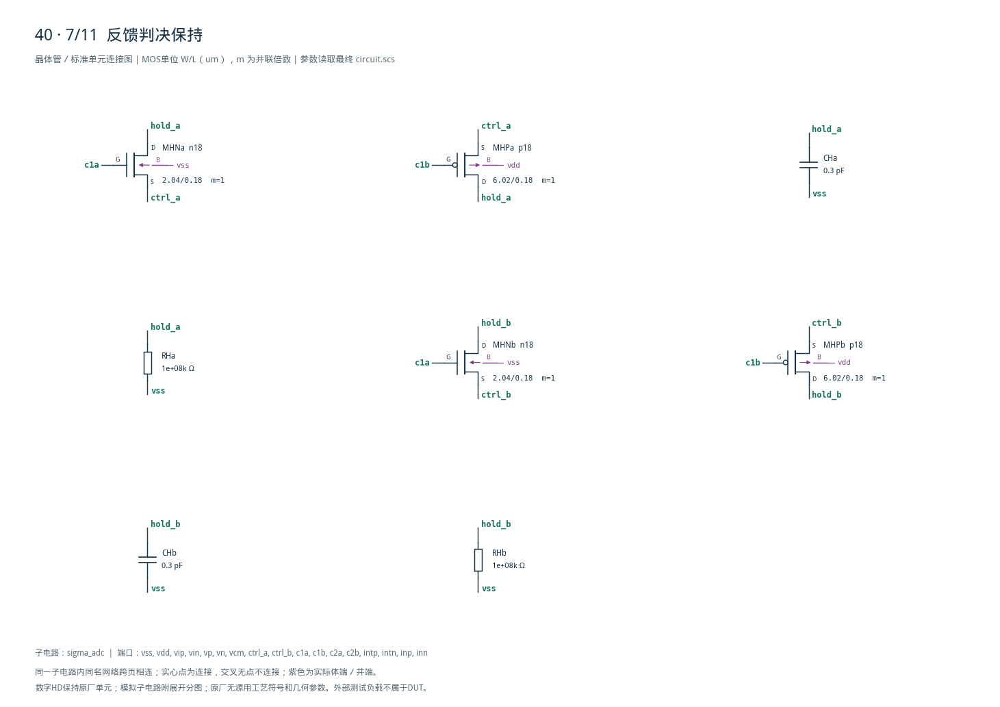

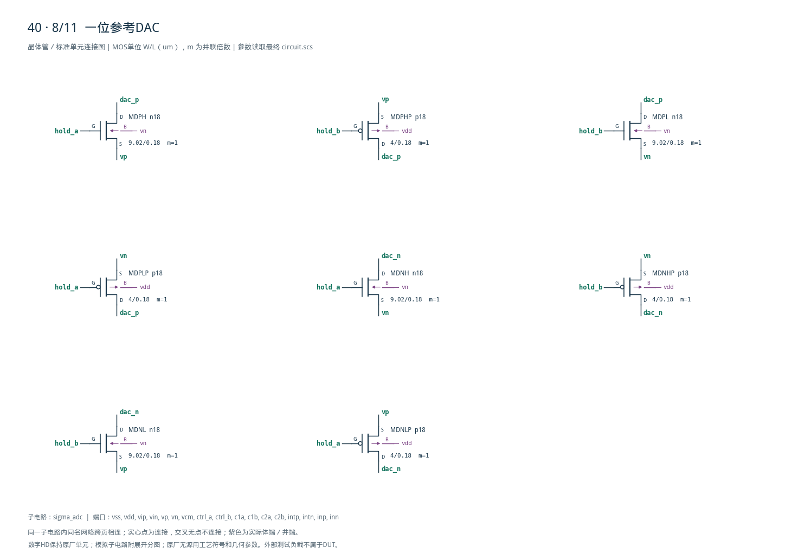

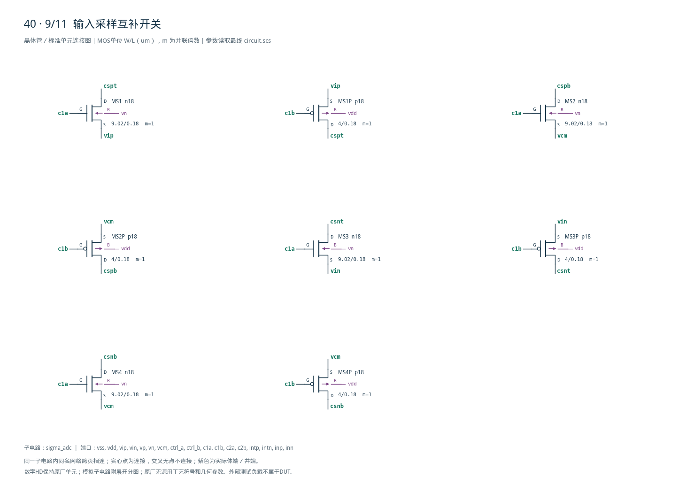

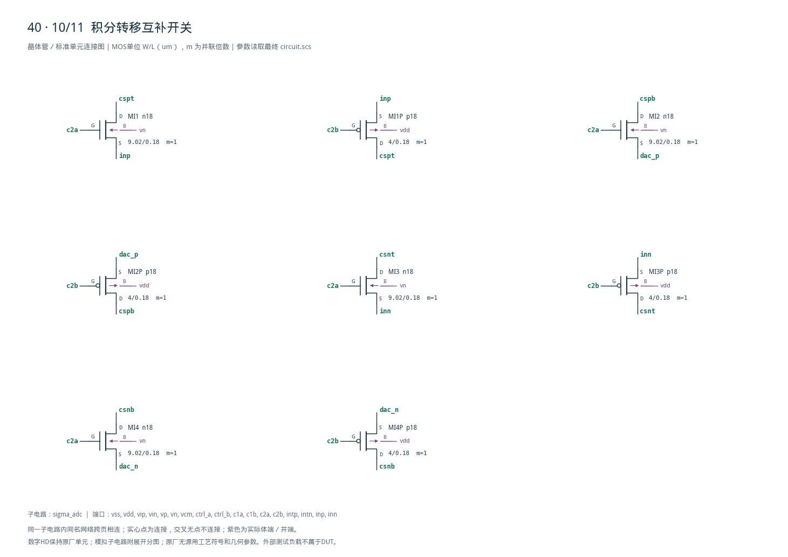

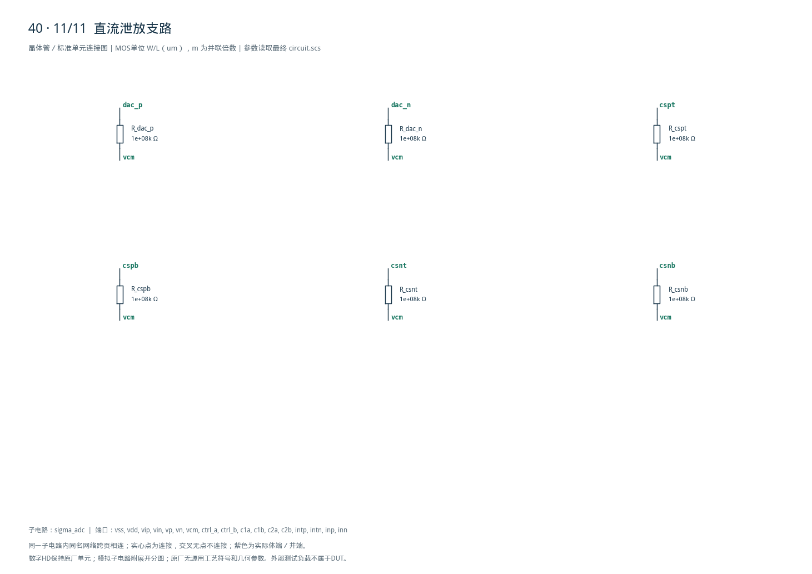
