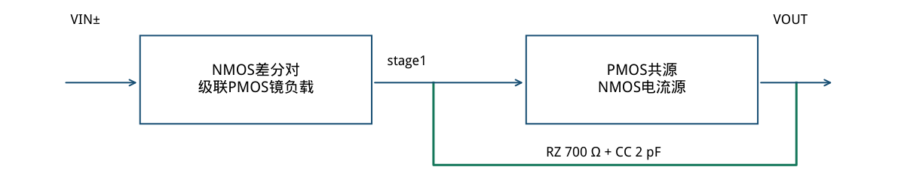
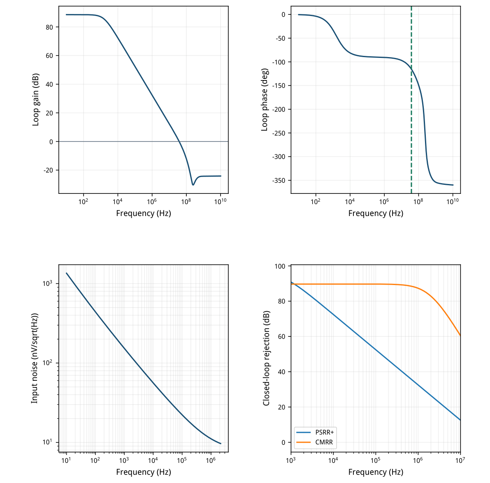
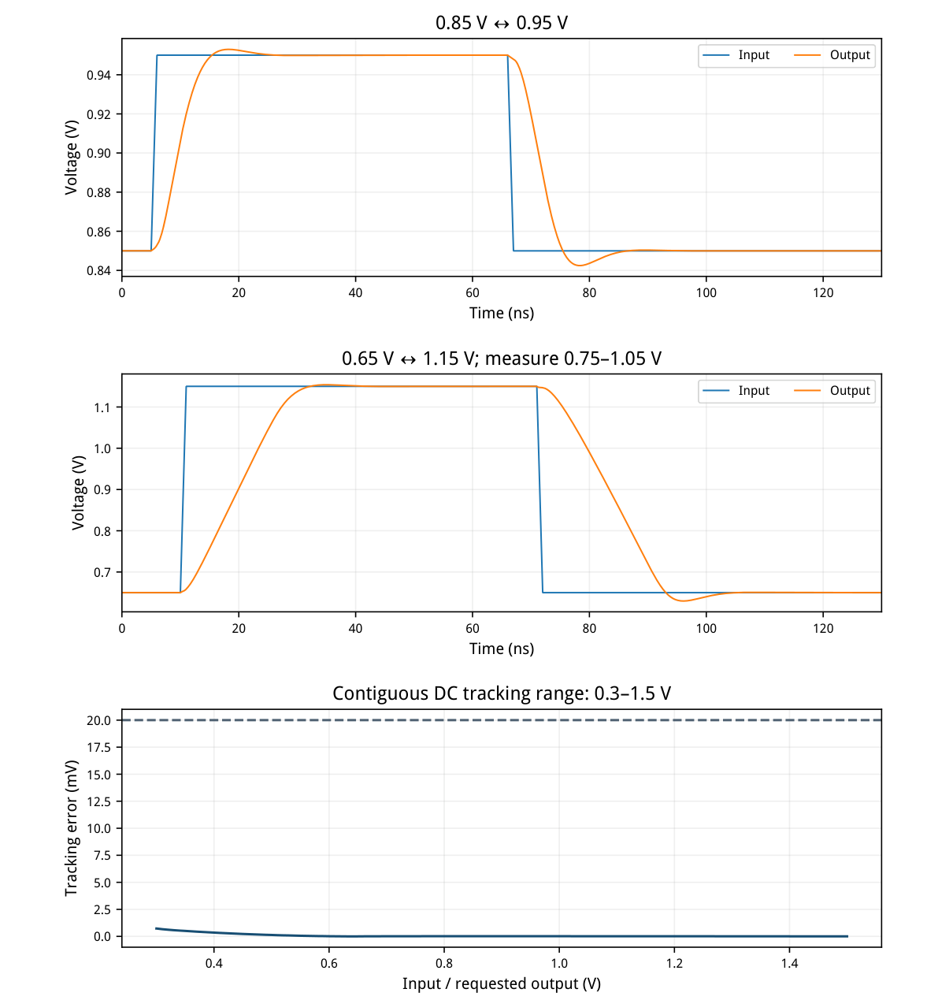
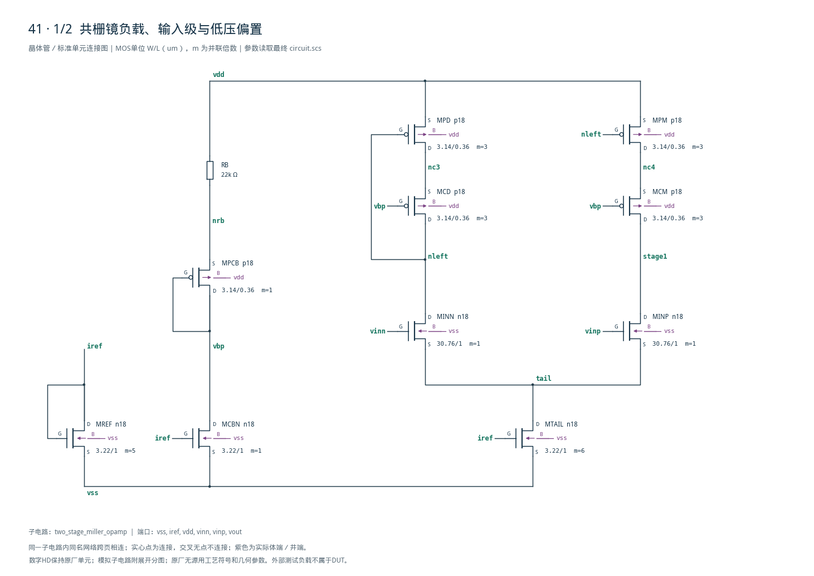
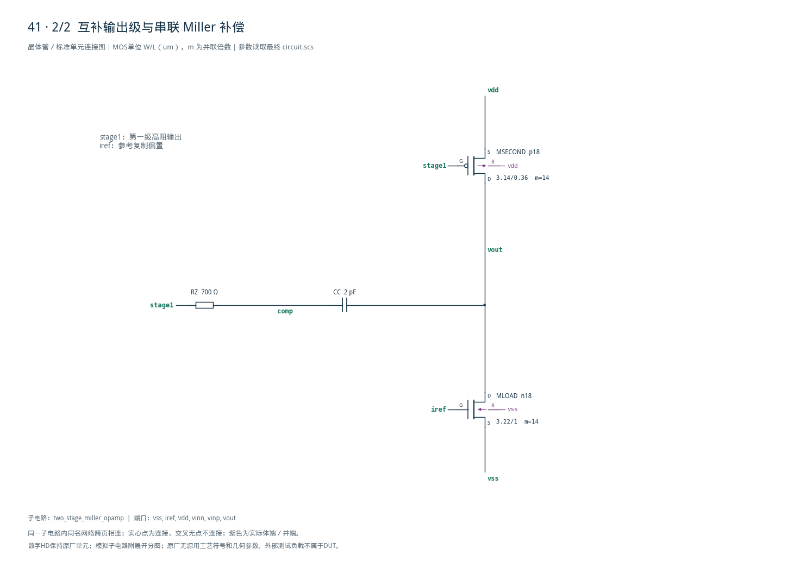

# 41 · 低功耗 Miller 运放审查

[审查 PDF](review.pdf) · [实测结果](latest_results.json) · [验收合同](contract.json) · [最终网表](circuit.scs)

## 验收结果

本模块以较低静态功耗提供高增益和闭环电压放大。相比普通镜负载的两级Miller运放，第一级级联镜可提高输出阻抗并减弱供电耦合，代价是额外偏置与电压余量。芯片中可用作低功耗传感器读出、基准缓冲或误差放大器；接入具体系统后仍需按其负载和环路重新设计。

结论：全部原nominal指标通过，无需使用10%–15%性能放宽。条件：SMIC18MMRF / tt / 1.8 V / 27°C；外部参考50 uA；输入共模0.9 V；负载2 pF。第一级级联PMOS镜负载，第二级为PMOS共源与NMOS电流源。

| 指标 | 实测 | 原门槛 | 10%边界 | 15%边界 | 单位 |
| --- | --- | --- | --- | --- | --- |
| 10Hz环路增益 | 88.583 | ≥70.000 | ≥69.085 | ≥68.588 | dB |
| UGB | 38.085 | ≥20.000 | ≥18.000 | ≥17.000 | MHz |
| 相位裕量 | 64.545 | ≥60.000 | ≥54.000 | ≥51.000 | deg |
| 静态输出误差 | 0.016 | ≤25.000 | ≤27.500 | ≤28.750 | mV |
| 总功耗（含参考） | 471.164 | ≤600.000 | ≤660.000 | ≤690.000 | uW |
| 输入积分噪声 | 23.239 | ≤50.000 | ≤55.000 | ≤57.500 | uVrms |
| 闭环PSRR+ @1kHz | 90.830 | ≥65.000 | ≥64.085 | ≥63.588 | dB |
| 闭环PSRR+ @1MHz | 32.461 | ≥20.000 | ≥19.085 | ≥18.588 | dB |
| 闭环CMRR @1kHz | 89.742 | ≥60.000 | ≥59.085 | ≥58.588 | dB |
| 连续输出范围 | 1.200 | ≥0.800 | ≥0.720 | ≥0.680 | Vpp |
| 最坏建立时间 | 17.477 | ≤30.000 | ≤33.000 | ≤34.500 | ns |
| 最坏最终跟踪误差 | 0.016 | ≤2.000 | ≤2.200 | ≤2.300 | mV |
| 上升压摆率 | 28.709 | ≥10.000 | ≥9.000 | ≥8.500 | V/us |
| 下降压摆率 | 26.558 | ≥10.000 | ≥9.000 | ≥8.500 | V/us |

噪声增益20的实测−3 dB带宽2.14287 MHz，10 Hz积分到该频率得到23.239 uVrms。环路在10 Hz–10 GHz只下降跨越一次0 dB，之后无回穿。

100 mV阶跃最坏终值误差16.13 uV，即0.01613%，同时满足2 mV及2%限制。额外PVT、Monte Carlo与版图验证不在本次nominal范围内。

## 结构、gm/ID尺寸与工作点

同一PMOS单元电流密度贯穿镜负载、共栅管和第二级。

| 角色 | 模型 | 单位W/L (um) | m | 目标gm/ID |
| --- | --- | --- | --- | --- |
| MINN/MINP | n18 | 30.76 / 1 | 1 | 18 |
| MREF/MTAIL/MLOAD/MCBN | n18 | 3.22 / 1 | 5 / 6 / 14 / 1 | 12 |
| MPD/MPM/MCD/MCM | p18 | 3.14 / 0.36 | 3 each | 10 |
| MPCB / MSECOND | p18 | 3.14 / 0.36 | 1 / 14 | 10 |

| 实际工作点 | \|I\| / uA | gm/ID | gm/gds | 饱和余量/mV |
| --- | --- | --- | --- | --- |
| MINP | 29.576 | 18.238 | 319.6 | 742.3 |
| MINN | 29.577 | 18.238 | 319.1 | 737.5 |
| MPM | 29.576 | 9.596 | 20.3 | 44.9 |
| MCD | 29.577 | 9.909 | 83.9 | 222.8 |
| MCM | 29.576 | 9.905 | 82.8 | 218.0 |
| MTAIL | 59.153 | 12.327 | 125.1 | 205.5 |
| MSECOND | 142.437 | 10.025 | 145.8 | 724.2 |
| MLOAD | 142.437 | 12.300 | 291.3 | 760.4 |
| MPCB | 10.168 | 9.886 | 126.0 | 509.5 |

RB=22 kΩ使MPCB源端为1.57631 V；共栅管源端1.57599/1.57603 V，体偏置相近。偏置VBP=0.88527 V。PMOS镜管饱和余量仅44.9 mV，虽nominal通过，仍需单独做PVT才能判断稳健性。

第二级实际gm=1.42786 mS，1/gm=700.35 Ω，与RZ=700 Ω接近；抵消前馈零点的初算仍须由实际环路相位确认。



[查看矢量图](markdown_assets/figure-02-01.svg)

## 环路、噪声及供电抑制

维持上游的串联电压注入、闭环抑制比和噪声积分口径。

环路T=−Vout/Vinn，DC单位反馈。PSRR采用VDD AC=1、输入固定；CMRR在vinp与串联反馈同向注入AC=1；两者均按−20log10|Vout|计算。这些是本题闭环定义。

噪声使用噪声增益20的独立闭环AC确定积分上限；PSF输入噪声幅度平方积分再开根号，未以UGB替代。



[查看矢量图](markdown_assets/figure-03-01.svg)

## 双向阶跃、压摆与连续范围

全部使用2 pF外部负载；压摆刺激按本题10 ns/71 ns的时序。

正负100 mV阶跃分别15.949/17.477 ns进入并保持2 mV窗口，65/130 ns终值均合格。整个原DC扫描0.3–1.5 V均满足20 mV跟踪误差；只声明这1.2 V范围，不向扫描边界外延伸。



[查看矢量图](markdown_assets/figure-04-01.svg)

## 精确电路、设计认识与复现

高抑制比来自拓扑与偏置匹配；当前证据限于nominal。

镜负载与第二级采用同一个p18单位管，通过m改变电流。两输入漏极电位1.17225/1.17703 V，仅差4.774 mV；这有助于减小确定性系统失调，本次单位反馈输出误差16.05 uV。它不能代表随机失配失调。

级联镜提升第一级输出电阻并减少供电耦合；但额外叠管消耗余量，上层MPM仅余44.9 mV。不要把90.83 dB的nominal闭环PSRR或88.58 dB增益直接视为跨角落保证。所有器件宽度均在模型有效范围。

复现： /home/IC/CodeX/virtuoso-bridge-lite/.venv/bin/python scripts/case41\_lowpower\_miller.py 生成PDF：同一Python运行 scripts/review\_pdf.py 41

静态：runs/41/20260922T065822810909Z\_static噪声：runs/41/20260922T065823009181Z\_noise动态：runs/41/20260922T065823206274Z\_dynamic

原任务：sky130-two-stage-miller-opamp-gain70-ugb20-pm60-noise50uv-pvt。本次未执行其他PVT、失配、寄生或版图验证；报告绑定最终网表及实测JSON哈希。

## 完整网表与电路图

[Spectre 网表](circuit.scs) · [全部分图 PDF](schematic/sheets.pdf) · [电路总图](schematic/full.svg) · [端子连接](schematic/connectivity.json)

<details>
<summary>展开完整 Spectre 网表</summary>

```spectre
// Wide-swing cascoded input load and complementary output stage.
simulator lang=spectre
subckt two_stage_miller_opamp (vss iref vdd vinn vinp vout)
MREF (iref iref vss vss) n18 w=3.22u l=1u m=5
MTAIL (tail iref vss vss) n18 w=3.22u l=1u m=6
MLOAD (vout iref vss vss) n18 w=3.22u l=1u m=14
MCBN (vbp iref vss vss) n18 w=3.22u l=1u
RB (vdd nrb) resistor r=22000
MPCB (vbp vbp nrb vdd) p18 w=3.14u l=.36u
MINN (nleft vinn tail vss) n18 w=30.76u l=1u
MINP (stage1 vinp tail vss) n18 w=30.76u l=1u
MPD (nc3 nleft vdd vdd) p18 w=3.14u l=.36u m=3
MPM (nc4 nleft vdd vdd) p18 w=3.14u l=.36u m=3
MCD (nleft vbp nc3 vdd) p18 w=3.14u l=.36u m=3
MCM (stage1 vbp nc4 vdd) p18 w=3.14u l=.36u m=3
MSECOND (vout stage1 vdd vdd) p18 w=3.14u l=.36u m=14
RZ (stage1 comp) resistor r=700
CC (comp vout) capacitor c=2p
ends two_stage_miller_opamp
```

</details>





## 报告来源

正文与表格整理自已交付的矢量 PDF，图表单独提取；本文件是后续整理的 Markdown，不是原 PDF 的编译输入。原 PDF、网表及测量数据保持原值。
