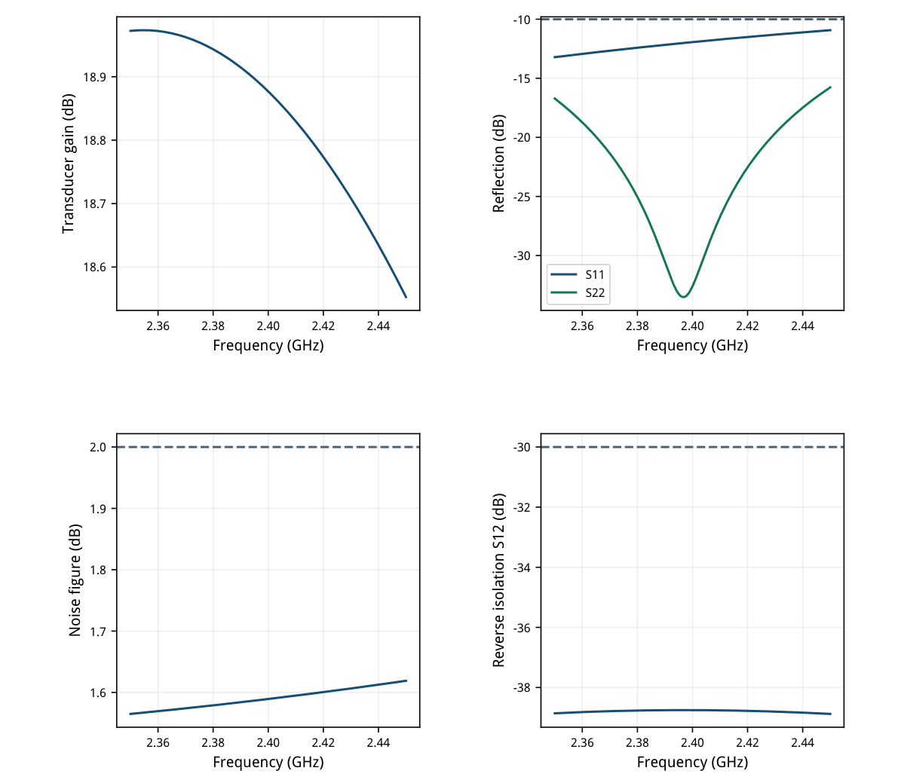
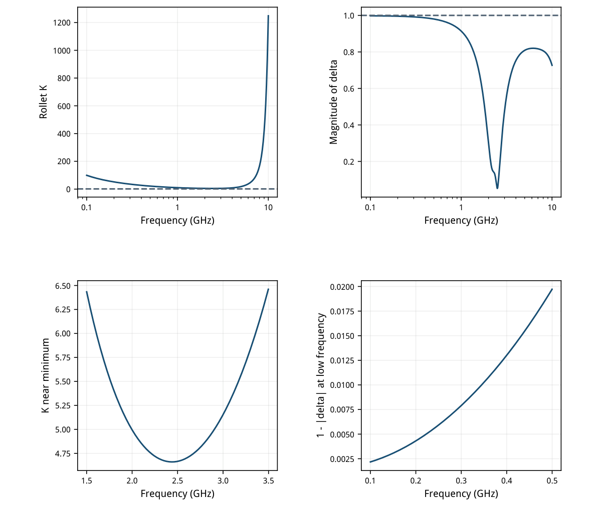
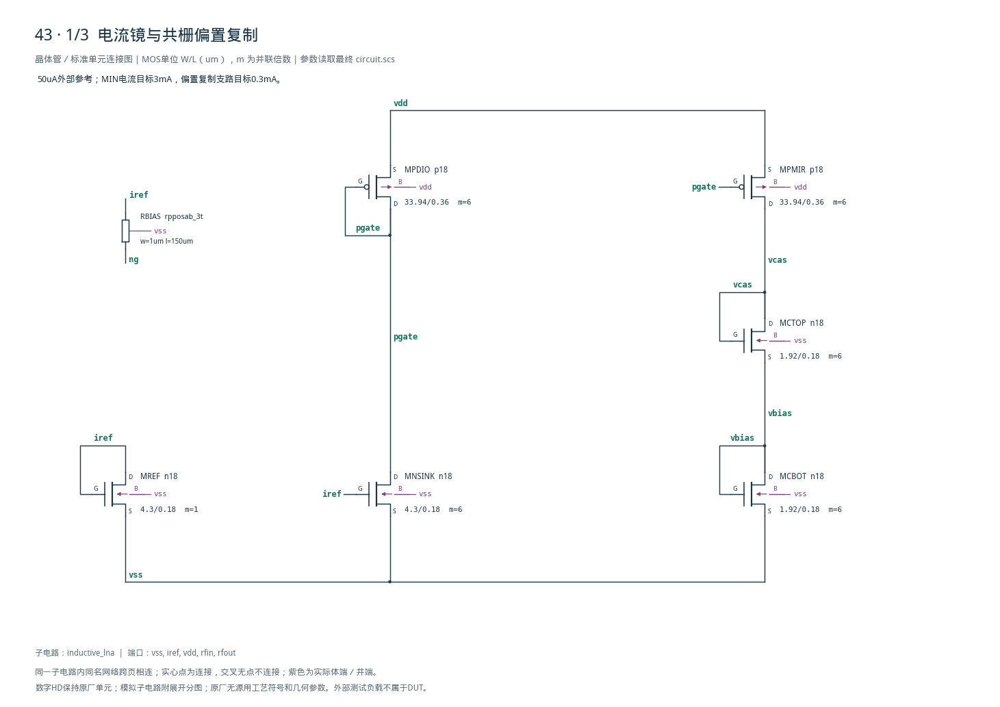
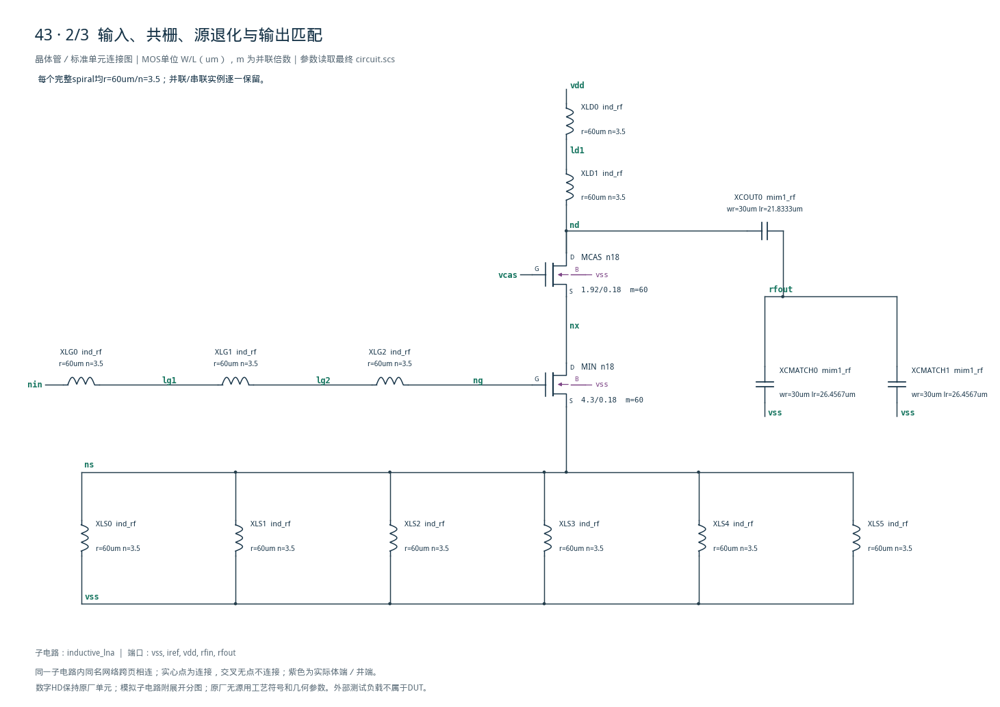
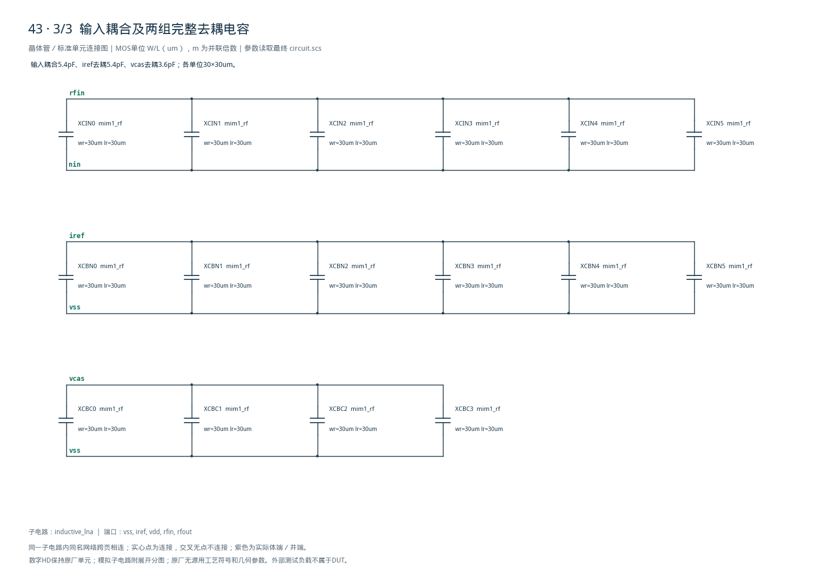

# 43 · 2.4GHz电感退化LNA审查

[审查 PDF](review.pdf) · [实测结果](latest_results.json) · [验收合同](contract.json) · [最终网表](circuit.scs)

## 验收结果

本模块放大2.4GHz附近的微弱射频信号，在两端50Ω条件下同时控制增益、噪声和反射。源极电感退化与栅极谐振网络帮助输入匹配，共栅级改善反向隔离，漏端电感及电容网络把高阻放大节点匹配到输出端口；代价是窄带响应和较大的无源面积。芯片中可用于无线接收机前端，本次以原理图工艺模型验证标称小信号性能，物理布局和互感仍需另行检查。

结论：全部标称原门槛通过，无需10%或15%放宽。

SMIC18MMRF TT / 1.8V / 27°C / 50uA参考，两端50Ω。增益、匹配、反向隔离及噪声覆盖2.35–2.45GHz；稳定性另覆盖0.1–10GHz。最终通带/噪声各201点、稳定性1601点，包含全部原网格点。

| 验收量 | 实测 | 原门槛 | 10% | 15% | 单位 |
| --- | --- | --- | --- | --- | --- |
| 最小传输功率增益 | 18.5527 | ≥12 | ≥11.542 | ≥11.294 | dB |
| 通带增益纹波 | 0.420696 | ≤1.5 | ≤1.9139 | ≤2.107 | dB |
| 最差S11 | -10.9265 | ≤-10 | ≤-9.1721 | ≤-8.786 | dB |
| 最差S22 | -15.7694 | ≤-10 | ≤-9.1721 | ≤-8.786 | dB |
| 最差噪声系数 | 1.61904 | ≤2 | ≤2.4139 | ≤2.607 | dB |
| 最差反向S12 | -38.752 | ≤-30 | ≤-29.172 | ≤-28.786 | dB |
| 最小Rollet K | 4.66069 | ≥1.2 | ≥1.08 | ≥1.02 | ratio |
| 最大\|delta\|* | 0.997823 | &lt;1 | &lt;1 | &lt;1 | ratio |
| 完整VDD功耗 | 6.88318 | ≤10 | ≤11 | ≤11.5 | mW |
| 参考端最低电压* | 0.555055 | ≥0.4 | ≥0.4 | ≥0.4 | V |
| 参考端最低余量* | 1.24494 | ≥0.1 | ≥0.1 | ≥0.1 | V |

增益、纹波与NF按功率比定义dB边界；S参数按幅度比。\*标记的参考合规、|delta|&lt;1保持原值，另要求K&gt;1及所有数据有限，不放宽稳定性或缺失测量。

只执行TT标称，原27点PVT中的另外26点与公开0°C诊断未运行；失配、压缩、互调、天线/封装、布局与PEX未验证。小信号通过不等于完整接收机签核。

## gm/ID尺寸与真实工作点

只有iref外部模拟偏置；电流镜与双NMOS复制栈产生共栅偏置。

输入管目标3mA/gmID14，共栅目标3mA/gmID10；偏置复制目标0.3mA。50uA单位LUT查询后以m复制，总输入宽258um、共栅宽115.2um。输入增大gm/ID可减小噪声所需电流，但增加栅电容与匹配电感需求。

| 角色 | 单位W/L um | m | LUT gm/ID |
| --- | --- | --- | --- |
| MREF / MNSINK | 4.30/0.18 | 1 / 6 | 14 |
| MIN | 4.30/0.18 | 60 | 14 |
| MCBOT/MCTOP / MCAS | 1.92/0.18 | 6 / 60 | 10 |
| MPDIO / MPMIR | 33.94/0.36 | 各6 | 14 |

| 器件 | \|ID\|/mA | gm/ID | VGS/V | VDS/V | \|VDS\|-\|VDSAT\| |
| --- | --- | --- | --- | --- | --- |
| MREF | 0.050000 | 13.8058 | 0.55506 | 0.55506 | 0.45334 |
| MNSINK | 0.373947 | 12.9496 | 0.55506 | 1.22568 | 1.11940 |
| MPDIO | 0.373954 | 12.8282 | -0.57432 | -0.57432 | 0.43540 |
| MPMIR | 0.366780 | 12.8381 | -0.57432 | -0.38484 | 0.24604 |
| MCBOT | 0.366780 | 8.7414 | 0.64372 | 0.64372 | 0.49429 |
| MCTOP | 0.366780 | 8.8400 | 0.77144 | 0.77144 | 0.61918 |
| MIN | 3.033245 | 13.8183 | 0.55318 | 0.66924 | 0.56791 |
| MCAS | 3.033245 | 9.9119 | 0.74405 | 1.10644 | 0.96746 |

实际输入/共栅电流3.033245mA；镜吸收支路373.947uA、复制栈366.780uA，高于0.3mA初值，原因包括不同VDS及体效应。两条偏置支路、参考和RF核心全部计入VDD功耗。

MOS使用现有SMIC18 n18/p18 LUT，L0.18/0.36um、VDS0.9V；实际输入gm/ID13.8183、共栅9.9119。所有8只MOS有正电压余量；参数符号沿用Spectre，PMOS电流表中取幅度。

## 完整工艺无源与匹配结构

DUT无用户理想R/C/L；所有spiral均使用文档示例r60um、n3.5的完整模型。

| 网络 | 实例/几何 | 名义量或用途 |
| --- | --- | --- |
| 栅极电感LG | 3个ind_rf串联 | 串联L约9.416925nH，保留每只衬底寄生 |
| 源退化LS | 6个ind_rf并联 | 独立器件近似L约0.5231625nH |
| 漏端电感LD | 2个ind_rf串联 | 串联L约6.27795nH |
| 输入CIN | 6个mim1_rf，各30×30um | 总名义5.4pF |
| iref去耦CBN | 6个mim1_rf，各30×30um | 总名义5.4pF |
| vcas去耦CBC | 4个mim1_rf，各30×30um | 总名义3.6pF |
| 输出COUT | 1个mim1_rf，30×21.833333um | 名义0.655pF |
| 输出CMATCH | 2个mim1_rf，各30×26.456667um | 总名义1.5874pF |
| 栅偏置RBIAS | rpposab_3t，W1/L150um | 第三端接vss；电阻噪声和寄生保留 |

单个spiral模型串联L=3.138975nH、R=3.7030115Ω，含跨接电容与两侧衬底损耗。以上总L仅是串并联主项估算；实际RF响应使用完整子电路，不以主项理想L/R替换。

mim1\_rf含金属串联电阻、电感与衬底支路，名义1fF/um²面积值不等于2.4GHz下的完整阻抗。19个MIM实例逐一绘制，电容板名义总面积16642.4um²；11只spiral还需更大版图面积。

独立spiral之间没有加入互感，尚无物理排布或电磁提取；MOS采用既有n18/p18模型，未额外构造版图门电阻。所有结论限于当前原生模型覆盖，不能假定实芯片有相同性能。

## 通带增益、匹配与噪声

两端50Ω、50uA参考、原101点网格保留，最终201点取最坏值。

最终增益18.552718–18.973414dB、纹波0.420696dB；噪声系数最坏1.619038dB。输入匹配最差-10.926464dB，比原-10dB有0.926dB余量，必须与其余指标同时判断。

最差输出匹配-15.769358dB，反向S12为-38.751989dB。保留50Ω输出实负载，未使用开路电压增益代替传输功率增益，也未从噪声中扣掉DUT无源损耗。



[查看矢量图](markdown_assets/figure-04-01.svg)

## 0.1–10GHz完整稳定性范围

Rollet K与|delta|共同判断；不能仅凭2.4GHz点或反向隔离宣布稳定。

K最小4.660687201，位于2.440619068GHz；|delta|最大0.997823069，位于100MHz。低端与1的距离约0.002177，明确保留该有限余量。

delta=S11·S22-S12·S21；K=(1-|S11|²-|S22|²+|delta|²)/(2|S12·S21|)。最终1601点均K&gt;1、|delta|&lt;1；这是给定频段及模型的线性双端口判据，未扩称带外、非线性或PVT稳定性。



[查看矢量图](markdown_assets/figure-05-01.svg)

## 独立测量与频率网格复核

原正向/反向两DUT台保留；输出负载无噪声是原测试条件，DUT噪声全开。

正向源AC=1V，串50Ω，输出50Ω：S11=2Vrfin-1、S21=2Vrfout。反向独立DUT用同样端口网络测S22/S12。输入可用功率=1/(8×50)W，输出功率=|Vrfout|²/(2×50)W，独立核对GT=|S21|²。

NF=20log10(max(e\_input)/sqrt(4kT×50))，T=300.15K。输入50Ω噪声保留、外部输出50Ω按原台关闭噪声，DUT电阻及RF无源噪声保留。用输出谱除以实际加载AC增益独立重建输入谱，最大相对差约5.15e-12。

| 复核量/SI或dB | 原网格 | 加密网格 | 绝对差 | 预设上限 |
| --- | --- | --- | --- | --- |
| transducer_gain_db_min | 18.552718 | 18.552718 | 0 | 0.05 |
| transducer_gain_db_max | 18.973413 | 18.973414 | 1.01e-06 | 0.05 |
| gain_ripple_db | 0.42069485 | 0.42069586 | 1.01e-06 | 0.05 |
| s11_db_max | -10.926464 | -10.926464 | 0 | 0.05 |
| s22_db_max | -15.769358 | -15.769358 | 0 | 0.05 |
| reverse_isolation_db_max | -38.751989 | -38.751989 | 0 | 0.05 |
| noise_figure_db | 1.6190384 | 1.6190384 | 0 | 0.005 |
| stability_k_min | 4.6609554 | 4.6606872 | 0.000268 | 0.0466 |
| stability_delta_max | 0.99782307 | 0.99782307 | 0 | 0.0001 |
| power_w | 0.0068831791 | 0.0068831791 | 0 | 1e-06 |
| iref_voltage_v | 0.5550552 | 0.5550552 | 0 | 1e-05 |
| iref_headroom_v | 1.2449448 | 1.2449448 | 0 | 1e-05 |

原通带/噪声101点、稳定性401点；最终201/1601点含全部原频率，reltol从1e-6至1e-7。预设增益/匹配/隔离差≤0.05dB、NF≤0.005dB、K≤基线1%、delta≤1e-4、功耗≤1uW、偏置≤10uV，全部通过。

独立13项测量与原7组检查全部通过。源文件、模型、RF子电路与LUT哈希未变；两个正式精度运行均0错误/0警告。39实例95端子另行独立连接审计。

## 迭代过程与复现入口

调整输出阻抗变换，保持电流、原RF端口与噪声定义。

| 阶段 | 变化 | 结果 |
| --- | --- | --- |
| 首版 | LD单spiral；COUT0.5pF/CM1.2pF | 增益4.194dB、S22 -0.291dB失败 |
| 增加漏端L | LD改两spiral串联 | 增益16.770dB，但S22 -3.870dB仍失败 |
| 最终匹配 | COUT0.655pF、CM1.5874pF | 全部原门槛通过 |
| 精度确认 | 原101/401点→201/1601点 | 同电路、同频段、固定精度界限通过 |

从复数S22推导输出阻抗，在2.4GHz用电容网络估算下一次匹配值，再以完整工艺模型重新验证。没有用理论估算替代最终仿真。早期Spectre lin=101产生102点，发现后改为100个间隔，先恢复原101点再进行加密对照。

复现（工程根目录，既有Bridge Python）： python scripts/case43\_lna.py python scripts/confirm43.py python scripts/schematic43.py python scripts/audit43.py python scripts/review43.py 报告重建后须重新查看全部页面及完整总图。

source/和source\_provenance.json保存原合同/测试台/验收器。iteration\_history.json保存失败方案；numerical\_plan/baseline/confirmation保留精度计划和对照；verification\_audit.json保留独立公式与来源，implementation/冻结本次脚本。

原26个其他PVT点、失配、压缩/互调、布局互感与PEX未执行；不把本次TT结果标记为上游27点完整签核。

## 最终精确电路与证据边界

全部模拟实例在后附三页完整图纸中一一对应；未折叠无源阵列。

端序：MOS为D G S B；rpposab\_3t第三端为衬底；ind\_rf和mim1\_rf仅有两外部端口，其原厂衬底网络参考全局0，本测试vss=0。完整原厂RF模型未改写为用户理想器件。

DUT SHA-256：dfceb74aacbcd14aeab9a680577996f67fbf2ffc8c7b4e321f7d3658b3ace2c5

## 完整网表与电路图

[Spectre 网表](circuit.scs) · [全部分图 PDF](schematic/sheets.pdf) · [电路总图](schematic/full.svg) · [端子连接](schematic/connectivity.json)

<details>
<summary>展开完整 Spectre 网表</summary>

```spectre
simulator lang=spectre
subckt inductive_lna (vss iref vdd rfin rfout)
MREF (iref iref vss vss) n18 w=4.3u l=.18u
MNSINK (pgate iref vss vss) n18 w=4.3u l=.18u m=6
MPDIO (pgate pgate vdd vdd) p18 w=33.94u l=.36u m=6
MPMIR (vcas pgate vdd vdd) p18 w=33.94u l=.36u m=6
MCBOT (vbias vbias vss vss) n18 w=1.92u l=.18u m=6
MCTOP (vcas vcas vbias vss) n18 w=1.92u l=.18u m=6
MIN (nx ng ns vss) n18 w=4.3u l=.18u m=60
MCAS (nd vcas nx vss) n18 w=1.92u l=.18u m=60
RBIAS (iref ng vss) rpposab_3t w=1u l=150u
XCIN0 (rfin nin) mim1_rf wr=30u lr=30u
XCIN1 (rfin nin) mim1_rf wr=30u lr=30u
XCIN2 (rfin nin) mim1_rf wr=30u lr=30u
XCIN3 (rfin nin) mim1_rf wr=30u lr=30u
XCIN4 (rfin nin) mim1_rf wr=30u lr=30u
XCIN5 (rfin nin) mim1_rf wr=30u lr=30u
XCBN0 (iref vss) mim1_rf wr=30u lr=30u
XCBN1 (iref vss) mim1_rf wr=30u lr=30u
XCBN2 (iref vss) mim1_rf wr=30u lr=30u
XCBN3 (iref vss) mim1_rf wr=30u lr=30u
XCBN4 (iref vss) mim1_rf wr=30u lr=30u
XCBN5 (iref vss) mim1_rf wr=30u lr=30u
XCBC0 (vcas vss) mim1_rf wr=30u lr=30u
XCBC1 (vcas vss) mim1_rf wr=30u lr=30u
XCBC2 (vcas vss) mim1_rf wr=30u lr=30u
XCBC3 (vcas vss) mim1_rf wr=30u lr=30u
XCOUT0 (nd rfout) mim1_rf wr=30u lr=21.8333333333u
XCMATCH0 (rfout vss) mim1_rf wr=30u lr=26.4566666667u
XCMATCH1 (rfout vss) mim1_rf wr=30u lr=26.4566666667u
XLG0 (nin lg1) ind_rf r=60u n=3.5
XLG1 (lg1 lg2) ind_rf r=60u n=3.5
XLG2 (lg2 ng) ind_rf r=60u n=3.5
XLD0 (vdd ld1) ind_rf r=60u n=3.5
XLD1 (ld1 nd) ind_rf r=60u n=3.5
XLS0 (ns vss) ind_rf r=60u n=3.5
XLS1 (ns vss) ind_rf r=60u n=3.5
XLS2 (ns vss) ind_rf r=60u n=3.5
XLS3 (ns vss) ind_rf r=60u n=3.5
XLS4 (ns vss) ind_rf r=60u n=3.5
XLS5 (ns vss) ind_rf r=60u n=3.5
ends inductive_lna
```

</details>







## 报告来源

正文与表格整理自已交付的矢量 PDF，图表单独提取；本文件是后续整理的 Markdown，不是原 PDF 的编译输入。原 PDF、网表及测量数据保持原值。
