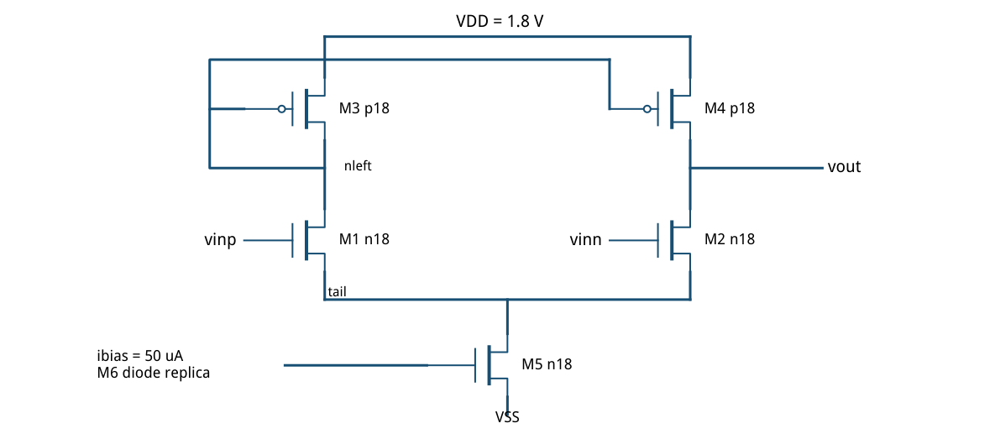
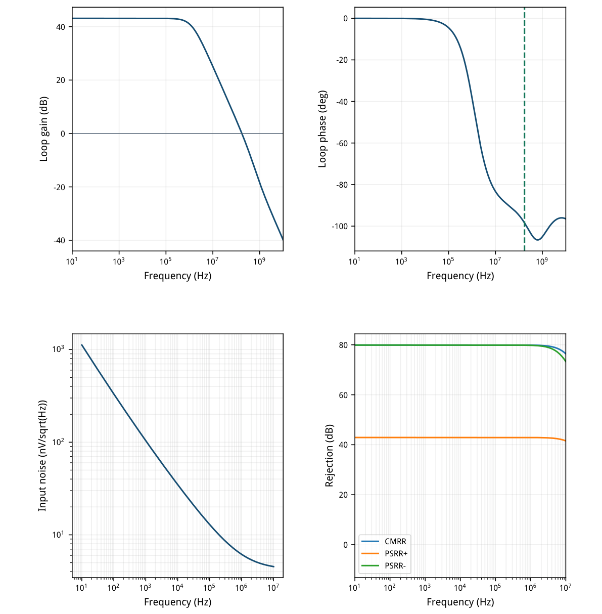
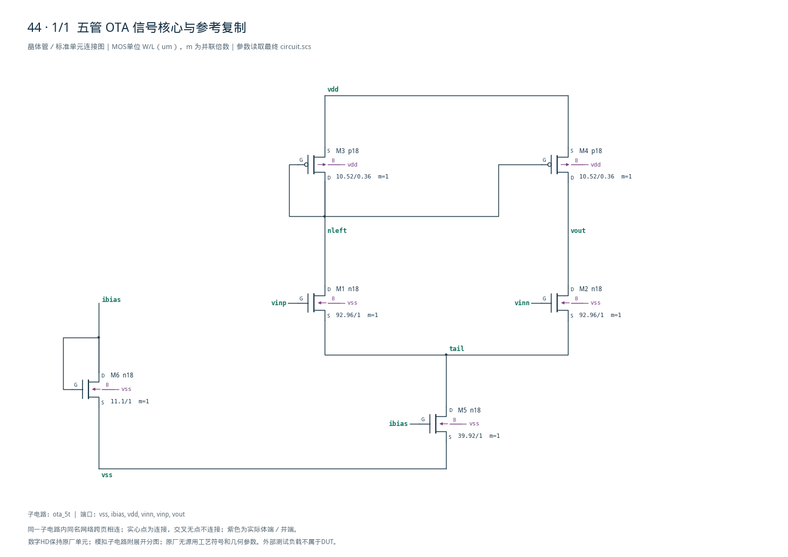

# 44 · 5T OTA 审查报告

[审查 PDF](review.pdf) · [实测结果](latest_results.json) · [验收合同](contract.json) · [最终网表](circuit.scs)

## 验收结果

本模块把两输入端的差分电压转换为单端输出电流，再由输出阻抗与负载形成电压增益。5T OTA结构简单、内部节点少，适合作为单级运放的基础架构；其增益和输出驱动受单级器件能力限制。芯片中常用于低功耗误差放大、偏置控制、滤波器和开关电容电路的小负载放大。

结论：全部 nominal 原始指标通过；无需10%–15%放宽。2026-09-22条件：SMIC18MMRF / tt / 1.8 V / 27°C；输入共模0.9 V；输出负载1 pF；外部偏置50 uA。核心5管加偏置复制管，使用目标工艺gm/ID LUT重新选尺寸。

| 指标 | 实测 | 原门槛 | 10%边界 | 15%边界 | 单位 |
| --- | --- | --- | --- | --- | --- |
| 环路增益 @1kHz | 43.144 | ≥40.000 | ≥39.085 | ≥38.588 | dB |
| UGB | 173.009 | ≥100.000 | ≥90.000 | ≥85.000 | MHz |
| 相位裕量 | 81.526 | ≥60.000 | ≥54.000 | ≥51.000 | deg |
| 总功耗（含50uA参考） | 409.838 | ≤500.000 | ≤550.000 | ≤575.000 | uW |
| 输入噪声 10Hz–10MHz | 19.517 | ≤50.000 | ≤55.000 | ≤57.500 | uVrms |
| 开环 CMRR @1kHz | 79.929 | ≥50.000 | ≥49.085 | ≥48.588 | dB |
| 开环 PSRR+ @1kHz | 42.911 | ≥30.000 | ≥29.085 | ≥28.588 | dB |
| 开环 PSRR− @1kHz | 79.900 | ≥30.000 | ≥29.085 | ≥28.588 | dB |

图示为信号核心。M6与M5共栅偏置；体端与完整端序见文末完整网表网表。



[查看矢量图](markdown_assets/figure-01-01.svg)

## 尺寸依据与实际工作点

使用已有SMIC18 LUT；不使用PTM代替目标PDK。

| 角色 | 模型 | L/um | W/um | gm/ID | I/uA | fT/GHz |
| --- | --- | --- | --- | --- | --- | --- |
| M1/M2 输入对 | n18 | 1.00 | 92.96 | 18.0 | 90.0 | 0.47 |
| M3/M4 镜负载 | p18 | 0.36 | 10.52 | 6.0 | 90.0 | 2.69 |
| M5 尾源 | n18 | 1.00 | 39.92 | 10.0 | 180.0 | 1.02 |
| M6 参考 | n18 | 1.00 | 11.10 | 10.0 | 50.0 | 1.02 |

选点：输入对L=1 um、gm/ID=18提供增益、噪声和跨导；PMOS负载采用L=0.36 um、gm/ID=6，把电流镜极点推高。尾源/参考同L，目标尾电流180 uA。宽度按0.02 um记录网格取整。

| 器件 | \|Id\|/uA | gm/ID | gm/gds | \|VDS\|/V | 余量/V |
| --- | --- | --- | --- | --- | --- |
| M1 | 88.41 | 18.29 | 304.9 | 0.708 | 0.619 |
| M3 | 88.41 | 6.03 | 86.3 | 0.746 | 0.473 |
| M5 | 177.69 | 10.58 | 97.8 | 0.345 | 0.183 |

余量定义为 |VDS|−|VDSAT|；表中信号输入、镜负载和尾源均为饱和工作。闭环输出0.90107 V，尾节点0.34533 V。输入管有约0.345 V体偏置，实测gm/ID=18.29；因此零体偏置LUT作为初值，实际OP作为确认。

设计经验：无需把所有信号器件都取长沟道。长NMOS输入对配较短、强反型PMOS镜，在本任务负载下同时保住DC增益与镜节点速度。这个结论限定于本次SMIC18 nominal工作点，不是跨PVT保证。

LUT出处：gmoverid\_smic18/lut/tt；每次查询的原文件SHA-256、VDS、L、Wref和目标电流已保存在 cases/44-ota5/sizing.json。

## 频域与噪声证据

全部曲线来自同一电路快照的Spectre PSF；没有用Sky130发布值替代。

环路在10 Hz–10 GHz内只有一次下降穿越0 dB。噪声积分为sqrt(∫en² df)，PSF单位已核对为V/sqrt(Hz)。CMRR/PSRR使用自然开环工作点，不能与DC闭环噪声台的工作点混用。



[查看矢量图](markdown_assets/figure-03-01.svg)

## 精确网表、测量与复现

原始网表和运行输入快照共同构成证据，环境保持未修改。

测量保持上游定义：Tv=−V(yv)/V(xv)，Ti=I(VYI)/I(VXI)，T=(Tv·Ti−1)/(Tv+Ti+2)。用复数返回比求1 kHz增益、首次下降跨频UGB和相位裕量。功耗为1.8·|I(VDDP)|，含50 uA参考支路。

本次只复现 nominal 电气合同；未执行其余26个PVT点、Monte Carlo或版图提取。没有新增数字逻辑。未把本结果作为量产良率、器件可靠性或全工作范围的证明。

复现命令（从本工程根目录）： /home/IC/CodeX/virtuoso-bridge-lite/.venv/bin/python scripts/case44\_ota5.py 生成PDF：同一Python运行 scripts/review\_pdf.py 44

结果：cases/44-ota5/latest\_results.json运行：runs/44/20260922T054841824289Z\_ota5依赖与模型SHA-256：该运行目录/run.json参考任务：sky130-ota-5t-gain40-pm60-noise50uv-pvt

审查重点：输入级体偏置、PMOS镜极点、自然开环抑制比定义，以及报告与最终网表哈希是否一致。

## 完整网表与电路图

[Spectre 网表](circuit.scs) · [全部分图 PDF](schematic/sheets.pdf) · [电路总图](schematic/full.svg) · [端子连接](schematic/connectivity.json)

<details>
<summary>展开完整 Spectre 网表</summary>

```spectre
// SMIC18MMRF 5T signal core plus bias replica.
// Dimensions are from sizing.json target-PDK gm/ID LUT, not scaled Sky130 widths.
simulator lang=spectre
subckt ota_5t (vss ibias vdd vinn vinp vout)
M1 (nleft vinp tail vss) n18 w=92.9600u l=1u
M2 (vout vinn tail vss) n18 w=92.9600u l=1u
M3 (nleft nleft vdd vdd) p18 w=10.5200u l=0.36u
M4 (vout nleft vdd vdd) p18 w=10.5200u l=0.36u
M5 (tail ibias vss vss) n18 w=39.9200u l=1u
M6 (ibias ibias vss vss) n18 w=11.1000u l=1u
ends ota_5t
```

</details>



## 报告来源

正文与表格整理自已交付的矢量 PDF，图表单独提取；本文件是后续整理的 Markdown，不是原 PDF 的编译输入。原 PDF、网表及测量数据保持原值。
