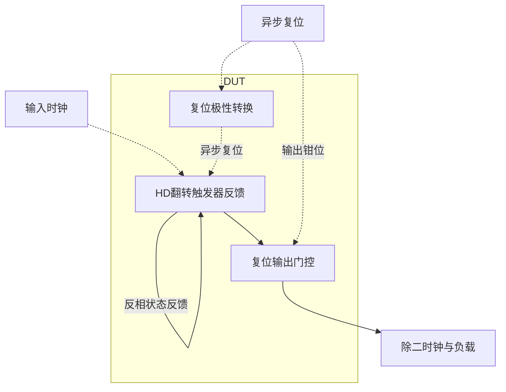
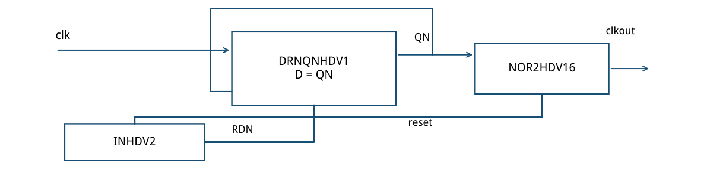
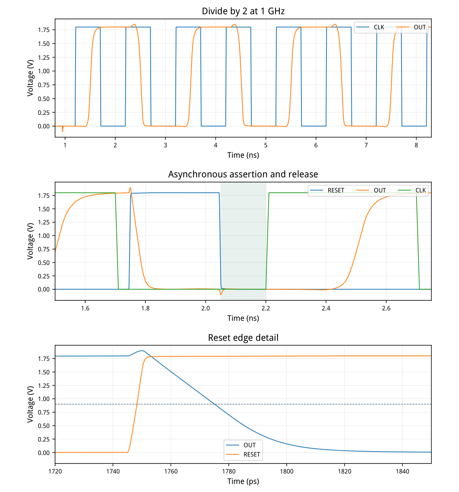
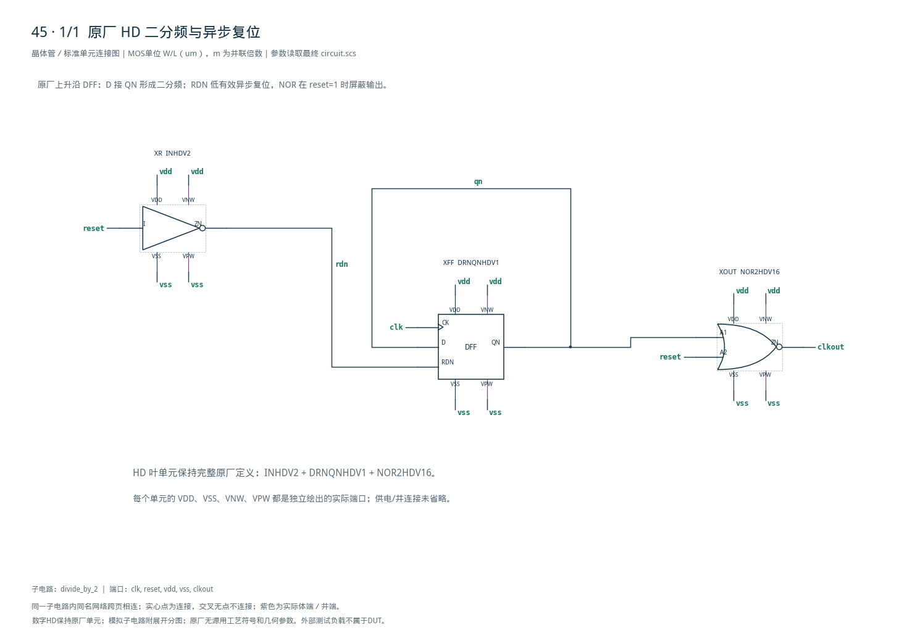

# 45 · HD 二分频审查报告

[审查 PDF](review.pdf) · [实测结果](latest_results.json) · [验收合同](contract.json) · [最终网表](circuit.scs)

## 验收结果

本模块把输入时钟频率除以二，并通过异步复位建立确定的初始状态。触发器反馈实现逐沿翻转，专用复位路径保证复位和释放时序；HD标准单元提供可复用的逻辑实现。芯片中常用于时钟分配、计数器和PLL反馈分频链；本模块只提供除二功能，不单独构成完整PLL。

结论：原始1 GHz时钟与20 fF负载下，全部 nominal 原始指标通过。条件：SMIC18MMRF / tt / 1.8 V / 27°C；时钟与复位各经20 ohm源阻抗，时钟边沿10 ps。使用原厂HD单元晶体管网表，无行为逻辑、无自定义门尺寸。

| 指标 | 实测 | 原门槛 | 10%边界 | 15%边界 | 单位 |
| --- | --- | --- | --- | --- | --- |
| 异步复位延迟 | 26.7837 | ≤100.000 | ≤110.000 | ≤115.000 | ps |
| 最大时钟到输出 | 304.4914 | ≤400.000 | ≤440.000 | ≤460.000 | ps |
| 占空比偏离50% | 0.0624 | ≤1.000 | ≤1.100 | ≤1.150 | 百分点 |

| 功能检查 | 实测 | 原门槛（不放宽） |
| --- | --- | --- |
| 输出频率 | 500.03141 MHz | 495–505 MHz |
| 高电平占空比 | 49.9376–49.9471% | 49–51% |
| 复位保持窗最大值 | 8.987 mV | ≤360 mV |
| 异步释放后/下一沿前 | 7.657 mV | ≤360 mV |
| 释放后下一有效沿 | 1.7921 V | ≥1.44 V |

FF内部状态确实复位；输出NOR提供快速拉低路径。复位释放时内部QN仍为高，不会提前产生输出上升。连接以第3页精确网表为准。

<!-- SYSTEM-BLOCK-DIAGRAM -->
## 系统框图

对应原厂DRNQN触发器及输出NOR门；不包含完整计数器或PLL。

实线表示信号或能量通路，虚线表示时钟、控制或偏置。DUT框外为外部端口或测试夹具；精确端子连接见后附基本电路图。



[独立Mermaid源文件](system_block_diagram.mmd) · [框图SVG](markdown_assets/system-block.svg)
<!-- END-SYSTEM-BLOCK-DIAGRAM -->



[查看矢量图](markdown_assets/figure-01-01.svg)

## 瞬态证据与边沿定义

边沿在实际DUT引脚0.9 V处线性插值；没有使用源端理想时刻替代。

复位前1.65 ns检查为高；1.85–2.04 ns检查保持低；2.05–2.20 ns检查异步释放保持；2.70 ns检查下一沿已正确翻转。逐周期周期与高/低宽度也单独验收。



[查看矢量图](markdown_assets/figure-02-01.svg)

## HD单元与精确连接

所有单元内部MOS尺寸和模型名保持原厂CDL值。

| 原厂单元 | 端序 | MOS数 |
| --- | --- | --- |
| DRNQNHDV1 | CK D QN RDN VDD VSS VNW VPW | 30 |
| INHDV2 | I ZN VDD VSS VNW VPW | 2 |
| NOR2HDV16 | A1 A2 ZN VDD VSS VNW VPW | 4 |

D与QN连接构成T触发器。RDN由reset反相驱动，使异步复位清除FF内部状态。NOR在外部reset为高时直接强制clkout为低，改善复位响应；它没有替代内部复位。VNW接VDD、VPW接VSS。

该模块是纯数字时序路径，按用户要求使用HD标准单元，不对其内部器件进行gm/ID重设计。模拟部分的gm/ID要求适用于另外的模拟核心。数字性能以这套原厂晶体管模型的实际瞬态结果为依据。

原始库：SCC018UG\_HD\_RVT\_V0.3a源CDL SHA-256：e6e262af41e959eca28dec1af498972f3fcb4e1239a927122baa90e3a1116b5c提取记录：cases/45-divider/hd\_cells\_manifest.json已转换单元：cases/45-divider/hd\_cells.scs

未覆盖：其他PVT、时钟抖动、全setup/hold扫描、复位recovery/removal统计、互连寄生。没有把本次波形作为上述范围的证明。

## 迭代、权衡与复现路径

失败迭代保留在runs/45；最终验收使用同一最终电路的两套测试。

| 触发器 | 输出门 | 最小高占比 | 延迟/ps | 复位/ps | 结论 |
| --- | --- | --- | --- | --- | --- |
| FF V1 | NOR V4 | 48.391% | 252.2 | 45.3 | 占空比失败 |
| FF V4 | NOR V8 | 48.507% | 251.5 | 34.1 | 占空比失败 |
| FF V1 | NOR V16 | 49.938% | 304.5 | 26.8 | 通过 |

第一版的频率、复位和时钟延迟通过，但占空比约48.39%，超出15%放宽后的窗口。第二版同时增大FF与输出门也没有解决。最终用FF V1 + NOR V16，得到49.94%左右占空比，同时保留304.5 ps以内延迟与26.8 ps复位。

工程认识：门驱动档位同时改变输出上/下沿延迟和前一级负载，因此“所有单元加大”并不保证占空比更好。这里通过未修改的标准单元组合找到时序平衡；不是手改晶体管尺寸。

复现命令（工程根目录）： /home/IC/CodeX/virtuoso-bridge-lite/.venv/bin/python scripts/case45\_divider.py --ff 1 --nor 16 生成PDF：同一Python运行 scripts/review\_pdf.py 45

结果：cases/45-divider/latest\_results.json分频运行：runs/45/20260922T055442345725Z\_divide复位运行：runs/45/20260922T055443514982Z\_reset每次run.json保存精确输入、模型和库哈希。

参考任务：sky130-transistor-divide-by-2。外部时钟、复位波形、源电阻和负载保持原nominal条件。

## 完整网表与电路图

[Spectre 网表](circuit.scs) · [全部分图 PDF](schematic/sheets.pdf) · [电路总图](schematic/full.svg) · [端子连接](schematic/connectivity.json)

<details>
<summary>展开完整 Spectre 网表</summary>

```spectre
// Unmodified HD library cells. Internal FF is reset; output NOR adds a fast assertion path.
simulator lang=spectre
subckt divide_by_2 (clk reset vdd vss clkout)
XR (reset rdn vdd vss vdd vss) INHDV2
XFF (clk qn qn rdn vdd vss vdd vss) DRNQNHDV1
XOUT (qn reset clkout vdd vss vdd vss) NOR2HDV16
ends divide_by_2
```

</details>



## 报告来源

正文与表格整理自已交付的矢量 PDF，图表单独提取；本文件是后续整理的 Markdown，不是原 PDF 的编译输入。原 PDF、网表及测量数据保持原值。
