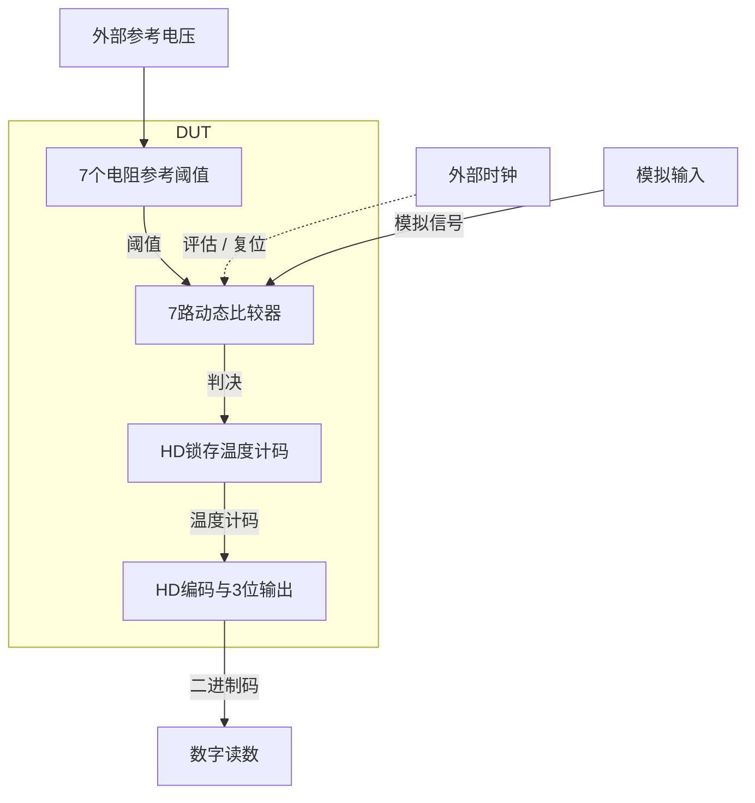
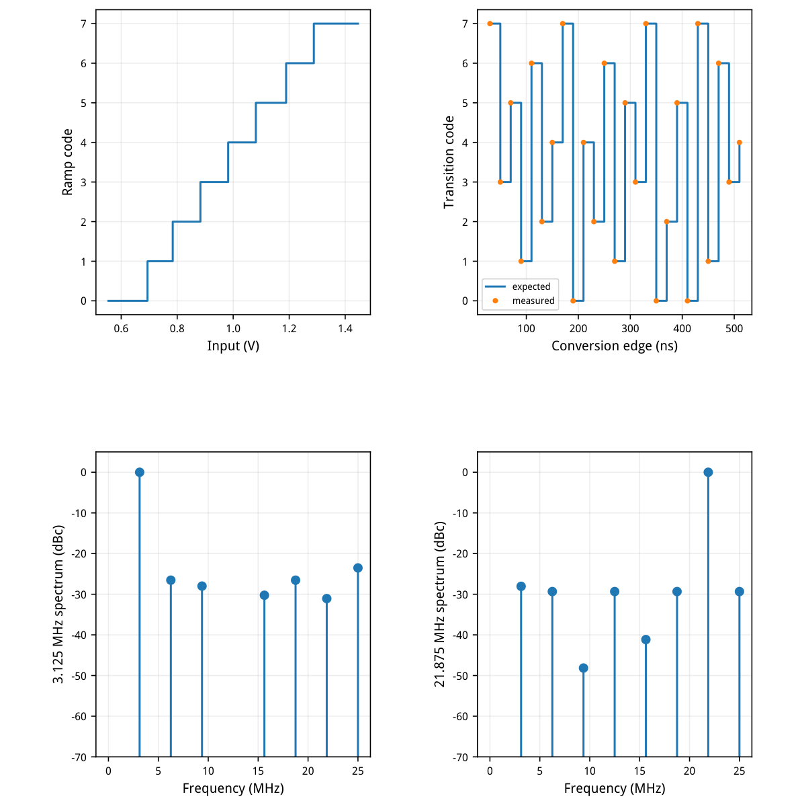
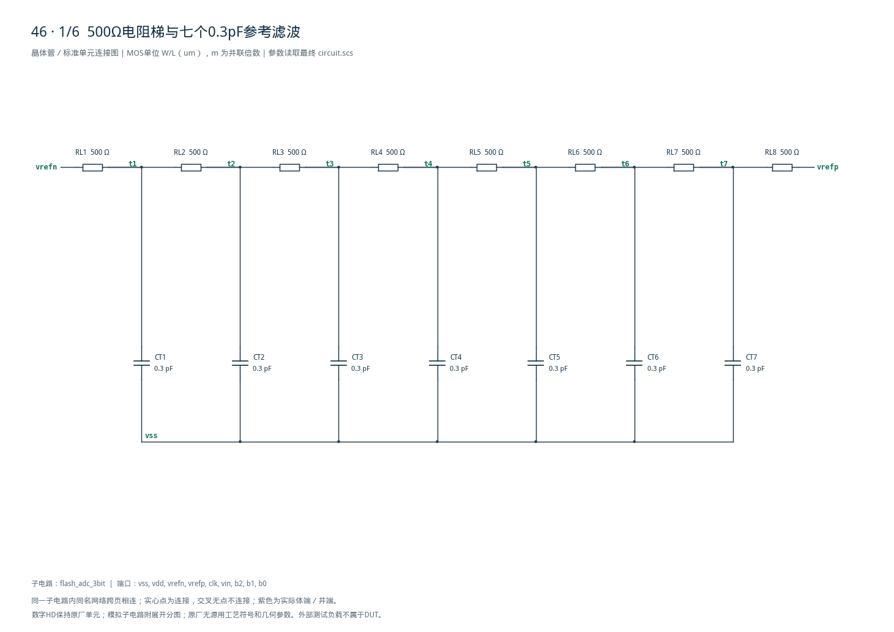
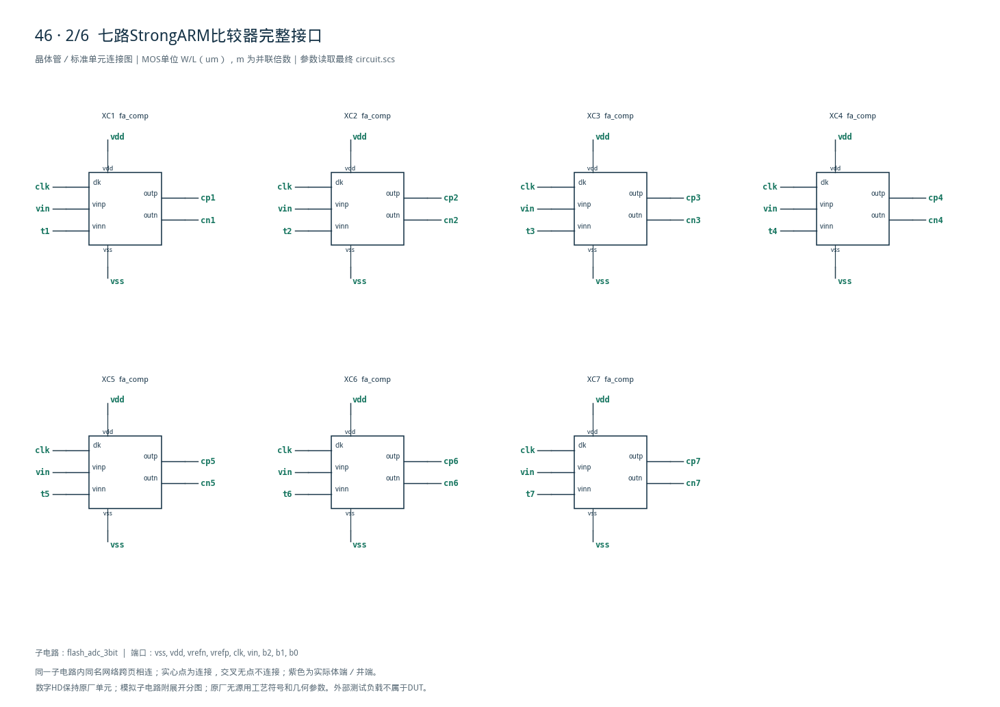
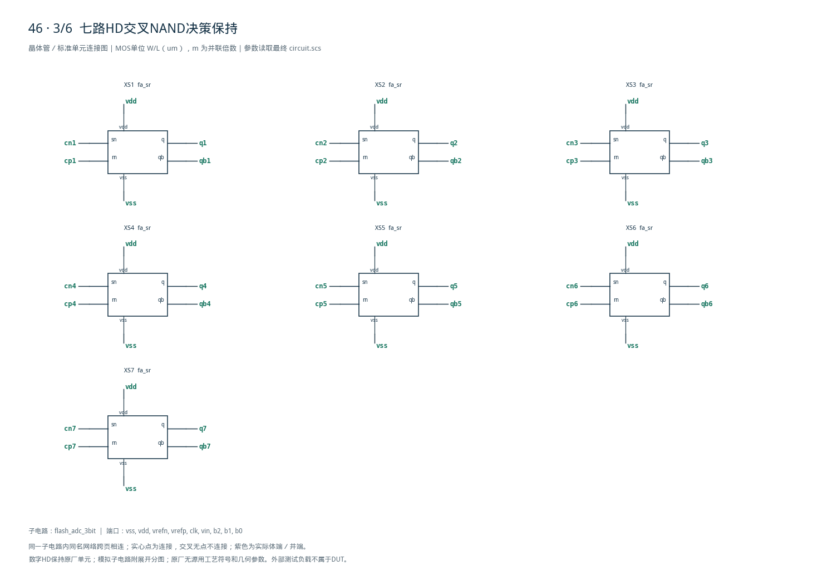
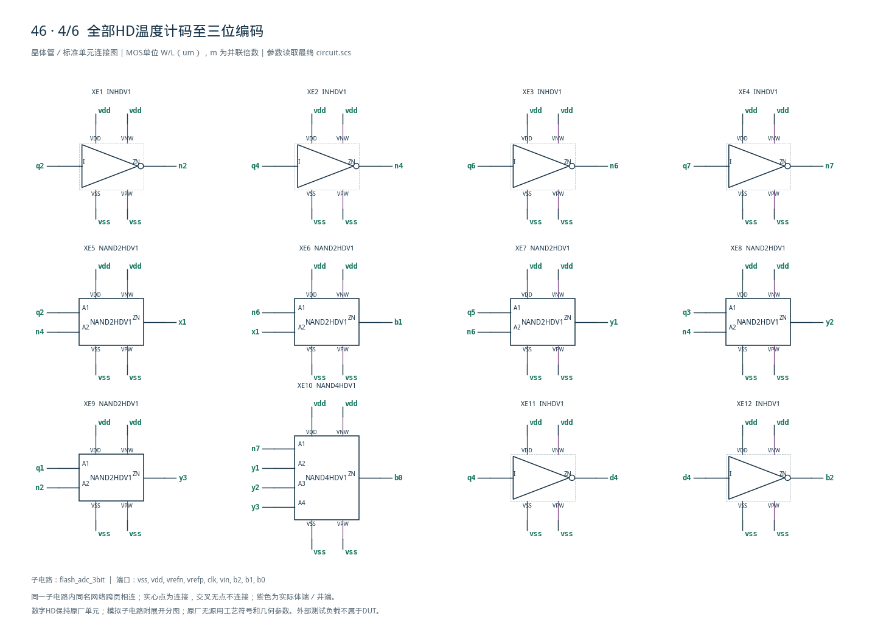
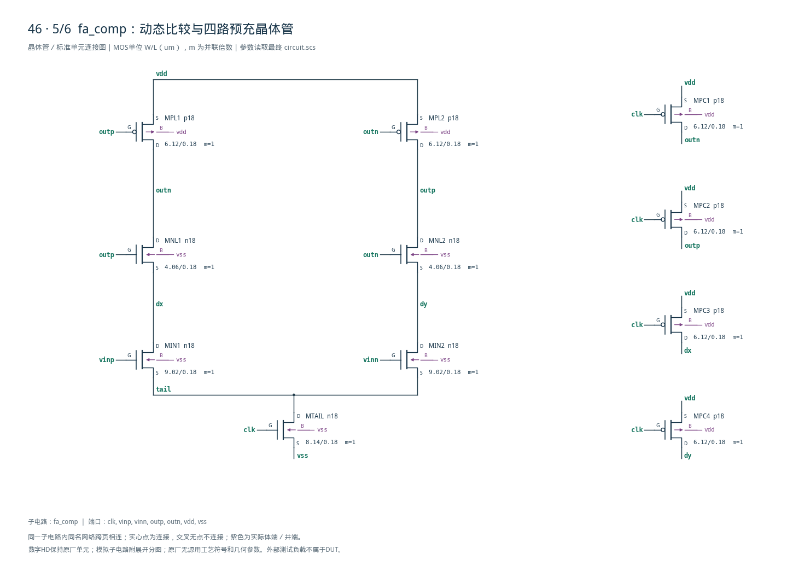
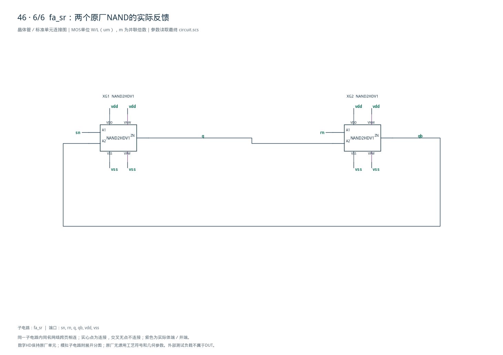

# 46 · 3位Flash ADC审查

[审查 PDF](review.pdf) · [实测结果](latest_results.json) · [验收合同](contract.json) · [最终网表](circuit.scs)

## 验收结果

本模块并行比较输入与七个电阻梯形阈值，以StrongARM动态比较器作出判决，用HD锁存器保存温度计码并编码为三位二进制。相比逐次逼近转换，Flash结构在一次时钟内完成并行判决，代价是比较器数量、参考负载和输入回踢随位数增加。芯片中可用于高速低分辨率ADC、流水线子ADC和快速幅度检测。

结论：TT/1.8V/27°C四类功能记录及原13组检查全部通过。

七路动态比较器并行判断输入与电阻梯阈值，SR锁存保持决策，HD逻辑编码成三位。相对逐次逼近无需逐位迭代，速度高；比较器、时钟负载及失配代价随位数增长，适合低位数高速量化。

| 指标 | 实测 | 原 | 10% | 15% |
| --- | --- | --- | --- | --- |
| 时钟到输出/ns | 0.690804 | ≤9.5 | ≤9.5 | ≤9.5 |
| 核心和参考/uW | 326.612 | ≤1000 | ≤1100 | ≤1150 |
| 正向时钟/uW | 43.6328 | ≤250 | ≤275 | ≤287.5 |
| DNL/LSB | 0.1 | ≤0.3 | ≤0.33 | ≤0.345 |
| INL/LSB | 0.09 | ≤0.3 | ≤0.33 | ≤0.345 |
| 绝对误差/LSB | 0.19 | ≤0.3 | ≤0.33 | ≤0.345 |
| 低频SNDR/dB | 20.0123 | ≥17 | ≥16.085 | ≥15.588 |
| 低频SFDR/dB | 26.537 | ≥21 | ≥20.085 | ≥19.588 |
| 低频归一ENOB | 3.12425 | ≥2.5 | ≥2.25 | ≥2.125 |
| 高频SNDR/dB | 22.4154 | ≥17 | ≥16.085 | ≥15.588 |
| 高频SFDR/dB | 28.0535 | ≥21 | ≥20.085 | ≥19.588 |
| 高频归一ENOB | 3.55823 | ≥2.5 | ≥2.25 | ≥2.125 |

静态斜坡覆盖8码、7个阈值，单调。跳码错误、缺失跳变、迟到跳变、无效电平和稳定窗违例全为0。有效低≤0.36V、高≥1.44V；9.5–19ns稳定窗及零错误要求不放宽。

归一ENOB来自原16点确定性记录与满量程校正；大于3不表示此3位ADC具备超过3位的物理分辨率，也不代表噪声、抖动或统计测试。

<!-- SYSTEM-BLOCK-DIAGRAM -->
## 系统框图

比较器、锁存和编码均在DUT；输入、参考和时钟属于固定测试端口。

实线表示信号或能量通路，虚线表示时钟、控制或偏置。DUT框外为外部端口或测试夹具；精确端子连接见后附基本电路图。



[独立Mermaid源文件](system_block_diagram.mmd) · [框图SVG](markdown_assets/system-block.svg)
<!-- END-SYSTEM-BLOCK-DIAGRAM -->

## 比较器阵列、保持与HD编码

七个11管StrongARM、七个双NAND SR锁存、十二个HD编码门。

| 角色 | 模型 | W/L um | gm/ID初算 | I初算/uA |
| --- | --- | --- | --- | --- |
| input | n18 | 9.02/0.18 | 14 | 100 |
| tail | n18 | 8.14/0.18 | 8 | 300 |
| latch_n | n18 | 4.06/0.18 | 10 | 100 |
| latch_p | p18 | 6.12/0.18 | 10 | 50 |
| precharge | p18 | 6.12/0.18 | 10 | 50 |

每个比较器含输入对、时钟尾管、交叉再生NMOS/PMOS各两只及四只预充PMOS。模拟再生核心按gm/ID初算，实际工作在复位、放电和再生等动态状态；固定饱和gm/ID不能代表整个周期。

原厂HD采用INHDV1、NAND2HDV1和NAND4HDV1；SR保持比较器结果，复位期间不把比较器预充值直接当有效输出。编码由6个反相器、5个二输入NAND、1个四输入NAND完成，内部器件尺寸不改。

电阻梯8×500Ω，参考0.6/1.4V，七个阈值节点各0.3pF。比较器与SR为复用定义：共54定义实例259端子；展开为77模拟MOS、26HD、15个R/C，即118个叶级实例。HD内部MOS另由原CDL保存。

时钟50MHz、50Ω源阻抗，三位输出各15fF；模拟输入为原合同理想电压源。电阻/电容为原题允许的理想无源，DUT内部无行为比较器、理想数字函数或受控源。

## 静态传输、跳码与动态频谱

两组原始正弦相位保持；所有图来自实际精算记录。

动态记录每组16码，分别覆盖7种码；不等同于静态缺码。静态全8码检查独立通过。功率100–500ns取有符号核心/参考均值；时钟只积正向供能，峰值电流3.698857mA作为诊断。



[查看矢量图](markdown_assets/figure-03-01.svg)

## 测量定义、精度与警告

所有动态试验明确投影至TT标称，保留原频率、相位和判码定义。

斜坡0.55→1.45V，100–2100ns；100次转换边沿110–2090ns。阈值取相邻代码对应输入的中点：0.694、0.784、0.883、0.982、1.081、1.189、1.288V。DNL/INL受此离散斜坡步进分辨率限制。

26码跳变序列含0↔7和内部码变化，25个评分周期；每周期检查全部中点交叉，最后/最迟交叉决定时延。每位9.5–19ns保持正确有效电平，未只在一个采样瞬间检查。

两正弦3.125/21.875MHz，相位212°/279.25°，中心1V、峰值0.39V；首边沿50ns，每20ns一次，在边沿+19ns判码。16码DFT中非DC、非基波谱线共同组成SNDR分母，最大杂散形成SFDR。

maxstep0.1→0.05ns、reltol1e-6→1e-7；29项数值确认通过，全部转换码不变，最大核心/参考功率差2.328429nW&lt;2uW。8运行实际0错误，每次2或5条LTE警告保留；精度确认不等于零警告。

独立原Python分析器接收实际Spectre波形，重算斜坡、全部跳变、稳定窗、核心/参考和正向时钟功率、递归DFT；29标量及原13组检查一致通过。模型、LUT、HD和源资料哈希不变。

## 最终完整网表 1/2

层级定义、7路实例与所有HD编码连接原样列出。

电路SHA-256：932079bd1b52f635b8632deb2e396f31044070eec8bb522322982af2f83ff7bd

## 最终完整网表 2/2

层级定义、7路实例与所有HD编码连接原样列出。

电路SHA-256：932079bd1b52f635b8632deb2e396f31044070eec8bb522322982af2f83ff7bd

## 范围、归一ENOB与复现证据

附后6页完整电路图；全部转换码和频谱功率随证据保存。

原算法：归一SNDR = SNDR + 10log10((16×8/4)² / P基波)，ENOB=(归一SNDR-1.76)/6.02。它保留原满量程归一口径；有限长度、特定相位的无噪声3位记录可能给出&gt;3的值，不能解释为实际精度提升。

核心功率=mean(-1.8·I(VDD)-1.4·I(VREFP)-0.6·I(VREFN))。正向时钟功率单列mean(max(-VCLK·I(VCLK),0))；输入理想源驱动功耗和真实外部时钟发生器损耗未计入原核心指标。

工程根目录，既有Bridge Python：scripts/case46\_flash\_adc.py → confirm46.py → schematic46.py → audit46.py → review46.py。重生成报告后须重新实际查看。conversion\_records与baseline\_conversion\_records保存每次码流、阈值和谱功率。

contract和原source固定实验条件，数值计划先于精算，独立明细保留原检查结果。当前四类记录都在TT1.8V27°C执行，两个正弦原压力角已明确投影到标称，未冒称原动态PVT点通过。

未做其他PVT、随机失配、噪声、抖动、统计亚稳态、输入驱动阻抗扫描、布局与PEX。PDK、LUT、HD库和既有Bridge/Spectre环境未修改。

## 完整网表与电路图

[Spectre 网表](circuit.scs) · [全部分图 PDF](schematic/sheets.pdf) · [电路总图](schematic/full.svg) · [端子连接](schematic/connectivity.json)

<details>
<summary>展开完整 Spectre 网表</summary>

```spectre
simulator lang=spectre
subckt fa_comp (clk vinp vinn outp outn vdd vss)
MTAIL (tail clk vss vss) n18 w=8.14u l=.18u
MIN1 (dx vinp tail vss) n18 w=9.02u l=.18u
MIN2 (dy vinn tail vss) n18 w=9.02u l=.18u
MNL1 (outn outp dx vss) n18 w=4.06u l=.18u
MNL2 (outp outn dy vss) n18 w=4.06u l=.18u
MPL1 (outn outp vdd vdd) p18 w=6.12u l=.18u
MPL2 (outp outn vdd vdd) p18 w=6.12u l=.18u
MPC1 (outn clk vdd vdd) p18 w=6.12u l=.18u
MPC2 (outp clk vdd vdd) p18 w=6.12u l=.18u
MPC3 (dx clk vdd vdd) p18 w=6.12u l=.18u
MPC4 (dy clk vdd vdd) p18 w=6.12u l=.18u
ends fa_comp
subckt fa_sr (sn rn q qb vdd vss)
XG1 (sn qb q vdd vss vdd vss) NAND2HDV1
XG2 (rn q qb vdd vss vdd vss) NAND2HDV1
ends fa_sr
subckt flash_adc_3bit (vss vdd vrefn vrefp clk vin b2 b1 b0)
RL1 (t1 vrefn) resistor r=500
RL2 (t2 t1) resistor r=500
RL3 (t3 t2) resistor r=500
RL4 (t4 t3) resistor r=500
RL5 (t5 t4) resistor r=500
RL6 (t6 t5) resistor r=500
RL7 (t7 t6) resistor r=500
RL8 (vrefp t7) resistor r=500
CT1 (t1 vss) capacitor c=0.3p
XC1 (clk vin t1 cp1 cn1 vdd vss) fa_comp
XS1 (cn1 cp1 q1 qb1 vdd vss) fa_sr
CT2 (t2 vss) capacitor c=0.3p
XC2 (clk vin t2 cp2 cn2 vdd vss) fa_comp
XS2 (cn2 cp2 q2 qb2 vdd vss) fa_sr
CT3 (t3 vss) capacitor c=0.3p
XC3 (clk vin t3 cp3 cn3 vdd vss) fa_comp
XS3 (cn3 cp3 q3 qb3 vdd vss) fa_sr
CT4 (t4 vss) capacitor c=0.3p
XC4 (clk vin t4 cp4 cn4 vdd vss) fa_comp
XS4 (cn4 cp4 q4 qb4 vdd vss) fa_sr
CT5 (t5 vss) capacitor c=0.3p
XC5 (clk vin t5 cp5 cn5 vdd vss) fa_comp
XS5 (cn5 cp5 q5 qb5 vdd vss) fa_sr
CT6 (t6 vss) capacitor c=0.3p
XC6 (clk vin t6 cp6 cn6 vdd vss) fa_comp
XS6 (cn6 cp6 q6 qb6 vdd vss) fa_sr
CT7 (t7 vss) capacitor c=0.3p
XC7 (clk vin t7 cp7 cn7 vdd vss) fa_comp
XS7 (cn7 cp7 q7 qb7 vdd vss) fa_sr
XE1 (q2 n2 vdd vss vdd vss) INHDV1
XE2 (q4 n4 vdd vss vdd vss) INHDV1
XE3 (q6 n6 vdd vss vdd vss) INHDV1
XE4 (q7 n7 vdd vss vdd vss) INHDV1
XE5 (q2 n4 x1 vdd vss vdd vss) NAND2HDV1
XE6 (n6 x1 b1 vdd vss vdd vss) NAND2HDV1
XE7 (q5 n6 y1 vdd vss vdd vss) NAND2HDV1
XE8 (q3 n4 y2 vdd vss vdd vss) NAND2HDV1
XE9 (q1 n2 y3 vdd vss vdd vss) NAND2HDV1
XE10 (n7 y1 y2 y3 b0 vdd vss vdd vss) NAND4HDV1
XE11 (q4 d4 vdd vss vdd vss) INHDV1
XE12 (d4 b2 vdd vss vdd vss) INHDV1
ends flash_adc_3bit
```

</details>













## 报告来源

正文与表格整理自已交付的矢量 PDF，图表单独提取；本文件是后续整理的 Markdown，不是原 PDF 的编译输入。原 PDF、网表及测量数据保持原值。
