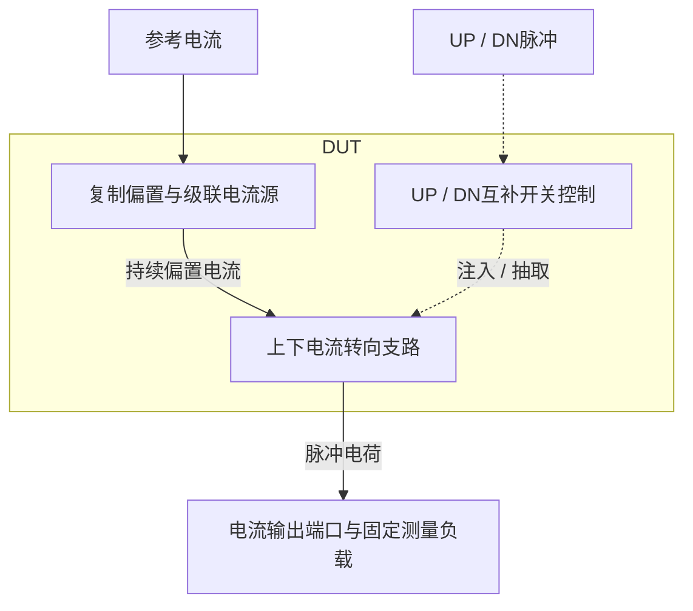
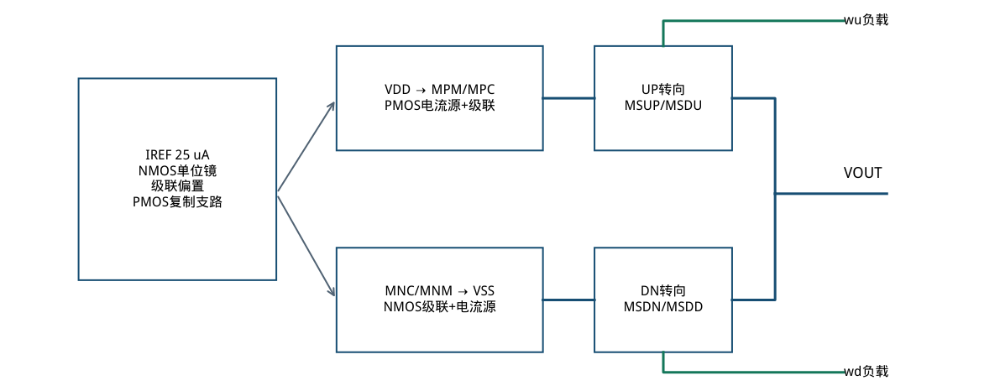
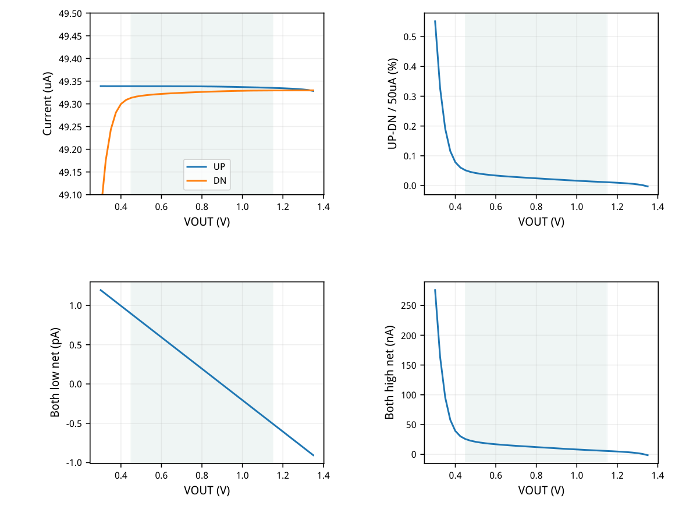
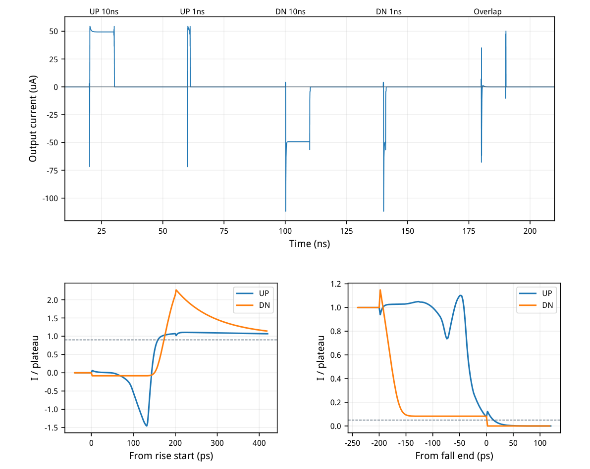
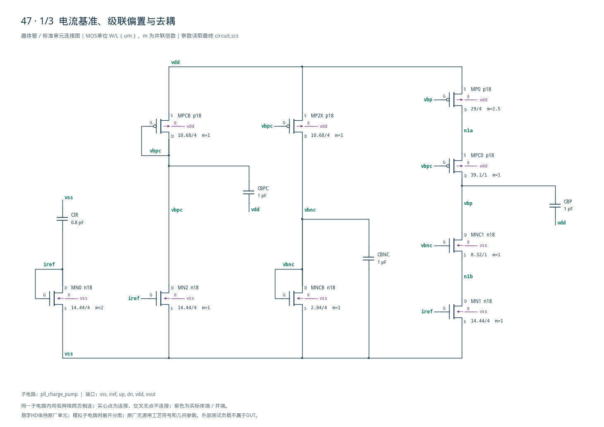
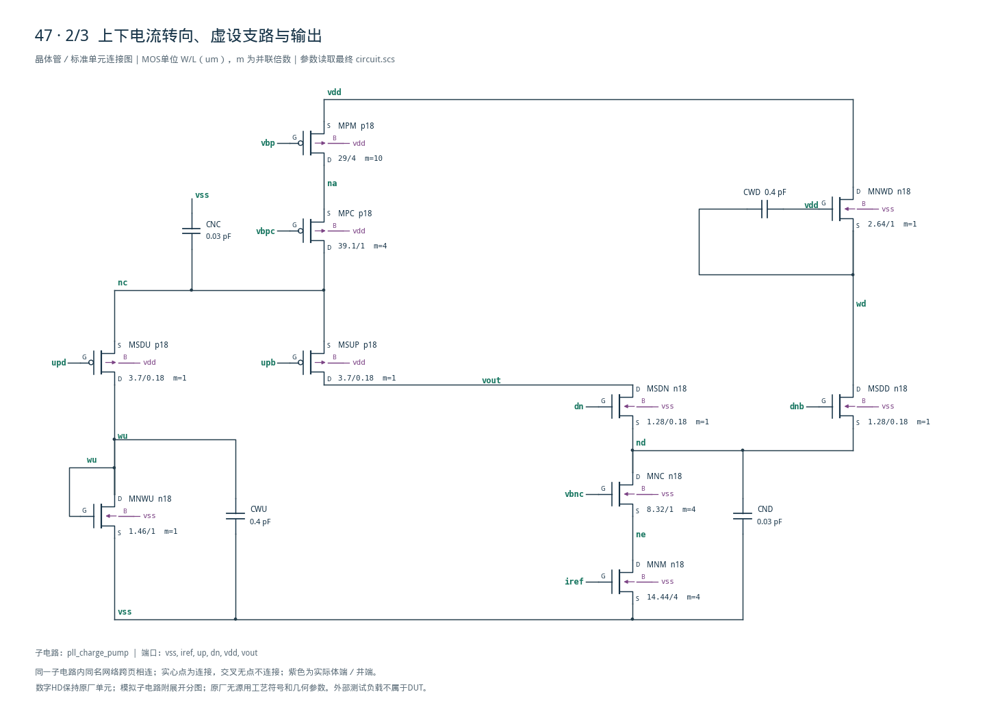
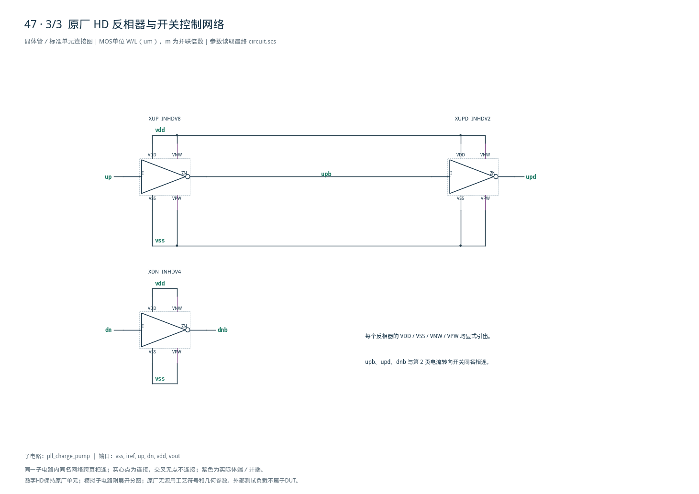

# 47 · PLL 电荷泵审查报告

[审查 PDF](review.pdf) · [实测结果](latest_results.json) · [验收合同](contract.json) · [最终网表](circuit.scs)

## 验收结果

本模块把UP和DN数字脉冲转换成向环路滤波器注入或抽取的电流，使脉冲宽度对应电荷量。相比直接启停电流源，电流转向结构让偏置支路持续工作，可减小重启延迟；级联管和复制偏置改善输出电压变化下的电流匹配，代价是静态功耗与电压余量。芯片中主要用于电荷泵PLL，将鉴相器的相位误差信号转换为振荡器控制电压的变化。

结论：DC四状态、宽/窄脉冲、重叠电荷与开关速度全部原nominal通过。条件：SMIC18MMRF / tt / 1.8 V / 27°C，唯一外部模拟参考25 uA。输出0.45–1.15 V检查电流精度，0.30–1.35 V检查关断漏电；瞬态输出钳位0.9 V，控制上/下沿均200 ps。

| 指标 | 实测 | 原门槛 | 10%边界 | 15%边界 | 单位 |
| --- | --- | --- | --- | --- | --- |
| UP绝对电流误差 | 1.3295 | ≤5 | ≤5.5 | ≤5.75 | % |
| DN绝对电流误差 | 1.3734 | ≤5 | ≤5.5 | ≤5.75 | % |
| UP平坦度 | 0.0075552 | ≤1 | ≤1.1 | ≤1.15 | % |
| DN平坦度 | 0.032996 | ≤1 | ≤1.1 | ≤1.15 | % |
| UP/DN匹配误差 | 0.051377 | ≤2 | ≤2.2 | ≤2.3 | % |
| 两路低/最大漏电 | 0.0011945 | ≤1 | ≤1.1 | ≤1.15 | nA |
| 两路高/净电流 | 0.025688 | ≤1 | ≤1.1 | ≤1.15 | uA |
| UP 10ns电荷误差 | 0.26346 | ≤5 | ≤5.5 | ≤5.75 | % |
| DN 10ns电荷误差 | 0.059243 | ≤5 | ≤5.5 | ≤5.75 | % |
| UP 1ns电荷误差 | 1.4649 | ≤25 | ≤27.5 | ≤28.75 | % |
| DN 1ns电荷误差 | 0.44621 | ≤25 | ≤27.5 | ≤28.75 | % |
| 重叠净电荷 | 1.0983 | ≤20 | ≤22 | ≤23 | fC |
| 最坏开启时间 | 173.03 | ≤500 | ≤550 | ≤575 | ps |
| 最坏关断时间 | 13.249 | ≤50 | ≤55 | ≤57.5 | ps |
| 平均VDD功耗 | 284.73 | ≤500 | ≤550 | ≤575 | uW |

UP电流49.3352–49.3390 uA；DN为49.3133–49.3296 uA。所有43个DC点、其中29个合规点均保留，匹配按原0.45/0.90/1.15 V三点验收；全29点的最坏匹配也为0.05138%。

没有运行其他PVT或20个tt\_mm固定种子；不宣称随机匹配、PLL杂散或锁定性能。开关速度参考时刻与脉冲电荷归一化见文末完整网表，不能将本表延迟直接当作逻辑门传播延迟。

<!-- SYSTEM-BLOCK-DIAGRAM -->
## 系统框图

本例只有电荷泵；鉴相器、环路滤波器和VCO未作为已实现的PLL系统画入。

实线表示信号或能量通路，虚线表示时钟、控制或偏置。DUT框外为外部端口或测试夹具；精确端子连接见后附基本电路图。



[独立Mermaid源文件](system_block_diagram.mmd) · [框图SVG](markdown_assets/system-block.svg)
<!-- END-SYSTEM-BLOCK-DIAGRAM -->

## 电流转向、复制偏置与尺寸

主电流始终存在，低控制状态把电流转向内部dummy支路。

| 器件角色 | 单位W/L (um) | 初始gm/ID | LUT单位电流/uA |
| --- | --- | --- | --- |
| NMOS镜单位 | 14.44 / 4 | 12 | 12.5 |
| PMOS镜单位 | 29 / 4 | 12 | 5 |
| NMOS级联单位 | 8.32 / 1 | 16 | 12.5 |
| PMOS级联单位 | 39.1 / 1 | 16 | 12.5 |
| NCB偏置二极管 | 2.04 / 4 | 4.5 | 12.5 |
| PCB偏置二极管 | 10.68 / 4 | 4.5 | 12.5 |
| DN转向管 ×2 | 1.28 / 0.18 | 8 | 50 |
| UP转向管 ×2 | 3.7 / 0.18 | 8 | 50 |
| wu二极管 | 1.46 / 1 | 3.5 | 50 |
| wd源跟随 | 2.64 / 1 | 5 | 50 |

并联倍数：MN0=2；MN1/MN2=1；MNM/MNC=4；MP0=2.5；MPM=10；MPC=4；复制级联MPC0/MNC1=1。单位W均未超过100 um模型上限。UP/UPD/DN反相器为原厂INHDV8/2/4。

偏置滤波：vbp/vbpc/vbnc各1 pF，iref 0.8 pF；dummy负载各0.4 pF，nc/nd各30 fF。DUT只有PDK MOS和正值电容，未加入理想电阻或内部激励源。精确连接见文末完整网表。



[查看矢量图](markdown_assets/figure-02-01.svg)

## 静态合规、匹配与电压余量

输出由外部电压源钳位并测其支路电流；UP为正，DN取吸入电流的绝对方向。

| 合规范围内器件 | 最小 \|VDS\|−\|VDSAT\| / mV | 出现的VOUT/V |
| --- | --- | --- |
| UP主镜 MPM | 92.099 | 1.15 |
| UP级联 MPC | 241.303 | 1.15 |
| DN主镜 MNM | 105.058 | 0.45 |
| DN级联 MNC | 58.163 | 0.45 |

参考MN0的VDS约0.5335 V，主镜约0.255 V；漏压差使电流较理想50 uA低约1.37%。复制支路与输出支路维持相近电流密度和主镜漏压，因此UP/DN匹配优于各自绝对精度。

最紧余量在低端DN级联，仅58.16 mV；它支持本次nominal工作点，不构成跨PVT证明。转向开关在线性区是其正常用途，不能套用电流源饱和判据。



[查看矢量图](markdown_assets/figure-03-01.svg)

## 窄脉冲、重叠电荷与延迟定义

瞬态0–220 ns，最大步长/采样间隔2 ps；开启从输入上升开始计，关断从下降结束计。

| 支路 | 10ns电荷/fC | 1ns电荷/fC | 开启/ps | 关断/ps |
| --- | --- | --- | --- | --- |
| UP | 494.6792 | 50.1926 | 158.651 | 13.249 |
| DN | 493.5700 | 49.5772 | 173.027 | 0.787 |

Q10按本支路DC(0.9 V)×10 ns归一；Q1按实测Q10/10归一。积分窗分别15–45、55–75、95–125、135–155 ns；重叠175–205 ns，净电荷1.0983 fC。没有只对理想脉冲持续段积分。

开启门限为末段平台90%，使用首次交越；图中仍有明显注入尖峰。重叠指标是净积分绝对值，不是绝对电流积分。DN关断0.79 ps为2 ps样点间插值；最坏UP13.25 ps满足原50 ps限制。



[查看矢量图](markdown_assets/figure-04-01.svg)

## 精确网表、工程认识与复现

最终电路保留25 uA外部参考、原控制时序和所有nominal测量窗口。

电流转向维持主镜和级联偏置，dummy负载使切换节点电压接近输出。UP nc由关断时1.031 V变为导通1.021 V；DN nd由0.764 V变为0.820 V。残余节点变化与开关注入共同影响短脉冲电荷。

供电功耗284.727 uW按原定义取−VDD×I(VDD)的0–220 ns平均，包含25 uA参考、永久偏置与数字门。输出固定0.9 V的外部源负责收送电荷；该功耗指标不是PLL完整系统的能耗。

复现：/home/IC/CodeX/virtuoso-bridge-lite/.venv/bin/python scripts/case47\_charge\_pump.py PDF：同一Python运行 scripts/review\_pdf.py 47运行：runs/47/20260922T085304148574Z\_dc runs/47/20260922T085304377636Z\_pulse

源任务：sky130-pll-charge-pump-pvt。原始合同、LUT查询、HD来源与全部运行依赖哈希分别保存在cases/47-charge-pump和上述runs目录。

## 完整网表与电路图

[Spectre 网表](circuit.scs) · [全部分图 PDF](schematic/sheets.pdf) · [电路总图](schematic/full.svg) · [端子连接](schematic/connectivity.json)

<details>
<summary>展开完整 Spectre 网表</summary>

```spectre
// Current steering charge pump; only PDK MOS and bias capacitors in DUT.
simulator lang=spectre
subckt pll_charge_pump (vss iref up dn vdd vout)
MN0 (iref iref vss vss) n18 w=14.44u l=4u m=2
MN2 (vbpc iref vss vss) n18 w=14.44u l=4u m=1
MPCB (vbpc vbpc vdd vdd) p18 w=10.68u l=4u m=1
MP2X (vbnc vbpc vdd vdd) p18 w=10.68u l=4u m=1
MNCB (vbnc vbnc vss vss) n18 w=2.04u l=4u m=1
MP0 (n1a vbp vdd vdd) p18 w=29u l=4u m=2.5
MPC0 (vbp vbpc n1a vdd) p18 w=39.1u l=1u m=1
MNC1 (vbp vbnc n1b vss) n18 w=8.32u l=1u m=1
MN1 (n1b iref vss vss) n18 w=14.44u l=4u m=1
MPM (na vbp vdd vdd) p18 w=29u l=4u m=10
MPC (nc vbpc na vdd) p18 w=39.1u l=1u m=4
MSUP (vout upb nc vdd) p18 w=3.7u l=0.18u m=1
MSDU (wu upd nc vdd) p18 w=3.7u l=0.18u m=1
MNWU (wu wu vss vss) n18 w=1.46u l=1u m=1
MNM (ne iref vss vss) n18 w=14.44u l=4u m=4
MNC (nd vbnc ne vss) n18 w=8.32u l=1u m=4
MSDN (vout dn nd vss) n18 w=1.28u l=0.18u m=1
MSDD (wd dnb nd vss) n18 w=1.28u l=0.18u m=1
MNWD (vdd vdd wd vss) n18 w=2.64u l=1u m=1
XUP (up upb vdd vss vdd vss) INHDV8
XUPD (upb upd vdd vss vdd vss) INHDV2
XDN (dn dnb vdd vss vdd vss) INHDV4
CBP (vbp vdd) capacitor c=1p
CBPC (vbpc vdd) capacitor c=1p
CBNC (vbnc vss) capacitor c=1p
CIR (iref vss) capacitor c=.8p
CWU (wu vss) capacitor c=.4p
CWD (wd vdd) capacitor c=.4p
CNC (nc vss) capacitor c=30f
CND (nd vss) capacitor c=30f
ends pll_charge_pump
```

</details>







## 报告来源

正文与表格整理自已交付的矢量 PDF，图表单独提取；本文件是后续整理的 Markdown，不是原 PDF 的编译输入。原 PDF、网表及测量数据保持原值。
