# 48-sar-adc4bit 审查报告

PDF由Python/Matplotlib排版生成。此Markdown从同一报告文本、表格和网表保存，便于编辑；它不是PDF编译输入。完整生成脚本随implementation目录保存。

<!-- SYSTEM-BLOCK-DIAGRAM -->
## 系统框图

CDAC、比较器及异步握手均为实际DUT；内部比较时钟由有效判决推进，不能画成外部理想逐位控制。

实线表示信号或能量通路，虚线表示时钟、控制或偏置。DUT框外为外部端口或测试夹具；精确端子连接见后附基本电路图。

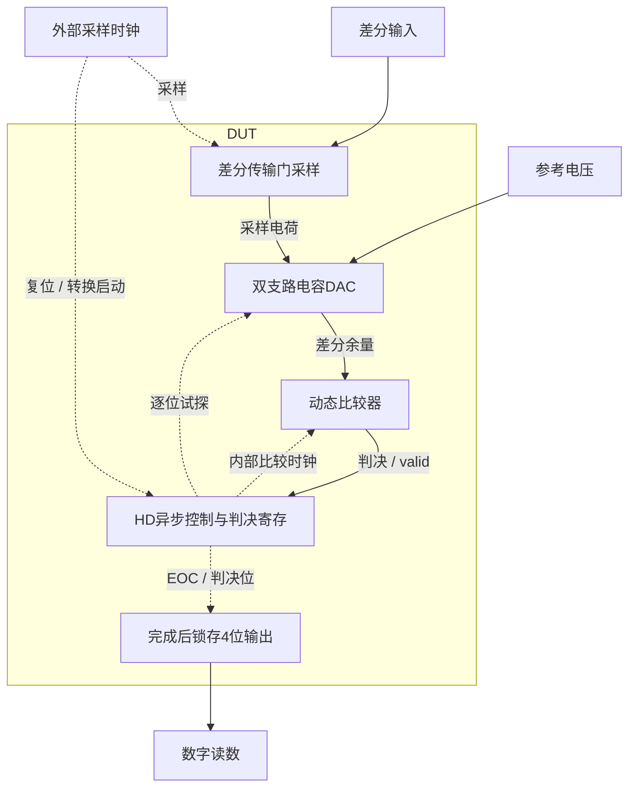
```mermaid
flowchart TB
    subgraph DUT["DUT"]
        direction TB
        S["差分传输门采样"]
        D["双支路电容DAC"]
        C["动态比较器"]
        L["HD异步控制与判决寄存"]
        R["完成后锁存4位输出"]
    end
    VIN["差分输入"]
    REF["参考电压"]
    CLK["外部采样时钟"]
    OUT["数字读数"]
    VIN --> S
    S -->|"采样电荷"| D
    REF --> D
    D -->|"差分余量"| C
    C -->|"判决 / valid"| L
    L -.->|"逐位试探"| D
    L -.->|"内部比较时钟"| C
    L -.->|"EOC / 判决位"| R
    R --> OUT
    CLK -.->|"采样"| S
    CLK -.->|"复位 / 转换启动"| L
```

[独立Mermaid源文件](system_block_diagram.mmd) · [框图SVG](markdown_assets/system-block.svg)
<!-- END-SYSTEM-BLOCK-DIAGRAM -->

## 48 | 4位异步SAR ADC

本模块通过差分采样、电容DAC逐位试探和单个动态比较器，把输入电压量化为四位数字码。异步控制器在每次判决有效后推进下一位，并在转换完成时寄存输出；相对Flash结构，它减少并行比较器数量，代价是串行建立时间、电容匹配与采样回踢需要共同控制。芯片中可用于低位数数据采集、传感器接口和子ADC。

结论：TT / 1.8V / 27°C，完整原始标称指标通过。

100MS/s，两组各16个乱序码中心包含采样结束后的诱骗输入。两组均零错误，所有判码电平有效；时钟50Ω源阻抗、10fF/位输出负载保持原题。

| 指标 | 实测 | 原指标 | 10% | 15% |
| --- | --- | --- | --- | --- |
| SNDR/dB | 27.55147 | >24 | >23.0849 | >22.5884 |
| 归一化ENOB/bit | 4.317249 | >3.9 | >3.51 | >3.315 |
| 最坏单记录功耗/mW | 1.032955 | ≤5 | ≤5.5 | ≤5.75 |

第二频率/相位动态记录的SNDR=27.551473dB，ENOB=4.317249bit。原SS/FF不在本次nominal范围。

归一化ENOB是原验收公式的确定性码序指标：以理想满量程谱功率除以实测非基波功率换算。有限相干码序可以得到大于4的值；这不代表ADC产生超过4位的信息，也不证明含热噪声、失配后的有效分辨率。

## gm/ID初算、采样与异步控制

原生模拟MOS与正值理想电容；全部数字单元保持原厂HD尺寸。

| 角色 | 模型 | 单位W/L um | gm/ID | 初算Id/uA |
| --- | --- | --- | --- | --- |
| input | n18 | 9.02/0.18 | 14.0 | 100 |
| tail | n18 | 8.14/0.18 | 8.0 | 300 |
| latch_n | n18 | 4.06/0.18 | 10.0 | 100 |
| latch_p | p18 | 6.12/0.18 | 10.0 | 50 |
| sample_n | n18 | 6.78/0.18 | 8.0 | 250 |
| sample_p | p18 | 20.04/0.18 | 8.0 | 250 |
| dac_n | n18 | 0.68/0.18 | 8.0 | 25 |
| dac_p | p18 | 2/0.18 | 8.0 | 25 |

实际比较器宽度为表中初算的1倍；CDAC单位电容50fF，二进制权重扩展，顶板dummy为10fF。异步返回路径电容70fF。gm/ID用于初始选型，动态再生过程的瞬时gm/ID不恒定。

四位差分输入用互补传输门采样。VALID推进判决链，每位控制两侧CDAC，EOC把整字码锁到输出；与当前转换重叠的下一次采样不会提前覆盖正式输出。

## 双次序保持检查与动态频谱

来自最终Spectre精算；频谱从-80dBc基线向上画。

两种完整16码次序、动态码序与单边频谱。低于-80dBc的谱线仅在显示时截底；评分使用未经截断的原始功率。

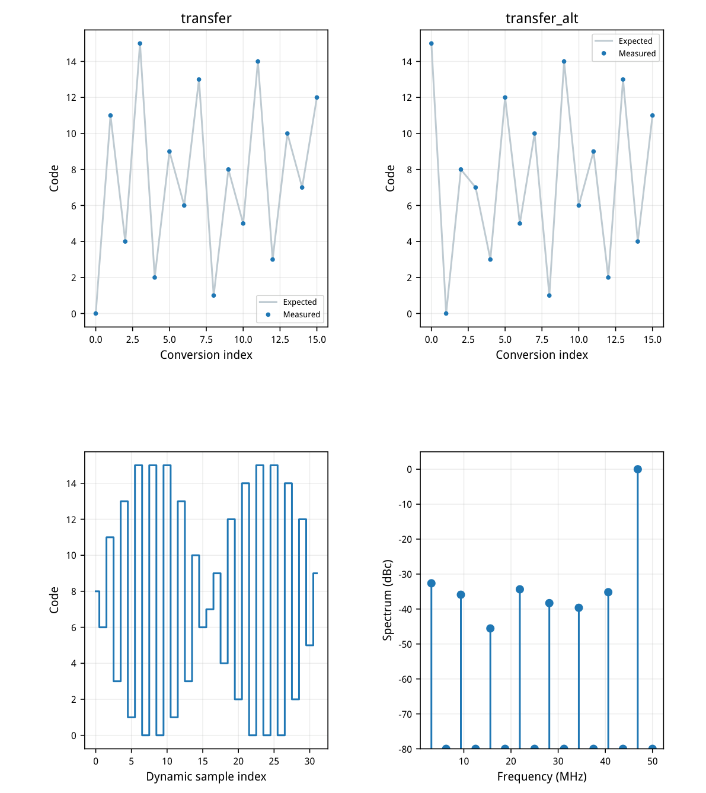

[查看矢量图](markdown_assets/figure-03-01.svg)

Nyquist点按原评分计半权功率；图中展示其原单边DFT幅值，未用于改变验收结果。

## 固定刺激、读出与能量口径

原始时钟、码次序、诱骗输入和功率窗口均保留。

采样时钟周期10ns、延时1ps、上升/下降20ps、高电平宽1.98ns。输入共模0.9V，动态每侧峰值0.85V；VREFP=1.8V、VREFN=0V。采样后2.20–2.25ns把输入换成错误码中心，验证实际保持。

四位静态从34.5ns起读16码，动态从44.5ns起读32码，每10ns一次；这是原题输出寄存器的一次转换延迟口径。两组动态分别为bin15/phase0和bin13/phase17°；功率窗口39.5–359.5ns。

能量由VDD、VREFP、VCM、VINP、VINN及VCLKS六个源的有符号电压×电流相加，再截取原窗口作时间加权积分。包括理想输入源与时钟净供能；回收能量按原题有符号口径保留。没有仅统计核心VDD来压低功耗。

矩形窗去DC，取第1至N/2-1点中除基波以外全部功率，并加Nyquist点的一半；未排除谐波或邻频点。P_FS=(N×2^bits/4)²，归一化ENOB=[10log10(P_FS/P_noise)-1.76]/6.02。

输出低电平≤0.36V、高电平≥1.44V，完整码序与数字电平检查不可随10%/15%档放宽。

## 数值确认、独立审查与可复现材料

全部报告文本和表格保留Markdown；网表、HD源块和模型/LUT哈希归档。

maxstep50→25ps，全局reltol1e-5→1e-6；conservative瞬态实际相对容差为1e-6→1e-7。18项预先设定的差异检查均通过，所有转换码逐点一致，最大功率差0.00510475uW<5uW。

独立复核对原始波形另作逐点插值，调用未改动的原解码器、递归FFT和4项电气检查，共13项数值交叉核对通过。8次基线/精算均实际0错误；警告原样保留，不把Bridge日志分类误当作实际仿真错误。

完整图纸13页，覆盖60个定义实例、355个端子和67个展开叶实例。比较器、采样器、CDAC与异步控制器全部有定义图；HD单元保持厂商边界和实际井端。

复现入口：case48_sar_adc4bit.py → confirm48.py → schematic48.py → audit48.py → review48.py。保留原source、完整码流、采样电平、FFT功率、数值计划、原始运行快照、PDF及可编辑review_report.md。完整电路图附后。

未执行器件噪声、失配、参考阻抗、亚稳态统计、PEX或可靠性寿命分析；电路SHA-256：
a87f8ceb7193b5c69bc95a629ca3d628484b30cb708e843db74e2d94b0687f8d

## 完整网表与电路图

[Spectre 网表](circuit.scs) · [全部分图 PDF](schematic/sheets.pdf) · [电路总图](schematic/full.svg) · [端子连接](schematic/connectivity.json)

<details>
<summary>展开完整 Spectre 网表</summary>

```spectre
simulator lang=spectre
subckt sar_cmp (clk outn outp vss vdd vinn vinp)
MTAIL (tail clk vss vss) n18 w=8.14u l=.18u
MINP (dx vinp tail vss) n18 w=9.02u l=.18u
MINN (dy vinn tail vss) n18 w=9.02u l=.18u
MLN (ln lp dx vss) n18 w=4.06u l=.18u
MLP (lp ln dy vss) n18 w=4.06u l=.18u
MPN (ln lp vdd vdd) p18 w=6.12u l=.18u
MPP (lp ln vdd vdd) p18 w=6.12u l=.18u
MRST_dx (dx clk vdd vdd) p18 w=6.12u l=.18u
MRST_dy (dy clk vdd vdd) p18 w=6.12u l=.18u
MRST_ln (ln clk vdd vdd) p18 w=6.12u l=.18u
MRST_lp (lp clk vdd vdd) p18 w=6.12u l=.18u
XON (ln outp vdd vss vdd vss) INHDV4
XOP (lp outn vdd vss vdd vss) INHDV4
ends sar_cmp
subckt sar_sample (clk clkb vin vout vdd vss)
MSN (vout clk vin vss) n18 w=6.78u l=.18u
MSP (vout clkb vin vdd) p18 w=20.04u l=.18u
ends sar_sample
subckt sar_cdac (clks clkb dctrl3 dctrl2 dctrl1 vss vdd vin vrefn vrefp vtop)
XS (clks clkb vin vtop vdd vss) sar_sample
CD (vtop vss) capacitor c=10f
C1 (vtop bot1) capacitor c=50f
MN1 (bot1 dctrl1 vrefn vss) n18 w=0.68u l=.18u
MP1 (bot1 dctrl1 vrefp vdd) p18 w=2u l=.18u
C2 (vtop bot2) capacitor c=100f
MN2 (bot2 dctrl2 vrefn vss) n18 w=1.36u l=.18u
MP2 (bot2 dctrl2 vrefp vdd) p18 w=4u l=.18u
C3 (vtop bot3) capacitor c=200f
MN3 (bot3 dctrl3 vrefn vss) n18 w=2.72u l=.18u
MP3 (bot3 dctrl3 vrefp vdd) p18 w=8u l=.18u
ends sar_cdac
subckt sar_logic (clkc cmpck dcmpn dcmpp dctrln3 dctrln2 dctrln1 dctrlp3 dctrlp2 dctrlp1 do3 do2 do1 do0 vss vdd)
XGATE (clkc rdyb clk_gate vdd vss vdd vss) AND2HDV1
XLOOP (nvalid clk_gate loop vdd vss vdd vss) AND2HDV1
XVALID (dcmpp dcmpn valid vdd vss vdd vss) OR2HDV2
XNVALID (valid nvalid vdd vss vdd vss) INHDV1
XRDY (clk0 rdyb vdd vss vdd vss) INHDV1
XDELAY1 (loop delay1 vdd vss vdd vss) INHDV1
CDEL (delay1 vss) capacitor c=70f
XDELAY2 (delay1 cmpck vdd vss vdd vss) INHDV8
XSEQ3 (valid vdd clk3 clkc vdd vss vdd vss) DRNQHDV1
XDECp3 (clk3 dcmpn dctrlp3_raw clkc vdd vss vdd vss) DRNQHDV1
XMSBp (dctrlp3_raw dctrlp3 vdd vss vdd vss) INHDV8
XDECn3 (clk3 dcmpp dctrln3_raw clkc vdd vss vdd vss) DRNQHDV1
XMSBn (dctrln3_raw dctrln3 vdd vss vdd vss) INHDV8
XSEQ2 (valid clk3 clk2 clkc vdd vss vdd vss) DRNQHDV1
XDECp2 (clk2 dcmpp dctrlp2 clkc vdd vss vdd vss) DRNQHDV1
XDECn2 (clk2 dcmpn dctrln2 clkc vdd vss vdd vss) DRNQHDV1
XSEQ1 (valid clk2 clk1 clkc vdd vss vdd vss) DRNQHDV1
XDECp1 (clk1 dcmpp dctrlp1 clkc vdd vss vdd vss) DRNQHDV1
XDECn1 (clk1 dcmpn dctrln1 clkc vdd vss vdd vss) DRNQHDV1
XSEQ0 (valid clk1 clk0 clkc vdd vss vdd vss) DRNQHDV1
XDECp0 (clk0 dcmpp dctrlp0_raw vdd vss vdd vss) DQHDV1
XLSBp (dctrlp0_raw clk0 dctrlp0 vdd vss vdd vss) AND2HDV1
XDECn0 (clk0 dcmpn dctrln0_raw vdd vss vdd vss) DQHDV1
XLSBn (dctrln0_raw clk0 dctrln0 vdd vss vdd vss) AND2HDV1
XEOC (clk0 nvalid eoc vdd vss vdd vss) AND2HDV1
XOUT0 (eoc dctrlp0 do0 vdd vss vdd vss) DQHDV1
XOUT1 (eoc dctrlp1 do1 vdd vss vdd vss) DQHDV1
XOUT2 (eoc dctrlp2 do2 vdd vss vdd vss) DQHDV1
XOUT3 (eoc dctrlp3 do3 vdd vss vdd vss) DQHDV1
ends sar_logic
subckt sar_adc_4bit_async (clks dout3 dout2 dout1 dout0 vss vdd vinn vinp vrefn vrefp)
XCLKC (clks clkc vdd vss vdd vss) INHDV8
XCMP (cmpck dcmpn dcmpp vss vdd vresn vresp) sar_cmp
XDP (clks clkc dctrlp3 dctrlp2 dctrlp1 vss vdd vinp vrefn vrefp vresp) sar_cdac
XDN (clks clkc dctrln3 dctrln2 dctrln1 vss vdd vinn vrefn vrefp vresn) sar_cdac
XLOG (clkc cmpck dcmpn dcmpp dctrln3 dctrln2 dctrln1 dctrlp3 dctrlp2 dctrlp1 dout3 dout2 dout1 dout0 vss vdd) sar_logic
ends sar_adc_4bit_async
```

</details>

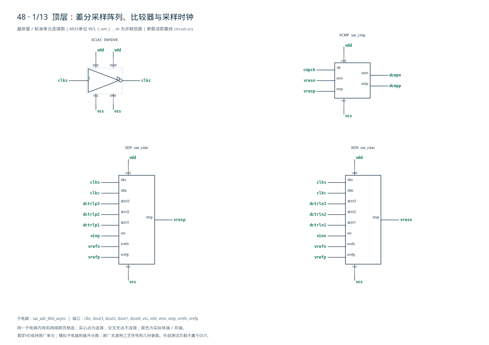

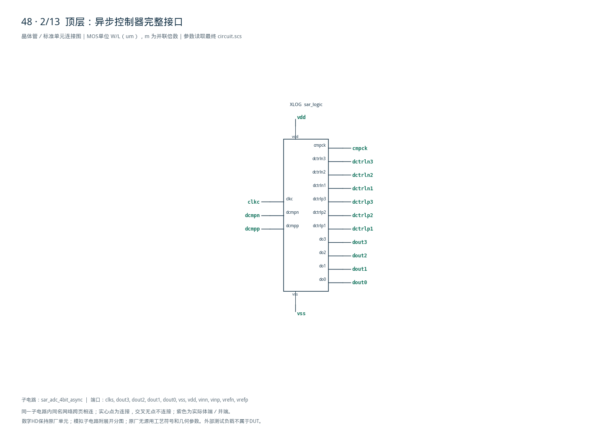

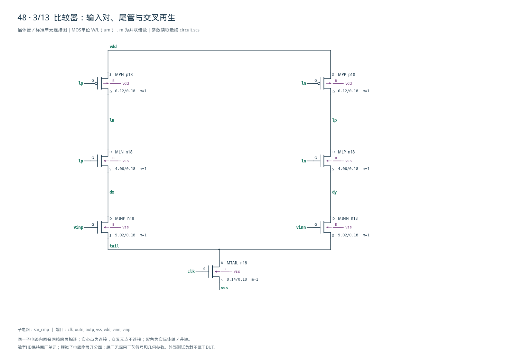

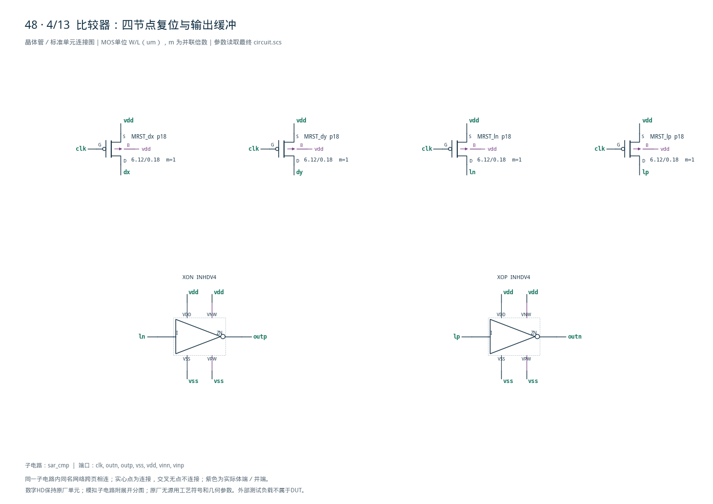

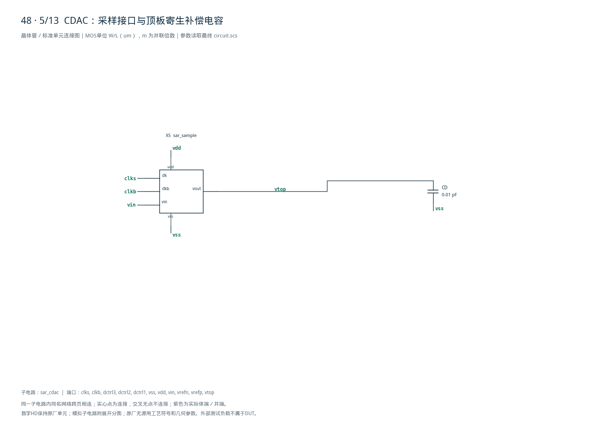

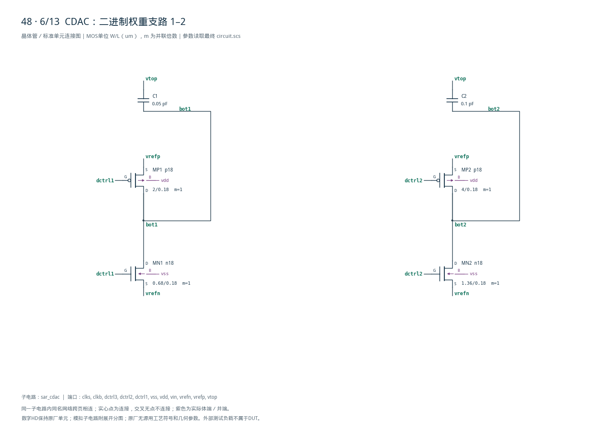

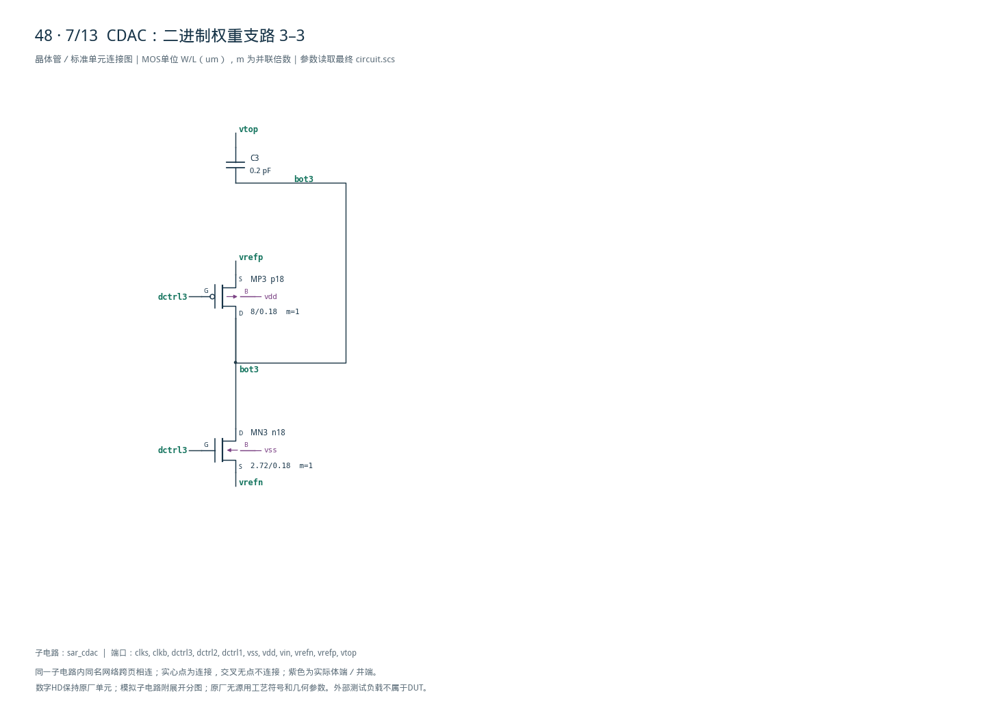

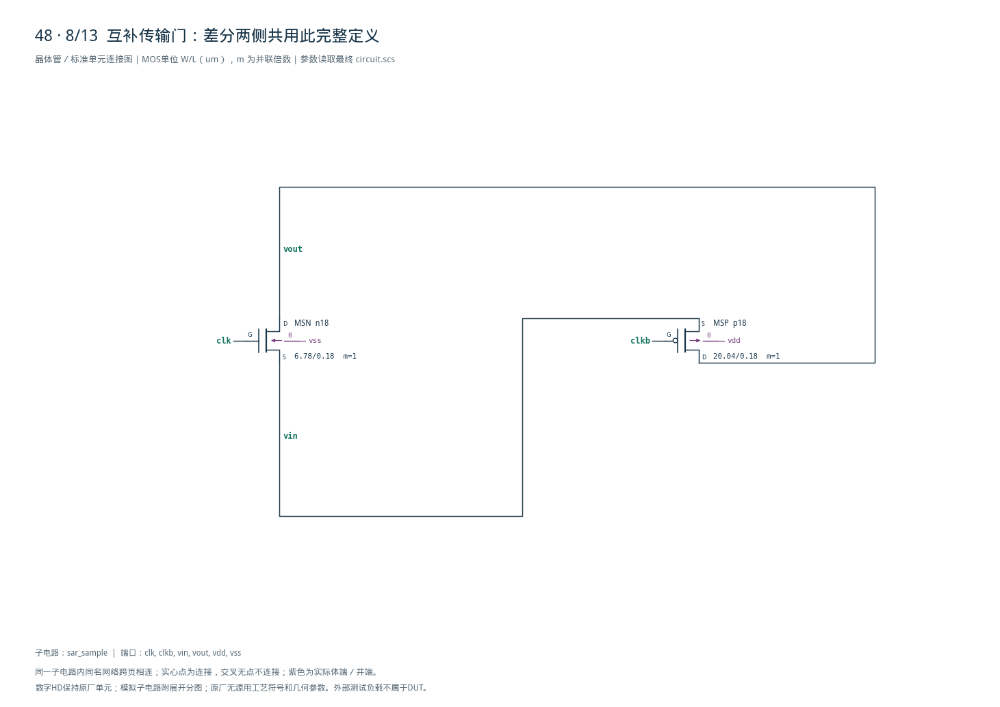

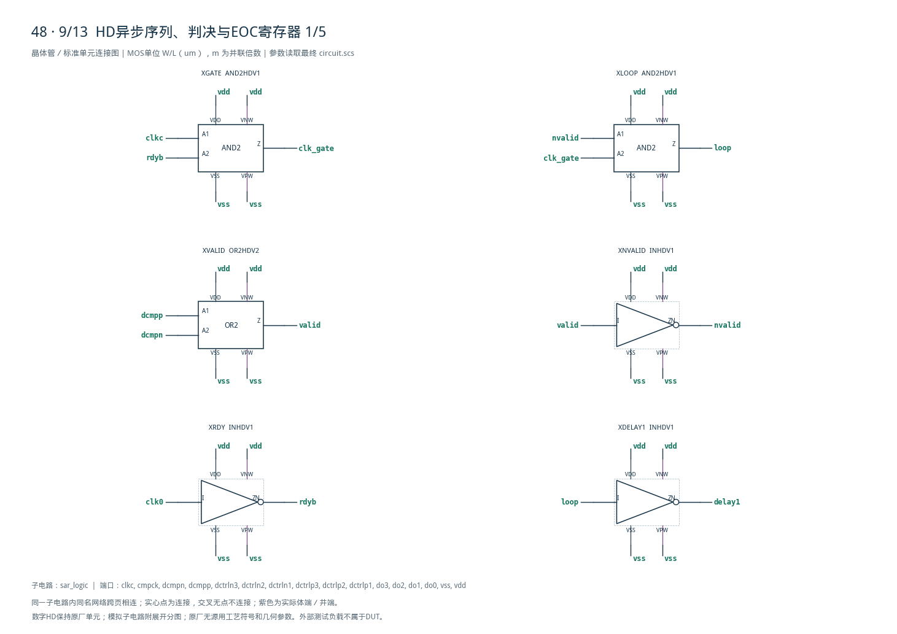

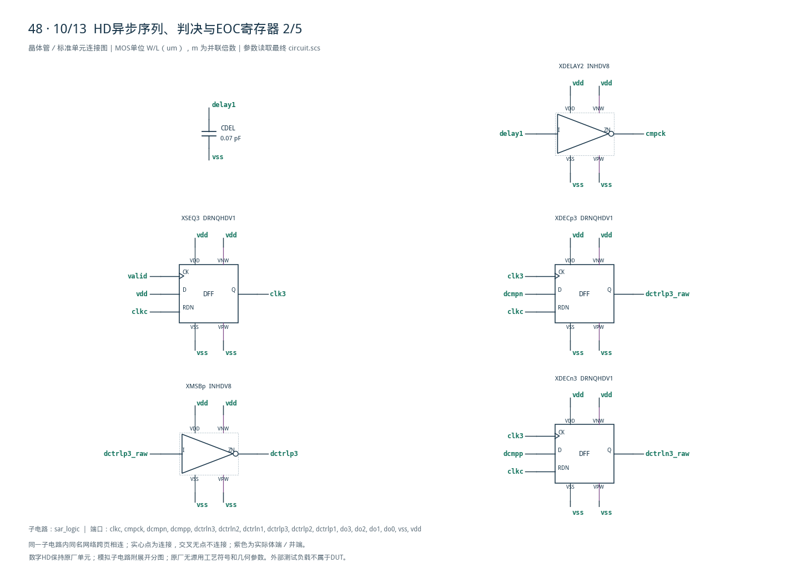

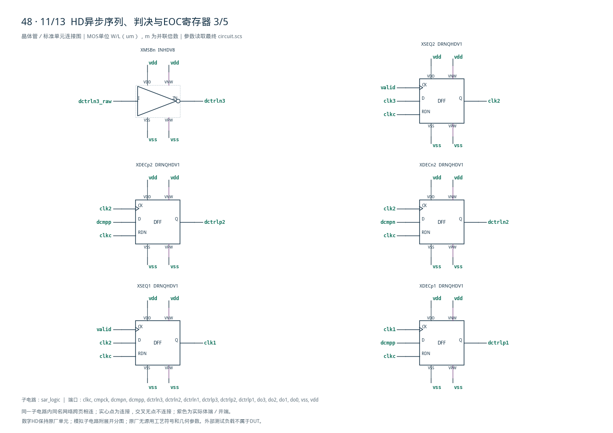

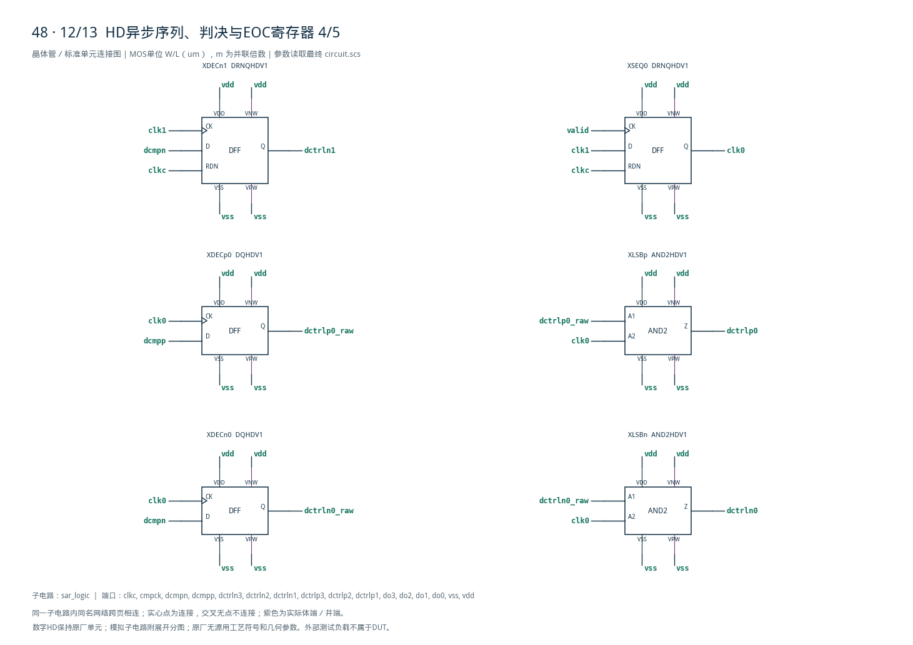

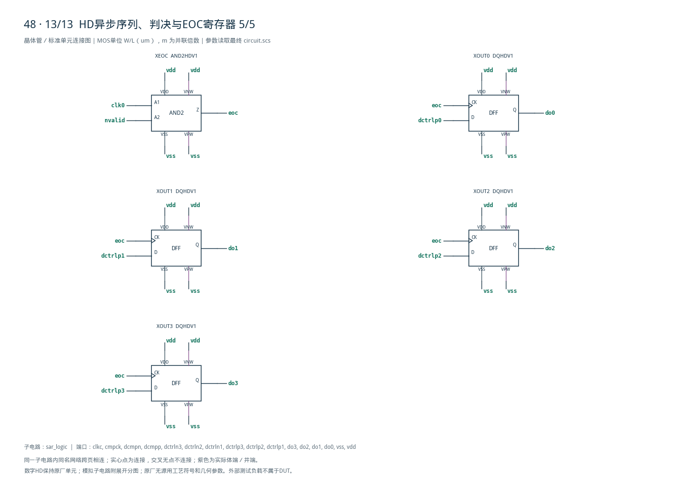
