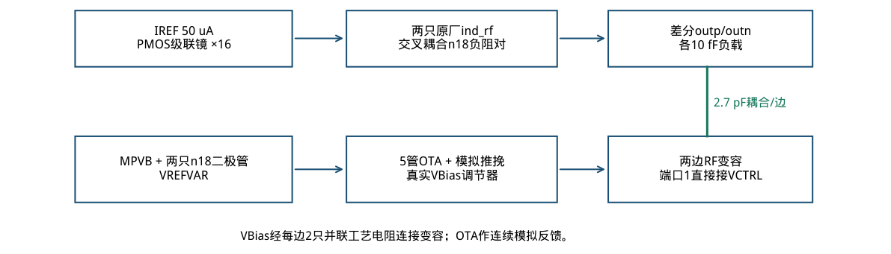
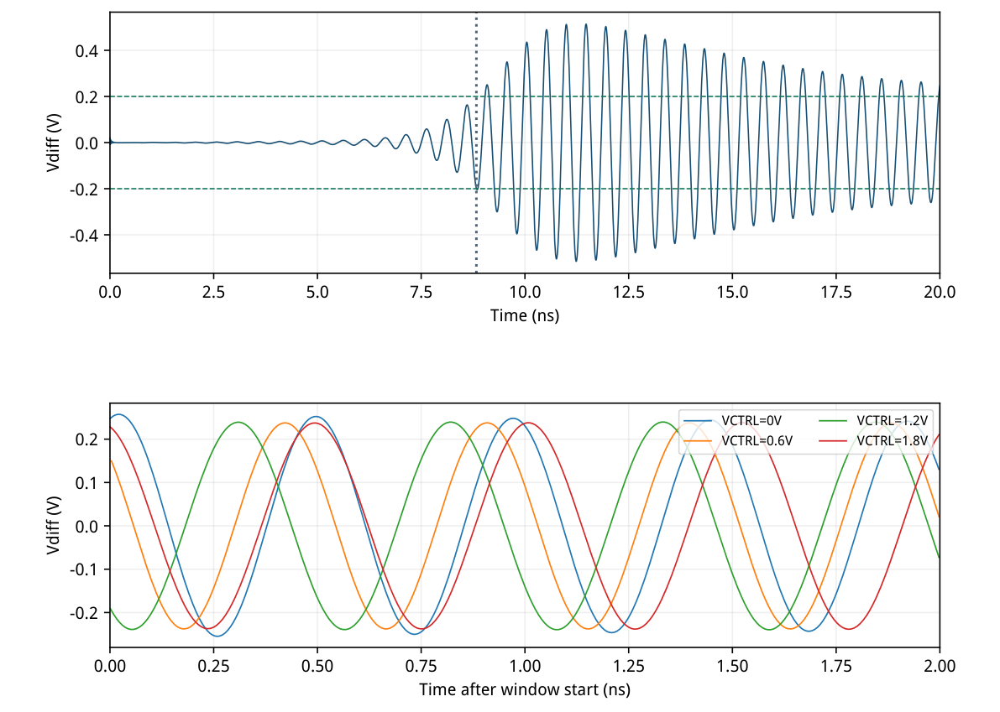
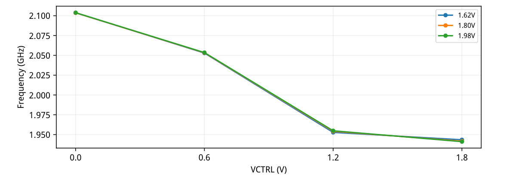
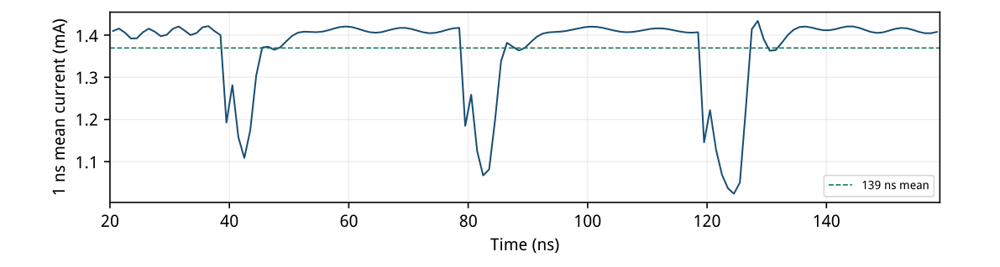
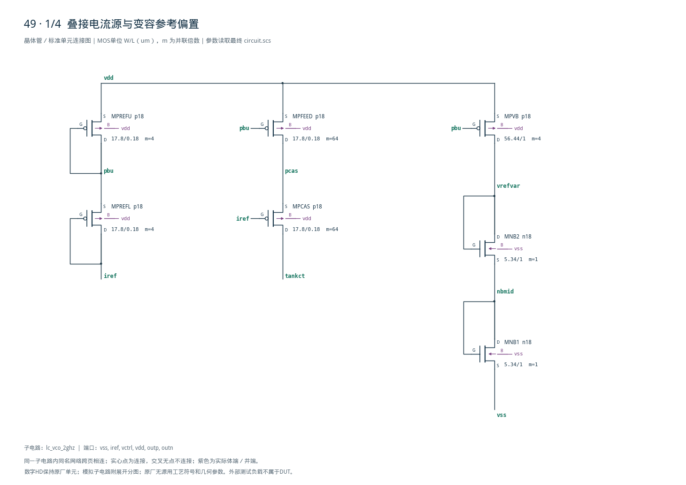
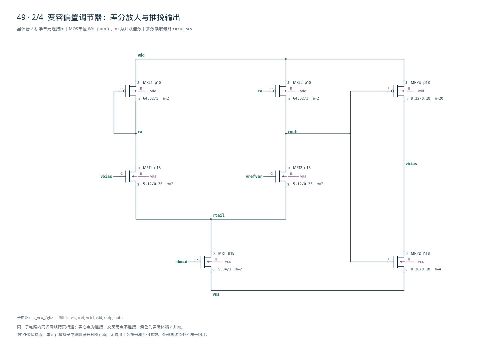
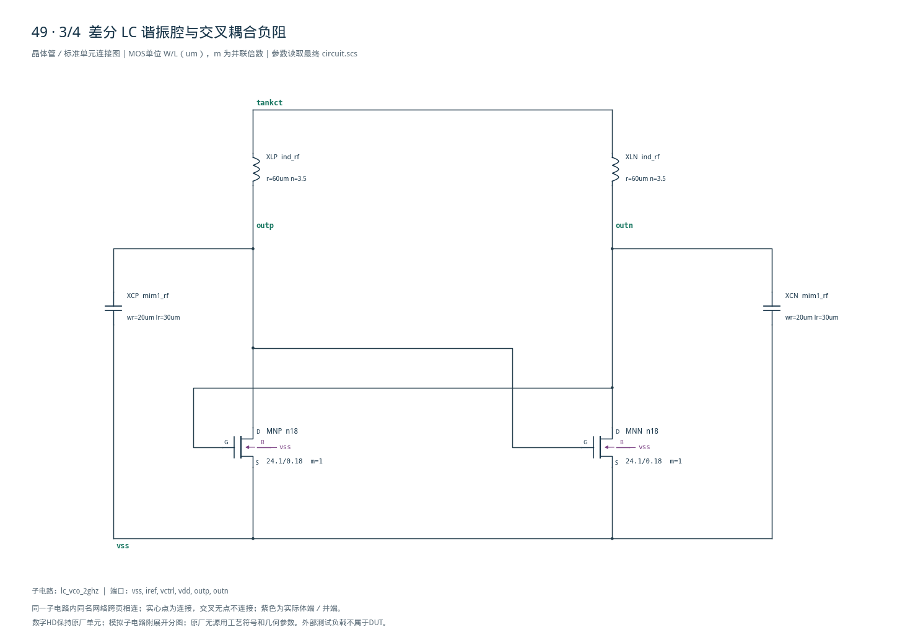
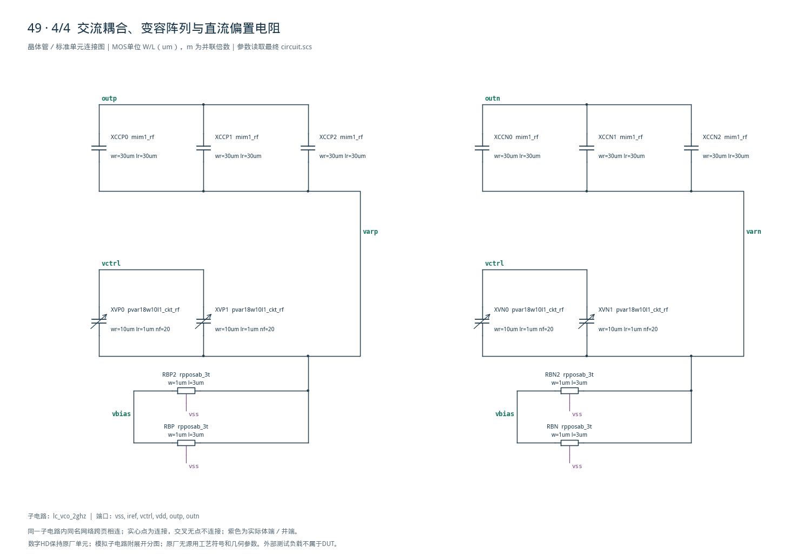

# 49 · 2 GHz 差分 LC VCO 审查

[审查 PDF](review.pdf) · [实测结果](latest_results.json) · [验收合同](contract.json) · [最终网表](circuit.scs)

## 验收结果

本模块利用电感和可调电容构成谐振腔，将控制电压转换为射频振荡频率。相比依靠门延迟的环形振荡器，LC结构通常能借助谐振腔储能改善相位噪声，但需要更大的无源器件面积并受品质因数约束。芯片中主要承担射频PLL本振、收发机频率合成和高速时钟源功能。

结论：全部nominal维度及四档supply pushing在15%边界内通过。

TT / 27°C；nominal为1.8 V，pushing端点1.62/1.98 V；唯一外部偏置IREF=50 uA，每输出10 fF。保留原四档控制、初值及固定测量窗口。

| 指标 | 实测 | 原门槛 | 10%边界 | 15%边界 | 单位 |
| --- | --- | --- | --- | --- | --- |
| f(0 V) | 2.1037 | ≥2.08 | ≥1.872 | ≥1.768 | GHz |
| f(1.8 V) | 1.9418 | ≤1.72 | ≤1.892 | ≤1.978 | GHz |
| 调谐比 | 1.0834 | ≥1.25 | ≥1.125 | ≥1.0625 |  |
| 最小频率台阶 | 12.411 | ≥8 | ≥7.2 | ≥6.8 | MHz |
| 最小差分摆幅 | 0.47552 | ≥0.3 | ≥0.27 | ≥0.255 | Vpp |
| 起振至0.2 V | 8.8303 | ≤14 | ≤15.4 | ≤16.1 | ns |
| 负轨越界量 | 0 | ≤0.05 | ≤0.055 | ≤0.0575 | V |
| 输出最大值/VDD | 0.37757 | ≤0.75 | ≤0.825 | ≤0.8625 |  |
| 共模最小值/VDD | 0.30576 | ≥0.18 | ≥0.162 | ≥0.153 |  |
| 共模最大值/VDD | 0.31271 | ≤0.48 | ≤0.528 | ≤0.552 |  |
| IREF最小电压 | 0.69538 | ≥0.22 | ≥0.198 | ≥0.187 | V |
| 最小参考余量 | 1.0963 | ≥0.9 | ≥0.81 | ≥0.765 | V |
| 平均VDD功耗 | 2.465 | ≤2.4 | ≤2.64 | ≤2.76 | mW |
| 最大supply pushing | 0.33798 | ≤0.6 | ≤0.66 | ≤0.69 | %/V |

只有高控制端频率与调谐比需15%放宽；功耗满足10%边界，其余均达到原门槛。正值上限乘1.10/1.15，下限乘0.90/0.85；严格单调、覆盖2 GHz和数据完整性不放宽。

四窗为20–39、60–79、100–119、140–159 ns；f=19/(t20−t1)，取各窗首20个差分上升零交叉。总VDD功耗按20–159 ns积分，包含三次调谐跃变与真实偏置调节器。

未执行其余PVT、MC、PEX及相噪/抖动。供电端点用于pushing与振荡数据完整性，不代表所有供电角落的频率、起振和功耗指标均通过。

## 原厂 RF 谐振腔与真实偏置调节

DUT：16只模拟MOS、2只电感、8只RF MIM、4只RF变容与4只工艺电阻。

| 部分 | 原厂实例/几何 | 说明 |
| --- | --- | --- |
| 电感/每边 | ind_rf r=60 um, n=3.5 | Lseries=3.138975 nH |
| 串联损耗近似 | Rs=3.703012 ohm | 2GHz时omegaL/R≈10.652 |
| 固定MIM/每边 | mim1_rf 20×30 um² | 标称0.6 pF |
| 交流耦合/每边 | 3×mim1_rf 30×30 um² | 标称2.7 pF |
| 变容/每边 | 2×pvar18w10l1_ckt_rf | wr=10 um, lr=1 um, nf=20 |
| 偏置电阻/每边 | 2×rpposab_3t并联 | W=1 um, L=3 um |

RF readme明确给出上述电感、变容和30×30 um² MIM示例。原厂模型包含导体损耗、衬底和寄生；串联Q只作初值估算，不是完整器件实测Q。未修改任何原厂内部器件。

关键诊断：RF变容内含浮置源漏。UIC加控制阶跃时，0.55 V直流偏置下， 四档Ceff约1.087/1.745/1.470/1.524 pF，并不单调。 独立2GHz瞬态特征验证了内部节点跟随再钳位的历史效应。

最终把变容直流偏置提升至约1.47 V，并用原厂MIM隔离输出的约0.56 V共模。参考、充电及调谐电荷吸收均由真实MOS电路提供，只有原接口50 uA为外部偏置。

无数字逻辑；模拟推挽输出级跟随连续误差，不是数字反相器。DUT内没有理想R/L/C或隐藏电流、行为振荡源。



[查看矢量图](markdown_assets/figure-02-01.svg)

## gm/ID 单元尺寸与动态工作点

既有SMIC18 LUT只读；TT/27°C，参考W=10 um、VBS=0、|VDS|=0.45 V。

| 作用 | 模型 | W/L /um | gm/ID | 单位ID/uA | 实例m |
| --- | --- | --- | --- | --- | --- |
| 负阻对 | n18 | 24.10/0.18 | 12.00 | 400 | 1 |
| PMOS参考/供流 | p18 | 17.80/0.18 | 20.00 | 12.5 | 4 / 64 |
| 变容偏置供流 | p18 | 56.44/1.00 | 17.75 | 12.5 | 4 |
| NMOS偏置/尾管 | n18 | 5.34/1.00 | 7.30 | 50 | 1 / 2 |
| 调节器输入对 | n18 | 5.12/0.36 | 15.00 | 25 | 2 |
| 调节器镜负载 | p18 | 64.02/1.00 | 15.00 | 25 | 2 |
| 调节器上拉 | p18 | 9.22/0.18 | 12.00 | 50 | 20 |
| 调节器下拉 | n18 | 0.28/0.18 | 3.00 | 40 | 4 |

W=ID/(ID/W)，取20 nm网格；总宽度以整数m复制，单元W最大64.02 um，未超过100 um模型限制。负阻管初值gm=4.8 mS、fT≈18.10 GHz。

PMOS参考用L=0.18 um/gmID=20以减小启动节点电容；长L=1 um的变容供流管反查相同VGS，得到gmID=17.75。二极管上管的实际体效应仍以PSF核查。

| VCTRL=0.6 V | \|平均ID\|/uA | 实际gm/ID | 最小饱和余量/V |
| --- | --- | --- | --- |
| MPREFU | 50.0167 | 20.026 | 0.41232 |
| MPREFL | 50.0112 | 20.338 | 0.53883 |
| MPCAS | 801.3872 | 20.368 | 0.67169 |
| MPVB | 48.5019 | 17.881 | 0.24185 |
| MNB2 | 48.5032 | 7.478 | 0.58673 |
| MRI2 | 48.7492 | 15.236 | 0.38129 |
| MRPU | 414.1801 | 15.970 | 0.22845 |
| MRPD | 413.9435 | 1.609 | 1.05452 |
| MNP | 400.6838 | 10.138 | 0.27504 |

工作点为60–79 ns时间加权平均；余量取|VDS|−|VDSAT|最小值。下拉实际gm/ID约1.61，区别于LUT初值3，源于最终较高栅压；不能把表值当实测。

最终四个窗口全部偏置/调节器MOS饱和余量为正。负阻对按真实周期变化解释，LUT用于初始尺寸，不强求整周期工作点恒定。

## 原初值起振与四档固定窗口

skipdc=yes；只设outp=0.61 V、outn=0.59 V，无额外kick或人工预充电。

| CTRL/V | 窗口/ns | 19周期频率/GHz | 沿数 | 第20沿/ns | Vdiff/Vpp |
| --- | --- | --- | --- | --- | --- |
| 0.0 | 20–39 | 2.103679487 | 40 | 29.409745 | 0.512120 |
| 0.6 | 60–79 | 2.053299192 | 39 | 69.553612 | 0.475519 |
| 1.2 | 100–119 | 1.954181703 | 37 | 109.904235 | 0.479809 |
| 1.8 | 140–159 | 1.941770300 | 37 | 150.149649 | 0.478222 |

起振=8.83030381 ns；频率严格递减，最小相邻差=12.41140339 MHz。所有20边沿终点均在原窗口内，未延迟采样以掩盖建立过程。

全窗全部完整周期频率与首20沿合同值的最大相对差约0.01854%；它反映有限窗口与建立轨迹，不是随机相噪或抖动测量。



[查看矢量图](markdown_assets/figure-04-01.svg)

## 四档供电 pushing 与完整 VDD 功耗

同一冻结电路、相同控制序列/初值/10 fF负载；两个端点在单bench独立实例运行。

| VCTRL/V | f@1.62V/GHz | f@1.98V/GHz | pushing/(%/V) |
| --- | --- | --- | --- |
| 0.0 | 2.103891557 | 2.103781341 | 0.01455227 |
| 0.6 | 2.052918773 | 2.053523720 | 0.08184255 |
| 1.2 | 1.952799834 | 1.954865944 | 0.29374024 |
| 1.8 | 1.943476207 | 1.941112986 | 0.33797669 |

定义：100×|f1.98−f1.62| / mean(f1.98,f1.62) / 0.36 V。最大0.337977 %/V，四档全部满足原0.6 %/V。每个端点每窗均有至少20个有效上升沿，均达到0.2 V起振阈值。

固定20–159 ns平均VDD功耗=2.46503259 mW；四个单独平台约2.534–2.542 mW。图示1 ns分箱，指标仍以原始PSF积分，包含全部调谐转换及偏置支路。

端点诊断：1.62 V起振14.2679 ns，1.98 V功耗2.93567 mW。端点只服务pushing，不能据此宣称全供电PVT通过。VCTRL外部驱动功耗不属于源题VDD指标。



[查看矢量图](markdown_assets/figure-05-01.svg)



[查看矢量图](markdown_assets/figure-05-02.svg)

## 保留失败迭代与证据核验

八轮nominal及对应pushing/变容诊断都保留真实PSF，未把单项通过计作完整成功。

| 轮次 | f0/GHz | f1.8/GHz | 调谐比 | P/mW | max pushing |
| --- | --- | --- | --- | --- | --- |
| 1 | 1.91437 | 1.75113 | 1.09322 | 1.91923 | 未测 |
| 2 | 1.90601 | 1.77462 | 1.07404 | 2.01444 | 未测 |
| 3 | 2.06689 | 1.80716 | 1.14372 | 2.27536 | 未测 |
| 4 | 2.09860 | 1.75619 | 1.19498 | 2.68579 | 4.04728 |
| 5 | 2.07239 | 1.76659 | 1.17310 | 2.25929 | 1.96099 |
| 6 | 2.08715 | 1.77683 | 1.17465 | 2.49105 | 1.25795 |
| 7 | 2.09297 | 1.93874 | 1.07956 | 2.48945 | 1.37668 |
| 8 | 2.10368 | 1.94177 | 1.08338 | 2.46503 | 0.33798 |

1–3轮：直接变容或偏置尚未建立，频率非单调。4–6轮：提升变容偏置、缩短PMOS参考L并增强调节器后nominal改善，但pushing仍约4.05/1.96/1.26 %/V，不能验收。

第7轮：每边耦合缩到2.7 pF，前三档pushing通过，但末档1.377 %/V；实测低供电vbias仍在140–150 ns恢复，且末两档差仅3.76 MHz。第8轮下拉m=4、核心800 uA，补足电荷吸收并控制总功耗。

代价：最终调谐比相对原下限低13.33%，高控制端频率相对原上限高12.89%。因此只标15%复现，不表述为原规格全通过；原Sky130汇总是27角落最坏值，不能直接作为nominal工艺比较。

| 检查 | 实现/限制 |
| --- | --- |
| 仿真设置 | reltol=1e-5；vabstol=1e-8；iabstol=1e-14；traponly |
| 时间/边沿 | conservative；maxstep=5 ps；160 ns全程；12窗×20边沿 |
| 实际PSF | 时间严格递增、全部保存轨迹有限；真实窗口积分 |
| 模型/快照 | 无Spectre警告/CMI-2441；RF原文件哈希及include闭包 |
| 未验证范围 | 完整PVT、相噪/抖动、真实参考源、MC、PEX/电感互耦 |

知识草稿：cases/49-lc-vco/knowledge.md；机器审计：verification\_audit.json。

## 完整 DUT 与可重放证据

模型include均位于bench层；下列电路不含任何隐藏激励或理想谐振元件。

运行：/home/IC/CodeX/virtuoso-bridge-lite/.venv/bin/python  scripts/case49\_lc\_vco.py 随后同一命令加 --mode push；PDF执行 scripts/review\_pdf.py 49。

最终nominal：runs/49/20260922T104209025109Z\_nominal最终pushing：runs/49/20260922T104247199846Z\_push

每个run含inputs/bench.scs、电路/合同/尺寸/RF模型快照，run.json记录基础模型递归哈希与额外RF哈希，output/bench.raw保存PSF，measurements.json保存实际测量。

原任务材料见cases/49-lc-vco/source/，LUT/PDK/Bridge均未修改；PDF与全部渲染页哈希见pdf\_provenance.json。

电路SHA256：56f91d72cc942ead964ed387c001590690600315d999f535cc6f0f26940c4753

## 完整网表与电路图

[Spectre 网表](circuit.scs) · [全部分图 PDF](schematic/sheets.pdf) · [电路总图](schematic/full.svg) · [端子连接](schematic/connectivity.json)

<details>
<summary>展开完整 Spectre 网表</summary>

```spectre
// Analog differential LC oscillator; no digital logic.
simulator lang=spectre
subckt lc_vco_2ghz (vss iref vctrl vdd outp outn)
MPREFU (pbu pbu vdd vdd) p18 w=17.8u l=.18u m=4
MPREFL (iref iref pbu vdd) p18 w=17.8u l=.18u m=4
MPFEED (pcas pbu vdd vdd) p18 w=17.8u l=.18u m=64
MPCAS (tankct iref pcas vdd) p18 w=17.8u l=.18u m=64
MPVB (vrefvar pbu vdd vdd) p18 w=56.44u l=1u m=4
MNB1 (nbmid nbmid vss vss) n18 w=5.34u l=1u
MNB2 (vrefvar vrefvar nbmid vss) n18 w=5.34u l=1u
MRT (rtail nbmid vss vss) n18 w=5.34u l=1u m=2
MRI1 (ra vbias rtail vss) n18 w=5.12u l=.36u m=2
MRI2 (rout vrefvar rtail vss) n18 w=5.12u l=.36u m=2
MRL1 (ra ra vdd vdd) p18 w=64.02u l=1u m=2
MRL2 (rout ra vdd vdd) p18 w=64.02u l=1u m=2
MRPU (vbias rout vdd vdd) p18 w=9.22u l=.18u m=20
MRPD (vbias rout vss vss) n18 w=0.28u l=.18u m=4
XLP (outp tankct) ind_rf r=60u n=3.5
XLN (outn tankct) ind_rf r=60u n=3.5
XCP (outp vss) mim1_rf wr=20u lr=30u
XCN (outn vss) mim1_rf wr=20u lr=30u
RBP (vbias varp vss) rpposab_3t w=1u l=3u
RBN (vbias varn vss) rpposab_3t w=1u l=3u
RBP2 (vbias varp vss) rpposab_3t w=1u l=3u
RBN2 (vbias varn vss) rpposab_3t w=1u l=3u
MNP (outp outn vss vss) n18 w=24.1u l=0.18u
MNN (outn outp vss vss) n18 w=24.1u l=0.18u
XCCP0 (outp varp) mim1_rf wr=30u lr=30u
XCCN0 (outn varn) mim1_rf wr=30u lr=30u
XCCP1 (outp varp) mim1_rf wr=30u lr=30u
XCCN1 (outn varn) mim1_rf wr=30u lr=30u
XCCP2 (outp varp) mim1_rf wr=30u lr=30u
XCCN2 (outn varn) mim1_rf wr=30u lr=30u
XVP0 (vctrl varp) pvar18w10l1_ckt_rf wr=10u lr=1u nf=20
XVN0 (vctrl varn) pvar18w10l1_ckt_rf wr=10u lr=1u nf=20
XVP1 (vctrl varp) pvar18w10l1_ckt_rf wr=10u lr=1u nf=20
XVN1 (vctrl varn) pvar18w10l1_ckt_rf wr=10u lr=1u nf=20
ends lc_vco_2ghz
```

</details>









## 报告来源

正文与表格整理自已交付的矢量 PDF，图表单独提取；本文件是后续整理的 Markdown，不是原 PDF 的编译输入。原 PDF、网表及测量数据保持原值。
