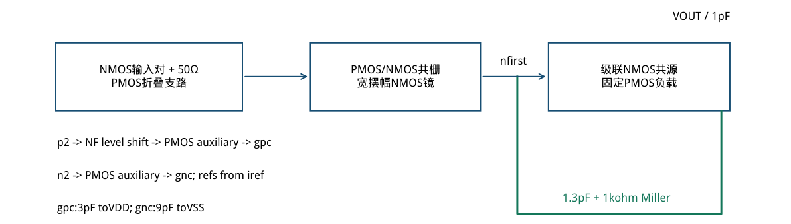
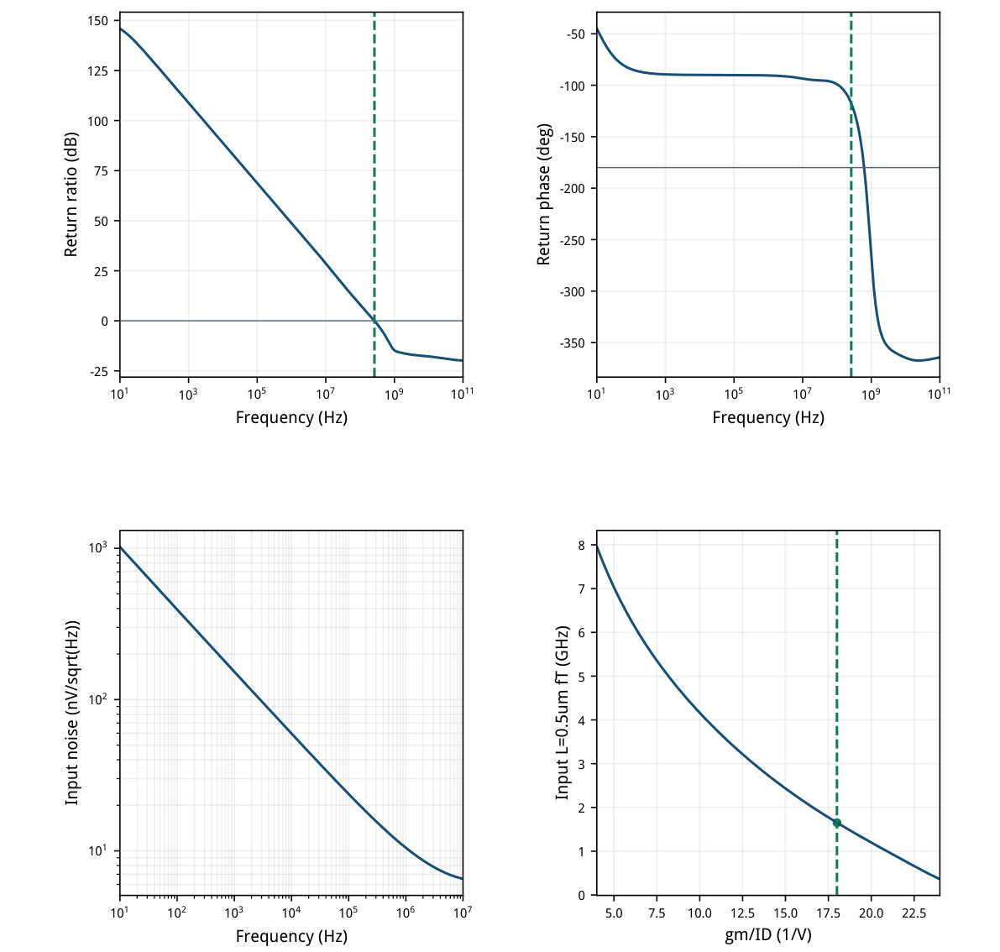
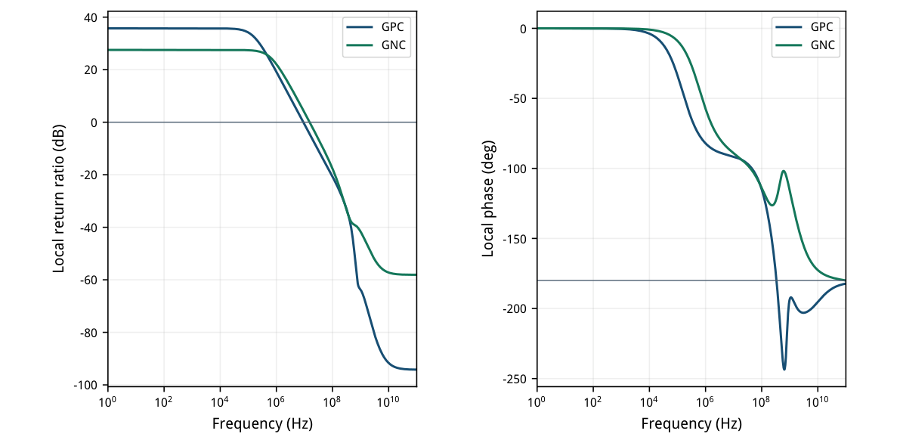
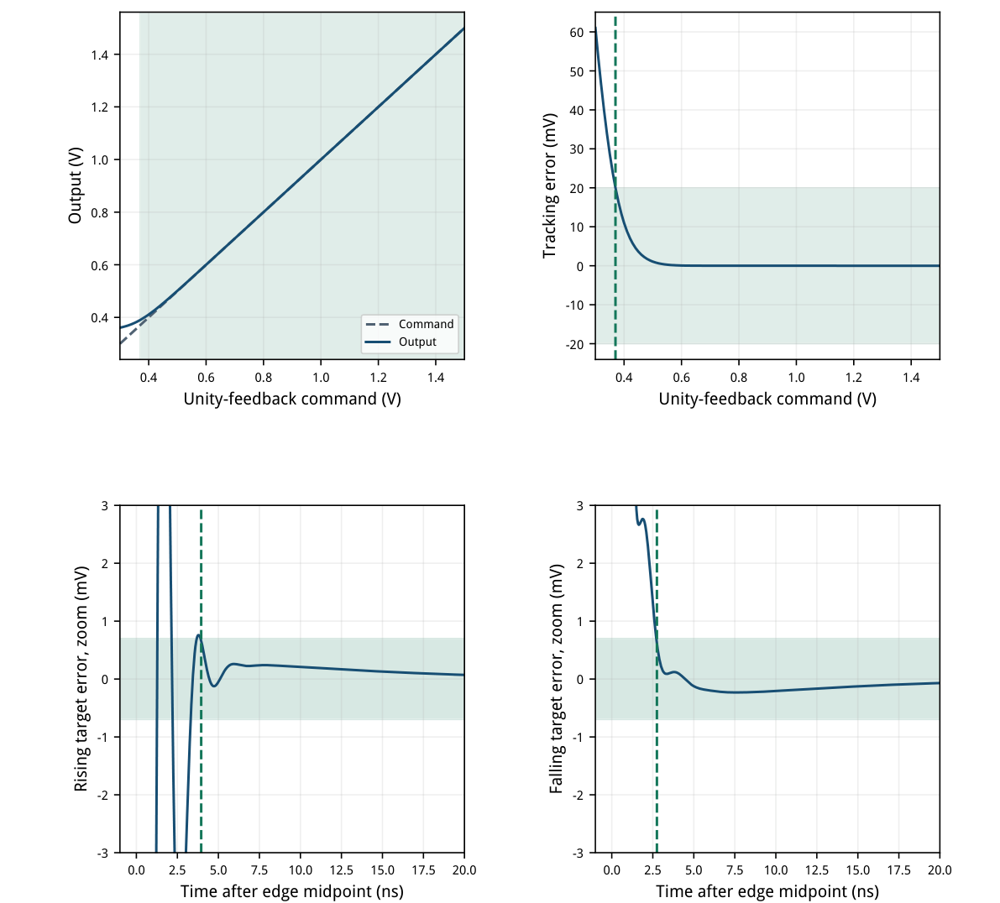
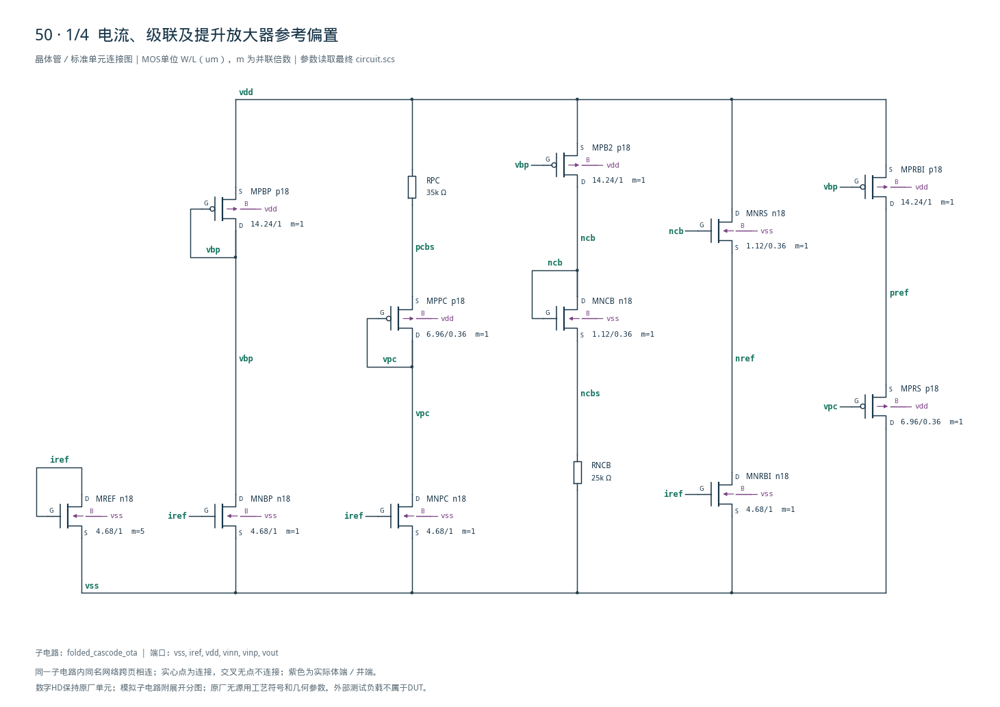
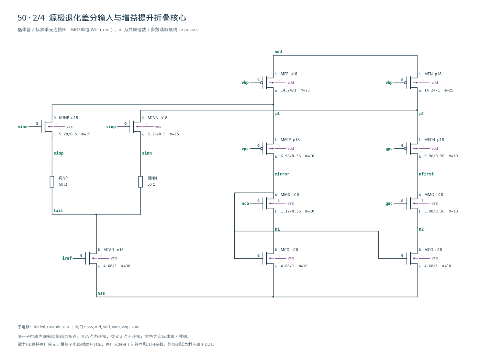
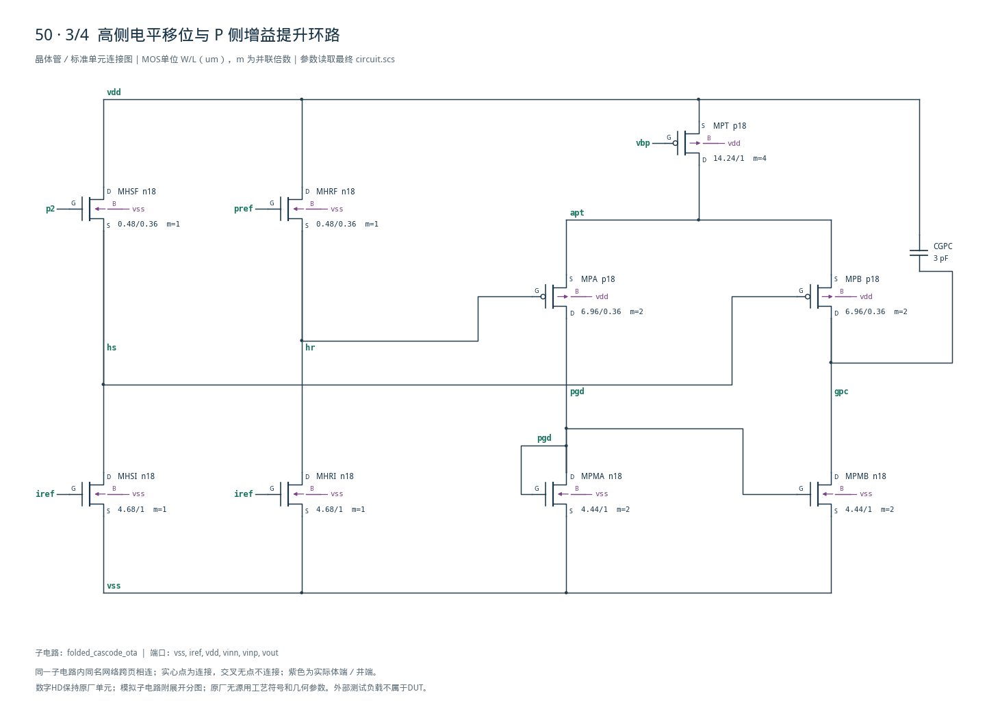
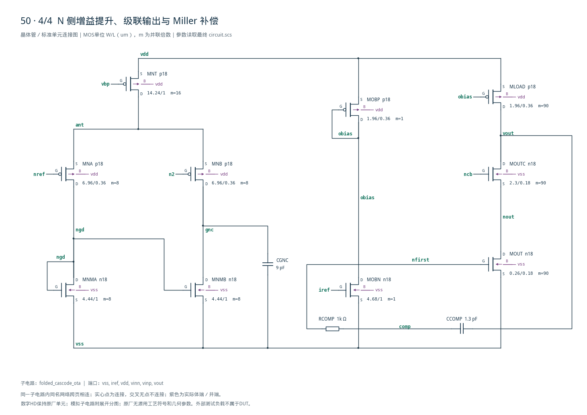

# 50 · 增益提升折叠共栅 OTA 审查

[审查 PDF](review.pdf) · [实测结果](latest_results.json) · [验收合同](contract.json) · [最终网表](circuit.scs)

## 验收结果

本模块提供高精度闭环电压放大，利用折叠共栅结构和增益提升提高开环增益。相比基础折叠共栅OTA，局部辅助放大器可提高关键支路的输出电阻，减小有限增益误差，但需要同时控制局部环路与主环路的动态。芯片中可用于高分辨率数据转换、精密信号调理和快速建立的模拟反馈通路。

结论：四组 nominal 原门槛全部通过，无性能放宽；两个增益提升环路也通过独立诊断。

条件：SMIC18MMRF / tt / 1.8 V / 27°C；50 uA参考、0.9 V输入/输出目标、1 pF负载。41只晶体管，双辅助增益提升折叠一级、级联共源输出级，1.3 pF串1 kΩ Miller补偿。

| 指标 | 实测 | 原门槛 | 10%边界 | 15%边界 | 单位 |
| --- | --- | --- | --- | --- | --- |
| 返回比增益 @10Hz | 145.8559 | ≥130.000 | ≥129.085 | ≥128.588 | dB |
| UGB | 261.4642 | ≥200.000 | ≥180.000 | ≥170.000 | MHz |
| 主环路PM | 62.4003 | ≥60.000 | ≥54.000 | ≥51.000 | deg |
| 静态输出误差 | 0.0028 | ≤0.800 | ≤0.880 | ≤0.920 | mV |
| VDD功耗，含参考 | 3.2291 | ≤5.400 | ≤5.940 | ≤6.210 | mW |
| 输入噪声 10Hz–10MHz | 30.2883 | ≤50.000 | ≤55.000 | ≤57.500 | uVrms |
| 连续合格命令区间 | 1.1300 | ≥0.920 | ≥0.828 | ≥0.782 | Vpp |
| 资格区间最大采样误差 | 19.9848 | ≤20.000 | ≤22.000 | ≤23.000 | mV |
| 上升最后进入时间 | 3.9500 | ≤10.000 | ≤11.000 | ≤11.500 | ns |
| 下降最后进入时间 | 2.7500 | ≤10.000 | ≤11.000 | ≤11.500 | ns |
| 上升末5ns均值误差 | 0.0027 | ≤0.700 | ≤0.770 | ≤0.805 | mV |
| 下降末5ns均值误差 | 0.0033 | ≤0.700 | ≤0.770 | ≤0.805 | mV |
| 最坏均值误差/0.1V | 0.0033 | ≤0.700 | ≤0.770 | ≤0.805 | % |

10 Hz–100 GHz返回比只有一次下降0 dB交越，之后不回穿。121点命令网格及双向完整观察窗保留；范围资格20 mV和建立0.7 mV固定窗均未改变。独立GPC/GNC局部PM为88.69°/87.95°。

所有41只MOS中心OP饱和余量为正，最小61.94 mV。全部单位W≤14.24 um，超宽总尺寸用m复制；实际Spectre日志没有模型尺寸警告。没有数字单元或DUT内部理想源。

边界：未运行其余26个OP/AC与噪声PVT点、另外两组范围/建立代表点、MC、寄生或无源容差。130 dB名义增益和微伏级偏差不能当成随机失配精度保证。

## 架构、偏置与gm/ID初值

两个辅助放大器调节关键共栅栅压，主电流镜把差分信号转换为单端一级输出。

| 角色 | 模型 | 单位W/L um | m | gm/ID |
| --- | --- | --- | --- | --- |
| MINP/N | n18 | 5.28/0.5 | 15 | 18 |
| 参考/尾源/镜/电流复制 | n18 | 4.68/1 | 1 / 5 / 10 / 30 | 14 |
| 偏置/折叠源/辅助尾源 | p18 | 14.24/1 | 1 / 4 / 16 / 25 | 12 |
| MNCB / MNRS / MMD | n18 | 1.12/0.36 | 1 / 1 / 10 | 12 |
| MMO | n18 | 3.98/0.36 | 10 | 18 |
| MPPC/MPRS / MFCP,N | p18 | 6.96/0.36 | 1 / 1 / 10 | 14 |
| MOUT | n18 | 0.26/0.18 | 90 | 8 |
| MOUTC | n18 | 2.30/0.18 | 90 | 18 |
| MOBP / MLOAD | p18 | 1.96/0.36 | 1 / 90 | 8 |
| MPA,B / MNA,B | p18 | 6.96/0.36 | 2 / 8 | 14 |
| MPMA,B / MNMA,B | n18 | 4.44/1 | 2 / 8 | 14 |
| MHSF / MHRF | n18 | 0.48/0.36 | 1 | 8 |

输入目标150 uA/支、gm/ID18给gm≈2.7 mS；50 Ω源退化后约2.38 mS。输出目标900 uA、L0.18 um、gm/ID8，串联1 kΩ大于1/gmout，可把Miller前馈零点移到左半平面；真实多节点响应仍用全频段验证。

输入L0.5 um需要补扫，数据只写本项目lut\_supplement。其余角色复用现有SMIC18 LUT；每项查询、VDS、Wref与SHA-256保存在sizing.json。LUT为初值，最终含窄宽与体效应的实际OP如下页。



[查看矢量图](markdown_assets/figure-02-01.svg)

## 工作点、余量与名义高增益

全部41只MOS在中心OP有正的|VDS|−|VDSAT|；表列主信号路径和辅助环路的关键器件。

| MOS | \|Id\| uA | gm/ID | gm/gds | \|VDS\| V | 饱和余量mV |
| --- | --- | --- | --- | --- | --- |
| MINP | 147.919 | 18.168 | 223.21 | 1.1142 | 1027.35 |
| MINN | 147.824 | 18.171 | 222.76 | 1.1056 | 1018.75 |
| MTAIL | 295.744 | 14.238 | 140.45 | 0.3258 | 206.02 |
| MFP | 256.386 | 11.845 | 203.59 | 0.3526 | 204.59 |
| MFN | 256.512 | 11.846 | 211.39 | 0.3613 | 213.20 |
| MFCP | 108.466 | 13.578 | 171.78 | 0.9277 | 794.00 |
| MFCN | 108.687 | 13.538 | 164.38 | 0.8033 | 668.91 |
| MMD | 108.466 | 11.040 | 30.03 | 0.2654 | 119.17 |
| MMO | 108.687 | 17.656 | 80.50 | 0.3681 | 279.36 |
| MCD | 108.466 | 13.678 | 83.09 | 0.2543 | 129.46 |
| MCO | 108.687 | 13.688 | 92.90 | 0.2674 | 142.57 |
| MPA | 20.480 | 13.802 | 166.47 | 0.8208 | 688.52 |
| MPB | 20.761 | 13.663 | 144.40 | 0.5652 | 431.08 |
| MNA | 82.737 | 13.530 | 137.07 | 0.5197 | 382.11 |
| MNB | 84.112 | 13.052 | 33.81 | 0.2029 | 61.94 |
| MOUT | 941.436 | 7.692 | 15.13 | 0.3346 | 167.63 |
| MOUTC | 941.436 | 17.914 | 32.32 | 0.5654 | 489.26 |
| MLOAD | 941.436 | 7.750 | 122.31 | 0.9000 | 679.80 |

主节点：tail0.32576 V，p1/p2=1.44735/1.43874 V，n1/n2=0.25432/0.26742 V，nfirst0.63549 V，nout0.33459 V。输出0.900002832 V，主输入147.9 uA/支，输出级941.44 uA。

GPC辅助把p2与电流复制pref1.44195 V比较，两个匹配NMOS跟随器将电位移至hs/hr≈0.65 V；GNC辅助直接比较n2与nref0.27223 V。没有供电电阻分压参考，也没有理想误差放大器。

MNB的61.94 mV是最小中心余量，不能推广为全PVT保证。10 Hz的有载内部比值|nfirst/vinn|=105.93 dB、|vout/nfirst|=39.93 dB，相乘等于145.86 dB；这核对数量级，不把两级当成互不加载的独立放大器。

## 主环路、闭环噪声与输入LUT

主返回比T=−Vout/Vinn；噪声测试采用单位反馈并以VIN源折算到输入。

噪声频带固定10 Hz–10 MHz，共601点；sqrt(∫en²df)的PSD梯形积分30.2883 uVrms，幂律插值积分30.2877 uVrms，相差0.001978%。没有用UGB替换积分上限，也没有缩小带宽。

补扫n18 L0.5 um、Wref10 um、VDS0.9 V、VBS0：603点单调反型分支，gm/ID18处fT1.653 GHz、gm/gds220.27。电流密度、VGS、fT曲线平滑；完整四图和数值校验见50-input-lut-validation.png及lut\_validation.json。



[查看矢量图](markdown_assets/figure-04-01.svg)

## 两个增益提升环路与补偿迭代

零压探针位于辅助输出到主共栅栅极，保留原DC连接和闭合的全局单位反馈。

| 诊断 | 1Hz增益 | UGB | PM | 下降交越 |
| --- | --- | --- | --- | --- |
| GPC局部环路 | 35.744 dB | 9.032 MHz | 88.690° | 1 / 无回穿 |
| GNC局部环路 | 27.533 dB | 15.301 MHz | 87.951° | 1 / 无回穿 |

| 主补偿版本 | Cc/pF | Rz/Ω | UGB/MHz | PM/deg | 结论 |
| --- | --- | --- | --- | --- | --- |
| 初版 | 1.5 | 400 | 159.449 | 49.350 | 带宽/PM失败 |
| 中间版本 | 1.2 | 800 | 224.840 | 58.219 | PM未达原门槛 |
| 最终 | 1.3 | 1000 | 261.464 | 62.400 | 全部原门槛通过 |

3 pF/9 pF把辅助输出带宽压到主环路UGB以下，同时保留DC增益提升。两个PM与Spectre原生日志相差不足0.0001°，探针对输出OP扰动不超过12 pV。45°是独立诊断下限，主环路仍按原60°验收。

主Miller电阻增大提高零点超前；并配合Cc调整，解决初版相位不足。内部多极点使UGB不能只按gm/Cc比例推断。未对辅助环路做PVT，也没有把主环路稳定性作为局部环路的替代。



[查看矢量图](markdown_assets/figure-05-01.svg)

## 连续区间与双向最后进入

原定义保留：范围只跨相邻失败/合格点插值；建立使用采样点上的完整余下窗口判据。

完整121点0.30–1.50 V、步长10 mV；114个合格采样点从0.37 V至1.50 V，低端在0.36/0.37 V之间按20 mV边界插值，得0.369963 V，连续跨度1.130037 V。1.50 V是扫描上界，未推定物理最大摆幅。

命令0.85→0.95→0.85 V，边沿20–21 ns与121–122 ns。时间原点为20.5/121.5 ns，观察至119.5/240 ns；固定目标±0.7 mV。末5 ns均值窗为114.5–119.5 ns和235–240 ns，误差2.748/3.319 uV。

波形输出50 ps采样、内部最大步长25 ps；原算法取末次越界后首个合格样本，未插值。图仅放大边沿，计算覆盖完整发布窗口。



[查看矢量图](markdown_assets/figure-06-01.svg)

## 精确网表与复现证据

D G S B端序；m复制合法单位管，PMOS体端统一接VDD；精确偏置与嵌套连接如下。

复现：既有Bridge Python运行 scripts/case50\_gainboosted\_folded.py，随后加--mode loops检查局部环路；同一Python运行scripts/review\_pdf.py 50生成本报告。源任务：sky130-folded-cascode-ota-gain130-pm60-noise50uv-pvt。

正式运行（OP/AC、噪声、范围、建立、GPC、GNC）：runs/50/20260922T100810630324Z\_op\_ac runs/50/20260922T100810861742Z\_noise runs/50/20260922T100811101938Z\_range runs/50/20260922T100811270078Z\_settling runs/50/20260922T100839104170Z\_gpc\_stb runs/50/20260922T100839271650Z\_gnc\_stb

冻结source、run inputs、原始PSF和全部模型/LUT哈希均保留；知识稿和审计在case目录。精确电路SHA-256：2bd50c5eb26a20f10d7e11c3a857716e417a47b187bcd32de1d617491ee51213

## 完整网表与电路图

[Spectre 网表](circuit.scs) · [全部分图 PDF](schematic/sheets.pdf) · [电路总图](schematic/full.svg) · [端子连接](schematic/connectivity.json)

<details>
<summary>展开完整 Spectre 网表</summary>

```spectre
// Gain-boosted folded first stage and cascoded common-source output.
// D G S B; legal base widths from SMIC18 gm/ID, m scales current.
simulator lang=spectre
subckt folded_cascode_ota (vss iref vdd vinn vinp vout)
MREF (iref iref vss vss) n18 w=4.68u l=1u m=5
MTAIL (tail iref vss vss) n18 w=4.68u l=1u m=30
MNBP (vbp iref vss vss) n18 w=4.68u l=1u m=1
MPBP (vbp vbp vdd vdd) p18 w=14.24u l=1u m=1
MNPC (vpc iref vss vss) n18 w=4.68u l=1u m=1
RPC (vdd pcbs) resistor r=35000
MPPC (vpc vpc pcbs vdd) p18 w=6.96u l=0.36u m=1
MPB2 (ncb vbp vdd vdd) p18 w=14.24u l=1u m=1
MNCB (ncb ncb ncbs vss) n18 w=1.12u l=0.36u m=1
RNCB (ncbs vss) resistor r=25000
MNRBI (nref iref vss vss) n18 w=4.68u l=1u m=1
MNRS (vdd ncb nref vss) n18 w=1.12u l=0.36u m=1
MPRBI (pref vbp vdd vdd) p18 w=14.24u l=1u m=1
MPRS (vss vpc pref vdd) p18 w=6.96u l=0.36u m=1
MINP (p1 vinn sinp vss) n18 w=5.28u l=0.5u m=15
MINN (p2 vinp sinn vss) n18 w=5.28u l=0.5u m=15
RINP (sinp tail) resistor r=50
RINN (sinn tail) resistor r=50
MFP (p1 vbp vdd vdd) p18 w=14.24u l=1u m=25
MFN (p2 vbp vdd vdd) p18 w=14.24u l=1u m=25
MFCP (mirror vpc p1 vdd) p18 w=6.96u l=0.36u m=10
MFCN (nfirst gpc p2 vdd) p18 w=6.96u l=0.36u m=10
MMD (mirror ncb n1 vss) n18 w=1.12u l=0.36u m=10
MMO (nfirst gnc n2 vss) n18 w=3.98u l=0.36u m=10
MCD (n1 mirror vss vss) n18 w=4.68u l=1u m=10
MCO (n2 mirror vss vss) n18 w=4.68u l=1u m=10
MHSI (hs iref vss vss) n18 w=4.68u l=1u m=1
MHSF (vdd p2 hs vss) n18 w=0.48u l=0.36u m=1
MHRI (hr iref vss vss) n18 w=4.68u l=1u m=1
MHRF (vdd pref hr vss) n18 w=0.48u l=0.36u m=1
MPT (apt vbp vdd vdd) p18 w=14.24u l=1u m=4
MPA (pgd hr apt vdd) p18 w=6.96u l=0.36u m=2
MPB (gpc hs apt vdd) p18 w=6.96u l=0.36u m=2
MPMA (pgd pgd vss vss) n18 w=4.44u l=1u m=2
MPMB (gpc pgd vss vss) n18 w=4.44u l=1u m=2
MNT (ant vbp vdd vdd) p18 w=14.24u l=1u m=16
MNA (ngd nref ant vdd) p18 w=6.96u l=0.36u m=8
MNB (gnc n2 ant vdd) p18 w=6.96u l=0.36u m=8
MNMA (ngd ngd vss vss) n18 w=4.44u l=1u m=8
MNMB (gnc ngd vss vss) n18 w=4.44u l=1u m=8
CGPC (gpc vdd) capacitor c=3p
CGNC (gnc vss) capacitor c=9p
MOBN (obias iref vss vss) n18 w=4.68u l=1u m=1
MOBP (obias obias vdd vdd) p18 w=1.96u l=0.36u m=1
MOUT (nout nfirst vss vss) n18 w=0.26u l=0.18u m=90
MOUTC (vout ncb nout vss) n18 w=2.3u l=0.18u m=90
MLOAD (vout obias vdd vdd) p18 w=1.96u l=0.36u m=90
CCOMP (vout comp) capacitor c=1.3p
RCOMP (comp nfirst) resistor r=1000
ends folded_cascode_ota
```

</details>









## 报告来源

正文与表格整理自已交付的矢量 PDF，图表单独提取；本文件是后续整理的 Markdown，不是原 PDF 的编译输入。原 PDF、网表及测量数据保持原值。
